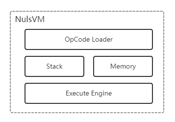

# Smart contract module design

## 1. Summary

Nuls is a customizable blockchain infrastructure and a global blockchain open source community project. Nuls consists of micro-kernels and modules. Through the reorganization of events and services we have achieved a highly modular underlying architecture. This includes intelligent contracts, multi-chain parallels, cross-chain consensus and other operational mechanisms. This document covers some the details of the smart contract.

## 2. Purpose

The nuls smart contract module (also referred to as the contract module) mainly solves the following problems:

* **Programmable Environment**: Provides a smart contract programming environment based on the Nuls blockchain.
* **Lightweight Virtual Machine**: Provides a lightweight virtual machine Nuls VM and all the byte instructions needed to perform smart contract execution. Lightweight guarantees can be started quickly and run quickly, and virtual machines like JVM or .Net are not suitable.
* **Isolation operation**: The operating environment of each virtual machine is isolated, which guarantees security.
* **Support for high-level languages**: Supports the syntax of various high-level languages to write smart contracts directly.
* **Ecological integrity**: Provides a variety of tools and complete documentation, gradually reducing the difficulty of writing smart contracts.
* **Easy access**: Provides API and full documentation, developers can easily read world status and listen for changes.

## 3. Related items

In software development, it is important to remember that “repetition of invention wheels” is particularly important on the shoulders of giants. The blockchain industry itself encourages an open, shared and virtuous ecology. When designing the smart contract module, we needed to learn from the successful smart contract designers.

The first reference is of course Ethereum. Ethereum's smart contract is currently the most widely used. Many projects, including Nuls, use Ethereum's ERC20 standard to issue TOKEN through smart contracts. Ethereum’s virtual machine is also the object of learning. Like the quantum chain, it is the complete Fork virtual machine code of Ethereum. It supports the operation of Ethereum smart contract on the UTXO model through the concept of account layer. Very creative and bold ideas.

Ethereum's smart contract is to build its world state through the account model, and record and execute world state changes through transaction messages and state transition functions. This design is very subtle and groundbreaking.

Then we look to the Corda project of R3 organization. Based on Java construction, the Java virtual machine is directly used in the smart contract, and the smart contract logic is realized by implementing the preset Java interface. Compared with Ethereum, its application area determines that its smart contracts only focus on "validation" rather than Ethereum's versatile smart contract platform.

Then there is the super-book project. The concept of the super-book is similar to that of the Nuls. It is modular, loosely coupled, and pluggable. The interesting part of its smart contract design is to put the contract into Docker. Executed in a separate container, the currently supported high-level languages are Java and Go. However, this is one of its drawbacks, because Docker startup is very fast, but it is very time consuming compared to the lightweight VMs of other blockchains. However, this is also related to the application prospects that are not defined as public chains. The more suitable areas are the alliance and private chain environment of enterprises and institutions.

There is also a multi-asset concept project than the original chain project. The bottom layer runs a multi-asset UTXO model, so its smart contract innovatively uses the UTXO collection as the storage unit of its world state. The effective organization of the UTXO model is very useful.

Finally, neo, neo, as one of the early companies involved in the blockchain industry in China, has many ideas and characteristics of its own, and the ideas on the smart contract module are also very innovative, especially the high-level language part which has its own through the modern mainstream high-level language itself. The characteristics of the virtual machine, using the high-level language bytecode to the blockchain bytecode direct conversion, brings a lot of possibilities for the expansion of high-level languages.

## 4. Basic design

The contract module is part of the entire Nuls modular technology ecosystem and is a fully autonomous module. Collaborate with other modules through Nuls' modular contract to provide an on-chain programmable environment.

Interacting with the contract is done by sending a special transaction to the contract. The Turing complete calculation of the contract is performed by the virtual machine. The execution result of the contract is permanently stored on the Nuls storage module. Each contract has its own separate storage space, distinguished by different contract addresses.

When the contract is executed, the virtual machine loads the bytecode compiled into the contract code and executes the program according to the contract code. After the execution is completed, the state of the entire contract storage changes, and the hashes of these changes are stored in the chain. The contract can be used as a software library for another contract, that is, the contract itself can call another contract. Before the virtual machine executes the contract, it will parse the contract content and load the relevant contract ahead of time. At the same time, the execution efficiency is improved by the cache technology.

Each bytecode command executed by the virtual machine will charge a certain fee according to the amount of calculation. This is called GAS in Ethereum, and Nuls retains this design concept. Each instruction is billed according to the length of its operation. At the same time, in order to ensure efficiency, there is an upper limit for the billing of the entire contract. After the upper limit is exceeded, the contract will fail to execute and the status will be rolled back, but the cost already consumed will not be returned. If the submitted fee has not been fully consumed after the execution is completed, the remaining portion will be returned to the contract caller. The reason for setting the cost cap is also to eliminate the problem of infinite loop calls.

The contract is written to support high-level languages. Java is the first supported language to be used when the contract module is online. The languages on the JVM, such as Kotlin, Scala, and Groovy, will be quickly supported. We also welcome community contributions. A high level language support.

The status of the contract can be opened to the outside world through the API. There are many methods built into the contract that can be called directly in use, such as hash algorithms, random numbers, and so on.

### 4.1 World Status

We will build a world state in Nuls, and every contract-related transaction in Nuls will cause the state of the world to change. The status can contain arbitrary data.

If we regard smart contracts as apps, then the contract transactions in Nuls can be seen as function calls in computer programs. These function calls can change the internal properties of the program. Of course, not all transactions are valid, they may also have invalid transactions, and invalid transactions will not cause a change in state. You can use an expression to illustrate:

        f(S, T) = S'

f represents a functional method in a smart contract. The core idea of the Nuls smart contract is to read the S and the contract transaction T as the input of f, thus converting the state from S to S'.

Null's blockchain stores all historical transaction data that can change state, so the latest block is the current state. Of course, Nuls does not save these states on the block, so the block is too large. The block only saves the root hash of this world state. On the one hand, the miners of Nuls will verify the status of the previous block execution. On the other hand, in order to compete for the bookkeeping rights, the miner will put the received transaction into the corresponding contract and put the final state into the new block. Announced.

The world state is composed of contract accounts. The world state is stored in the storage module of Nuls. The storage module provides a data interface of KV structure. That is to say, the storage mode of the world state is KV form, and KV is the key value. Yes, here K represents the address of the contract, which is a 160-bit hash value; V represents the state of the contract. Although not all of the world state is stored in the block, the entire state is cached in the contract module, and the entire state is maintained by the Merkle Patricia tree. The Partricia tree is actually a dictionary tree, and the dictionary is designed to find this contract account more quickly. Merkle is responsible for ensuring that all states are unaltered. The Merkle root is the state root and is stored in the block. With each change, the new state is re-stored in the storage module. This is designed so that the entire state tree represented by the root of each block is immutable, so the state of the world in Nuls can start from any determined state of the world, that is, we can revert to the specified block. Historical state.

The contract account contains three fields:

* nonce: Transaction count: This value is equal to the number of transactions the contract has executed.
* storage root: Stores the root node. This field stores the root node of the internal storage content of the account. The organization of the stored content is the same Merkle Patricia tree as the account, and the length is 256-bit hash code.
* code hash: code hash, the code is the content of the Nuls virtual machine implementation. The code hash is different from the first two fields, and the contents of this field cannot be changed after they are specified.

The Merkel Patricia tree has four nodes:

* Empty nodes, as the name implies, empty nodes, without any value
* Extended node, the extended node stores three fields, the first is the prefix field, the value is 0 or 1; the second is the common part of K in KV, such as 'ab12...' and 'ab32. The 'ab' in .' is the common part; the third field stores the index to the branch node.
* Branch node, the branch node is a 17-bit array, the first 16 bits store the 0-f character and the index to the lower node, and the last bit is the value.
* Leaf node, stores three fields, the first is the prefix field, the value has 2 or 3; the second stores the last part of the common part of k in kv; the third field stores the specific value This value is encoded by rlp.

### 4.2 Overall Architecture

The above picture shows the overall architecture of the smart contract. The core is built around the Nuls virtual machine. The virtual machine provides a way to access the state of the world. The world state is stored in the storage module of Nuls. OpCode is a bytecode, and Nuls implements a minimum set of bytecodes that support Turing's completeness, with the goal of fast startup while maintaining Turing integrity. Tools is a toolbox that provides a range of tools that include bytecode compilers, template methods, SDKs, and more to enhance and simplify development. The API is the entry point to the access contract, and the world state of the contract can be easily queried through the API.

### 4.3 Future direction

Although the state of the world only increases part of the change, its storage capacity will still accumulate relatively large. So in the future, a snapshot method may be implemented to compress all data with a certain history into the latest state, and all the changes before this state. They will be cleaned up.

We will provide support for light nodes. Nuls users do not need to obtain a complete world state history, rather just get the latest world state.

## 5. Nuls virtual machine

The Nuls virtual machine is similar to the Java virtual machine. Unlike VMWare and VirtualBox, it is the smallest set of Turing completion. Like the JVM, the Nuls virtual machine executes bytecode, and the high-level language is compiled into bytecode executable by the Nuls virtual machine.

Nuls virtual machine architecture diagram

* OpCodeLoader: load contract bytecode and associated contract bytecode
* Stack: The operand stack is also often referred to as the operation stack, which is a last-in, first-out stack. The underlying bytecode instruction set of the virtual machine is based on the stack type. All opcodes operate on the data on the operand stack. For each method call, the virtual machine creates an operand stack for computation.
* Memory: As a temporary storage area provided during execution, it is released after execution is completed.
* Execute Engine: Like the CPU in the computer, this execution engine performs all operations, can execute smart contract bytecode, common bytecode: flow control, stack operation, bit operation, arithmetic operation, logic operations, etc.
* Nuls Modular Interface: Provides the ability to interact with Nuls blockchains and other Nuls modules.

The design of this NulsVM is based on the design of the JVM. It has been simplified and modified for the needs of the intelligent contract engine to achieve the simplest and most efficient virtual machine.

The Nuls virtual machine is based on the stack structure. The size of the data in the stack is 256 bits. The purpose of this design is to match the output of the hash result. The maximum depth of the stack is 1024.The temporary storage area of the virtual machine is based on the addressed byte data. Each virtual machine has this temporary storage area, which can also be said to be the virtual machine's memory. This is designed to facilitate some state that needs to be temporarily maintained. All the memory is in the state. It was 0 at the beginning.

The Nuls virtual machine can make errors in some cases, such as stack overflow and illegal instructions, lack of gas, and so on. When an exception occurs, the virtual machine stops executing immediately and returns an error.

Each time a contract code is executed, a new virtual machine is started. Unlike some other virtual machines, there is no shared space like these heaps between these virtual machines. Nuls guarantees that the same contract can only be executed in the order in which the call is executed by calling and dependency analysis. Different contracts can be solved in parallel. This not only ensures the orderliness of the contract, but also ensures high efficiency.

## 6. Fees and gas

For economic and efficiency reasons, the contract engine executes code, on the one hand, to prevent the contract from being executed without termination, and on the other hand, urges the developer to write efficient contract code. Each specified operation will have a specified cost, and the cost is calculated using gas.

Each operation corresponds to the price of gas, so each call to the contract method will calculate the cost of the entire call, when the call is completed, if the gas is completely consumed, the entire state changes; if the gas is insufficient, the entire contract code after the consumption is completed If it has not been executed yet, the consumed gas will not be returned, and the state will be rolled back; if the gas is rich, the excess gas will be returned after the contract code call is completed. The purchase of gas requires Nuls, and the price of Nuls has stabilized in mature markets.

The cost is calculated as:

**Total cost** = **gas usage** * **gas price**

For each statement, each built-in operation has a fixed price and usage of the gas, which means that the price of each contract can be calculated. The contract has a starting price, which means that as long as the contract is called, the minimum price paid, even if the contract is not done, is also set to prevent malicious calls.

The entire price list will be given in succession.

| Operation | Gas Consumption | Description|
|:----------:|-------------|-------------|
|Add|1|Addition|
|Sub|1|Subtraction|
|Mul|1|Multiplication|
|Div|1|Division|
|Step|1|Execute each step|
|Stop|0|Stop execution|
|Store|100|Storage|
|Load|100|Read|
|Hash|20|Hash function|
|Create|50000|Create contract fees|
|Call|500|call base fee|
|Balance|20|Read balance|

## 7. Contract trading

The contract transaction has several parameters.

* sender: the sender of the transaction
* gas limit: upper limit of gas usage, this limit is reached, if the transaction has not been completed, the conversion of the state change will be canceled.
* data: Pass in the specified parameter, data is a hexadecimal encoding structure.

### 7.1 Deploying a contract

Deploying a contract is also known as a contract creation. The contract is deployed in the storage module of Nuls. The contract module provides complete encapsulation and integration of the storage module. The developer of the contract does not need to directly access the storage module. It only needs to be provided to the tools provided by the contract module.

Deploying a contract is also a message call. It needs to pay fees. The cost refers to the previous section. When the contract is created, it will receive parameters such as sender, contract code and GAS limit. The contract module will open a separate storage area in the storage module and assign a separate hash address, and generate a contract account with a transaction count of 0. The hash root will be empty. In the account layer section, the output of this transaction is a result of a balance of 0, except for the transaction fee charged by the miner. That is, the contract is not allowed to transfer the contract when it is created.

The contract has an initialization method that will be executed immediately after the contract is successfully created. If the user has calculated in the initialization method, please give enough GAS fee. If the GAS is insufficient, the initialization will fail, and the contract creation will fail. The initialization and destruction of the contract as its life cycle function will only be called once, and any subsequent calls will throw an exception.

### 7.2 Calling the contract

If there is a function method in the contract that affects the storage, access can only be called through the contract transaction. It is initiated via the underlying normal address.

The contract module also provides an interface that can access the contract according to the address. The interface can get all the function method definitions of the contract. The method "read" of the contract method can be called directly through the api. The api calls a method that can "write". Calling the "read" method does not require payment of the gas fee.

The result of the contract call will form a coded output, the most direct is the root hash of the world state, and the result of the execution, the amount of gas, and so on.

### 7.3 Destruction contract

The contract can't be destroyed, but it is marked as no longer available. This is because the state root of each block can lead to a complete world state. Different blocks correspond to the world state at different moments, so when the contract is deleted, the previous world state cannot be built, so the miner will not be able to verify each historical block. When the user calls the destroyed contract, an error is thrown. We encourage developers to control the life cycle of contracts themselves in contract code.

## 8. Contract

### 8.1 Contract Tools

To make the contract easier and faster for the user to write the contract, the contract itself follows the design of the template pattern. By inheriting the template class in the contract, the basic abilities of the contract can be quickly obtained. This includes the initialization and destruction methods of the life cycle of the contract. In monitoring of related events, for example, the user transfers the Nuls to the contract account; the interaction method with the chain, such as reading the number of blocks, obtaining the corresponding interface of the transaction sender, the storage module, and the like.

### 8.2 High-level language support

The contract provides high-level language support and will gradually support the main languages based on the Java vm (jvm), which includes:

* Java
* Kotlin
* Scala
* Groovy

In the future, we will support more advanced languages, including but not limited to:

* C#
* C++
* Python
* Go

The high-level language supported here is only the support of its syntax - not all the features of the language. We have removed instructions and features in order to keep the virtual machine simple and efficient. The following features are not supported:

* Multi-threading: Multi-threading increases the complexity of virtual machine execution and increases the complexity of the writer. In the Nuls virtual machine, there is no multi-threaded bytecode support.
* Loading a three-party library: This will cause too many classes to be loaded into the virtual machine, increasing the computational complexity, and reducing execution efficiency. We recommend that the author only copy the required function methods directly into the contract. In a Nuls virtual machine, too much code can cause an exception.

### 8.3 Examples

Through examples, you can get a clearer idea of how to write smart contracts. Several representative examples are provided:

[Getting Started Example `NRC20-Token`Click to enter](https://github.com/CCC-Nuls/NRC20-Token)

[Advanced example `POCM`click to enter](https://github.com/CCC-Nuls/pocm-contract)

There are some contract examples on Github:

[Nuls Contract Sample Collection](https://github.com/nuls-io/nuls-contracts)

[Nuls Contract Example - NRC20](https://github.com/CCC-Nuls/NRC20-Token)

[Nuls Contract Example - NRC721](https://github.com/MIMIEYES/Nuls-NRC721-baselib)

[Nuls Contract Example - POCM](https://github.com/CCC-Nuls/pocm-contract)

## 9. Developer Documentation

Developing a smart contract program requires an understanding of the API, SDK, and Java language provided by the contract module. We recommend Intellij IDEA. The following resources can help developers develop Nuls smart contract applications better and more efficiently:

* [Contract Development Manual](https://docs.nuls.io/Docs/s_manual.html)
* [Contract Development Tools](https://docs.nuls.io/Docs/s_tools.html)

## References

* [Eaibafang Yellow Book](https://ethereum.github.io/yellowpaper/paper.pdf)
* [Corda Docs](https://docs.corda.net)
* [Hyperledger fabric](https://hyperledger-fabric.readthedocs.io)
* [Beyond the original chain technology white paper](https://bytom.io/BytomWhitePaperV1.0.pdf)
* [NEO Smart Contract Introduction](http://docs.neo.org/en-us/sc/introduction.html)

