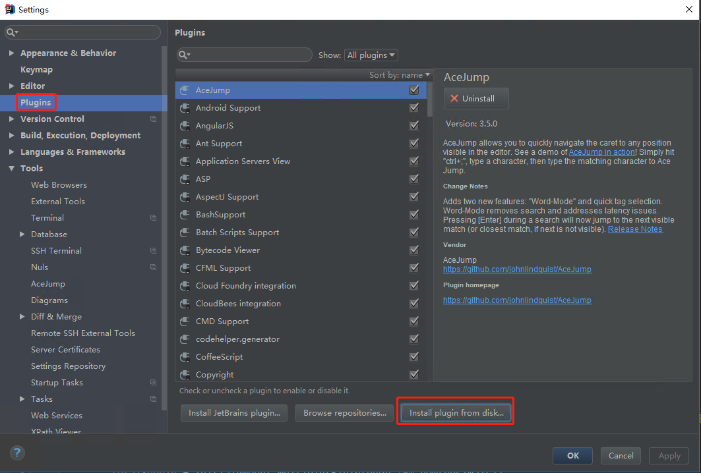

# IDEA Plugin 

#### 1 Install NULS Plugin on IDEA
- [Get NULS plugin](https://nuls-usa-west.oss-us-west-1.aliyuncs.com/plugins/Docs%26plugin.zip) ZIP, and save in disk
Click File->Settings->Plugin->Install plugin from disk

- Select the said ZIP, and click OK

- Tick NULS plugin, and click Apply

#### 2 Create a NULS project

Input Project name, click finish

#### 3 Compile smart contract

Smart contract code compilation refers to [developer document] (http://dev.nuls.io/contract/)

#### 4 Set and deploy the node and account for contract

- Click NULS plugin on the right, and call NULS plugin interface

	

- Plugin automatically generates a node 127.0.0.1:8001, and developer adds a node to deploy the contract.
Recommendation: Start the local wallet, and add the wallet address as the node address.

	Click + on the top left corner of panel, and select Add Node.

	

- Input Node address and clock OK

	

- Click + on the top left corner of panel, and select Add Account. Input Account address and click OK.

	

#### 5 Package contract

- Click the second button on the top left corner of plugin to directly package the current Project. Two output forms after packaging: Jar package and Hex code

	

- Click [copy code] to copy the HEX code to the [deploy contract] interface of wallet to deploy contract (optional step).

	

- Click the third button on the plugin panel top or [Next] at the button of current package interface to access contract deploying interface

	

	

#### 6 Deploy contract

- On Deploy interface, select the node and account for deploying contract from pull-down list. JarFilePath default value is the package route of the previous step.

	

- Parameters following JarFilePath are the parameters of the contract construction function.
	
	

- Click [advanced] to set gas value and price value. Gas varies from 1 to 10000000. Recommend to set a greater gas value to avoid failing in deploying contract.

	

- Click [Test Deploy] to conduct a trial deployment of contract. In case of a success, it gives prompt of Success.

	

- If success, click [Deploy]. After confirmation of contract creation transaction, it feeds back details of transaction, indicating a success of contract deployment.

	

- Review the deployed contract on the top of panel

	

- Click the deployed contract to review all method of this contract

	
	
	

