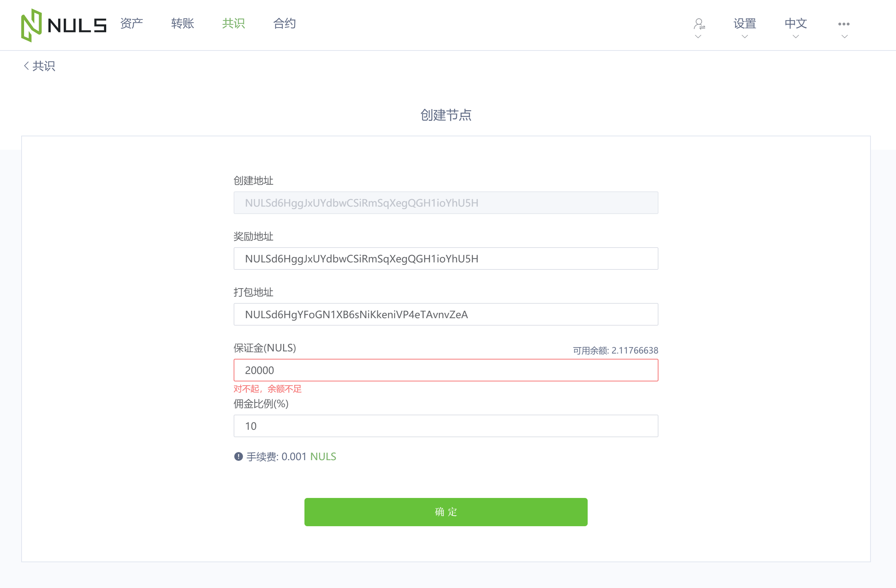

# Create a node

## NULS recommends creating your node for the Test Network first.

You have the option to install and run your node in the Nuls test network or the Nuls production network, Mainnet.  Nuls strongly recommends that FIRST you run your node in test. After you experience the installation and management of your node in test, you are ready to re-install for the mainnet.

For the test network, make sure to open the server ports 18001 and 18002.
For the Mainnet, make sure to open the server ports  8001 and 8002. 
If these ports are not open, your node will not successfully communicate with the blockchain.

## Step 1 - Use the Create Node checklist

Use the Create Node Checklist in conjunction with this document. The checklist informs you about the requirements for the node creation, and provides a summary of the required steps. 

## Step 2 - Download and Install the Node Wallet

1. Download the zipped node wallet package (linux version, windows version) from [GitHub](https://github.com/nuls-io/nuls-v2/releases). Download the Testnet or Mainnet version.


#  Linux Installation

The installation does not require root. Asd per linux standards, it is recommended not to install as root. 

The following example includes the creation of the user nuls, and the installation as the user nuls.

 ```
antares:~ # useradd -m -d /home/nuls nuls
New password:
Retype new password:
passwd: password updated successfully
antares:~ #
antares:~ # su - nuls
nuls@antares:~> pwd
/home/nuls
nuls@antares:~>
 ```
Download the latest version of  'Linux Node Wallet' or 'Windows Node Wallet' from [GitHub](https://github.com/nuls-io/nuls-v2/releases).

There is more than one way to download, here is a linux example: 

 ```
nuls@antares:~> wget -c http://nuls-usa-west.oss-us-west-1.aliyuncs.com/2.1/NULS_Wallet_linux64_v2.1.0_beta.tar.gz
 --2019-10-27 22:07:18--  http://nuls-usa-west.oss-us-west-1.aliyuncs.com/2.1/NULS_Wallet_linux64_v2.1.0_beta.tar.gz
 Resolving nuls-usa-west.oss-us-west-1.aliyuncs.com (nuls-usa-west.oss-us-west-1.aliyuncs.com)... 47.88.73.131
 Connecting to nuls-usa-west.oss-us-west-1.aliyuncs.com (nuls-usa-west.oss-us-west-1.aliyuncs.com)|47.88.73.131|:80... connected.
 HTTP request sent, awaiting response... 200 OK
 Length: 118128124 (113M) [application/octet-stream]
 Saving to: ‘NULS_Wallet_linux64_v2.1.0_beta.tar.gz’
 
 NULS_Wallet_linux64_v2.1.0_beta.tar.gz   100%[================================================================================>] 112.66M  5.36MB/s    in 21s
 
 2019-10-27 22:07:39 (5.35 MB/s) - ‘NULS_Wallet_linux64_v2.1.0_beta.tar.gz’ saved [118128124/118128124]
 
 nuls@antares:~>
 ```
Then, untar; cd to newly created directory; and start your wallet/node.
Note the commands start and stop, start and stop your wallet/node (the base for your node service).

```
nuls@antares:~> tar -xzvf NULS_Wallet_linux64_v2.1.0_beta.tar.gz
NULS_Wallet_linux64_v2.1.0_beta/
NULS_Wallet_linux64_v2.1.0_beta/Modules/
NULS_Wallet_linux64_v2.1.0_beta/Modules/Nuls/
NULS_Wallet_linux64_v2.1.0_beta/Modules/Nuls/libs/
NULS_Wallet_linux64_v2.1.0_beta/Modules/Nuls/libs/activation-1.1.1.jar
……..
NULS_Wallet_linux64_v2.1.0_beta/stop-dev
NULS_Wallet_linux64_v2.1.0_beta/nuls.ncf
NULS_Wallet_linux64_v2.1.0_beta/genesis-block.json

nuls@antares:~>cd NULS_Wallet_linux64_v2.1.0_beta
nuls@antares:~/NULS_Wallet_linux64_v2.1.0_beta> ls
check-status  cmd  cmd.bat  create-address  data  func  genesis-block.json  Libraries  Logs  Modules  nuls.ncf  start  start-dev  stop  stop-dev  test

nuls@antares:~/NULS_Wallet_linux64_v2.1.0_beta> ./start
nuls@antares:~/NULS_Wallet_linux64_v2.1.0_beta> qt.network.ssl: QSslSocket: cannot resolve CRYPTO_num_locks
qt.network.ssl: QSslSocket: cannot resolve CRYPTO_set_id_callback
qt.network.ssl: QSslSocket: cannot resolve CRYPTO_set_locking_callback
qt.network.ssl: QSslSocket: cannot resolve ERR_free_strings
…
qt.network.ssl: QSslSocket: cannot resolve SSLeay
qt.network.ssl: Incompatible version of OpenSSL

nuls@antares:~/NULS_Wallet_linux64_v2.1.0_beta>
```
Note, you may have some extraneous messages, such as the ones listed in this example.  Continue with the  creation of the  node, and check with the telegram  channel "nuls node owners" for feedback.  If you are creating a mainnet node and the messages are unfamiliar to you, consult telegram "nuls node owners" before proceeding.

Use the command "./check-status" to confirm the node has started.

After the node has started, Enter "./cmd" and check to see if the node is working as expected. i.e you can issue cli commands to the node.
```
nuls@antares:~/NULS_Wallet_linux64_v2.1.0_beta> ./cmd
JAVA_HOME:/home/nuls/NULS_Wallet_linux64_v2.1.0_beta/Libraries/JAVA/JRE/11.0.2
java version "11.0.2" 2019-01-15 LTS
Java(TM) SE Runtime Environment 18.9 (build 11.0.2+9-LTS)
Java HotSpot(TM) 64-Bit Server VM 18.9 (build 11.0.2+9-LTS, mixed mode)

/home/nuls/NULS_Wallet_linux64_v2.1.0_beta/nuls.ncf
Service Manager URL: ws://127.0.0.1:7771

 __    __ __    __ __        ______          ______          ______  __       ______
/  \  /  /  |  /  /  |      /      \        /      \        /      \/  |     /      |
$$  \ $$ $$ |  $$ $$ |     /$$$$$$  |      /$$$$$$  |      /$$$$$$  $$ |     $$$$$$/
$$$  \$$ $$ |  $$ $$ |     $$ \__$$/       $$____$$ |      $$ |  $$/$$ |       $$ |
$$$$  $$ $$ |  $$ $$ |     $$      \        /    $$/       $$ |     $$ |       $$ |
$$ $$ $$ $$ |  $$ $$ |      $$$$$$  |      /$$$$$$/        $$ |   __$$ |       $$ |
$$ |$$$$ $$ \__$$ $$ |_____/  \__$$ |      $$ |_____       $$ \__/  $$ |_____ _$$ |_
$$ | $$$ $$    $$/$$       $$    $$/       $$       |      $$    $$/$$       / $$   |
$$/   $$/ $$$$$$/ $$$$$$$$/ $$$$$$/        $$$$$$$$/        $$$$$$/ $$$$$$$$/$$$$$$/

Module:cmd-client

waiting nuls-wallet base module ready
 2 3nuls-wallet base module ready
nuls>>>

```


Here is another Linux example of installation and start:


The linux user starts the wallet with the **./start** command. After each module starts successfully, the command line is entered through the **./cmd** command. After the block is synchronized to the latest height, other operations can be performed.


# Windows Installation

Windows users double-click **start.bat** in the folder to start the wallet. After the module is successfully started, double-click **cmd.bat** to enter the command line. After the block is synchronized to the latest height, other operations can be performed.


## Step 3 - Wait for your node to sync with the blockchain

Here we deviate between test and mainnet.

For test, you wait.  It's going to be at least one or two hours. ***

For the mainnet, you can download the "Data Package" from the same link as you used for your node/wallet download: [GitHub](https://github.com/nuls-io/nuls-v2/releases).
This will significantly speed up the synchronization process. 


```
antares:/home/kathy # su - nuls
nuls@antares:~> ls
]  bin  NULS_Wallet_linux64_v2.1.0_beta  NULS_Wallet_linux64_v2.1.0_beta.tar.gz  pwd  wget

nuls@antares:~> wget -c http://nuls-cn.oss-cn-hangzhou.aliyuncs.com/data/data-281818.zip
--2019-11-04 01:16:08--  http://nuls-cn.oss-cn-hangzhou.aliyuncs.com/data/data-281818.zip
Resolving nuls-cn.oss-cn-hangzhou.aliyuncs.com (nuls-cn.oss-cn-hangzhou.aliyuncs.com)... 118.31.219.209
Connecting to nuls-cn.oss-cn-hangzhou.aliyuncs.com (nuls-cn.oss-cn-hangzhou.aliyuncs.com)|118.31.219.209|:80... connected.
HTTP request sent, awaiting response... 200 OK
Length: 341679794 (326M) [application/octet-stream]
Saving to: ‘data-281818.zip’

data-281818.zip           100%[==================================>] 325.85M  1.11MB/s    in 4m 43s

2019-11-04 01:20:51 (1.15 MB/s) - ‘data-281818.zip’ saved [341679794/341679794]

nuls@antares:~> ls
data-281818.zip   NULS_Wallet_linux64_v2.1.0_beta.tar.gz  NULS_Wallet_linux64_v2.1.0_beta  
nuls@antares:~>
                


```

1. Copy the zipped data file to the wallet directory.
2. Notice the size of the directory call 'data'.  (It will be 0 or 4 bytes.)
3. Unzip the data.zip file.
4. The 'data' directory is now large and contains the unzipped data.

```
nuls@antares:~> cp data-281818.zip  NULS_Wallet_linux64_v2.1.0
nuls@antares:~> cd NULS_Wallet_linux64_v2.1.0
nuls@antares:~/NULS_Wallet_linux64_v2.1.0> ls
check-status  create-address   func                Logs      start      stop-dev
cmd           data             genesis-block.json  Modules   start-dev  test
cmd.bat       data-281818.zip  Libraries           nuls.ncf  stop
nuls@antares:~/NULS_Wallet_linux64_v2.1.0> unzip data-281818.zip
Archive:  data-281818.zip
   creating: data/smart-contract/
   creating: data/transaction/
   creating: data/consensus/
   .....
   
nuls@antares:~/NULS_Wallet_linux64_v2.1.0> ls
check-status  create-address   func                Logs      start      stop-dev
cmd           data             genesis-block.json  Modules   start-dev  test
cmd.bat       data-281818.zip  Libraries           nuls.ncf  stop
nuls@antares:~/NULS_Wallet_linux64_v2.1.0> du -s data
701764	data
   

```

Start your node:

```
nuls@antares:~/NULS_Wallet_linux64_v2.1.0> ./start

nuls@antares:~/NULS_Wallet_linux64_v2.1.0> ./check-status
==================MODULE PROCESS====================
account PROCESS IS START
...
transaction STATE IS RUNNING
==================NULS WALLET STATE=================
==========================
NULS WALLET IS RUNNING
==========================
nuls@antares:~/NULS_Wallet_linux64_v2.1.0>

```

Start the cli interface.

```
nuls@antares:~/NULS_Wallet_linux64_v2.1.0> ./cmd
JAVA_HOME:/home/nuls/NULS_Wallet_linux64_v2.1.0/Libraries/JAVA/JRE/11.0.2
java version "11.0.2" 2019-01-15 LTS
Java(TM) SE Runtime Environment 18.9 (build 11.0.2+9-LTS)
Java HotSpot(TM) 64-Bit Server VM 18.9 (build 11.0.2+9-LTS, mixed mode)

/home/nuls/NULS_Wallet_linux64_v2.1.0/nuls.ncf
Service Manager URL: ws://127.0.0.1:7771

 __    __ __    __ __        ______          ______          ______  __       ______
/  \  /  /  |  /  /  |      /      \        /      \        /      \/  |     /      |
$$  \ $$ $$ |  $$ $$ |     /$$$$$$  |      /$$$$$$  |      /$$$$$$  $$ |     $$$$$$/
$$$  \$$ $$ |  $$ $$ |     $$ \__$$/       $$____$$ |      $$ |  $$/$$ |       $$ |
$$$$  $$ $$ |  $$ $$ |     $$      \        /    $$/       $$ |     $$ |       $$ |
$$ $$ $$ $$ |  $$ $$ |      $$$$$$  |      /$$$$$$/        $$ |   __$$ |       $$ |
$$ |$$$$ $$ \__$$ $$ |_____/  \__$$ |      $$ |_____       $$ \__/  $$ |_____ _$$ |_
$$ | $$$ $$    $$/$$       $$    $$/       $$       |      $$    $$/$$       / $$   |
$$/   $$/ $$$$$$/ $$$$$$$$/ $$$$$$/        $$$$$$$$/        $$$$$$/ $$$$$$$$/$$$$$$/

Module:cmd-client

waiting nuls-wallet base module ready
 2 3nuls-wallet base module ready
nuls>>>

```

## Step 4 - How to confirm your node has sync'd with the test/ mainnet chain

Use the command "network info" to determine if the sync has completed or how close you are to completing the sync.
```
nuls>>> network info
{
  "localBestHeight" : 337342,
  "netBestHeight" : 463046,
  "timeOffset" : 18,
  "inCount" : 0,
  "outCount" : 20
}
nuls>>>

```
The sync is complete when the localBestHeight is equal to the netBestHeight.
Here is an example. 

```
nuls>>> network info
{
  "localBestHeight" : 463191,
  "netBestHeight" : 463191,
  "timeOffset" : 2,
  "inCount" : 0,
  "outCount" : 20
}
nuls>>>
```


## Step 5 - Import your Packing Account

Once your node has sync'd with the blockchain, import the packing account.  Your package account must have the password "nuls123456". That password indicates to the node that this account is the "package account".

Import the packing address using the import command, and provide the private key.
A successful import will display your packing address, after the import is complete.


```
nuls>>> import b54db432bba7e13a6c4a28f65b925b18e63bcb79143f7b894fa735d5d3d09db5
Please enter the password (password is between 8 and 20 inclusive of numbers and letters), If you do not want to set a password, return directly.
Enter your password:**********
Please confirm new password:**********
tNULSeBaMkrt4z9FYEkkR9D6choPVvQr94oYZp

# The password for the imported address must be nuls123456
# You will be asked to enter the password twice
```

## Step 6 - After importing the packing address, your node is listed as a consensus node.

Go to the [test wallet](https://beta.wallet.nuls.io) or [mainnet wallet](https://.wallet.nuls.io), select the consensus option.

Your  node is now listed.  It will be listed with a deposit of 20000 NULS and staking of 0 NULS. When you clink on the node you found, it will display  page and list your create (agent), reward, and packing address. Record your Node name.  (Note: you can change your node name by adding an alias to your agent account. Once you add the alias, you cannot change the alias.)

## Download Light Wallet Installation -- Required to define consensus node

Users download and open the light wallet (windows version, mac version) from [GitHub](https://github.com/nuls-io/nuls-v2/releases) and connect to the node service.


## Step 7 - Shutting down your node

To stop your node, enter the cli command "stopagent". Upon successful execution of the command the hash of the transaction is returned.

```

nuls>>> stopagent tNULSeBaMnNZHHLwae8UAouJiro6URjwMkkMHv
Enter your account password********
"4adc8971bd9930e3b335a3a9aa1f4b35503f8ae05568a4548fb0822e6e070846"
nuls>>>

```

Your node will no longer be listed as a consensus node by the nulscan.io facility.
All NULS staked to the node will be refunded. The initial deposit by the node creator is locked for 72 hours, and then refunded to the agent address.


## Exampler of creating a consensus node

The user creates a consensus node on the light wallet (the reward address can be the same as the creation address, or it can be another address, the package address cannot be the creation address and reward address, the deposit is 20000-200000, the commission ratio is an integer value from 10-100 representing the comission percentage.)

Note: the English option is available in the upper left.



## Participation -- example of staking

The user opens the light wallet or [web wallet](wallet.nuls.io), imports  private key or keystore file, enters the consensus page, selects the node to stake.


## Familarize yourself with the node cli

It is recommended that you familarize yourself with the [cli](https://docs.nuls.io/Guide/g_linux_tutorial.html), command line interface. 

All/most functions can be done by a GUI wallet or nulsscan.io.  However the cli provides information in a compact manner that is easy to copy and save.  Also, actions can be performed faster since you are not waiting for a GUI interface to refresh.

To list all command catagories, enter "help".


```

nuls>>> help
parameter error
args incorrect:
help [-a | group | command]
	OPTIONS:
	[-a] show all commands and options of command - optional
	[group] show commands and options of this group. group list: [account, consensus, ledger, transaction, block, smart_contract, cross_chain, system]
	[command] shwo this command info

```


To obtain a summary of commands for a specific group, enter "help <command group>".

```
nuls>>> help consensus


--------------------------------------------------
group : consensus
--------------------------------------------------

createagent <agentAddress> <packingAddress> <commissionRate> <deposit> [rewardAddress] --create a agent
	OPTIONS:
	<agentAddress>   agent owner address   -required
	<packingAddress>    packing address    -required
	<commissionRate>    commission rate (10~100), you can have up to 2 valid digits after the decimal point  -required
	<deposit>   amount you want to deposit, you can have up to 8 valid digits after the decimal point -required
	[rewardAddress]  Billing address    -not required
...
stopagent <address> -- stop the agent
	OPTIONS:
	<address> account address of the agent -required
...
withdrawformultisign <address> <txHash> [sign address]-- withdraw the agent
	OPTIONS:
	<address>   address -required
	<txHash>    your deposit transaction hash  -required
	[sign address] first sign address -- not required
nuls>>>


```