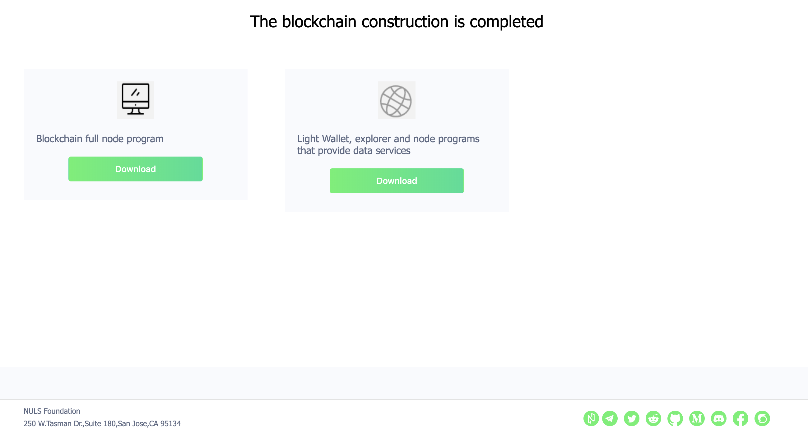

# Chain Factory Tutorial
Welcome to Chain Factory.  We are very proud of Chain Factory, the ability to create a blockchain designed for your application and business needs. The core of our blockchain is Nulstar. The Nulstar design enables us to provide to you a blockchain where only the modules you need are assembled to form your blockchain. Across time, as our modules/services grow,  the variety of blockchains and blockchain characteristics will expand, perhaps, beyond what we can imagine today.  As you use your blockchain, please consult the telegram channel NULS Support (https://t.me/NulsSupport)  for questions or feedback. We look forward to hearing from you. 
## Build blockchain
### Select module
In the chain factory, the modules are divided into the required modules and the optional modules. The system has already helped the user to select all the required modules. The user needs to select the optional modules according to the actual business scenarios. After the selection is completed, click [Submit Module Information]


### Fill in the basic information

Fill in the basic information of the chain, such as name, logo and inflation rules, etc.


### Configuring Genesis Blocks

The system automatically generates a series of Genesis block addresses, and the user needs to fill in the initial number assigned to each address. There are two points in the process of completing this step that require special attention from the user.

- The sum of the number of passes assigned to each address must be equal to the total circulation filled in the basic information
- After filling in, the user needs to click [Backup Address Private Key] to download all address private keys and save them. This part of the information will not be saved, so if the user loses the private key, the system will not be able to retrieve it.


### Configuring the seed node

If the user has prepared the server of the seed node, fill in the seed node ip/domain name and save the private key of the packaged address. After starting the node program on the seed node, import the corresponding package address, and the seed node can start. Maintain the blockchain network. If the server is not ready, you can use the default ip first. After the server is ready, change the seed node ip value in the node program configuration file.


### Confirm Order

The user needs to confirm the correctness of the information in the previous steps. After the order is submitted and the transaction is issued, it cannot be modified. After confirming that the information is correct, click [Submit Order] and enter the password. The system will automatically deduct the corresponding quantity nuls from the account address. Chain fee


### Download Chain Resources

After submitting the order and paying for nuls, the system will start assembling the module and packing the resources. The process may take a few minutes. Please wait patiently. After waiting for a certain period of time, please refresh the page and you will see the packaged resources.



## The Steps for Deploying your Blockchain

## Step 1 -- Setup your environment

1. If the user selected any  optional modules, the user will receive two downloadable compressed tar files. One file is prefixed with "normal" and the other is prefixed with "pro". The "normal" is the no-option  blockchain, and the "pro" is the blockchain containing the selected optional modules. 

2. Store the blockchain tar file(s), the Genesis file and the Seed file(s) in a safe location. If the user selects the Public-service module, you need to follow the steps to start the data service node, wallet and browser.

3. The blockchain  runs on a linux server. The ports 8001-8006 must be open for:  communication with other nodes (8001), cross-chain (8002), public-service (8003), nuls-api(8004), NULS explorer (8005), and NULS web wallet (8006).

4. The blockchain will not work as expected until the tokens contained in the address affiliated with the genesis block are unlocked.  THe lock is enabled in the Chain Factory "Configure Genesis Block" section. The file "GenesisAddressList.txt" contains the lock information.

```
kathy@ubuntu-8gb-nbg1-1:~/spacechain2$ cat GenesisAddressList.txt
[{"address":"TTSETeCA3FciSwrkMVDqggPWv5p77iULuUdKgwS","coins":1000000,"lockTime":1575281386000,"pri":"24eee6db98419b31ac425ae9f4d4aeb1e2e76efc755e3ce8b49311c58602a8fd"}]

```
If there is a value for "lockTime", then the Genesis address is/was locked. The blockchain Tokens are available after the lockTime.  To find out the date when the lock expires, enter the lockTime value in  https://currentmillis.com/.


### Step 2 -- Installing MongoDB

Users who need to use the public-service service need to install MongoDB on the server.  

Install MongoDB as a regular user.

Two MongoDB maintenance recommendations:
1. Run Mongod as a deamon.
2. To reset Mongo:
- kill mongod
- delete the contents of the directory data
- level the contents of the directory logs
- restart mongod


1.) If your L<inux server is running Centos:
 
Download the centos7 version:

```
wget https://fastdl.mongodb.org/linux/mongodb-linux-x86_64-rhel70-4.2.1.tgz
```

After the download is successful, extract and enter the directory:

```
tar -xvf mongodb-linux-x86_64-rhel70-4.2.1.tgz
cd mongodb-linux-x86_64-rhel70-4.2.1
```

After entering the directory, create a new configuration file mongodb.conf

```
vi mongodb.conf
Dbpath=/usr/local/mongodb/data #data file storage directory
Logpath=/usr/local/mongodb/logs/mongodb.log #log storage directory
Port=27017 #port
Fork=true #enabled as a daemon, ie running in the background
logappend=true
maxConns=5000
storageEngine = wiredTiger
bind_ip = 127.0.0.1
```

MongoDB sets the default name, does not set a password, starts by creating a new configuration file mongodb.conf

```
./bin/mongod -f mongodb.conf
```

2.) If you are using a different Linux OS:

Download and install mongo in its owns directory.

To bypass creating a mongod configuration file (which requires different syntax for different Linux OS), start mongod with all options recommended by NULS. For example:

```
kathy@ubuntu-8gb-nbg1-1:~$ cd mongodb
kathy@ubuntu-8gb-nbg1-1:~/mongodb$ ./bin/mongod --fork --dbpath ./data --verbose --port 27017 --maxConns 5000 --logpath ./logs/mongo.log --bind_ip 127.0.0.1 --storageEngine wiredTiger
about to fork child process, waiting until server is ready for connections.
forked process: 26812
child process started successfully, parent exiting
kathy@ubuntu-8gb-nbg1-1:~/mongodb$
```
### Step 3 -- installing Your Blockchain

1.) Transfer the blockchain compresses tar file(s), the Seed file(s), and the Genesis file to your Linux Server. 

2.) Here are the instructions regardless of whether you are installing the blockchain with additionally selected options (pro_linux.tar.gz), or the standard blockchain (normal_linux.tar.gz).

Uncompress and un-tar the compressed tar file, and cd to the blockchain directory NULS_Wallet.
```
tar -zxvf pro_linux.tar.gz 
cd NULS_Wallet/
```
OR
```
tar -zxvf normal_linux.tar.gz 
cd NULS_Wallet/
```
### Step 4 -- Start your Blockchain

Before starting your blockchain, make the following change to the nuls configuration file. The configurstion file is either "nuls.ncf" or ".default-config.ncf".  (Notice default-config.ncf is a hidden file.)

Change "minNodeAmount=2"  to "minNodeAmount=0".  "minNodeAmount" will occur twice in the configuration file.   Change the "minNodeAmount" under the "block" category.

Here is the "block" catagory, with the changed value "minNodeAmount=0":

```

[block]
#区块最大字节数
blockMaxSize=5242880
#区块扩展字段最大字节数
extendMaxSize=1024
#引发分叉链切换的高度差阈值
chainSwtichThreshold=3
#最小链接节点数,当链接到的网络节点低于此参数时,会持续等待
minNodeAmount=0
#区块同步过程中,每次从网络上节点下载的区块数量
downloadNumber=10
#从网络节点下载单个区块的超时时间
singleDownloadTimeout=15000
#区块同步过程中缓存的区块字节数上限
cachedBlockSizeLimit=20971520
genesisBlockPath=genesis-block.json


```


After entering the wallet directory (NULS_Wallet), execute the `./start-dev` command to start the wallet, and the `./check-status` command to check the wallet startup status.


```
kathy@ubuntu-8gb-nbg1-1:~/spacechain/NULS_Wallet$ ./start-dev
LOG PATH    : /home/kathy/spacechain/NULS_Wallet/Logs
DATA PATH   : /home/kathy/spacechain/NULS_Wallet/data
CONFIG FILE : /home/kathy/spacechain/NULS_Wallet/nuls.ncf
DEBUG       : 0
JAVA_HOME   : /home/kathy/spacechain/NULS_Wallet/Libraries/JAVA/JRE/11.0.2
java version "11.0.2" 2019-01-15 LTS
Java(TM) SE Runtime Environment 18.9 (build 11.0.2+9-LTS)
Java HotSpot(TM) 64-Bit Server VM 18.9 (build 11.0.2+9-LTS, mixed mode)

====================
NULS-WALLET STARTING
====================
kathy@ubuntu-8gb-nbg1-1:~/spacechain/NULS_Wallet$

```

Use the command ./check-status to confirm that the blockchain has started. Check-status will loop, checking the all the states of the modules that comprise your blockchain. It may take more than a minute for all modules to fully start. The final output should look like this:

```
./check-status
....
===================RUNNING MODULE===================
account STATE IS RUNNING
nuls-api STATE IS RUNNING
block STATE IS RUNNING
consensus STATE IS RUNNING
cross-chain STATE IS RUNNING
ledger STATE IS RUNNING
network STATE IS RUNNING
protocol-update STATE IS RUNNING
public-service STATE IS RUNNING
smart-contract STATE IS RUNNING
transaction STATE IS RUNNING
nuls-module-explorer STATE IS RUNNING
nuls-module-web-wallet STATE IS RUNNING
==================NULS WALLET STATE=================
==========================
NULS WALLET IS RUNNING
==========================
kathy@ubuntu-8gb-nbg1-1:~/spacechain2/NULS_Wallet$

```
At this point your blockchain is running.

If you have not successfully started MongoDB, your blockchain may be successfully running without the public-service module. Check-status will display this output:

```
==================MODULE PROCESS====================
account PROCESS IS START
nuls-api PROCESS IS START
block PROCESS IS START
consensus PROCESS IS START
cross-chain PROCESS IS START
ledger PROCESS IS START
network PROCESS IS START
protocol-update PROCESS IS START
public-service PROCESS NOT FOUND
smart-contract PROCESS IS START
transaction PROCESS IS START
nuls-module-explorer PROCESS IS START
nuls-module-web-wallet PROCESS IS START
==========================
MODULE PROCESS NOT READY
==========================

```

Notice, all the modules have started except for public-service. 

Start the command line CLI.  


```
kathy@ubuntu-8gb-nbg1-1:~/spacechain2/NULS_Wallet$ ./cmd
JAVA_HOME:/home/kathy/spacechain2/NULS_Wallet/Libraries/JAVA/JRE/11.0.2
java version "11.0.2" 2019-01-15 LTS
Java(TM) SE Runtime Environment 18.9 (build 11.0.2+9-LTS)
Java HotSpot(TM) 64-Bit Server VM 18.9 (build 11.0.2+9-LTS, mixed mode)

/home/kathy/spacechain2/NULS_Wallet/nuls.ncf
Service Manager URL: ws://127.0.0.1:7771

 __    __ __    __ __        ______          ______          ______  __       ______
/  \  /  /  |  /  /  |      /      \        /      \        /      \/  |     /      |
$$  \ $$ $$ |  $$ $$ |     /$$$$$$  |      /$$$$$$  |      /$$$$$$  $$ |     $$$$$$/
$$$  \$$ $$ |  $$ $$ |     $$ \__$$/       $$____$$ |      $$ |  $$/$$ |       $$ |
$$$$  $$ $$ |  $$ $$ |     $$      \        /    $$/       $$ |     $$ |       $$ |
$$ $$ $$ $$ |  $$ $$ |      $$$$$$  |      /$$$$$$/        $$ |   __$$ |       $$ |
$$ |$$$$ $$ \__$$ $$ |_____/  \__$$ |      $$ |_____       $$ \__/  $$ |_____ _$$ |_
$$ | $$$ $$    $$/$$       $$    $$/       $$       |      $$    $$/$$       / $$   |
$$/   $$/ $$$$$$/ $$$$$$$$/ $$$$$$/        $$$$$$$$/        $$$$$$/ $$$$$$$$/$$$$$$/

Module:cmd-client

waiting nuls-wallet base module ready
 2 3nuls-wallet base module ready
nuls>>>

```

### Step 5 -- Import the private key of the Seed
After the wallet is successfully started, there is one more step for your blockchain to be viable.

Copy the private key contained in your SeedAddressList.txt file. The private key is identified by "pri".

```
kathy@ubuntu-8gb-nbg1-1:~/spacechain2/NULS_Wallet$ cat SeedAddressList.txt
[{"address":"TTSETeCA3FZJixem5LsfsBVD5TLmFz43zyB8MBw","pri":"2779fbbc237225a6f5bbaae542a474f7d862f392b5b157787ab8eda25b41006c","pub":"03475dfc8092e77be686c557b1700a26d28f0347bc48cc71639b82e5ac886a3349","ip":"78.47.206.255"}]

```

Import the private key. You will be prompted for the password. The password is "nuls123456". Note, there is no quotes in the password.

```
nuls>>> import 2779fbbc237225a6f5bbaae542a474f7d862f392b5b157787ab8eda25b41006c5
Please enter the password (password is between 8 and 20 inclusive of numbers and letters), If you do not want to set a password, return directly.
Enter your password:**********
Please confirm new password:**********
TTSETeCA3FZJixem5LsfsBVD5TLmFz43zyB8MBw

# The password for the imported address  must be nuls123456
# You will be asked to enter the password twice

```

The import is successful, if the account address listed is the address contained in the SeedAddressList.txt file. 

Now your blockchain begins to build blocks:

```
nuls>>> network info
{
  "localBestHeight" : 2,
  "netBestHeight" : 2,
  "timeOffset" : -1,
  "inCount" : 0,
  "outCount" : 0
}
nuls>>>

```


- Access to the block's block browser via **ip:18005**

- **ip:18006**Access to the web wallet of the chain. In the web wallet, you can connect to the chain by adding a node service (**http://{ip}:18006/**):


### Launching a normal node wallet

Download the normal wallet from the chain factory and upload it to the server and unzip it (same as above). After entering the directory, start the wallet. After the wallet is successfully launched, enter the command line by pressing the command `./cmd` to import the block address downloaded during the chain creation (password setting). Consistent with the configuration file)

Precautions:

- Multiple outbound addresses need to be imported into the launched wallet (cannot be the same wallet)

- The server must be enabled on the server configured as the ip of the seed node. The newly added wallet will first connect to this ip.

### Cross-chain network waiting

Set up a cross-chain chain, you need to wait for the cross-chain networking, networking takes a period of time, when the cross-chain network of the main network and the new chain is successfully initialized, you can initiate cross-chain transactions, otherwise it will cause asset loss.
