# Community Governance Tutorial

1. Click the community management tab and enter the login page. Import your address using the keystore file or private key, or create a new address.

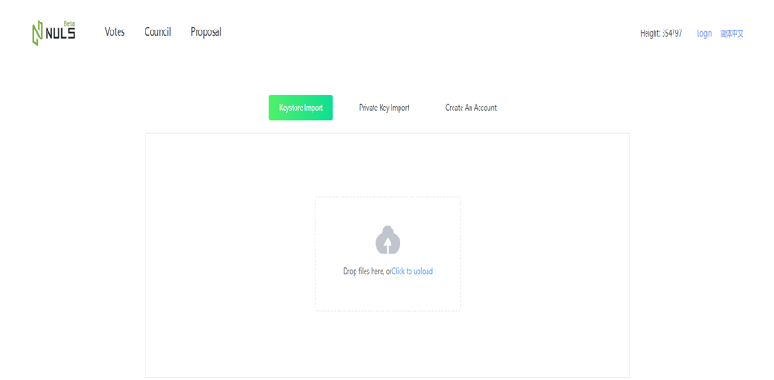 

 

 

## Voting Right

After importing the address, users can view the number of votes available to the changed address. 1NULS=1 Vote. Users can set other addresses as proxy addresses, and the proxy uses its own ticket rights. (Enter an address or alias)

 

In addition, the user can also cancel the proxy actively after setting the address of the proxy.

 

If other users set your address as agent, then the user can view them in my agent, and also can cancel the operation to void the voting agent for other users.

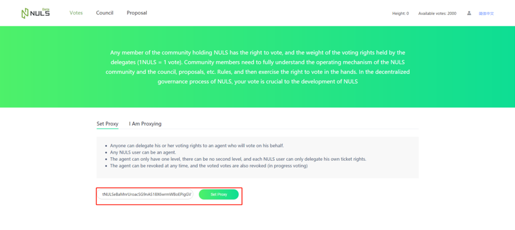

## Council

Normal users can go to the council to apply to become a councilor (Technical Councilor: The address balance cannot be less than 25000 NULS, Management and Operation Councilor address balance cannot be less than 50000 NULS) The number of Councilors are limited to 11 total;  3 technical councilors, 4 management councilors and 4 operation councilors. The candidates are listed from top to bottom according to the number of votes, in each of three categories that reflect the three types of councilors.

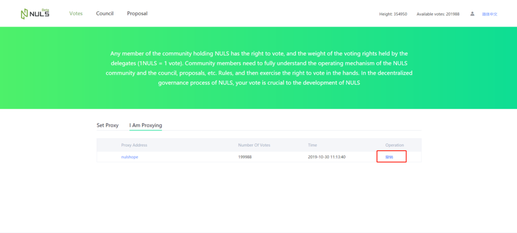 

 

**Council Voting**: Each account can vote for up to 11 councilors and a minimum of 0. After voting, if you want to cancel in batches, uncheck the boxes.

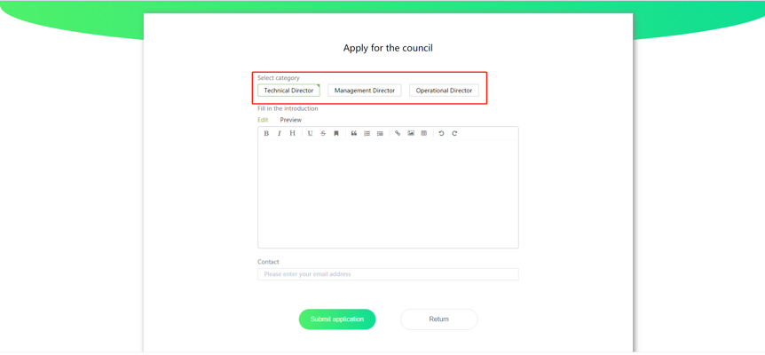 

Users can also go to the councilors details pages to vote or cancel their vote.

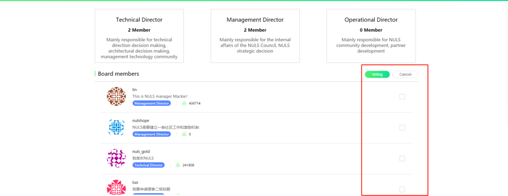 

 

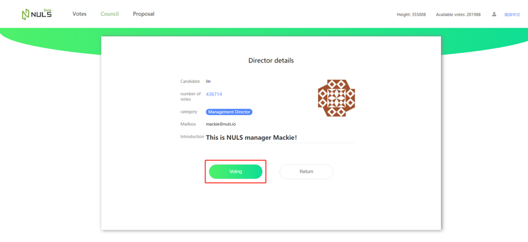 

 

## Proposal

Each user can create a vote with multiple types of proposals. When the proposal is created, you can choose whether the voting option can be changed or not.

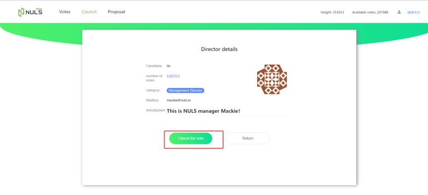 

 

Council members can review or reject the application proposals, (When all the councilors reject the proposal, the proposal cannot enter the voting stage, and it will show a review of the refusals.)

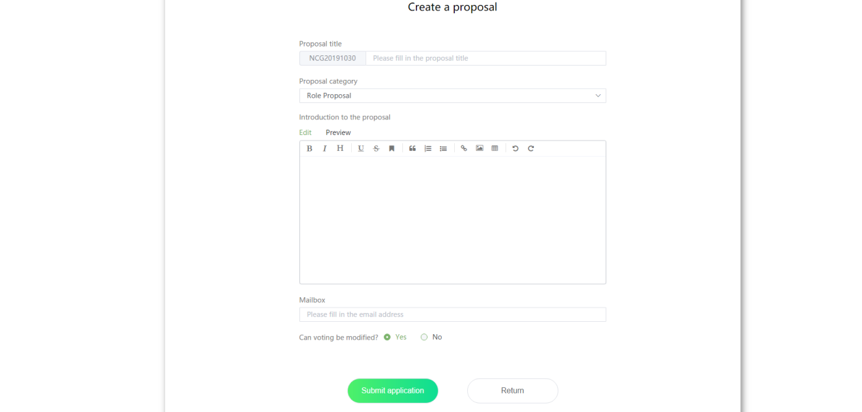 

Any user can vote on a proposal or update their vote.

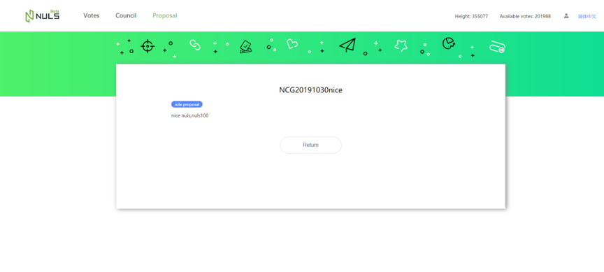 

 

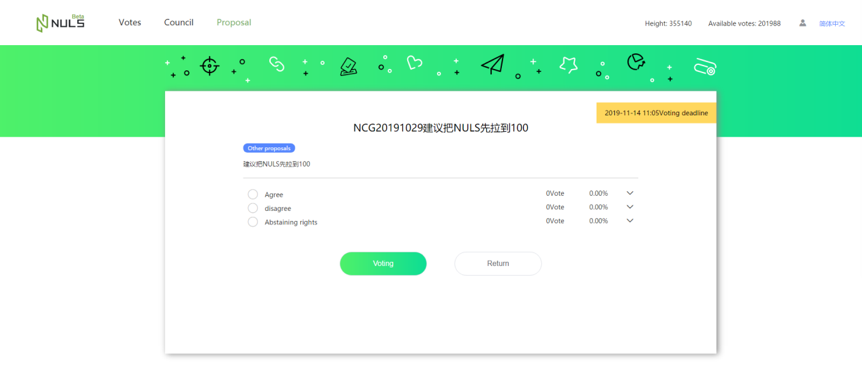 

## Voting

Any user can create a normal vote (this temporarily locks 10 NULS), and single or multiple selections both can be set. The number of options and content can be customized. You can also choose whether to update your vote within a limited time. In addition, you can also associate various proposals that are being voted on.

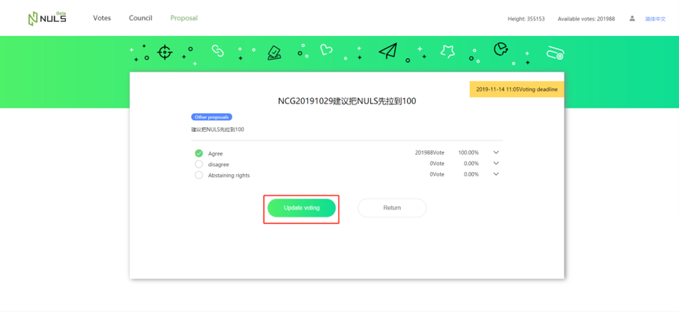 

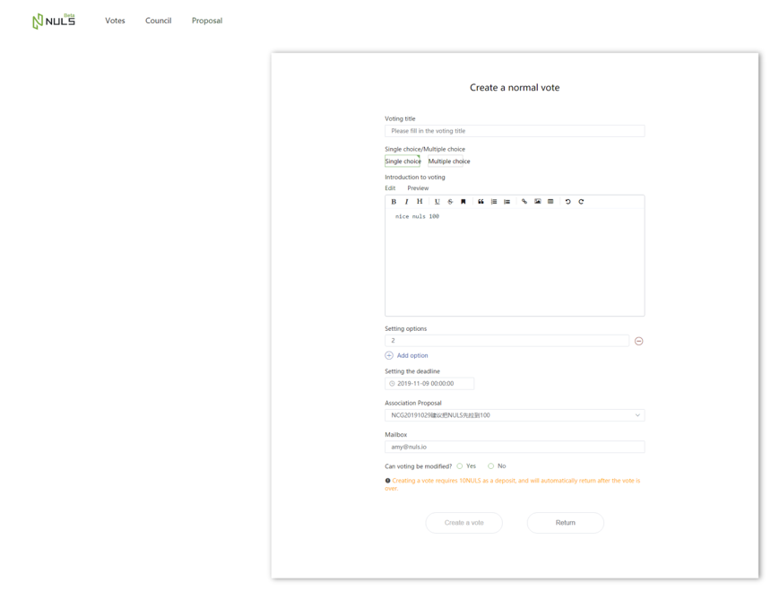 

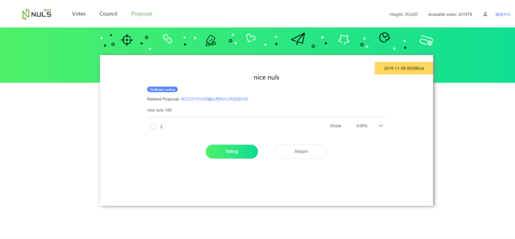 

## User Center

 The user center can be used to view the votes and lists the titles to all of the current votes. Click on a title to get more detail about the vote.

 

 

 