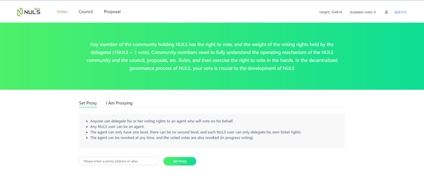

# Community governance Tutorial
The user opens the community management and enters the login page. The address can be imported through the keystore file or private key. Or a new address can be created.

## Voting Right
After the user imports the address, you can view the ticket rights of the changed address.1NULS=1 Vote,Users can set other addresses as proxy addresses, and the proxy uses its own ticket rights.(Enter an address or alias)

In addition, the user can also cancel the proxy actively after setting the address of the proxy.

If other users set your address as agent, then the user can view them in my agent, and also can cancel the operation to cancel the voting agent for other users.

## Council
Normal users can go to the council to apply for a councilor(Technical councilor: The address balance cannot be less than 25000 NULS,Management and Operation councilor:The address balance cannot be less than 50000 NULS),the number of the Councilor are limited,it is 11.Including 3 technical councilors,4 management councilors and 4 operation councilors.The top rankings of all types of councilors are formal ,others are candidates.

Council voting:Each account can vote for up to 11 councilors, at least 0,After voting, if you want to cancel in batches, uncheck the click to vote.

Users can also go to the councilors details pages to vote or cancel the vote.

## Proposal
Each user can create a proposal with multiple types of proposals. When the proposal is created, you can choose whether you can change the voting or not.

Council members can review or reject the application proposals,(When all the councilors reject the proposal, the proposal cannot enter the voting stage, and it will shows review refuses.)

Any user can vote on the voting proposal or update the vote

## Voting
Any user can create a normal vote (mortgage 10NULS),single or multiple selection both can be set , and the number of options and content are customized, You can also choose whether you can update your vote within a limited time.In addition, you can also associate proposals that are being voted on.

## User Center
The user center can be enter and view all the votes , the title can jump to the voting details.
