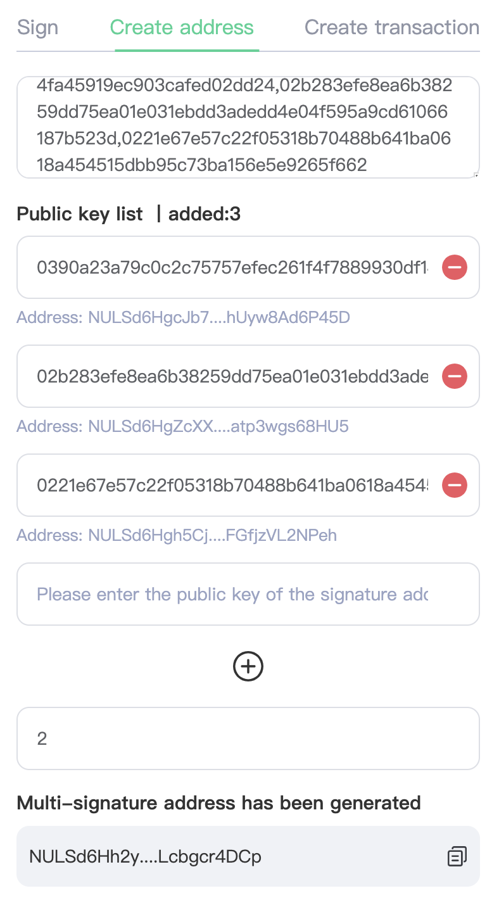

# NULS Multi-Sign DApp Guide 

## What is multi-sign?

Multi-signature, also known as multisigi, which is a digital signature that allows multiple users to sign one transaction. To address in a simpler way, an account that is owned, managed, signed by more than one party.  

In most cases, there is only one private key that manages a single account, which we call it 1/1. Multisig is different,it goes m/n, “n” refers to the amount of private keys that are authorized to sign for the account, transactions only take effect when the number of signatures reaches to “m”. In this case, “m” must be less than or equal to “n”.

## How is multisig applied in cases 

Multi-signature has many uses in account authority management 
For example:

* Assets management:. Multi-sigi greatly enhances security level by allowing multiple people managing one account using different private keys, which lowers the risks of assets being attacked. 

* By managing one account with multi-signatures, even if one of the signatories lost the private key, the rest of them can still get access to the account that is being protected by multi-sig.

* Department Authorization; A matter that must be approved and signed by multiple departments before it takes effects. Every signature can be traced and it is transparent to all parties. 

## Assets that supported

Our multi-sig comes as a DApp, which is compatible to NULS and NerveNetwork blockchain The DApp can be used to manage NULS and Nerve mainnet asset and assets bridged from Ethereum/Polygon/Arbitrum/BSC/Heco/OEC/Cronos and other blockchains to NULS through NerveNridge(currently not supports NRC20 assets )

## A quick starter on Multisig DApp  

How to use Multi-sig DApp in NULS network

### Connect Wallet
To get access to [multi-sig](https://sign.nuls.io)，connect wallet by Nabox or Metamask. 
 Click & [Down extension wallet](https://chrome.google.com/webstore/detail/nabox-wallet/nknhiehlklippafakaeklbeglecifhad?hl=zh-CN&authuser=2)

After successfully connecting to the wallet, click【Generate multi-chain address】to sign up, this will automatically generate a NULS address and a Nerve address and directly lead you to the operation UI. Our multi-sig DApp is enabled with the following functions.

- Create Multisig account address 
- Create Multi-sig transactions 
- Signning 

### Create Multi-sig account address 

A multi-sig account address is required, before you can use the multi-sig DApp. 

- Input public keys in the first box and separate them with dots, the system will automatically identify every public key. 
- Input private key one by one, click “+” to add more.

After submitting public keys, you will need to select a number of the minimal signatures. Minimal signatures set a minimal number of accounts used to confirm a multisig transaction. For example, if a multisig account is managed by 3 people, the minimal signatures number is 2, which is to say, confirmations from 2 people are required to enable a transaction. Otherwise the transation would fail 

After submitting information, click “Generate address” to create a multisig account address

### Create Multisig Transactions

To create a multisig transaction, users need to select a multisig address that starts the transactions. 

Select assets that you want to transfer - select amount of transfer and receiving address - create transaction

After creating the transaction, a multisig HEX will be generated. Copy the HEX and send it to the other signers to confirm. 

### Signatures 
 
Signature function The user will sign the received multi-signature transaction HEX, and the user's role at this time is one of the signers. The user pastes the received HEX into the input box, and the tool will automatically parse the data of the multi-signature transaction and display it.

Note: After the first signer completes the signature, a new HEX will be generated, the second signer will copy the new HEX and so on

After transaction is parsed, you will be able to check the status of transaction based on the information of “signed quality” and “signature still required”

If the current signer is the last signer that is authorized to sign the transaction (For example, if a transaction that requires two signers has already been signed once and it is being signed now, this makes the current signer the second/last signer). After all signatures are completed, the transaction will be broadcasted in the blockchain and will be confirmed in few minutes) 

