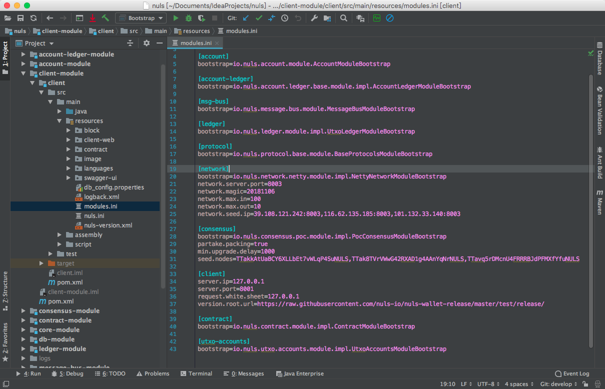

# Build Chain

## Introduction

This tutorial guides you to build a private chain based on NULS source code, to make is easier for users to learn about the operation, development or experiment of the NULS Blockchain. By building a chain to fully understand the operation of each node and data interaction, we can better grasp the overall operating mechanism of the NULS Blockchain, which is conducive to further research. We assume that readers have the skills to set up and debug a Java development environment.


## Setting up environment

- Operating systems: macOS, Windows
- Build Tools: Maven
- Development Tools: IntelliJ IDEA
- NULS source code on github: https://github.com/nuls-io/nuls


## Beginning

Since blockchain is a decentralized network composed of multiple nodes, we will take a private chain with three nodes as an example. Although we recommend using a Linux server to run the NULS main-net consensus node, in this tutorial, we choose macOS system that can set up a Java development environment to run and debug nodes.

## Development environment

First, clone the NULS source code using IntelliJ IDEA and open the project. Make sure JDK is the jdk1.8 version and Maven is configured correctly.

## Steps to build

1. Open the module.ini file, which is the configuration file for joining or building the network. In this tutorial, it is the configuration information of the NULS test-net.



2. We will use three nodes to build a private chain. First we need to prepare devices (virtual machine works) for three nodes to run.

- Node A: 192.168.1.1
- Node B: 192.168.1.2
- Node C: 192.168.1.3

We also need to set up a seed node to maintain the operation of the blockchain, i.e., to package and forge blocks. In addition, we need to prepare a block-forging address (including private key, to import into the seed node), which can be prepared in advance.

In this tutorial, the initial block-forging address we prepare is: 
`Nse4zpZHsUuU7h5ymv28pcGbwHju3joV`

PS: You may find that the first few letters of the address we prepare differs from those of the test-net address in the figure, which is for the sake of distinguishing the test-net address from the main-net address, so as to avoid confusion that may result in adverse consequences. Specifically, we set the test-net address to start with "TT" and the main-net address to start with "Ns". This tutorial uses the NULS main-branch code, so the address starts with "Ns". If you prefer to custom the starting letters of the private-chain account address, you can try to modify the `chain.id` parameter in the nuls.ini file. The parameters of the same chain must be in consistence.

3. Assuming node A is the seed node, then modify the network and consensus sections of the module.ini configuration file of three nodes A, B and C according to the following configuration:

```ini
[network]
Bootstrap=io.nuls.network.netty.module.impl.NettyNetworkModuleBootstrap
Network.server.port=8003
Network.magic=20190101
Network.max.in=100
Network.max.out=10
Network.seed.ip=192.168.1.1:8003

[consensus]
Bootstrap=io.nuls.consensus.poc.module.impl.PocConsensusModuleBootstrap
Partake.packing=true
Min.upgrade.delay=1000
Seed.nodes=Nse4zpZHsUuU7h5ymv28pcGbwHju3joV
```

- Modify `work.seed.ip` to the ip and port of the seed node.
- Modify `seed.nodes` to the block-forging address.
- The consistency of the magic parameters `network.magic` of all nodes in the private chain is a must.

4. Run the three nodes separately through IntelliJ IDEA. If you only need to debug one node, the other two nodes can be packaged with maven and sent to a Linux server to run. Remarkably, a jre must be placed in the NULS root directory to run properly.
5. After launching the three nodes, once the IntelliJ IDEA console has the following log output, it means that the three nodes have successfully formed a private chain network, but it still cannot produce new blocks and the block height is 0. If there is no log output, you need to uncomment the `<appender-ref ref="STDOUT"/>` in logback.xml.

```
io.nuls.client.Bootstrap.sysStart(Bootstrap.java:156):bestHeight:0 , txCount : 1 io.nuls.client.Bootstrap.sysStart(Bootstrap.java:174):height:0,count:2, hash :xxxxxxx,192.168.1.2:8003,192.168.1.2:8003

```

6. Then import the prepared block-forging account `Nse4zpZHsUuU7h5ymv28pcGbwHju3joV` via wallet interface of the seed node A. After a while, you can see the latest height displayed in the console increasing, which indicates that the network is producing new blocks. At the same time, the height of the node B, C will also increase and the height of the three nodes will remain the same. At this point, the setup of the private chain network is completed.

## Conclusion

This tutorial mainly introduces the easiest way to build a private chain for the development and debugging of NULS, without modification on the source code of NULS. If you want to dig deeper into NULS, you can refer to the relevant documentation of NULS to modify and debug the source code. Maybe you will find more secrets!