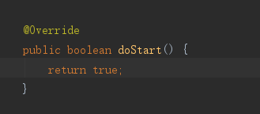
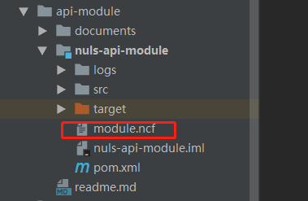

# Develop Business Modules

Before reading this article, please read [Package Generation](/NULS2.0/packageGeneration.html)

NULS 2.0 is a blockchain project based on modular development. According to the characteristics of the blockchain and the unique NULS POC consensus mechanism, we have built-in accounts, ledger, network, block management, transaction management, consensus, and intelligent contract modules. These modules can meet the normality of the NULS2.0 blockchain node. run. But the underlying module is unlikely to meet all of the business needs. This article will guide developers on how to add their own modules and how to add their own protocols.

Before adding modules, we should first analyze the requirements of the business. We need to know clearly that the added modules only encapsulate and process the existing protocols, or that the existing protocols do not meet the needs of the business and must be added. The logic of the protocol and protocol handles the function.

This article uses api-module and account two developed modules to illustrate how to add their own modules (both modules are JAVA development, can be downloaded at [https://github.com/nuls-io/nuls_2.0](https://github.com/nuls-io/nuls_2.0) Source code reading).

## Only add modules 

The api-module module is responsible for secondary parsing of the stored block data in the wallet, providing the wallet page and the browser with information that can be displayed. Therefore the module does not require an additional protocol.

1. Add a new module to the ModuleE enumeration class

2. Create a module's Bootstrap startup class

   The startup class needs to inherit the RpcModule class for easy management of the mykernel core module. After inheritance, you need to implement a unique method, as shown below:

   

Add dependent modules: If your module needs to call other modules' interfaces to query related data, or if you need other modules to run, your module can run normally, you need to add the dependent modules here. As shown below:

Module initialization: If the module has data that needs to be initialized, it can be implemented here. The init method must call super.init() to ensure that the dependency injection is successful. As shown below:

Start running: Start the running process to start your own service process, return true after the startup succeeds, if the startup fails, the program will return false after catching the exception, and inform the mykernel core module. As shown below:

The dependent module has been started: Going to this step, the modules you depend on have been successfully started, and you can call the interfaces of other modules at this time.

The main function of the api-module module is to query the interfaces of other modules, and then parse the data and return it to the wallet page display. Therefore, the real operation of the module is done in the scheduleManager.start() step. The internal implementation is detailed in the source code.

At this point, the api-module module has successfully joined nusl2.0. Since there is no new protocol, the module only needs to write the business functions of the module itself.

## Add new protocols

​We use the alias trading of the account module to illustrate how to add a new protocol. Alias ​​trading, as its name implies, is that the account sends a transaction with the alias information that the account wants to set. Once the transaction is successfully packaged into the block by the consensus node, it indicates that the account setting alias is successful. The page displays the account alias when the account information is displayed.

Step 1: Add a transaction type

Each transaction requires a separate set of its own transaction type. The transaction type cannot be duplicated with the transaction type of other modules. See the RPC documentation for the transaction types of other modules.

Step 2: Create a transaction logic object

The transaction logic object belongs to the business logic data stored in the transaction, such as the alias information stored in the alias transaction, and the object needs to inherit the TransactionLogicData class. As shown below:

Since the logical data is eventually serialized as a byte array to be broadcast over the network, methods for serialization and deserialization are also needed. As shown below:

Step 3: Create a transaction-related RPC interface. The interface should include creating transactions, verifying transactions, processing transactions, and rolling back transactions.

Users can successfully assemble transactions and broadcast to the entire network by creating a trading interface;

The verification transaction interface will be uniformly called by the transaction management module, and the transaction that fails verification will be discarded;

The verified transaction will be uniformly called by the consensus module to process the transaction interface and stored in the local database;

When there is a block rollback, the block management module uniformly calls the rollback transaction interface to clear the transaction related data stored locally;

For details on the implementation of the code, see: io.nuls.account.rpc.cmd.AliasCmd

Step 4: Start the module registration transaction

When the module is started, you need to register the new transaction of the module with the transaction management module in doStart(), and the corresponding validator and processor, as shown below:

Then, just like api-module, add code related to other business logic in your own module.

Finally, remember to add the module.ncf configuration file under the module's class, as shown below:

