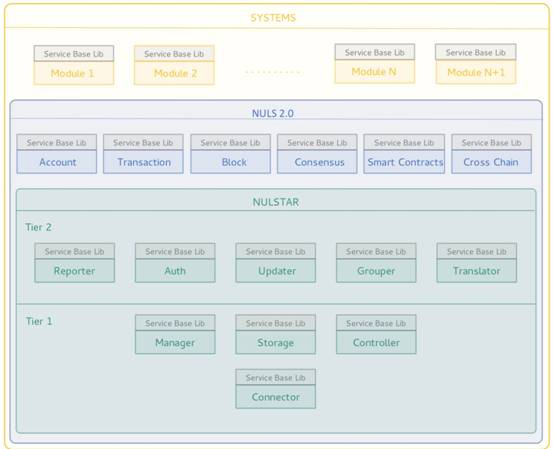

#  Build Chain
## Development environment setup

NULS2.0 is an open and non-restricted language underlying platform for blockchain. This paper only refers to the core business modules of blockchain to write the Java environment building process.

1 Environment to prepare

- install the JDK
- install Maven
- install the IntelliJ IDEA development tools
- install git

2 Clone source code

 git clone [git@github.com](mailto:git@github.com):nuls-io/nuls_2.0.git

3 IDEA imports all maven projects in nuls_2.0

4 Build your own maven project

5 Run all the modules that need to be started

## Using NULS2.0 core module to build the basic chain

NULS is a global open source blockchain underlying infrastructure. Making the blockchain simpler is the mission of NULS. This article will describe how to use the NULS core module to quickly build a basic blockchain.

NULS does not limit the attributes of the blockchain. Using the NULS underlying layer, you can build a private chain, a coalition chain, and a public chain. You can build a coin blockchain or build a currency-free blockchain.

### 1 Understanding the Microservice Architecture of NULS 2.0



NULS 2.0 is built on a micro-service architecture with built-in blockchain core business modules, including accounts, transactions, blocks, consensus, etc. When we build a basic blockchain based on NULS 2.0, we will be based on the NULS 2.0 blockchain. The basic functional layer is extended.

Because NULS2.0 already contains the basic functions of the blockchain, when developing its own blockchain, it only needs to organize its own unique business functions, abstract the corresponding protocol, and develop the function into a module inserted into NULS2. 0 can be. For example: Suppose we want to implement a "Notepad Chain". On the basis of NULS, we need to design a "Notepad" business transaction, such as a note transaction, delete a note transaction, our business module needs to do, in this The business logic code is added to the module, and the verification, processing, and rollback functions of the two transactions are implemented, and then the transaction information is reported to the transaction management module to process the transaction related logic.

Understand how to expand the blockchain function, you can design your own functional modules according to the following steps.

### 2 Modify basic configuration information

To run a blockchain, you need a lot of basic configuration. Each blockchain must have its own configuration parameters. When building a new blockchain, the first thing is to configure its own operating parameters.

The startup script of NULS2.0 supports the way to send configuration files to start the blockchain. The usage is as follows: sh start.sh -c modules.ncf

The modules.ncf can be configured with parameters of each module. The developer can modify the running parameters according to the situation of the own chain. The specific operating parameters are preset as follows:

| section | param | name | remark |
| --------- | ----------------------- | -------------- | ------------------------------------------------------------ |
| common | chain.id | This chain id | Uint16, NULS main network is 1, test network is 2 |
| common | address.prefix | address prefix | size letters + numbers, 2-5 characters |
| common | data.root.dir | Data Storage Path | For all modules to be stored in the same directory, special paths can be configured in any module if needed |
| common | encoding | Encoding method | Default UTF-8, not recommended to modify |
| common | asset.id | Original Master Asset Code | NULS 1 |
| common | log.root.dir | Log Root | Log files for each module |
| common | log.level | log level | log print level debug/info/warn/error. |
| block | data.folder | data subfolder | used to store block module data, placed under #{data.root.dir} |
Block | block.max.size | Block size max | Block size limit, avoid too large blocks too high to participate in the threshold |
| block | block.interval | Block Interval | |
| block | max.rollback | Maximum rollback quantity | When this number is exceeded, the system will stop rolling back to avoid major problems |
| block | header.extend.max.size | Extended Maximum size | Size Limits for Extended Fields in Block Headers |
| block | genesis.block.json.path | Genesis Block Description File | Genesis Block Description File |
| consensus | data.folder | data subfolder | used to store consensus module data, placed under #{data.root.dir} |
| consensus | packing.interval | Blocking interval |
| consensus | inflation.token.count | Annual Issues | The number of additional issuances used to reward nodes via coinbase transactions |
| consensus | block.max.size | Block size |
| consensus | seed.addresses | Consensus Seed Address | Multiple Addresses Separated by "," |
| consensus | packing.address.pwd | Address Password | Password for the packaged address |
| consensus | agent.deposit.min | | Minimum Margin Quantity When Creating Nodes |
| consensus | agent.deposit.max | | Maximum Margin Quantity When Creating Nodes |
| consensus | commission.rate.max | | The maximum commission rate, no more than 100 |
| consensus | commission.rate.min | | Commission Ratio Minimum |
| consensus | deposit.min | | Single commission minimum amount |
| consensus | agent.total.deposit.max | | Maximum amount of nodes to accept delegates |
| consensus | packing.token.min | | When the node's delegate reaches this value, it starts to block |
| consensus | red.punish.lock.time | | Red Card Lock Time |
| consensus | agent.stop.lock.time | | Stop Node Lock Time |
| network | data.folder | data subfolder | |
| network | seeds | | Seed nodes, separated by ","
| network | magic.number | | Magic numbers for isolating other networks |
| network | port | | port |
| network | nuls.seed | | NULS2.0 seed node configuration when cross-chaining is required |
| network | cross.listener.port | | |
| network | nuls.magic.number | | |
| contract | nrc20.file.path | | NRC20 protocol description json file path |
| tx | data.folder | data subfolder | |
| Ledger | data.folder | data subfolder | |
| api | mongodb.ip | mongodb address | |
| api | mongodb.port | mongodbport | |
| api | rpc.listener.ips | rpc listener ip | can configure multiple |
| api | rpc.port | rpc listening port | |
| api | req.allow.per.s | Concurrency Limits |

The table lists the most common configuration items, not all. After the alpha version and the beta version, the team will sort out the list of available configurations for all NULS 2.0 for the majority of blockchain developers to configure their own areas. Blockchain.

> [^Note]: Since the NULS2.0-alpha version does not complete the docking of Nulstar, the individual parameters may be modified later, which is subject to the final online version.

 ### 3 Packaging and booting

 After the configuration items of the chain have been modified, you can directly refer to Part 4 of this document: [Packing and Booting] (#Packing and Booting)


## Building a blockchain containing business modules

After building your own blockchain using the modular infrastructure of NULS 2.0, you need to develop a business module and integrate it into the base chain to achieve your own unique business. The following sections can provide some guidance on how to develop a business module of your own.

### 1 Business Module Description

#### 1.1 What is a business module?

A functional module with a custom service based on the bottom of the blockchain. The module can be a microservice module that can communicate with other modules according to the NULS2.0 module protocol, or can be an independent, only through the RPC interface. External application for basic module communication.

The service module does not add or modify the protocol, only extends the basic protocol, and implements its own business through the extension of the protocol.

#### 1.2 How to extend the agreement

NULS provides two ways to extend the protocol. The two methods are similar, as follows:

- Expand by remark field of transfer transaction

Serialize the data you want to wind up into a byte array and place it in the remark field of the transfer transaction. Place your own magic number at the very beginning of the byte array to distinguish other transfer transactions. Monitor the transfer transactions in all blocks in your own application, and parse and process the business when you find remarks that start with your own magic number.

- Expanded through established business expansion transactions

NULS provides a specific transaction type for business expansion. The transaction can freely fill in txData, serialize the data to be chained, into a byte array, and put it into the txData of the transfer transaction. Place your own magic numbers in front of the byte array to distinguish between transactions that are not of interest. Monitor the business extension transactions in all blocks in your own application, and find txData with its own module number for parsing and business processing.

**Example:**

Suppose now that an application is to be implemented, the application's business is: private notepad, the core business is that each address can store the encrypted note text on the blockchain, and can be decrypted and viewed at any time.

1 functional design

```
1. Add a note: Encrypt the note content and send the encrypted data to the chain;

2. Parse the block data extraction note data: obtain the data of the application from the blockchain, and store the data to the local database;

3. Decrypt view: Get records from the database, decrypt, display decryption results

4. Delete the note: the app is deleted locally, and the data in the blockchain is not deleted.
```

2 blockchain interaction

The above function design needs to interact with the blockchain is 1 new note and 2 parsing block data extraction note data.

- The implementation of the first function is as follows:

```
First design the data format as follows

{

  Address:"", / / ​​note owner

  Time:"", / / ​​note time point

  Content:""//Encrypted note content

}

According to the data format, assemble the uplink data: address+time+content;

Determine the magic number of the app, assuming 12345678.

Then assemble the DataTransaction (business extension transaction), set the value of txData to the spliced ​​byte array of 12345678, address, time, content. After paying a sufficient fee, sign the transaction and broadcast the transaction to the network.
```

- The implementation of the second function is as follows:

```
Listen to all the blocks, find the 'business expansion transaction' to analyze, first parse to txData, first determine whether it has started 12345678,
If not, discard the transaction. If yes, continue to parse and determine if address+time+content was successfully obtained (to avoid data confusion caused by repeated magic numbers)
If the data is successfully parsed, store the data in a local database
```

3 other business implementation

All services that do not need to interact with the blockchain can be designed through conventional application methods, so that a simple blockchain application is completed.

> Developing applications using business extensions is a simple, fast and efficient way. NULS's support for business expansion is full and friendly, and it is hoped that more and more people will join the NULS ecosystem.


### 2 Demand Analysis

Before you start developing modules, you must first identify a few issues:
- What kind of functions do you need?
- Is it necessary to add modules to achieve business needs? Can it be implemented in an easier way with existing features?
- In which way is this module implemented?
- Ways to extend the basic protocol: no longer add new protocols, expand your own business based on the basic agreement to meet your own needs.
- Add a new protocol method: you need to add a new protocol, the business logic corresponding to the new protocol, in order to meet your own needs.
- Modify the basic chain: The above two can not achieve their own business, you need to modify the basic module to meet your own needs.

### 3 Module Design

After you have identified your needs, you need to design your own modules. The module design depends on the overall design of NULS2.0. When designing its own module, it can focus on designing its own business, and other parts are implemented according to the basic module.

So how do you design your own business? for example:

#### 3.1 Ways to extend the basic protocol:

```
Case I: Our need is just to store some key information in the chain without complicated logic processing.
For example, we just want to store a contract related information in the chain, and can be queried at any time in the chain. At this time, we actually don't have to develop any modules. Nuls2.0 provides a transaction (DataTransaction) for storing data. The user only needs to convert the data into a byte array and store it in the txData field or remark field of the transaction. After the broadcast transaction to the whole network, the data can be successful. Winding up. Through the query trading interface provided by nuls2.0, you can query the relevant data of transactions and transactions at any time. Such other business functions can be designed and developed in the form of general software.

Case II: Our needs need to store some key information on the chain and require simple logic processing.
In general, we recommend users to consider using smart contracts to develop DAPP, such as simple quiz games.
```

#### 3.2 How to add a new agreement

```
If our requirements are complex and have related logic processes, we must do so by adding new protocols.
Here we use the nuls poc consensus mechanism to give examples
Functional design: first organize the functions to be provided according to the requirements, and design new protocols according to the functions.
The business functions of the nuls poc consensus mechanism are:
1. The user can create a consensus node by sending a request for the consensus node transaction, and lock the 2-20 million nuls. After the node meets the block condition, it can participate in the package and get the block reward.
2. Users can participate in the consensus by sending at least 2000 nuls by sending a transaction that joins the consignment consensus, and get a block reward.
3. The user can unlock the nuls locked by the consignment consensus by sending a transaction that cancels the entrusted consensus. After canceling the entrustment, the reward will not be continued.
4. The user can send the transaction to let the node exit the consensus. After exiting, all the nuls on the node will be unlocked, and the node will no longer participate in the block.

Protocol design: including protocol serialization and deserialization, transaction validator, transaction confirmation processor, transaction rollback processor, need to pay attention to avoid conflicts with the underlying protocol.
4 protocols of the poc consensus mechanism: create consensus node transactions, commission transactions, cancel commission transactions, node exit consensus transactions
Transaction Verifier: Each protocol will have an associated business verifier. When the node receives a new transaction or receives a new block, it will execute the verifier, and the failed transaction will be rejected.
For example, create a consensus node:
1) The account that creates the node cannot create the consensus node multiple times;
2) The margin is between 20,000 and 200,000 nuls;
3) Whether the account has a red card record;
Storage design: Stores business data in the protocol as formatted data for providing user functions.
For example, after creating a consensus node, the bottom layer stores the transaction data of the created node, and also stores related information of the node, such as the name of the consensus node, the current total amount of the consensus node, the credit value of the consensus node, etc.

Interface design: RPC interface that needs to be provided externally
For example: query consensus node information, query consensus delegation information, etc.

Other: Other internal processing mechanisms are implemented within the module itself according to different business needs. For example, the core processing of the poc consensus is in the ConsensusProcess.
```

#### 3.3 How to modify the base chain

```
This method differs from the second method only in that it involves the modification of the basic chain. When modifying, you need to fully understand the services of the basic chain. After adapting your own services, you need to perform sufficient tests.
The modified method can be the way to replace the module: get the source code of the base chain module, modify it, and then release its own module to replace the original base module.
```

### 4 Module implementation

First of all, the module consists of the following two parts. For the first part, the official version only provides the Java version of lib, and will continue to provide C++, Go and other language versions.

1 nuls-service-base-lib (baselib):

Common, all modules have the same functionality, providing basic communication, interface format, general code, etc. If the developer uses a language that does not provide baselib, you need to develop baselib yourself.

2 module-self:

The module itself needs to make its own implementation in the following ways:

- Module management

  1. Start and stop the script: Provide the module's start and stop scripts in your own module, and ensure that any timing to execute the start and stop scripts will not have a significant impact on the business and data.

  2. After the startup, the state management is firstly connected to the Nulstar (microservice manager) through the startup parameters, reporting the information of the module itself, obtaining the information of the dependent module, attempting to communicate with the dependent module, and completing the initialization of the module during this period. And change the state of your own module. After all the modules that are dependent are ready, start running the business of your own module.

  3. After the dependent module status changes, the module should be processed according to the changed status.

- Agreement related

  After a new transaction is created in the module, it is necessary to register its own protocol information with the transaction management module each time the module is started, and report the transaction verifier, confirmation processor, and rollback processor information.

- Network message

  After the new module adds the network protocol, the network module needs to subscribe to the message of the network that it needs, so that the network module can send the message to the message processor of the module after receiving the message.

- data storage

  NULS2.0 does not impose any restrictions on data storage, and can freely design and implement its own data storage function according to its own business needs.

- Function realization

  If there are other functions that need to be implemented, you can develop according to your own habits or industry standard specifications. NULS2.0 does not impose any restrictions.

- Function interface

  According to the product design, the implementation of the function interface, NULS2.0 will provide a unified interface call mode, and will support access methods such as JSONRPC2.0/restFul/CMD/WebSocket.

- Logging

  In principle, NULS2.0 does not limit the logging mode of the expansion module. However, it is recommended to collect all the logs into one root directory by referring to the basic chain, which is convenient for backup and viewing.

Summary: The extension of the business module can refer to the underlying infrastructure chain. All modules are equal in the architecture of NULS2.0. If you are unclear, you can learn or copy the solution of the basic module by looking at the basic module code. The follow-up will continue to open up some of the project's extension modules, so that developers can learn from it, making the development module more and more simple.

### 5 Defining your own agreement

- The principle of the design agreement: data is streamlined, do not add redundant data in the protocol, and reduce the data size as much as possible.

- Network messages: message formats, serialization methods, deserialization methods, computational data size methods, subscription interfaces, and logical processors.

- Trading: transaction format, serialization method, deserialization method, calculation data size method, validator, processor, rollback processor, etc.

### 6 Debugging

After the design and development work is completed, it is inevitable to test. This part does not include the unit test part of the development process. Only the methods and precautions of the integration test are explained here.

```
1 Start all modules through NULSTAR to see if their new modules can be started and stopped normally.

2 Test whether the transaction of the newly added module can be sent, and whether various interfaces can be called normally;

3 The main network test, whether the block can be packaged normally, whether the new transaction can be confirmed or rolled back;

4 check the transaction verification logic is rigorous, do not appear security loopholes;

5 Test whether the business of its own module is correct and complete.
```

After all the tests are completed, you can enter the packaging and startup phase.


## Packing and launching

### 1 Packaging

NULS2.0 has its own code packaging mechanism. Because it involves different languages ​​and different development environments, we have developed a unique packaging specification. Please ensure that the new development module follows the packaging specification and has provided the dependencies, scripts, etc. required by the specification. Components and testing the packaging process

```
Cd /home/nuls2/nuls_2.0
./package.sh -m
```

After confirming that there is no problem, complete the development of the blockchain, you can hand over the packaged package to the relevant parties for public testing. After testing for a period of time, no problem can be found, you can formally assemble the blockchain network and start your own business. .

### 2 Startup
- Compiled successfully will generate the following path file
```
/home/nuls2/nuls_2.0/RELEASE/bin
```


- Execute the following command to start all modules in batches with one click
```
Cd /home/nuls2/nuls_2.0/RELEASE/bin
./start.sh -c ./moudle.json (specify the moudle.json configuration file to start)
````

- linux command jps view all module processes:
```
 ./start.sh --jre $JAVA_HOME --managerurl 192.168.1.124:8887/ws
 ```

- View module startup status

```
./checkstatus.sh
```

- Stop Engineering Module:
```
Kill process number (the process number corresponds to the process of the mykernel module displayed by jps)
```