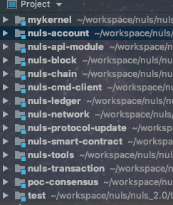
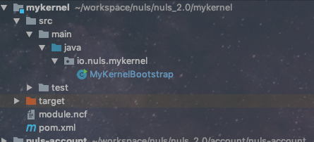
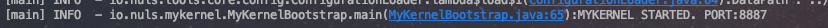
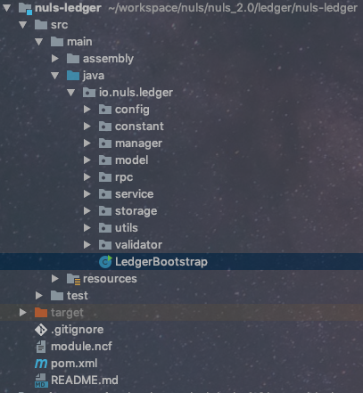
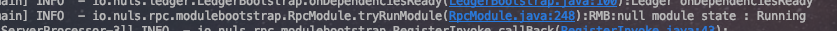
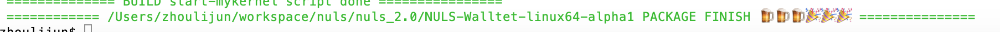

# Package Generation

## Essential knowledge
The Nuls2 base module is developed using java11, which uses a distributed multi-module micro-service architecture, and uses websocket for communication between modules. However, there is no language requirement between modules. The language that can support the websocket protocol for network programming can be a module of NULS2, so you need to have a certain understanding of the websocket protocol.
## Get the program source code
The source code for NULS2 is hosted on github.com and is freely available to anyone. Project address [nuls_2.0](https://github.com/nuls-io/nuls_2.0), see [git](https://git-scm.com/book/en/v2) for how to get it.
## Debugger
If you want to develop or debug the source code of NULS2, you need to prepare the development environment, install JDK11.0.2, apache maven 3.3, and a development tool. We recommend IntelliJ IDEA. After the development environment and source code are ready, import the program module in IDEA by importing the maven project.



The module with the module.ncf file in the root directory of the module is defined as the nuls2 submodule, where mykernel is the core scheduling module, which is responsible for other submodule registration services. The startup class of each module is named XXXXBootstrap, and the main function of the startup class is used to start the module.



In the development environment, you first need to start the mykernel module, and then start other modules, the dependencies between modules are automatically controlled by the framework. When the "MYKELNEL STARTED. PORT:8887" is printed in the log, the mykernel module is successfully started.



Start other modules (take the ledger module as an example), find the LedgerBootstrap class, and run the main function.



When the log prints "RMB:module state : Running", the module starts successfully.



## Generating executable packages
Once you have the source code, you can generate your own scripts from the source code. Run the script package.sh in the nuls2.0 root directory to execute the automatic packager (the script needs to rely on jdk11, maven3.3, git).

Execute the packager and copy the JDK in the /usr/local/java/jdk11.0.2 directory to the runtime directory to the wallet directory. The wallet can run the program output to the relative directory of ../NULS2.
```
./package.sh -J /usr/local/java/jdk11.0.2 -o ../NULS2
```
When the log outputs XXXX PACKAGE FINISH, the packager is successfully generated.



More package.sh script parameters can be viewed with help in -h.
```
Lijunzhou:nuls_2.0 zhoulijun$ ./package.sh -h
     Desc: Use this script to generate an executable submodule that conforms to the NULSTAR specification.
     All submodules are configured according to module.ncf, packaged with the mvn command, and generate start and stop scripts.
     Usage: ./package.sh
     -b <branch> Synchronize the latest code before packaging. Parameter is the remote branch name for synchronization.
     -p Synchronize the latest code before packing. Pull from the master branch
     -o <directory> specifies the output directory
     -h View help
     -j JAVA_HOME
     -J outputs the jvm virtual machine directory, the script will copy this directory to the program dependencies
     -i skip mvn package
     -z generates a tarball
     Author: zlj
```
Please refer to the [Command Line User Manual] (/zh/NULS2.0/linuxTutorial.html) for how to use the wallet.