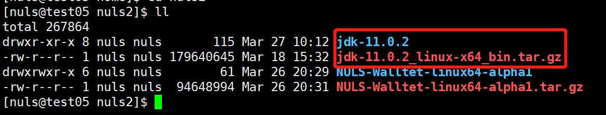

# Quick Start

## Install JDK11

Download JDK11 to the server and extract it.

### 1 download jdk11

Jdk11 download address: [jdk11 download] (https://www.oracle.com/technetwork/java/javase/downloads/jdk11-downloads-5066655.html)

### 2 upload to the server and extract

```
Tar -zxvf jdk-11.0.2_linux-x64_bin.tar.gz
```



### 3 configuration environment

**vi /ect/profile**

Copy the following code to the file

```
JAVA_HOME=/home/nuls2/jdk-11.0.2
PATH=$PATH:$JAVA_HOME/bin
CLASSPATH=:$JAVA_HOME/lib/dt.jar:$JAVA_HOME/lib/tools.jar
Export JAVA_HOME PATH CLASSPATH
```

**ps**: /home/nuls2/jdk-11.0.2 is the path after jdk is unpacked, please configure according to your actual path.

**source /ect/profile** The configuration of this command takes effect.

View the jdk version via java -version:


## Download and install the wallet

### 1 download NULS wallet

Go to GitHub and download the latest version of the NULS2.0 Alpha1 wallet: [download address] (https://github.com/nuls-io/nuls_2.0/releases)

### 2 upload to the server and extract

```
Tar -zxvf NULS-Walltet-linux64-alpha1.tar.gz
```


## Enter the CLI

### 1 start the wallet

After the wallet is decompressed, go to the start.sh file directory: /home/nuls2/NULS-Walltet-linux64-alpha1/bin


Execute the command: **./start.sh -D**

### 2 enter the command line

After the wallet is started, execute cmd.sh (./cmd.sh) in the same directory to enter the wallet command line. The NULS command prompts the prompt: `nuls>gt;&gt; `, enter the NULS wallet operation command, and operate .


## Part of Instructions 

### 1 create an account

Command: **create** [Number]

```
Number: The number of account addresses created. The default is 1 and the maximum is 100.
```


### 2 Backup keystore

Command: **backup** &lt;address&gt; [Path]
  
```
Address: Account address to be backed up (required)
Path: The directory where the backup file is generated. The default is the current directory (optional)
```

### 3 Get the private key

Command: **getprikey** &lt;address&gt;

```
Address: Account address for obtaining the private key (required)
```

### 4 remove the account

Command: **remove** &lt;address&gt;

```
Address: address to be removed (required)
```

### 5 modify the account password

Command: **resetpwd** &lt;address&gt;

```
Address: Account address to change the password (required)
```

### 6 Transfer

Command: **transfer** &lt;FormAddress/FormAlias&gt; &lt;ToAddress/ToAlias&gt;&lt;amount&gt; [Remark]

```
FormAddress/FormAlias: Transfer the address or export the alias, choose one (required)
ToAddress/ToAlias: Receive address or receive alias, choose one (required)
```

### 7 create a consensus node

Command: **createagent** &lt;AgentAddress&gt; &lt;PackingAddress&gt; &lt;CommissionRate&gt; &lt;Deposit&gt; [RewardAddress]

```
AgentAddress: Consensus node creation address (required)
PackingAddress: The address of the consensus node is packed. The password must be the same as the configuration file. The default is: nuls123456 (required)
CommissionRate: commission ratio, range: 10-100, maximum decimal place 2 digits (required) Deposit: margin, range: 20000-200000, maximum decimal place 8 digits (required) RewardAddress: reward address, default is node creation address ( Optional)
```

**ps**: Save the hash of the consensus node (or query in [**Browser**] (http://alpha.nulscan.io)), join the consensus and query consensus node information needs to be used; Ensure that the consensus node creates an address and a packaged address in one wallet, and one wallet cannot create two consensus nodes at the same time.

### 8 join the consensus

Command: **deposit**&lt;Address&gt;&lt;AgentHash&gt;&lt;Deposit&gt;

```
Address: Account address to join the consensus (required)
AgentHash: Create a hash of the consensus node (required)
Deposit: Join the consensus deposit, 2000-500000, up to 8 decimal places (required)
```

**ps**: Save the consensus hash, you need to use the exit consensus

### 9 Exit the consensus

Command: **withdraw**&lt;Address&gt;&lt;TxHash&gt;

```
Address: Exit consensus address (required)
TxHash: transaction hash at the time of delegation (required)
```

### 10 stop consensus node

Command: **stopagent**&lt;Address&gt;

```
Address: Consensus node creation address (required)
```

### 11 query consensus node information

Command: **getagent**&lt;AgentHash&gt;

```
AgentHash: Consensus node creates hash (required)
```