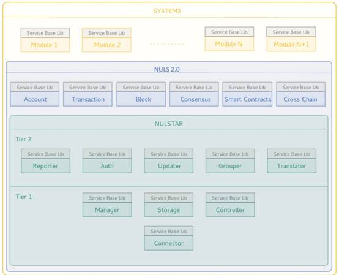

# [Alpha]如何使用NULS搭建区块链
## NULS2.0 开发环境搭建

NULS2.0是一个开放的不限制语言的区块链底层平台，本文只参考区块链核心业务模块的情况，编写Java环境搭建流程。

1 环境准备

- 安装JDK
- 安装Maven
- 安装IntelliJ IDEA开发工具
- 安装git

2 clone源代码

 git clone [git@github.com](mailto:git@github.com):nuls-io/nuls_2.0.git

3 IDEA导入nuls_2.0中所有maven项目

4 建立自己的maven项目

5 运行所有需要启动的模块

## 使用NULS2.0核心模块搭建基础链

NULS是一个全球开源的区块链底层基础设施，让区块链更简单是NULS的使命，本文将描述如何使用NULS核心模块，快速搭建一条基础区块链。

NULS并不限制区块链的属性，使用NULS底层可以搭建私链、联盟链、公有链，可以搭建有币区块链，也可以搭建无币区块链。

###  1 理解NULS 2.0的微服务架构



NULS 2.0基于微服务架构搭建，内置了区块链核心业务模块，包括账户、交易、区块、共识等，当我们要基于NULS 2.0搭建基础区块链时，我们将基于NULS 2.0区块链通用基础功能层进行扩展。

因为NULS2.0中已经包含了区块链的基础功能，在开发自己的区块链时，只需要整理自己独有的业务功能，抽象出对应的协议，将功能开发为一个模块插入到NULS2.0中即可。举个例子：假设我们要实现一条“记事本链”，在NULS的基础上我们需要设计“记事本”的业务交易，比如记事交易、删除记事交易，我们的业务模块需要做的是，在本模块中添加业务逻辑代码，并实现两个交易的验证、处理、回滚功能，然后将交易信息上报给交易管理模块，处理交易相关逻辑。

理解了如何进行区块链功能拓展，就可以根据下面的步骤，详细设计自己的功能模块了。

### 2 修改基础配置信息

一条区块链要运行起来，需要非常多的基础配置，每条区块链都要有自己的配置参数，在搭建一条新的区块链时，第一件事就是配置自己的运行参数。

NULS2.0的启动脚本支持传入配置文件的方式启动区块链，使用方式如下：sh start.sh -c modules.ncf

modules.ncf内可以配置各个模块的参数，开发者可以根据自己的链的情况自行修改运行参数，具体运行参数预设如下：

| section   | param                   | name           | remark                                                       |
| --------- | ----------------------- | -------------- | ------------------------------------------------------------ |
| common    | chain.id                | 本链id         | Uint16，NULS主网为1，测试网为2                               |
| common    | address.prefix          | 地址前缀       | 大小字母+数字，2-5个字符                                     |
| common    | data.root.dir           | 数据存储路径   | 为了所有模块都存储在同一个目录，如有需要可以在任意模块内配置特殊的路径 |
| common    | encoding                | 编码方式       | 默认UTF-8，不建议修改                                        |
| common    | asset.id                | 本来主资产编码 | NULS为1                                                      |
| common    | log.root.dir            | 日志根目录     | 用于存放各个模块的日志文件                                   |
| common    | log.level               | 日志级别       | 日志打印级别debug/info/warn/error.                           |
| block     | data.folder             | data子文件夹   | 用于存储block模块数据，该文件夹放在#{data.root.dir}下        |
| block     | block.max.size          | 区块最大size   | 区块大小限制，避免太大区块太高参与门槛                       |
| block     | block.interval          | 出块间隔       |                                                              |
| block     | max.rollback            | 最大回滚数量   | 当超过这个数量后，系统将停止回滚，避免出现重大问题           |
| block     | header.extend.max.size  | 扩展最大size   | 区块头中的扩展字段的大小限制                                 |
| block     | genesis.block.json.path | 创世块描述文件 | 创世块的描述文件                                             |
| consensus | data.folder             | data子文件夹   | 用于存储共识模块数据，该文件夹放在#{data.root.dir}下         |
| consensus | packing.interval        | 出块间隔       |                                                              |
| consensus | inflation.token.count   | 每年增发数量   | 增发数量用于通过coinbase交易奖励给节点                       |
| consensus | block.max.size          | 区块最大size   |                                                              |
| consensus | seed.addresses          | 共识种子地址   | 多个地址用","分隔                                            |
| consensus | packing.address.pwd     | 地址密码       | 用于打包的地址的密码                                         |
| consensus | agent.deposit.min       |                | 创建节点时最小保证金数量                                     |
| consensus | agent.deposit.max       |                | 创建节点时最大保证金数量                                     |
| consensus | commission.rate.max     |                | 佣金比例最大值，不能大于100                                  |
| consensus | commission.rate.min     |                | 佣金比例最小值                                               |
| consensus | deposit.min             |                | 单笔委托最小金额                                             |
| consensus | agent.total.deposit.max |                | 节点接受委托的最大金额                                       |
| consensus | packing.token.min       |                | 当节点的委托达到该值则开始出块                               |
| consensus | red.punish.lock.time    |                | 红牌锁定时间                                                 |
| consensus | agent.stop.lock.time    |                | 停止节点锁定时间                                             |
| network   | data.folder             | data子文件夹   |                                                              |
| network   | seeds                   |                | 种子节点，多个之间用","隔开                                  |
| network   | magic.number            |                | 魔法数字，用于隔离其他网络                                   |
| network   | port                    |                | 端口                                                         |
| network   | nuls.seed               |                | 需要进行跨链时，配置NULS2.0种子节点                          |
| network   | cross.listener.port     |                |                                                              |
| network   | nuls.magic.number       |                |                                                              |
| contract  | nrc20.file.path         |                | NRC20协议描述json文件路径                                    |
| tx        | data.folder             | data子文件夹   |                                                              |
| Ledger    | data.folder             | data子文件夹   |                                                              |
| api       | mongodb.ip              | mongodb地址    |                                                              |
| api       | mongodb.port            | mongodb端口    |                                                              |
| api       | rpc.listener.ips        | rpc监听ip      | 可以配置多个                                                 |
| api       | rpc.port                | rpc监听端口    |                                                              |
| api       | req.allow.per.s         | 并发限制       |                                                              |

表格中列出的是可能比较常用的配置项，并不是全部，在经过alpha版本和beta版本后，团队会整理所有NULS2.0的可用配置清单，用于广大区块链开发者配置自己的区块链。

> [^注]: 由于NULS2.0-alpha版本并未完成Nulstar的对接，个别参数后期可能会出现修改的情况，以最终上线版本为准。

 ### 3 打包和启动

 链的配置项修改完成后，则可直接参考本文档的第4部分：[打包和启动](#打包和启动)


## 搭建包含业务模块的区块链

在使用NULS2.0的模块化基础设施搭建了自己的区块链之后，想要实现自己的独特业务，就需要自己开发一个业务模块，整合到基础链中。下面的内容可以对如何开发一个自己的业务模块做一些指导。

### 1 业务模块说明

#### 1.1 何为业务模块

基于区块链底层进行扩展的带有自定义业务的功能模块，该模块可以是遵循NULS2.0模块协议、可以与其他模块通信的微服务模块，也可以是一个独立的、只通过RPC接口与基础模块通信的外部应用。

业务模块不进行协议的增加和修改，只对基础协议进行扩展，通过协议的扩展，实现自身业务。

#### 1.2 如何扩展协议

NULS提供了两种方式可以对协议进行扩展，两种方式比较类似，具体方式如下：

- 通过转账交易的remark字段进行扩展

将想要上链的数据，序列化为字节数组，放入转账交易的remark字段。在字节数组的最前面放置自己的魔法数字，用于区别其他的转账交易。在自己的应用中监听所有区块中的转账交易,当发现以自己的魔法数字开头的remark时，进行解析和业务处理。

- 通过制定的业务扩展交易进行扩展

NULS为业务扩展提供了特定的交易类型，该交易可以自由填写txData，将想要上链的数据，序列化为字节数组，放入转账交易的txData中。在字节数组的最前面放置自己的魔法数字，用于区别不关心的交易。在自己的应用中监听所有区块中的业务扩展交易,当发现以自己的模块数字开头的txData，进行解析和业务处理。

**示例：**

假设现在要实现一个应用，该应用的业务是：私密记事本，核心业务就是每个地址可以将加密后的记事文本存储到区块链上，在任意时候可以解密查看。

1 功能设计

```
1. 新增记事：对记事内容进行加密，将加密后的数据发送到链上；

2. 解析区块数据提取记事数据：从区块链上获取本应用的数据，并将数据存储到本地数据库；

3. 解密查看：从数据库中获取记录，解密，展示解密结果

4. 删除记事：app本地删除，不删除区块链中数据
```

2 区块链交互

以上功能设计需要和区块链进行交互的就是1新增记事和2解析区块数据提取记事数据。

- 第一个功能的实现思路如下：

```
首先设计数据格式，如下

{

  address:"",//记事所属人

  time:"",//记事时间点

  content:""//加密后的记事内容

}

根据数据格式，组装上链数据：address+time+content;

确定应用的魔法数字，假设为12345678.

则组装DataTransaction(业务扩展交易)，将txData的值设置为12345678、address、time、content的拼接字节数组，支付足够的手续费后，对交易进行签名，将交易广播到网络中。
```

- 第二个功能的实现思路如下：

```
监听所有的区块，发现'业务扩展交易'则进行解析，首先解析到txData时，先判断是否是已12345678开始的，
如果不是则丢弃该交易，如果是则继续解析，判断是否成功获取了address+time+content(避免魔法数字重复导致数据混乱)
如果成功解析了数据，则将数据存储到本地数据库中
```

3 其他业务实现

所有不需要与区块链交互的业务，就可以通过常规的应用方式进行设计了，这样一个简单的区块链应用就完成了。

   > 使用业务扩展的方式开发应用，是一个简单快捷高效的方式，NULS对业务扩展的支持是充分而友好的，希望越来越多的人加入到NULS生态建设中来。


### 2 需求分析

在动手开发模块之前，首先要确定几个问题：
- 自己需要的是什么样的功能？
- 是否一定需要添加模块来实现业务需求？是否可以通过已有的功能用更简单的方式实现？
- 用哪种方式实现这个模块？
  - 扩展基础协议的方式：不再新增协议，在基础协议的基础上拓展自己的业务就能满足自己的需要。
  - 增加新协议方式：需要新增协议、新增协议对应的业务逻辑，才能满足自己的需要
  - 修改基础链：以上两种都不能实现自己的业务，需要对基础模块进行修改才能满足自己的需求。

### 3 模块设计

在确定了自己的需求后，需要对自己的模块进行设计。模块设计依存于NULS2.0的整体设计，在设计自己的模块时，可以着重设计自己的业务，其他部分依照基础模块实现。

那么如何设计自己的业务？举例说明：

#### 3.1 扩展基础协议的方式：

```
第Ⅰ种情况：我们的需求只是需要将一些关键信息存储上链，没有复杂的逻辑处理。
比如我们只是想存储一份合同的相关信息在链上，且能够在链上随时查询到。这个时候实际上我们是没有必要去开发任何模块的。nuls2.0提供了一种专门用于存储数据的交易(DataTransaction)，用户只需要将数据转换成字节数组存放在交易的txData字段或者remark字段中，广播交易到全网后，数据即可成功上链。再通过nuls2.0提供的查询交易接口，就能随时查询到交易和交易的相关数据。这样其他的业务功能可以以通用软件的方式进行设计和开发。

第Ⅱ种情况：我们的需求需要将一些关键信息存储上链，并且需要有简单逻辑处理。
一般这种情况，我们会推荐用户考虑使用智能合约做DAPP的开发，例如做简单的竞猜类游戏等。
```

#### 3.2 新增协议的方式

```
如果我们的需求比较复杂，且有相关的逻辑流程处理，必须要通过添加新的协议来完成。
这里我们就用nuls的poc共识机制来举例
功能设计：先根据需求整理要提供的功能，根据功能设计新的协议。
nuls的poc共识机制的业务功能有：
1. 用户可以通过发送申请共识节点的交易，锁定2-20万的nuls来新建共识节点，待节点满足出块条件后，可参与打包出块，获得出块奖励。
2. 用户可以通过发送加入委托共识的交易，至少锁定2000个nuls来参与共识，获得出块奖励。
3. 用户可以通过发送取消委托共识的交易解锁委托共识时锁定的nuls，取消委托后，不再继续得到奖励。
4. 用户可以通过发送交易让节点退出共识，退出后委托在节点上的所有nuls都会解锁，节点不再参与出块。

协议设计：包括协议的序列化和反序列化、交易验证器、交易确认处理器、交易回滚处理器，需要注意和基础协议避免冲突。
poc共识机制的4个协议：创建共识节点交易、委托交易、取消委托交易、节点退出共识交易
交易验证器：每个协议都会有相关的业务验证器，在节点收到新的交易或者在收到新的区块时，便会执行验证器，验证失败的交易直接拒绝。
例如创建共识节点：
	1）创建节点的账户不能重复多次创建共识节点；
	2）保证金在2-20万nuls之间；
	3）账户是否有过红牌记录；
存储设计：将协议中的业务数据，存储为格式化数据，用于提供用户功能。
例如创建共识节点后，底层会存储创建节点的交易数据，还会存储节点的相关信息，例如共识节点名称，共识节点当前的委托总量，共识节点的信用值等

接口设计：需要对外提供的RPC接口
例如：查询共识节点信息，查询共识委托信息等

其他：其他的内部处理机制则根据不同的业务需求，在模块自己内部实现，例如poc共识的核心处理都在ConsensusProcess里
```

#### 3.3 修改基础链的方式

```
本方式与方式二区别只在于涉及对基础链的修改，在修改时需要先对基础链的业务进行充分的理解，对自己的业务进行适配后需要进行充分的测试。
修改的方法可以是替换模块的方式：获取基础链模块的源代码，对其进行修改，然后发布自己的模块替换原始的基础模块。
```

### 4 模块实现

首先模块由下面两部分组成，对于第一部分，目前官方只提供了Java版本的lib，后续会陆续提供C++,Go等其他语言版本。

1、nuls-service-base-lib（baselib）：

通用的、所有模块中功能都一样的依赖包，提供基础的通信、接口格式、通用代码等内容，如果开发者使用未提供baselib的语言，则需要自己开发baselib。

2、module-self：

模块本身，在一下几方面需要做出自己的实现：

- 模块管理

  1、启动、停止脚本:在自己的模块中，提供模块的启动和停止脚本，并且保证任何时机执行启动和停止脚本不会对业务和数据造成重大影响。

  2、启动后进行状态管理，首先通过启动参数连接到Nulstar(微服务管理器)，上报自己模块的信息，同时获取到依赖模块的信息，尝试与依赖模块通信，在此期间完成自己模块的初始化，并变更自己模块的状态。在依赖的所有模块都ready后，开始运行自己模块的业务。

  3、当依赖的模块状态变更后，本模块要根据变更的状态进行处理

- 协议相关

  当模块中创建了新的交易后，需要在每次模块启动时向交易管理模块注册自己的协议信息，同时上报交易的验证器、确认处理器、回滚处理器信息。

- 网络消息

  当新模块增加了网络协议后，需要向网络模块订阅自己需要的网络的消息，让网络模块接到消息后可以把消息发送到模块的消息处理器中。

- 数据存储

  NULS2.0不对数据存储做任何限制，可以根据自己的业务需要自由的设计、实现自己的数据存储功能。

- 功能实现

  如果有其他功能需要实现，可以按照自己的习惯或者行业的标准规范进行开发，NULS2.0不做任何限制。

- 功能接口

  根据产品设计进行功能接口的实现，NULS2.0底层会提供统一的接口调用方式，会支持JSONRPC2.0/restFul/CMD/WebSocket等访问方式。

- 日志记录

  NULS2.0原则上不对扩展模块的日志记录方式进行限制，但建议参考基础链的方式将所有日志归集到一个根目录中，便于备份和查看。

总结：业务模块的扩展可以参考底层基础链，所有的模块在NULS2.0的架构中都是平等的，遇到不清楚的地方可以通过查看基础模块代码的方式借鉴或者复制基础模块的解决方式，后续会陆续开源一些项目的扩展模块，让广大开发者借鉴，使开发模块变得越来越简单。

### 5 定义自己的协议

- 设计协议的原则：数据精简，不要再协议中增加冗余数据，尽可能减小数据大小。

- 网络消息: 消息格式，序列化方法、反序列化方法，计算数据大小方法、订阅接口和逻辑处理器。

- 交易：交易格式，序列化方法、反序列化方法，计算数据大小方法、验证器、处理器、回滚处理器等。

### 6 调试

完成了设计和开发工作后，不可避免的要进行测试，本部分内容不包含开发过程中的单元测试部分，这里只讲解集成测试的方法和注意事项。

```
1、首先通过NULSTAR启动所有模块，查看自己的新增模块是否可以正常启动和停止；

2、测试新增模块的交易是否可以发送，各种接口是否可以正常调用；

3、主网测试，是否可以正常打包区块，新增交易是否可以被确认、回滚；

4、检查交易验证逻辑是否严谨，不要出现安全漏洞；

5、测试自身模块的业务是否正确、完整。
```

全部测试都完成后，便可进入打包和启动阶段了


## 打包和启动

### 1 打包

NULS2.0有自己的代码打包机制，因为涉及不同语言和不同开发环境，我们制定了一套独有的打包规范，请确保新开发模块遵循打包规范，已经提供了规范中要求的依赖、脚本等组件，并对打包流程进行测试

```
cd /home/nuls2/nuls_2.0
./package.sh -m
```

确认没有问题后，完成区块链的开发工作，可以将打包后的程序包交给相关方进行公开测试，在测试一段时间后没有发现问题，就可以正式组件区块链网络，开始自己的业务。

### 2 启动
- 编译成功 会生成如下路径文件
```
/home/nuls2/nuls_2.0/RELEASE/bin
```


- 执行如下命令，即可一键批量启动所有模块
```
cd /home/nuls2/nuls_2.0/RELEASE/bin
./start.sh -c ./moudle.json（指定moudle.json配置文件启动）
````

- linux指令 jps 查看所有模块进程：
```
 ./start.sh  --jre $JAVA_HOME --managerurl 192.168.1.124:8887/ws
 ```

- 查看模块启动状态

```
./checkstatus.sh  
```

- 停止 工程模块： 
```
kill  进程号（进程号对应jps显示出来的 mykernel 模块的进程）
```