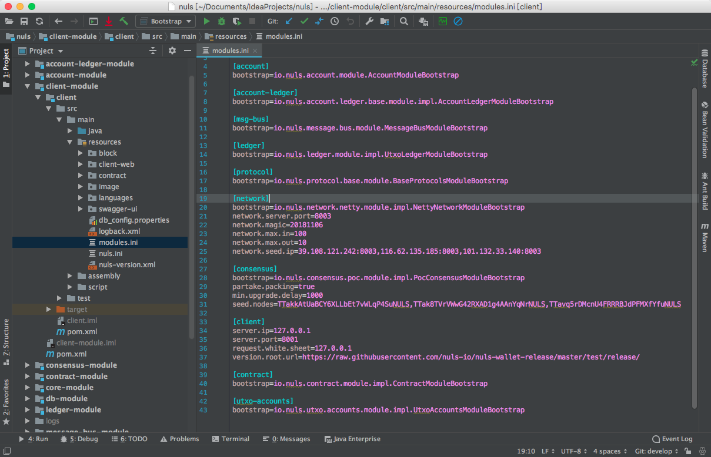

## 如何基于NULS搭建私链

#### 简介

​	本教程是基于NULS源代码介绍如何搭建私链，目的是为了方便学习了解NULS区块链网络运行，开发或者实验。自己搭建一条链来全方位的了解各节点是如何运行以及数据交互等，可以更好的把握NULS区块链网络的整体运行机制，有助于更深一步的研究。我们默认本文阅读者是具备Java开发环境的构建和调试技能的。


#### 环境搭建

- 操作系统：macOS、Windows
- 构建工具：Maven
- 开发工具：IntelliJ IDEA
- NULS源码github地址：https://github.com/nuls-io/nuls


#### 开始

​	由于区块链是去中心化网络，是由多个节点组成，我们将以3个节点搭建一条私链为例进行介绍。虽然我们建议使用Linux服务器来作为运行NULS主网共识节点的服务器，但由于涉及到开发调试的需求，本文我们将在可以搭建Java开发环境的macOS系统上运行调试节点。

##### 开发环境

​	首先使用IntelliJ IDEA克隆NULS源代码，并打开项目。确保Java使用的是jdk1.8，以及Maven工具配置正确。

##### 如何搭建

​	1.打开module.ini 文件，该文件为加入或组建网络的配置文件，此示例是NULS测试网的配置信息。



2.我们将用3个节点来搭建一条私链，首先需要准备可供3个节点运行的设备(可以是虚拟机)。

- 节点A：192.168.1.1
- 节点B：192.168.1.2
- 节点C：192.168.1.3

我们还需要设置一个种子节点，用来进行维持区块链的运行，即打包出块。同时我们还需要准备一个出块地址（包括私钥，用于在种子节点导入该地址），可以事先准备。

本例我们准备的初始出块地址为：`Nse4zpZHsUuU7h5ymv28pcGbwHju3joV`

PS：如果你比较细心你可能为发现我们准备的地址和图中测试网的地址的开头字母是不一样的，那是为了让用户更容易识别测试网地址和主网地址，以免混淆导致不良后果，我们特意将测试网地址设置为以"TT"开头，将主网地址设置为"Ns"开头，而本教程使用的是NULS主分支代码，所以使用"Ns"开头的地址。如果您想自定义私链的账户地址开头字母，可以尝试修改nuls.ini文件中的`chain.id`参数，同一条链的节点该参数必须一致。

3. 假设节点A为种子节点，那么将A、B、C三个节点的module.ini配置文件的network、consensus节都按照以下配置进行修改：

```ini
[network]
bootstrap=io.nuls.network.netty.module.impl.NettyNetworkModuleBootstrap
network.server.port=8003
network.magic=20190101
network.max.in=100
network.max.out=10
network.seed.ip=192.168.1.1:8003

[consensus]
bootstrap=io.nuls.consensus.poc.module.impl.PocConsensusModuleBootstrap
partake.packing=true
min.upgrade.delay=1000
seed.nodes=Nse4zpZHsUuU7h5ymv28pcGbwHju3joV
```

- 将`work.seed.ip`修改为种子节点的ip和端口。
- 将`seed.nodes`修改为出块地址。
- 必须保证私链所有节点的魔法参数`network.magic`一致

4. 通过IntelliJ IDEA分别将3个节点运行起来，如果只需要调试其中一个节点，那么其他两个节点可以用maven打包发送到Linux服务器中运行，但是要注意的是需要准备一个jre放到NULS根目录中才能正常运行。
5. 这3个节点启动后直到IntelliJ IDEA控制台有类似以下日志输出，则表示3个节点已近组成一个私有链的网络，但是没有打包出块，高度为0。如果没有日志输出，需要打开logback.xml中`<appender-ref ref="STDOUT"/>`的注释。

```
io.nuls.client.Bootstrap.sysStart(Bootstrap.java:156):bestHeight:0 , txCount : 1 io.nuls.client.Bootstrap.sysStart(Bootstrap.java:174):height:0,count:2, hash:xxxxxxx,192.168.1.2:8003,192.168.1.2:8003

```

6. 这时在种子节点A的钱包界面中，导入事先准备的出块账户`Nse4zpZHsUuU7h5ymv28pcGbwHju3joV`，稍等一会儿，则可以看见控制台的最新高度在增加了，表示网络已经在打包出块了，而与此同时B节点、C节点高度也会增加并且3个节点高度保持一致，此时表示私有链网络已经搭建完成。

#### 总结

​	本文主要介绍使用最简便的方式搭建一个用于开发调试NULS的私链，并没有修改NULS的源代码。如果您需要更进一步探索NULS，可以查阅NULS的相关文档并在此基础上对源码进行修改调试，或许您会发现更多的奥秘！

