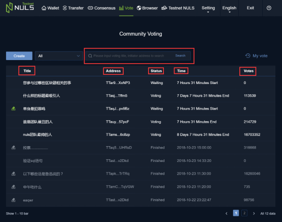
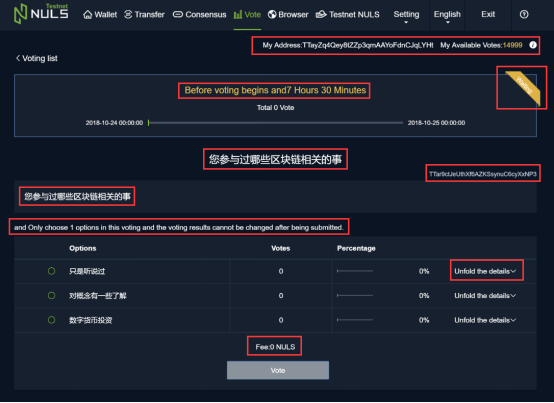
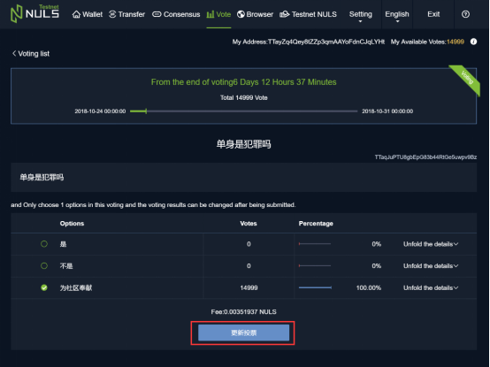
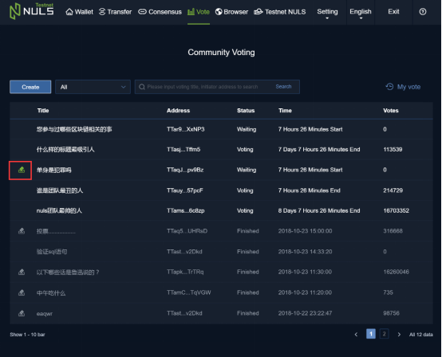
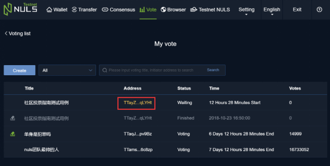
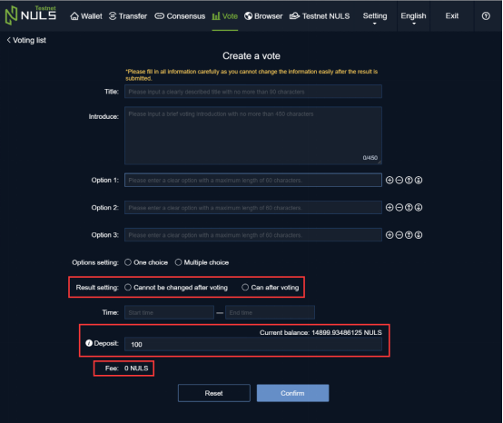

# Guide to Community Vote

## Voting

If you want to participate in the community vote X created by address A, you can search for the community vote you want to participate in by entering the community vote title X or the creator’s address A. After finding the community vote X, you can see some key information about the community vote in the voting list.

Click on the title of the community vote X to enter the voting details page, which shows the detailed information of the vote. The upper right corner shows my address B and my corresponding available votes N. The available votes are subject to the total amount of NULS in my address B. Currently the ratio of votes to NULS is 1:1, while the fractional part of the total is excluded.

If community voting is still in progress, you can cast your vote by selecting the appropriate option according to the voting rules, and then click "Vote" to enter the password and submit your vote. 

The way votes are counted is as follows: whether single or multiple options are involved, as long as the submission of your vote is successful, the submitted votes will count towards your available votes N. N can be 0, but still requires your address B to have enough NULS to pay the fee to guarantee the vote submitted is a success. After casting your vote, if the amount of NULS in address B changes, and voting is still in progress, the corresponding options selected will reflect the total number of votes for that option, according to the amount of NULS in address B.

The system allows the creator of the community vote to set the type of voting result as either changeable or unchangeable. If the voting result cannot be changed, the voter cannot change their selected option. If the voting result can be changed and voting is still in progress, then the voter can enter the voting details page again, select another option according to the voting rules, and change their voting option. The number of the votes counted towards the original selected option is reduced by N, while the number of votes counted towards the newly selected option is increased by N.

Each option in the voting details page is clickable to show the current or final distribution of votes.

##  Changing and Updating Your Vote

As mentioned before, if the creator sets the voting result to be changeable when creating the community vote Y and voting is still in progress, then the voter can re-enter the details page of the community vote Y, select a new option according to the voting rules, and update their vote. Simply click "Update Voting" and enter the password to complete the new submission.

There will be a well-marked icon in the voting list that indicates whether a community vote is of the changeable type.

## Checking My Votes

In the voting list, click on "My Voting" on the right to enter “my” voting list, which shows the community votes created by you and the community votes you participated in. If Z is the community vote you have created, and it is still in progress, then its address will appear yellow.

If you click on the title of the community vote you participated in, all of the voting options you selected can be seen. If the community vote is of a changeable type and it is still in progress, then you can change your vote by choosing another option and submitting your changed vote according to the voting rules.

## Creating A Community Vote

In the voting list, click **“Create Voting"** to enter the information page of the community vote and fill in the corresponding options and settings. Afterwards, select the correct start and end time. Once finished, click "Confirm" to complete creation of your community vote. Creating a community vote requires that there is enough NULS in your address B to provide a deposit and a fee.

In order to prevent the creation of frivolous or duplicate community votes that are not needed, each community vote created requires a deposit of 100 NULS. The block height to unlock the deposit is calculated according to the creation time and the end time of the community vote. When the block height corresponding to the end time has been reached, the deposit can be unlocked.

When creating a community vote, **please fill in the item contents** **carefully.** Once the community vote has been created successfully**, it cannot be modified**. It will take about one minute to confirm the created community vote on the NULS network, and the voting list page will then be refreshed.

