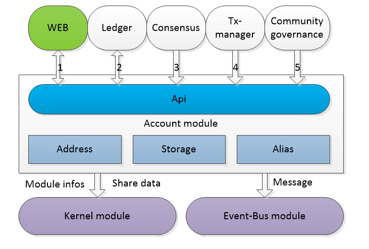

# Account Module Design Document


## Overall overview

### Module Overview

#### Why should I have an account module?

Addresses and their associated information in the blockchain play an extremely important role in relation to data security issues. And the information about the account address is also the part that interacts most with the user. Although the entire account address information structure is simple, the function is more complicated, so we separate the account module to handle the information and functions of the account address.

#### What do you want to do with your account?

The Account Module is the basic module that provides information about the various functions of the account.It mainly supports the functions of account generation, security and custody, and information acquisition. Other modules can use various functions of the account and obtain account information according to the interface provided by the account module. Users or other applications can be based on rpc. The interface makes the account more practical and personalized.The account is the basic module and the carrier of the user data.

- Account generation

  Create an account, import an account

- Account security and custody

  Backup of account, setting account password, modifying account password, removing account

- Acquisition of account information

  Query individual account information, obtain multiple account information, obtain account address, query account balance, query account alias

- Other usability and personalization features

  Set account aliases, set account notes, signatures, etc.

#### Account location in the system



The account is the underlying module that is dependent on the ledger, consensus, transaction, kernel, event bus, and community governance modules.

1. Account module relies on the ledger module

	The ledger module needs to handle local transactions and relies on account information.
	
	The account module needs to initiate a setup alias transaction, which requires the ledger module to pay the fee.
	
	Account balance inquiry, need to rely on ledger module

2, the account module depends on the kernel module

```
Report module information and share data operations
```

3, the account module depends on the network module

```
Receive and send data through a network module
```

4, the account module depends on the event bus module

```
Create an account, delete an account, change a password event, send a message through the event bus module
The account module is not strongly dependent on the event bus module, because even if the event fails to send, it will not affect the normal business process.
```

5, consensus module dependent account module

```
Consensus requires account information to be packaged out
```

6, the transaction management module depends on the account module

```
The transaction management module needs to verify the transaction, rely on the address function in the account, verify whether the address is legal, etc.
```

7, the community governance module depends on the account module

```
Community governance requires account signature
```

### Architecture diagram


1. api: provides an interface layer externally, providing operations such as creating, backing up, and setting aliases for accounts.

2. business logic layer: define the account, account address, alias function.

3. data persistence layer: save account, alias data.

## feature design

### Functional Architecture


### nuls protocol address detailed

#### ECKey  

The first step in creating a NULS address is to obtain a public-private key pair based on the elliptic curve algorithm.The elliptic curve parameters of NULS are the same as bitcoin, using secp256k1.

#### Address Format 

```
address = prefix + Base58Encode(chainId+addressType+pkh+xor)
```

- address is 23

- chainId is the chain id of the current chain, used to distinguish the addresses of different chains

- addressType address type is divided into 1: normal address, 2: smart contract address, 3: multi-signature address.

#### prefix 

The prefix prefix exists to facilitate identification and distinguishing addresses of different chains.Currently NULS provides two kinds of prefix determination solutions:

1. Default setting: NULS retains 1 as the primary network chainId, and also defaults all addresses with chainId 1 to start with NULS.Reserved 2 is the chainId of the core test network. By default, all addresses with a chainId of 2 start with tNULS.
2. Set the prefix by registering the cross-chain: When registering the cross-chain, you need to fill in the prefix of the chain. The system maintains the correspondence table between the chainId and the prefix, and generates the corresponding address according to the corresponding table.
3. Automatic calculation: The address of other chainId, NULS provides a unified algorithm to calculate the prefix, the specific calculation code is as follows:

```
/ / Convert the chainId to a byte array, use the base58 algorithm to calculate the byte array, all converted to uppercase letters after calculation
String prefix = Base58.encode(SerializeUtils.int16ToBytes(chainId)).toUpperCase();
```

Between the prefix and the real address, separated by a lowercase letter, it is convenient to extract the chainId and verify the address type and correctness from the address.
The lowercase letters are selected by providing an array, the lowercase letters are filled in the order in which the alphabet is installed, and the separated letters are selected according to the length of the prefix.

```
// The prefix length is a few letters, and the first few elements are selected as the separated letters.
/ / If the prefix length is 2, then separated by b, the length is 3 separated by c, the length is 4 separated by d, ...
String[] LENGTHPREFIX = new String[]{"", "a", "b", "c", "d", "e"};
```

#### chain id 

The goal of NULS is to establish a multi-chain parallel, value-interoperable blockchain ecosystem. At the beginning of the design, a unique ID, 2 bytes, is defined for each chain, ranging from 1 to 65535. The ChainId is the address. Very important data is the basis for cross-chain operations.

#### account type 

Nuls supports setting different account types in a network, such as common addresses, contract addresses, multi-sign addresses, etc. Developers can design according to their needs.
The account type is 1 byte, and the value range is 1~128.

#### Public Key Summary pkh 

The relationship between the ECKey and the address is reflected in this part. The NULS method is to first calculate the public key with Sha-256, and the result is calculated by RIPEMD160 to obtain a result of 20 bytes, which is PKH.

#### Check Digit 

NULS adds a one-byte check digit when generating an address in string format, which is obtained by XORing the first 23 bytes (chainId+type+pkh).
The check digit does not participate in serialization.

#### Generate Address 

- Serialized address

  ```
  address = chainId(2) + type(1) + PKH(20)
  ```

- Fixed prefix string address

  ```
  addressString = prefix + separator + Base58Encode(address+xor)
  ```

- Automatic prefix string address

  ```
  addressString = Base58Encode(chainId) + separator + Base58Encode(address+xor)
  ```

#### Address format of non-nuls system 

Nuls is a network that supports access to all blockchains. For completely different address formats than nuls, nuls has designed an address translation protocol. The details are as follows:

copy

```
Address = Base58Encode (chainId + original address length + original address + xor)
```

For example: Bitcoin address, the two-byte chainId is appended before the address, followed by the original address of the bitcoin. The address resolution mode is determined according to the chain configuration, ensuring that any address can obtain the mapped address in NULS. 

### Multi-Signed Account

Refer to [Multi-Signature Account Document]()


## Module Service

Refer to [Account Module RPC-API Interface Document](./account.md)

## Agreement

### Trading Business Data Protocol

* Set alias

  * Agreement

    Compared with the general transaction, only the type and txData are different, the specific difference is as follows

  ```
  Type: n //Set the type of alias transaction
  txData:{
      Address: //VarByte Set the address of the alias
      Alias: //VarByte The byte array into which the alias string is converted, decoded with UTF-8
  }
  ```

  - Alias transaction parameters

  | Len  | Fields  | Data Type | Remark                                |
  | ---- | ------- | --------- | ------------------------------------- |
  | 24 | address | byte[] | Set the address of the alias |
  | 32 | alias | byte[] | Byte array converted from alias string, decoded with UTF-8 |

  * Validator

  ```
  1, alias format legality verification
  2, the address must be a satellite chain address, and an address can only set an alias
  3, burn a token unit
  4. Transaction fee
  5, signature: set address, input, signature verification
  ```

  * processor

  ```
  1, the asset processor
  2, store alias data
  3. Update local account information
  ```


## Java-specific design

* Account object design

  The key used when the table is stored:

  NULS system: chainId+type+hash160

  Non-NULS system: chainId+length+address


| `field name` | `type` | `description` |
| :-------------- | :------ | :------------------------------------------ |
| chainId | short | Chain ID |
| address | String | Account Address (Base58(address)+Base58(chainId)) |
| alias | String | Account Alias |
| status | Integer | Default account (not saved) |
| pubKey | byte[] | Public Key |
| priKey | byte[] | Private Key - Unencrypted |
| encryptedPriKey | byte[] | Encrypted Private Key |
| extend | byte[] | Extended Data |
| remark | String | Notes |
| createTime | long | creation time |

* Address object design (not persistent storage)

| `field name` | `type` | `description` |
| ------------ | ------- | ------------ |
| chainId | short | Chain ID |
| addressType | byte | address type|
| hash160 | byte[] | public key hash |
| addressBytes | byte[] | address byte array |

- Alias object design

  The key used when the table is stored:

  Address and alias are stored as keys respectively, and alias data is stored in two copies.

  Need to create different alias tables according to different chains

| `field name` | `type` | `description` |
| ---------- | ------- | -------- |
| address | byte[] | Account Address|
| alias | String | Account Alias |

- MultiSigAccount object design

| `field name` | `type` | `description` |
| ---------- | ------------ | ------------------ |
| address | String | Account Address|
| pubKeyList | List<byte[]> | List of public keys that need to be signed |
| minSigns | long | Minimum Signatures |


