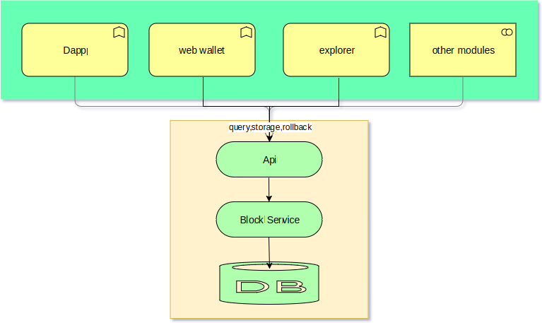
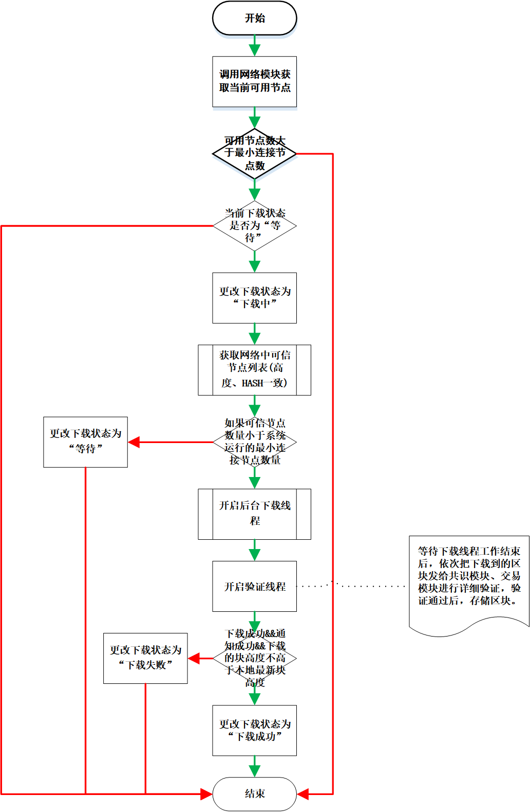
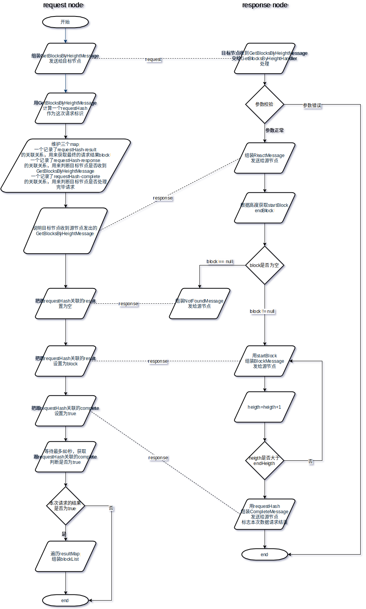
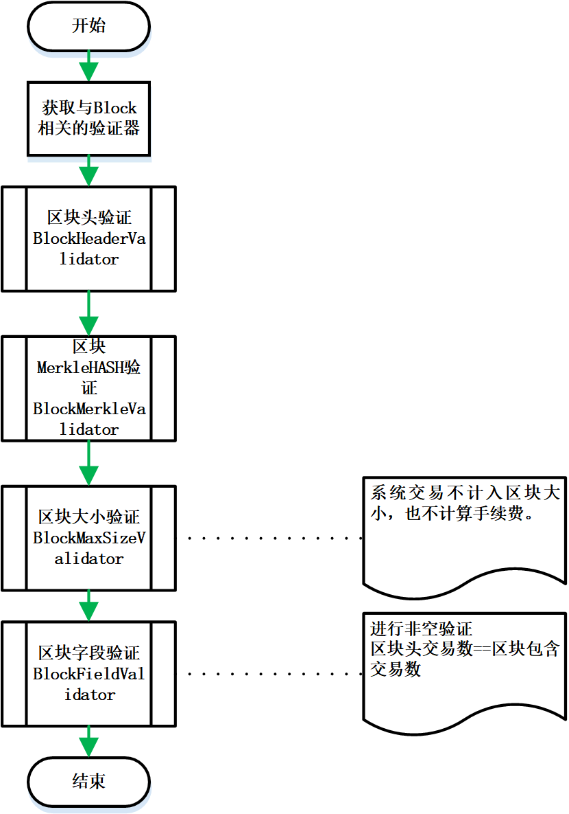
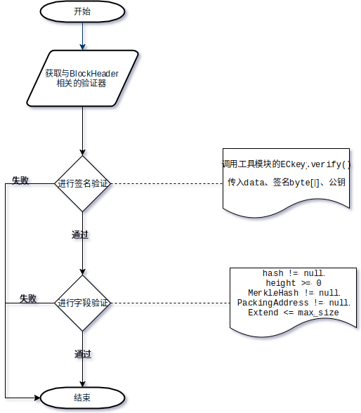
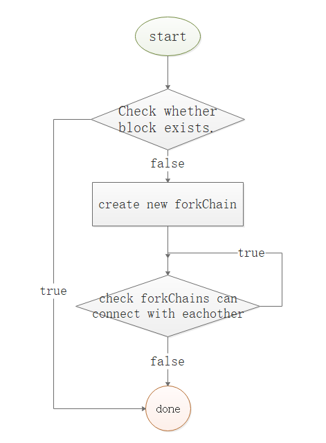
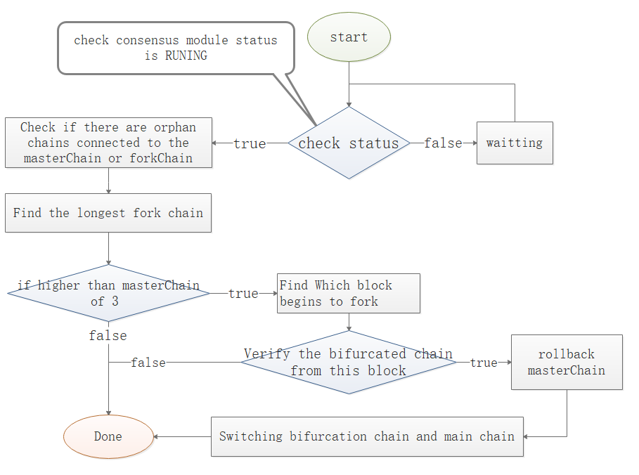

# Block Management Module Design Document

##  Overall description

### 1.1 Module Overview

#### 1.1.1 Why should I have the "block management" module?

	All transaction data in the blockchain is stored in the block, so there is a module responsible for the storage and management of the block, so that other modules can obtain the block when verifying the data in the block and processing the business.

	When the blockchain program is started for the first time, it is necessary to synchronize the latest block on the network to the local. This process is generally time consuming, and the transaction cannot be initiated when the synchronization is not completed, so it is suitable for the work to be performed by a separate module.

	In summary, it is necessary to provide a unified block data service for other modules, and it is also better to separate the management of the block from the specific service of the block. The module used in the block does not have to care about the block acquisition. detail.

#### 1.1.2 What to do in Block Management
- Provide api for block storage, query, rollback operations
- Synchronize the latest block from the network, save it after saving
- Block synchronization, broadcast, and forwarding of message processing
- Judgment and storage of bifurcation blocks
- Judgment and storage of orphan blocks
- Forked chain maintenance, switching
- Orphan chain maintenance, switching

#### 1.1.3 Positioning of "Block Management" in the system

Block management is one of the underlying modules. The following sub-functions discuss module dependencies.

rely

- Block synchronization - dependent on the communication interface of the network module, relying on the serialization tool of the tool module
- Block storage, rollback-dependency tool library storage tool, consensus module, transaction management module
- Block forwarding - Dependent network module broadcast message interface

Be dependent

- The entire system can initiate transactions - block synchronization
- Consensus module: block detailed verification, packing - block query, block saving, block broadcasting, block rollback

### 1.2 Architecture



## functional design

### 2.1 Functional Architecture


### 2.2 Module Service

#### 2.2.1 Get the latest block height

#### 2.2.2 Get the latest block header

- Interface Description

1. According to the chain id, the latest block height of the cache, query db to get the latest block header hash
2. According to the HASH query DB to get the block header byte array
3. Deserialize to block header object

- Request example

    ```
    {
      "cmd": "bestBlockHeader",
      "minVersion":"1.1",
      "params": ["888"]
    }
    ```

- Request parameter description

| index | parameter | required | type    | description |
| ----- | --------- | -------- | ------- | :---------: |
| 0 | chainId | true | Long | Chain ID |

- Return to example

    Failed
    
    ```
    {
        "version": 1.2,
        "code": 1,
        "msg": "error message",
        "result": {}
    }
    ```
    
    Success
    
    ```
    {
        "version": 1.2,
        "code": 0,
        "result": {
            "chainId": "888",
            "hash": "xxxxxxx",
            "preHash": "xxxxxxx",
            "merkleHash": "1",
            "height": 1,
            "size": 1,
            "time": 1,
            "txCount": 1,
            "packingAddress": "1",
            "reward": 0,
            "fee": 0,
            "extend": xxxxxxx,HEX
            "scriptSig": "1"
        }
    }
    ```
    
- Return field description
  
| parameter | type      | description                                |
| --------- | --------- | ------------------------------------------ |
| chainId | Long | Chain ID |
| hash | String | Block HASH |
| preHash | String | Previous Block HASH |
| merkleHash | String | Block MerkleHash |
| height | Long | Block Height |
| size | Integer | Block Size |
| time | Long | Block Packing Time |
| txCount | Integer | Number of transactions |
| packingAddress | String | Packed Address |
| reward | Long | Consensus Awards |
| fee | Long | Fees |
Extend | String | Extended field, HEX, containing roundIndex, roundStartTime, consensusMemberCount, packingIndexOfRound, stateRoot |
| scriptSig | String | Block Signature |

#### 2.2.3 Get the latest block

- Interface Description:

1. Get the latest local block header according to the chain id
2. Query the db according to the block head height to get the transaction hash list.
3. Get transaction data from the transaction management module according to the hash list
4. Assembled into block objects

- Request example

    ```
    {
      "cmd": "bestBlock",
      "minVersion":"1.1",
      "params": ["888"]
    }
    ```

- Request parameter description

| index | parameter | required | type    | description |
| ----- | --------- | -------- | ------- | :---------: |
| 0 | chainId | true | Long | Chain ID |

- Return to example 

    Failed

      ```
      {
          "version": 1.2,
          "code":1,
          "msg" :"xxxxxxxxxxxxxxxxxx",
          "result":{}
      }
      ```

    Success

    ```
    {
        "version": 1.2,
        "code": 0,
        "result": {
        	"blockHeader": {
                "chainId": "888",
                "hash": "xxxxxxx",
                "preHash": "xxxxxxx",
                "merkleHash": "1",
                "height": 1,
                "size": 1,
                "time": 1,
                "txCount": 1,
                "packingAddress": "1",
                "reward": 0,
                "fee": 0,
                "extend": xxxxxxx,HEX
                "scriptSig": "1"
        	}, //block header
        	"transactions": [
        	    {
                    "chainId": "888", //chainId
                    "height": "1", //block height
                    "hash": "1", //transaction HASH
                    "remark": "1", //transaction notes
                    "size": "1", //transaction size
                    "time": "1", //transaction time
                    "type": "1", //transaction type
                    "transactionSignature": "1", //transaction signature
                    "coinData": {
                        "from" : [
                            {
                                "fromAssetsChainId":""//id of asset distribution chain 
                                "fromAssetsId":""//asset id
                                "fromAddress":""//Transfer account address
                                "amount": ""//transfer amount
                                "nonce": ""//transaction sequence number, increment
                            },{...}
                        ]
                        "to" : [
                            {
                                "toAssetsChainId":""//id of asset distribution chain 
                                "toAssetsId":""//asset id
                                "toAddress": ""//Transfer account address
                                "amount": ""//transfer amount
                                "locktime":""
                            },{...}
                        ]
                    }
                    "txData": XXXX, //transaction data HEX
        	    },
        	    {...}
        	] //Transaction list
        }
    }
    ```

- Return field description

    slightly

#### 2.2.4 Get the block header according to the height

- Interface Description

1. According to the chain id, height query db to get the latest block header hash
2. According to the HASH query DB to get the block header byte array
3. Deserialize to block header object

- Request example

    ```
    {
      "cmd": "getBlockHeaderByHeight",
      "minVersion":"1.1",
      "params": ["111","888"]
    }
    ```

- Request parameter description

| index | parameter | required | type    | description |
| ----- | --------- | -------- | ------- | :---------: |
| 0 | chainId | true | Long | Chain ID |
| 1 | height | true | Long | Block Height |

- Return to example

    Failed
    
    ```
    {
        "version": 1.2,
        "code": 1,
        "msg": "error message",
        "result": {}
    }
    ```
    
    Success
    
    ```
    {
        "version": 1.2,
        "code": 0,
        "result": {
            "chainId": "888",
            "hash": "xxxxxxx",
            "preHash": "xxxxxxx",
            "merkleHash": "1",
            "height": 1,
            "size": 1,
            "time": 1,
            "txCount": 1,
            "packingAddress": "1",
            "reward": 0,
            "fee": 0,
            "extend": xxxxxxx,HEX
            "scriptSig": "1"
        }
    }
    ```
    
- Return field description
  
| parameter | type      | description                                |
| --------- | --------- | ------------------------------------------ |
| chainId | Long | Chain Id |
| hash | String | Block HASH |
| preHash | String | Previous Block HASH |
| merkleHash | String | Block MerkleHash |
| height | Long | Block Height |
| size | Integer | Block Size |
| time | Long | Block Packing Time |
| txCount | Integer | Number of transactions |
| packingAddress | String | Packed Address |
| reward | Long | Consensus Awards |
| fee | Long | Fees |
Extend | String | Extended field, HEX, containing roundIndex, roundStartTime, consensusMemberCount, packingIndexOfRound, stateRoot |
| scriptSig | String | Block Signature |

#### 2.2.4 Get the block according to the height

- Interface Description:

1. Get the block header according to the chain id and height
2. Query the db according to the block head height to get the transaction hash list.
3. Get transaction data from the transaction management module according to the hash list
4. Assembled into block objects

- Request example

    ```
    {
      "cmd": "bl_getBlockByHeight",
      "minVersion":"1.1",
      "params": ["111","888"]
    }
    ```

- Request parameter description

| index | parameter | required | type    | description |
| ----- | --------- | -------- | ------- | :---------: |
| 0 | chainId | true | Long | Chain ID |
| 1 | height | true | Long | Block Height |

- Return to example 

    Failed

      ```
      {
          "version": 1.2,
          "code":1,
          "msg" :"xxxxxxxxxxxxxxxxxx",
          "result":{}
      }
      ```

    Success

    ```
    {
        "version": 1.2,
        "code": 0,
        "result": {
        	"blockHeader": {
                "chainId": "888",
                "hash": "xxxxxxx",
                "preHash": "xxxxxxx",
                "merkleHash": "1",
                "height": 1,
                "size": 1,
                "time": 1,
                "txCount": 1,
                "packingAddress": "1",
                "reward": 0,
                "fee": 0,
                "extend": xxxxxxx,HEX
                "scriptSig": "1"
        	}, //block header
        	"transactions": [
        	    {
                    "chainId": "888", // chain ID
                    "height": "1", //block height
                    "hash": "1", //transaction HASH
                    "remark": "1", //transaction notes
                    "size": "1", //transaction size
                    "time": "1", //transaction time
                    "type": "1", //transaction type
                    "transactionSignature": "1", //transaction signature
                    "coinData": {
                        "from" : [
                            {
                                "fromAssetsChainId":""//id of asset distribution chain 
                                "fromAssetsId":""//asset id
                                "fromAddress":""//Transfer account address
                                "amount": ""//transfer amount
                                "nonce": ""//transaction sequence number, increment
                            },{...}
                        ]
                        "to" : [
                            {
                                "toAssetsChainId":""//id of asset distribution chain 
                                "toAssetsId":""//asset id
                                "toAddress": ""//Transfer account address
                                "amount": ""//transfer amount
                                "nonce": ""//transaction sequence number, increment
                            },{...}
                        ]
                    }
                    "txData": XXXX, //transaction data HEX
        	    },
        	    {...}
        	], //transaction list
        }
    }
    ```

- Return field description

    slightly

#### 2.2.5 Get the block header according to hash

- Interface Description

1. According to the chain ID, HASH query DB to get the block header byte array
2. Deserialize to block header object

- Request example

    ```
    {
      "cmd": "bl_getBlockHeaderByHash",
      "minVersion":"1.1",
      "params": ["888","aaa"]
    }
    ```

- Request parameter description

| index | parameter | required | type    | description |
| ----- | --------- | -------- | ------- | :---------: |
| 0 | chainId | true | Long | Chain ID |
| 1 | hash | true | String | Block hash |

- Return to example

    Failed
    
    ```
    {
        "version": 1.2,
        "code": 1,
        "msg": "error message",
        "result": {}
    }
    ```
    
    Success
    
    ```
    {
        "version": 1.2,
        "code": 0,
        "result": {
            "chainId": "888",
            "hash": "xxxxxxx",
            "preHash": "xxxxxxx",
            "merkleHash": "1",
            "height": 1,
            "size": 1,
            "time": 1,
            "txCount": 1,
            "packingAddress": "1",
            "reward": 0,
            "fee": 0,
            "extend": xxxxxxx,HEX
            "scriptSig": "1"
        }
    }
    ```
    
- Return field description
  
| parameter | type      | description                                |
| --------- | --------- | ------------------------------------------ |
| chainId | Long | Chain ID |
| hash | String | Block HASH |
| preHash | String | Previous Block HASH |
| merkleHash | String | Block MerkleHash |
| height | Long | Block Height |
| size | Integer | Block Size |
| time | Long | Block Packing Time |
| txCount | Integer | Number of transactions |
| packingAddress | String | Packed Address |
| reward | Long | Consensus Awards |
| fee | Long | Fees |
Extend | String | Extended field, HEX, containing roundIndex, roundStartTime, consensusMemberCount, packingIndexOfRound, stateRoot |
| scriptSig | String | Block Signature |

#### 2.2.6 Get the block according to the hash

- Interface Description:

1. Get the block header according to the chain ID and hash
2. Query the db according to the block head height to get the transaction hash list.
3. Get transaction data from the transaction management module according to the hash list
4. Assembled into block objects

- Request example

    ```
    {
      "cmd": "bl_getBlockByHash",
      "minVersion":"1.1",
      "params": ["888","aaa"]
    }
    ```

- Request parameter description

| index | parameter | required | type    | description |
| ----- | --------- | -------- | ------- | :---------: |
| 0 | chainId | true | Long | Chain ID |
| 1 | hash | true | String | Block hash |

- Return to example 

    Failed

      ```
      {
          "version": 1.2,
          "code":1,
          "msg" :"xxxxxxxxxxxxxxxxxx",
          "result":{}
      }
      ```

    Success

    ```
    {
        "version": 1.2,
        "code": 0,
        "result": {
        	"blockHeader": {
        	    "chainId": "888",
                "hash": "xxxxxxx",
                "preHash": "xxxxxxx",
                "merkleHash": "1",
                "height": 1,
                "size": 1,
                "time": 1,
                "txCount": 1,
                "packingAddress": "1",
                "reward": 0,
                "fee": 0,
                "extend": xxxxxxx,HEX
                "scriptSig": "1"
        	}, //block header
        	"transactions": [
        	    {
        	        "chainId": "888",
                    "height": "1", //block height
                    "hash": "1", //transaction HASH
                    "remark": "1", //transaction notes
                    "size": "1", //transaction size
                    "time": "1", //transaction time
                    "type": "1", //transaction type
                    "transactionSignature": "1", //transaction signature
                    "coinData": {
                        "from" : [
                            {
                                "fromAssetsChainId":""//id of asset distribution chain 
                                "fromAssetsId":""//asset id
                                "fromAddress":""//Transfer account address
                                "amount": ""//transfer amount
                                "nonce": ""//transaction sequence number, increment
                            },{...}
                        ]
                        "to" : [
                            {
                                "toAssetsChainId":""//id of asset distribution chain 
                                "toAssetsId":""//asset id
                                "toAddress": ""//Transfer account address
                                "amount": ""//transfer amount
                                "nonce": ""//transaction sequence number, increment
                            },{...}
                        ]
                    }
                    "txData": XXXX, //transaction data HEX
        	    },
        	    {...}
        	], //transaction list
        }
    }
    ```

- Return field description

    slightly

#### 2.2.7 Getting the block header in a certain height interval

- Interface Description

1. make queryHash=endHash
2. According to the chain ID, queryHash query DB to get the block header byte array
3. Deserialize to block header object blockHeader, add to List as return value
4. If blockHeader.hash!=startHash, make queryHash=blockHeader.preHash, repeat step 2
5. Return to List

- Request example

    ```
    {
      "cmd": "bl_getBlockHeaderBetweenHeights",
      "minVersion":"1.1",
      "params": ["888",111","111"]
    }
    ```

- Request parameter description

| index | parameter | required | type    | description |
| ----- | --------- | -------- | ------- | :---------: |
| 0 | chainId | true | Long | Chain ID |
| 1 | startHeight | true | Long | Starting height |
| 2 | endHeight | true | Long | End Height |

- Return to example

    Failed
    
    ```
    {
        "version": 1.2,
        "code": 1,
        "msg": "error message",
        "result": {}
    }
    ```
    
    Success
    
    ```
    {
        "version": 1.2,
        "code": 0,
        "result": {
            "list" : [
                {
               "chainId": "888",
               "hash": "xxxxxxx",
               "preHash": "xxxxxxx",
               "merkleHash": "1",
               "height": 1,
               "size": 1,
               "time": 1,
               "txCount": 1,
               "packingAddress": "1",
               "reward": 0,
               "fee": 0,
               "extend": xxxxxxx,HEX
               "scriptSig": "1"
               }
            ]

        }
    }
    ```
    
- Return field description
  
| parameter | type      | description                                |
| --------- | --------- | ------------------------------------------ |
| chainId | Long | Chain ID |
| hash | String | Block HASH |
| preHash | String | Previous Block HASH |
| merkleHash | String | Block MerkleHash |
| height | Long | Block Height |
| size | Integer | Block Size |
| time | Long | Block Packing Time |
| txCount | Integer | Number of transactions |
| packingAddress | String | Packed Address |
| reward | Long | Consensus Awards |
| fee | Long | Fees |
Extend | String | Extended field, HEX, containing roundIndex, roundStartTime, consensusMemberCount, packingIndexOfRound, stateRoot |
| scriptSig | String | Block Signature |

#### 2.2.8 Get the block in a certain height interval

- Interface Description

1. make queryHash=endHash
2. According to the chain ID, queryHash query DB to get the block byte array
3. Deserialize to a block object block, add it to the List as the return value
4. If block.hash!=startHash, make queryHash=block.preHash, startHash, repeat step 2
5. Return to List

- Request example

    ```
    {
      "cmd": "bl_getBlockBetweenHeights",
      "minVersion":"1.1",
      "params": ["888",111","111"]
    }
    ```

- Request parameter description

| index | parameter | required | type    | description |
| ----- | --------- | -------- | ------- | :---------: |
| 0 | chainId | true | Long | Chain ID |
| 1 | startHeight | true | Long | Starting height |
| 2 | endHeight | true | Long | End Height |

- Return to example

    Failed
    
    ```
    {
        "version": 1.2,
        "code": 1,
        "msg": "error message",
        "result": {}
    }
    ```
    
    Success
    
    ```
    {
        "version": 1.2,
        "code": 0,
        "result": {
            "list" : [
                {
                    "blockHeader": {
                        "chainId": "888",
                        "hash": "xxxxxxx",
                        "preHash": "xxxxxxx",
                        "merkleHash": "1",
                        "height": 1,
                        "size": 1,
                        "time": 1,
                        "txCount": 1,
                        "packingAddress": "1",
                        "reward": 0,
                        "fee": 0,
                        "extend": xxxxxxx,HEX
                        "scriptSig": "1"
                    }, //block header
                    "transactions": [
                        {
                            "chainId": "888",
                            "height": "1", //block height
                            "hash": "1", //transaction HASH
                            "remark": "1", //transaction notes
                            "size": "1", //transaction size
                            "time": "1", //transaction time
                            "type": "1", //transaction type
                            "transactionSignature": "1", //transaction signature
                            "coinData": {
                                "from" : [
                                    {
                                        "fromAssetsChainId":""//id of asset distribution chain 
                                        "fromAssetsId":""//asset id
                                        "fromAddress":""//Transfer account address
                                        "amount": ""//transfer amount
                                        "nonce": ""//transaction sequence number, increment
                                    },{...}
                                ]
                                "to" : [
                                    {
                                        "toAssetsChainId":""//id of asset distribution chain 
                                        "toAssetsId":""//asset id
                                        "toAddress": ""//Transfer account address
                                        "amount": ""//transfer amount
                                        "nonce": ""//transaction sequence number, increment
                                    },{...}
                                ]
                            }
                            "txData": XXXX, //transaction data HEX
                        },
                        {...}
                    ], //transaction list
               }
            ]

        }
    }
    ```
    
- Return field description
  
    slightly

#### 2.2.9 Receiving the latest packaging block

- Interface Description

After the local node consensus module is packaged, call this interface to save the block data.

- Request example

    ```
    {
      "cmd": "receivePackingBlock",
      "minVersion":"1.1",
      "params": [
      	Blockhex// can use hex with hex
      ]
    }
    ```

- Request parameter description

    slightly

- Return to example

    Failed

    ```
    {
        "version": 1.2,
        "code": 1,
        "msg": "error message",
        "result": {}
    }
    ```

    Success

    ```
    {
        "version": 1.2,
        "code": 0,
        "result": {"sync": "true"}
    }
    ```

- Return field description

| parameter | type      | description                                |
| --------- | --------- | ------------------------------------------ |
| sync | String | Whether the block was saved successfully |

#### 2.2.10 Running a chain

- Interface Description

After the chain factory releases a chain, the core module calls the interface of the block management module, initializes the block and the forked chain database according to the chainID, starts a series of work threads corresponding to the chainID, and prepares for running the new chain.

- Request example

    ```
    {
      "cmd": "bl_startChain",
      "minVersion":"1.1",
      "params": ["888"]
    }
    ```

- Request parameter description

    slightly

- Return to example

    Failed

    ```
    {
        "version": 1.2,
        "code": 1,
        "msg": "error message",
        "result": {}
    }
    ```

    Success

    ```
    {
        "version": 1.2,
        "code": 0,
        "result": {"result": "true"}
    }
    ```

- Return field description

| parameter | type      | description                                |
| --------- | --------- | ------------------------------------------ |
| result | String | Whether the new chain starts successfully |

#### 2.2.11 Stop a chain

- Interface Description

After stopping a chain in the chain factory, the core module will call the interface of the block management module, delete the cache block and the fork chain data of the chain, and stop a series of work threads corresponding to the chainID.

- Request example

    ```
    {
      "cmd": "bl_stopChain",
      "minVersion":"1.1",
      "params": ["888"]
    }
    ```

- Request parameter description

    slightly

- Return to example

    Failed

    ```
    {
        "version": 1.2,
        "code": 1,
        "msg": "error message",
        "result": {}
    }
    ```

    Success

    ```
    {
        "version": 1.2,
        "code": 0,
        "result": {"result": "true"}
    }
    ```

- Return field description

| parameter | type      | description                                |
| --------- | --------- | ------------------------------------------ |
| result | String | Whether the new chain stops successfully |

### 2.3 Module internal function

#### 2.3.1 Module startup

- Function Description:

  Boot block management module

- Process description


- 1.rpc service initialization
- 2. Initialize the general database
- 3. Load configuration information
- 4. Initialize each chain database
- 5. Wait for the dependent module to be ready
- 6. Register the message processing class with the network module.
- 7. Start sync block thread, database size monitor thread, fork chain processing thread, orphan chain processing thread, orphan chain maintenance thread

- Dependent service

  Tool module, kernel module, network module, transaction management module

#### 2.3.2 Block Storage

- Function Description:

    Store block header data on the main chain and complete block data of the forked chain or orphan chain

    - Main chain storage

      Different chains are stored in different tables, table name plus chainID suffix
              A complete block consists of a block header and a transaction, and the block header is stored separately from the transaction.
      	Block header: (put in the block management module)
                    Key (block height) - value (block header hash) 		block-header-index
                    Key (block header hash)-value (complete block header) 	block-header
      	Trading: (put in the transaction management module)

    - Forked chain, orphan chain storage

      All the forked chains and orphaned chain objects are cached in memory (only the starting height, starting hash, ending height, ending hash, etc.) are recorded, and the full block data is cached in the hard disk. If forked chain switching or cleaning is required For operations such as forks, you only need to read the database once.
      	Different branches of the bifurcation chain have different tables, the table name plus the chainID suffix, and each bifurcation chain object is as follows:
      		Key (block hash)-value (complete block data) 	CachedBlock

- Process description

    slightly

- Dependent service

  Database tool for tool modules

#### 2.3.3 Block Cleaning

- Function Description:

  In order to avoid excessive garbage data occupying hard disk space, timing cleaning of the forked chain and orphan chain

- Process description

  1. Clean up according to the configured maximum number of cache blocks. When the number of blocks in the forked chain + orphan chain cache is greater than the threshold, clean up.
  2. Clean up according to the starting height of the bifurcation chain or orphan chain and the latest height difference of the main chain
  3. According to the age of the orphan chain, the initial age of the orphan chain is 0. After each orphan chain maintenance, but the chain of the orphan chain does not add legal blocks, the orphan chain age is increased by one. Clean up when the orphan chain age is greater than the threshold

- Dependent service

  Database tool for tool modules

#### 2.3.4 Block Synchronization

- Function Description:

  After the system is started, the maintenance of the local block data is consistent with most nodes on the network.

  BlockSynchronizer: statistics the latest consistent height on the network, check whether the local block needs to be rolled back, and initialize the parameters during the synchronization of various blocks.

  BlockDownloader: From the starting height, assign the download task according to the credit value of each download node, assemble the HeightRangeMessage, and send it to the target node.

  BlockConsumer: Extracts the blocks in the cached map according to the height, verifies and saves them. If a certain height is not available, assembles a HeightMessage and sends it to the connected node to obtain the block of the height.

- Process description

    - Block synchronization main process

    

    - Get a list of available nodes on the network

    ```
        1. Traverse the node and count the two MAPs, assuming that each node (the latest HASH+ latest height) is the key
        2. A key with the key as the number of statistics
        3. A key is used to record the list of nodes holding the key.
        4. Finally, the most frequently occurring key is counted, and the current trusted latest height and latest hash, as well as the list of trusted nodes are obtained.
        
        Give a chestnut:
        Now connect to 10 nodes at the same time.The latest block height of 4 nodes (A, B, C, D) is 100, the latest block hash is aaa, and the latest block height of 6 nodes (E, F, G, H, I, J) Is 101, the latest block hash is bbb.
        Finally return (101, bbb, [E, F, G, H, I, J]).
    ```

    - Download block logic

    
    ```
        Before the block is officially downloaded, it is necessary to determine whether there is a fork between the local and the network, and whether it needs to be rolled back.In order to find the exact block download height.
        The following discussion is divided into:
        Take the result of the previous step (101, bbb, [E, F, G, H, I, J]), while LH(N) represents the hash of the local Nth block, and RH(N) represents the hash of the Nth block on the network. .
        1. Local height 100 &lt; network height 101, LH (100) == RH (100), normal, behind the remote node, download block
        2. Local height 100 &lt; network height 101, LH (100)! = RH (100), think local fork, roll back the local block, if LH (99) == RH (99)
        At the end of the rollback, download from 99 blocks. If lh(99)!=rh(99), continue to roll back and repeat the above logic.However, if you roll back 10 blocks at most, it will stop and wait for the next synchronization. This will avoid being attacked by malicious nodes and roll back normal blocks in large quantities.
        3. Local height 102> network height 101, lh (101) == rh (101), normal, leading than the remote node, no need to download the block
        4. Local height 102> network height 101, lh(101)!=rh(101), think local fork, first roll back to height and remotely, repeat scene 2
        5. Local height 101 = network height 101, lh (101) == rh (101), normal, consistent with the remote node, no need to download the block
        6. Local height 101 = network height 101, lh (101)! = rh (101), think local fork, repeat scene 2
        
        Scenes 1, 2 need to download additional blocks from the node that are consistent with the local height, and perform hash judgment.
        In the scenario that needs to be rolled back, the number of available nodes (10) > configuration, the number of consistent available nodes (6) accounted for more than 80%, and avoiding too few nodes leads to frequent rollback.The above two conditions are not met, empty the connected nodes, and re-acquire the available nodes.
     
        When actually downloading a block, give an example:
        The current height is 100, the network height is 500, 12 nodes are available, 10 nodes are consistently available, and each node initially downloads 2 blocks. When downloading, the cache queue allows up to 100 blocks to be cached.
        Pseudo code representation
        	Idle download node queue: nodes (each download node will have an initial download credit value, the credit value increases every time the download is successful, and the credit maximum is twice the initial value)
        	Block cache queue downloaded to: queue
            Download starting height: startHeight = 101;
            Download end height: netLatestHeight = 500;
            while (startHeight &lt;= netLatestHeight) {
                    while (queue.size() > 100) {
                        BlockDownloader wait！ cached queue size beyond config
                    }
                    Get an available node
                    Calculate the number of download blocks according to the node download credit value as size
                    Submit an asynchronous download task
                    startHeight += size;
            }
    If a node fails to download, it is downloaded by other nodes.
    Considering that during the download process, other nodes on the network will continue to generate new blocks.After the download is completed, it is necessary to judge whether the latest block height in the local area is the same as the latest matching height on the network. If they are the same, the flag block synchronization ends. If they are not the same, you need to continue downloading.
    ```

    - Download blocks from a height interval from the node

    

- Dependent service

  Database module tool for tool module, rpc tool

#### 2.3.5 Block Basic Verification

- Function Description:

  Verify the correctness of the block's own data, verify during the download process, verify that there is no problem with the block data itself, and discard the block if the verification fails.

- Process description

    - Block basic verification
    
    
    
    - Block header verification
    
    

- Dependent service

  Database storage tool for tool modules

#### 2.3.6 Bifurcation block, orphan block verification

- Function Description:

  Verify the correctness of the block context. After the download is completed, the verification is verified. The verification indicates that the block is connected to the main chain. The verification failure indicates that the block is bifurcated and enters the forked chain processing logic.

- Process description

  - Forked block, orphan block verification
  - There are four relationships between block b and chain a:
  - 1.b is a duplicate block on a
  - 2.b is a forked block on a
  - 3.b can connect directly to a
  - 4.b has no association with a
  - The above four relationships apply to the main chain, the bifurcation chain, the orphan chain
    

  The height difference is cached to disk within 1000. The disk space is limited in size. If the height exceeds the height, it is discarded. When the cache space is full, the fork chain is cleared in the order of adding cache time.
  If it is in normal operation, it receives the block forwarded by other nodes, and finds that the fork module has to notify the consensus module to give the red card penalty for the node that generated the block. This judgment is not made during the synchronization process after the system is started.

  

- Dependent service

  Database storage tool for tool modules

#### 2.3.7 Fork Chain Management

- Function Description:

  Determine if the fork chain and the main chain need to be switched

- Process description
  - Find the maximum height difference, compared to the chain switching threshold, and chain switching if it is greater than the threshold
      - Find the bifurcation point of the main chain and the longest bifurcation chain, and find the chain switching path
      - Roll back the main chain block, roll back the block to form a new fork chain link to the original main chain
      - Add blocks of the forked chain on the switching path in turn
      - Switch completed



- Dependent service

  Database storage tool for tool modules

#### 2.3.8 Orphan Chain Management

- Function Description:

    Used to connect orphan chains to bifurcation chains, main chains, and fork operations

- Process description

    There are three kinds of relationships between chains and chains, which are connected, bifurcated and repeated.
    
 1. Mark (change chain attribute stage)
 The main chain, the bifurcation chain, and the orphan chain correspond to the three final categories of master, fork, orphan.
     - If the orphan chain is connected to the main chain, temporarily mark the orphan chain as master_append, and mark the subchain of the orphan chain as master_fork
     - If the orphan chain is duplicated with the main chain, temporarily mark the orphan chain as master_duplicate, and mark the subchain of the orphan chain as master_fork
     - If the orphan chain is bifurcated with the main chain, temporarily mark the orphan chain as master_fork, and mark the sub-chain of the orphan chain as fork_fork
     - If the orphan chain is connected to the forked chain, temporarily mark the orphan chain as fork_append, and mark the child chain of the orphan chain as fork_fork
     - If the orphan chain and the bifurcation chain are repeated, temporarily mark the orphan chain as fork_duplicate, and mark the sub-chain of the orphan chain as fork_fork
     - If the orphan chain and the bifurcation chain are forked, temporarily mark the orphan chain as fork_fork, and mark the child chain of the orphan chain as fork_fork
     - If the orphan chain is connected to the orphan chain, temporarily mark the orphan chain as orphan_append, and mark the child chain of the orphan chain as orphan_fork
     - If the orphan chain is repeated with the orphan chain, temporarily mark the orphan chain as orphan_duplicate, and mark the child chain of the orphan chain as orphan_fork
     - If the orphan chain and the orphan chain are forked, temporarily mark the orphan chain as orphan_fork, and mark the child chain of the orphan chain as orphan_fork
     - If the orphan chain has not changed through the above process, it is not associated with other chains, the flag is still orphan

 2. Copy, clear
     - If marked as duplicated with the main chain, orphanChain will not be copied to the new orphan chain collection, nor will it enter the bifurcation chain collection. The direct subchain of orphanChain is marked as ChainTypeEnum.MASTER_FORK
     - If marked as connected to the main chain, orphanChain will not be copied to the new orphan chain collection, nor will it enter the bifurcation chain collection. The direct subchain of orphanChain is marked as ChainTypeEnum.MASTER_FORK
     - If marked as bifurcated from the main chain, orphanChain will not be copied to the new orphan chain collection, but will enter the bifurcation chain collection, and the direct subchain of orphanChain is marked as ChainTypeEnum.FORK_FORK
     - If marked as duplicated with a forked chain, orphanChain will not be copied to the new orphaned chain set, nor will it enter the forked chain set. The direct subchain of orphanChain is marked as ChainTypeEnum.FORK_FORK
     - If marked as connected to a forked chain, orphanChain will not be copied to the new orphan chain collection, nor will it enter the forked chain collection. The direct subchain of orphanChain is marked as ChainTypeEnum.FORK_FORK
     - If marked as bifurcated from the forked chain, orphanChain will not be copied to the new orphaned chain set, but will enter the forked chain set, and the direct subchain of orphanChain is marked as ChainTypeEnum.FORK_FORK
     - If marked as repeating with an orphan chain, orphanChain will not be copied to the new orphan chain collection, nor will it enter the forked chain collection. The direct subchain of orphanChain is marked as ChainTypeEnum.ORPHAN_FORK
     - If marked as connected to an orphan chain, will not be copied to the new orphan chain collection, all orphanChain's direct sub-chain will be copied to the new orphan chain collection, the type is unchanged
     - If marked as bifurcated with an orphan chain, it will be copied to the new orphan chain collection, and all orphanChain's direct sub-chains will be copied to the new orphan chain collection with the same type
     - If marked as an orphan chain (not changed), or forked from an orphan chain, copy to a new orphan chain set
      
- Dependent service

  Database storage tool for tool modules

#### 2.3.9 Orphan chain maintenance

- Function Description:

    Timing attempts to increase the block at the beginning of the chain of the orphan chain, maintaining the age of the failed orphan chain plus one.

- Process description

    Iterate through all the orphan chains, take the preHash of the starting block on the chain, assemble it into a HashMessage and send it to any of the currently available nodes, waiting for the result to be returned asynchronously.

- Dependent service

  Database storage tool for tool modules

#### 2.3.10 Forwarding block

- Function Description:

    The non-exit node performs the forwarding process after verifying the block

- Process description

1. Assemble the HashMessage using blockHash and send it to the target node.
2. After receiving the HashMessage, the target node fetches the hash to determine whether it is duplicated. If it is not repeated, use hash to assemble the HashMessage and send it to the source node.
3. After receiving the GetSmallBlockMessage, the source node takes the hash, queries the SmallBlock, and assembles the SmallBlockMessage, and sends it to the target node.
4. Subsequent interaction process reference broadcast block

- Dependent service

  Database storage tool for tool modules

#### 2.3.11 Broadcast Block

- Function Description:

  Outgoing node performs broadcast process

- Process description

  - Receive the packaging block of the consensus module. After the verification is successful, assemble the SmallBlockMessage according to the Block and broadcast it to the connected node.
  - After receiving the message, the target node determines which transactions are not locally based on txHashList, and then assembles the HashListMessage to the source node.
  - After receiving the information, the source node assembles the TxGroupMessage according to the hashlist and returns it to the target node.
  - At this point the complete block data has been sent to the target node.

- Dependent service

  Database storage tool for tool modules

## Description of the event

### 3.1 Published events

#### 3.1.1 Synchronization completed

Description: The synchronization is completed. When the height of the area is the same as the height of the network, the event is released.

 event_topic : "bl_blockSyncComplete",

```
data:{
    chainId
    height
    hash
}
```

#### 3.1.2 Saving Blocks

Description: This event is posted every time a block is saved, and is not sent during the initial synchronization.

 event_topic : "bl_saveBlock",

```
data:{
    chainId
    height
    hash
}
```

#### 3.1.3 Rollback block

Description: Publish this event each time you roll back a block 

 event_topic : "bl_rollbackBlock",

```
data:{
    chainId
    height
    hash
}
```

### 3.2 Subscribe to events

	slightly

## Agreement

### 4.1 Network Communication Protocol

	See network module

### 4.2 Message Protocol

#### 4.2.1 Block Height Information HeightMessage

- Message description: Retry download during "block synchronization"

- Message type (cmd)

  getBlockH

- The format of the message (messageBody)

| Length | Fields  | Type      | Remark         |
| ------ | ------- | --------- | -------------- |
| 64 | heighrt | int64 | Block Height |

- Verification of the message

    slightly

- Message processing logic

    - Query the complete block according to the block height and send it to the target node
    - If there is no block of this height, an empty message is returned

#### 4.2.2 Single Summary Message HashMessage

- Message description: for "forward block", "orphan chain maintenance" function

- Message type (cmd)

  forward,getBlock,getsBlock

- The format of the message (messageBody)

| Length | Fields  | Type      | Remark         |
| ------ | ------- | --------- | -------------- |
| 32 | hash | byte[] | Trading hash |

- Verification of the message

    slightly

- Message processing logic

    - Forward the hash of SmallBlock
    - Get SmallBlock based on hash
    - Get the full block based on hash

#### 4.2.3 Summary List Message HashListMessage

- Message description: for "forward block" function

- Message type (cmd)

  getTxs

- The format of the message (messageBody) 

| Length | Fields  | Type      | Remark         |
| ------ | ------- | --------- | -------------- |
| 32 | blockHash | byte[] | Block hash |
| ? | hashLength | VarInt | Array Length |
| 32 | hash | byte[] | Trading hash |

- Verification of the message

    slightly

- Message processing logic

1. Obtain the Transaction List based on chainID and hash
2. Assemble the TxGroupMessage and send it to the source node

#### 4.2.4 Block Broadcast Message SmallBlockMessage

- Message description: for "forwarding block", "broadcast block" function

- Message type (short)

  sBlock

- The format of the message (messageBody)

| Length | Fields  | Type      | Remark         |
| ------ | ------- | --------- | -------------- |
| ?     | preHash         | byte[]    | preHash           |
| ?     | merkleHash      | byte[]    | merkleHash           |
| 32 | time | Uint32 | Time |
| 32 | height | Uint32 | Block Height |
| 32 | txCount | Uint32 | Number of Transactions |
| ? | extendLength| VarInt | extend array length |
| ?     | extend      | byte[]    | extend           |
| 32 | publicKeyLength | Uint32 | Public Key Array Length |
| ? | publicKey | byte[] | Public Key |
| ? | signBytesLength| VarInt | Signature Array Length |
| ? | signBytes | byte[] | Signature|
| ? | txHashListLength| VarInt | Transaction hash list array length |
| ? | txHashLength| VarInt | Trading hash array length |
| ? | txHash | byte[] | Trading hash |

- Verification of the message

    slightly

- Message processing logic

    - Determine whether the block timestamp is greater than (current time +10s). If it is greater than this time, it is determined to be maliciously prematurely out of the block, ignoring the message.
    - According to the chainID and the block hash, it is judged whether the message is repeated. If it is repeated, the message is ignored (it is required to maintain a set and store the received block hash according to the chainID).
    - Query the DB according to the chainID and the block hash to see if the block already exists in the local area. If it already exists, ignore the message.
    - Verify the block header, if the verification fails, ignore the message
    - Take txHashList, determine that tx is not local, assemble HashListMessage, send it to the source node, and get those transaction information that is not available.
    - If the transaction is available, the group is placed in the cache queue, waiting for the verification thread to verify and store

#### 4.2.5 Height interval message HeightRangeMessage

- Message description: for "sync block" function

- Message type (cmd)

  getBlocks

- The format of the message (messageBody)

| Length | Fields  | Type      | Remark         |
| ------ | ------- | --------- | -------------- |
| 64 | startHeight | int64 | Starting height |
| 64 | endHeight | int64 | End Height |

- Verification of the message

    slightly

- Message processing logic

    - chainID, height parameter verification
    - Find the Block from startHeight, assemble the BlockMessage, and send it to the target node.
    - As soon as the endHeight is found, assemble CompleteMessage(true) and send it to the target node.
    - Midway lookup failed, assemble CompleteMessage(false), and send it to the target node

#### 4.2.6 Complete block message BlockMessage

- Message description: for "block synchronization"

- Message type (cmd)

  block

- The format of the message (messageBody)

| Length | Fields  | Type      | Remark         |
| ------ | ------- | --------- | -------------- |
| 32     | requestHash         | byte[]    | requestHash           |
| 32 | preHash | byte[] | hash of the previous block |
| 32     | merkleHash      | byte[]    | merkleHash           |
| 32 | time | Uint32 | Time |
| 32 | height | Uint32 | Block Height |
| 32 | txCount | Uint32 | Number of Transactions |
| ? | extendLength| VarInt | extend array length |
| ?     | extend      | byte[]    | extend           |
| 32 | publicKeyLength | Uint32 | Public Key Array Length |
| ? | publicKey | byte[] | Public Key |
| ? | signBytesLength| VarInt | Signature Array Length |
| ? | signBytes | byte[] | Block Signature |
| 16 | type | uint16 | Transaction Type |
| 32 | time | uint32 | Trading Hours |
| ? | remarkLength| VarInt | Remarks Array Length |
| ? | remark | byte[] | Notes |
| ? | txDataLength| VarInt | Transaction Data Array Length |
| ? | txData | byte[] | Trading Data |
| ? | coinDataLength| VarInt | CoinData array length |
| ?     | coinData      | byte[]    | CoinData           |
| ? | txSignLength| VarInt | Transaction Signature Array Length |
| ? | txSign | byte[] | Transaction Signature |
| 1 | syn | byte | Whether it is a block for block synchronization request |

- Verification of the message

    slightly

- Message processing logic

    - If syn==true, put the block into the synchronized cache map and increase the number of sync block bytes
    - Put in a single block cache if syn==false

#### 4.2.7 Request completion message CompleteMessage

- Message Description: A generic message for asynchronous requests that marks the end of asynchronous request processing.

- Message type (cmd)

  complete

- The format of the message (messageBody)

| Length | Fields  | Type      | Remark         |
| ------ | ------- | --------- | -------------- |
| 32     | Hash         | byte[]    | Hash           |
| 1 | success | byte | success logo|

- Verification of the message

    slightly

- Message processing logic

1. Set the working flag of the corresponding node to idle according to the chainID and nodeId.

#### 4.2.8 Transaction List Message TxGroupMessage

- Message description: for "forwarding blocks"

- Message type (cmd)

  txs

- The format of the message (messageBody)

| Length | Fields  | Type      | Remark         |
| ------ | ------- | --------- | -------------- |
| 32   | blockHash | byte[]    | blockHash  |
| ? | txCount | VarInt | Number of transactions |
| 16 | type | uint16 | Transaction Type |
| 32 | time | uint32 | Trading Hours |
| ? | remarkLength| VarInt | Remarks Array Length |
| ? | remark | byte[] | Notes |
| ? | txDataLength| VarInt | Transaction Data Array Length |
| ? | txData | byte[] | Trading Data |
| ? | coinDataLength| VarInt | CoinData array length |
| ?     | coinData      | byte[]    | CoinData           |
| ? | txSignLength| VarInt | Transaction Signature Array Length |
| ? | txSign | byte[] | Transaction Signature |

- Verification of the message

    slightly

- Message processing logic

    - Ignore the message if I have received the full block
    - If a partial block is received and the transaction is missing, the complete block is assembled and saved

## Module configuration

```
{
  "forkChainsMonitorInterval": 10000,
  "orphanChainsMonitorInterval": 10000,
  "orphanChainsMaintainerInterval": 5000,
  "storageSizeMonitorInterval": 300000,
  "networkResetMonitorInterval": 300000,
  "nodesMonitorInterval": 5000,
  "txGroupRequestorInterval": 1000,
  "txGroupTaskDelay": 3000,
  "testAutoRollbackAmount": 0,
  "blockMaxSize": 5242880,
  "resetTime": 180000,
  "chainSwtichThreshold": 3,
  "cacheSize": 1000,
  "heightRange": 1000,
  "maxRollback": 1000,
  "consistencyNodePercent": 60,
  "minNodeAmount": 1,
  "downloadNumber": 10,
  "extendMaxSize": 1024,
  "validBlockInterval": 60000,
  "smallBlockCache": 6,
  "orphanChainMaxAge": 10,
  "singleDownloadTimeout": 10000,
  "waitNetworkInterval": 5000,
  "cachedBlockSizeLimit": 20971520,
  "genesisBlockPath": ""
}
```

## Java-specific design

- Block object design
> | `field name` | `field type` | `description` |
> | ------------------- | ---------- | ---------- |
> | blockHeader | BlockHeader | Block Head |
> | transactions | List&lt;Transaction> | Trading List|

- SmallBlock object design
> | `field name` | `field type` | `description` |
> | ------------------- | ---------- | ---------- |
> | blockHeader | BlockHeader | Block Head |
> | transactions | List&lt;String> | All Trading HASH List |
> | subTxList | List&lt;Transaction> | Transactions that other nodes must not have (such as consensus reward transactions, red and yellow cards, etc.) |

- BlockHeader object design
> | `field name` | `field type` | `description` |
> | ------------------- | ---------- | ---------- |
> | hash | String | Block HASH |
> | preHash | String | Previous Block HASH |
> | merkleHash | String | Block MerkleHash |
> | height | int | Block Height |
> | time | long | Block packing time |
> | txCount | short | Number of transactions |
> | extend | byte[] | extended field|
> | blockSignature | BlockSignature | Block Signature |

- BlockSignature object design
> | `field name` | `field type` | `description` |
> | ------------------- | ---------- | ---------- |
> | signData | String | Block Signature |
> | publicKey | byte[] | Public Key |

- Chain object design
> | `field name` | `field type` | `description` |
> | ------------------- | ---------- | ---------- |
> | parent | Chain | parent chain |
> | sons | SortedSet&lt;Chain> | Sub-chain Collection|
> | chainId | int | Chain ID |
> | previousHash | NulsDigestData | previousHash of the starting block on the chain |
> | startHeight | long | chain start height |
> | startHashCode | int | chain start hash conversion int (sort) |
> | endHeight | long | chain end height |
> | hashList | LinkedList | Chain block hash list|
> | type | ChainTypeEnum | Chain Type |
> | age | AtomicInteger | Chain age (orphan chain cleanup use) |

## Supplementary content
