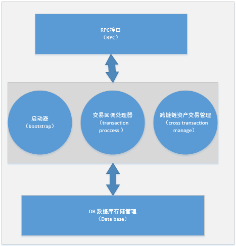
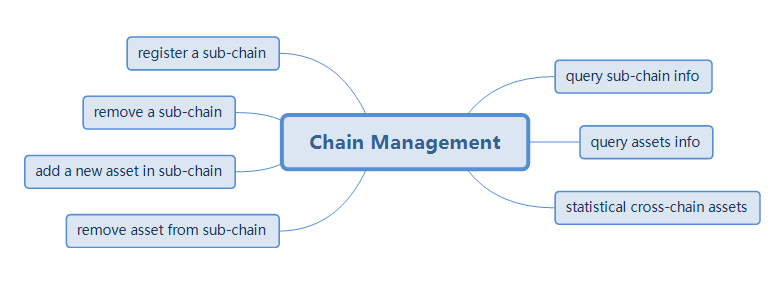
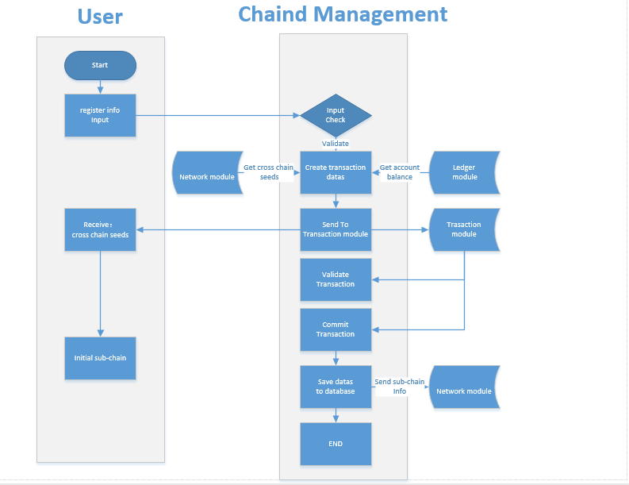
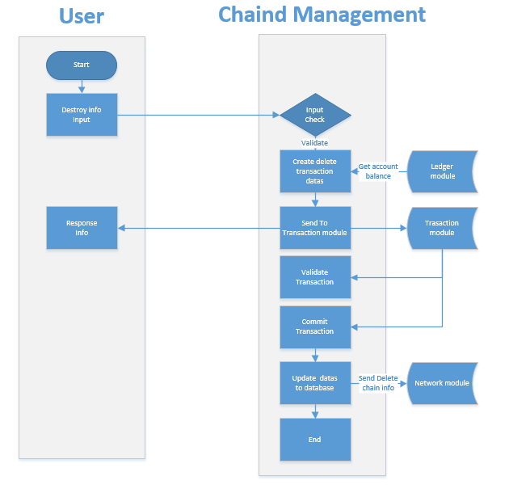
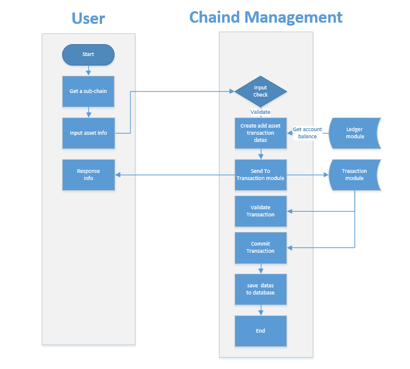
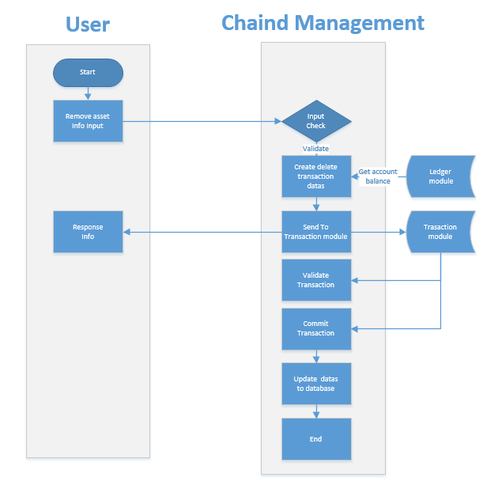

# Chain Management Module Design Document

## Overall description

### 1.1 Module Overview

#### 1.1.1 Why should I have the "chain management" module?

[^Description]: Reasons for the existence of the module

In nuls 1.0, there is only one chain (nuls main network), so no chain management module is needed.

In nuls 2.0, the nuls main network can register other parallel chain information, including: 

- Chains in the nuls ecosystem: Derived from the same set of code as the nuls main network.
- Other chains: Bitcoin, Ethereum, etc.

The Chain Management module is used to manage all parallel links to the nuls main network.


Glossary:

- nuls main network: The architecture is different from nuls 1.0, which is another chain that runs independently, also known as nuls 2.0.
  "Chain Management" is one of the modules of the nuls main network.
- Parallel chain: other chains registered on the nuls main network


Hypothesis 1: Parallel chain a, which owns assets a

Hypothesis 2: Parallel chain b, which owns asset b

- Cross-chain trading:
  - Parallel chain a turns asset a to parallel chain b
  - Parallel chain b internal transfer of assets a
  - Parallel chain b turns asset a back to parallel chain a
  - Parallel chain b transfers asset a to other parallel chains (c, d, etc.)
- Non-chain trades:
  - Parallel chain a internal transfer of assets a
  - Parallel chain b internal transfer of assets b

Remarks: Regardless of the assets in the chain or the assets outside the chain, as long as the assets are traded across the chain, the main network needs to be confirmed.


#### 1.1.2 What to do with "Chain Management"

[^Description]: What does the module do and what it aims to achieve, the goal is to let non-technical personnel know what to do

The Chain Management module is used to manage the basic information of the chain that joins the nuls main network, including:

* Register a new parallel chain
* Destroy existing parallel chains
* Query parallel chain information
* Parallel chain increases asset type
* Parallel chain destruction asset type
* Cross-chain asset verification


#### 1.1.3 "Chain Management" positioning in the system

[^Description]: The positioning of the module in the system, what role, which modules to rely on, what can be done, what can be used to do

The module that Chain Management relies heavily on:

- Core module
- Network module
- Transaction management module
- Account module

"chain management" weakly dependent modules:

- Event bus module


### 1.2 Module internal architecture diagram

[^Description]: Graphic description module hierarchy, component relationship, and description by text




## Functional design

### 2.1 Functional Architecture

[^Description]: Describes the functional design of the module, which can have a hierarchical relationship, which can be displayed in the form of a graphic and illustrated with text.



### 2.2 Module Service

[^Description]: Here, which services are provided by the module, the function description of each service, the process description, and the external services depended on the implementation of the interface definition.

#### 2.2.1 Registering a new chain

* Function Description:

  The nuls main network will provide an entry (web page) through which you can register a new parallel link to the nuls main network.

  Registering a parallel chain must contain a registered asset.

* Process description


  

Step description:

   1. The user registers the registration chain information with the terminal and the asset information initialized with the chain.

   2. The chain management module performs the encapsulation of the chain transaction and sends it to the transaction module.During the period, you need to obtain account balance and transaction nonce value through the ledger module.

And verify the correctness of the account through the account module.

After the transaction is sent, the success or failure information is returned to the user. When successful, the information includes the main network cross-chain seed node and the primary network seed certifier list information.

   3. The trading module will perform a callback of the data check during the transaction process.

   4. The chain management module performs registration data submission through the transaction module callback "commit chain registration transaction" interface.

   5. The chain management module stores the data and sends the registration information to the network module and the cross-chain protocol module.

   6. The registration chain requires 1000nuls, of which 20% is directly destroyed, 80% is used for mortgages, and is returned when assets are deleted.

- Interface definition

  - Interface Description

  Register friendchain information with the chain management module.

          method : cm_chainReg

  - Request example

  ```
  {
          "chainId": 152,
          "assetId": 2,
          "chainName": "nuls chain",
          "addressType": "1",
          "magicNumber":454546,
          "supportInflowAsset":"1",
          "minAvailableNodeNum":5,
          "singleNodeMinConnectionNum":5,
          "txConfirmedBlockNum":30,
          "address":"NsdxSexqXF4eVXkcGLPpZCPKo92A8xpp",
          "assetId":85,
          "symbol":"NULS",
          "assetName": "NAS",
          "initNumber":"1000000000",
          "decimalPlaces":8,
          "password":"xxxxxxxxxxxxx"
          
  }
  ```
  - Request parameter description

  | parameter           | required | type   | description            |
  | :------------------ | :------- | :----- | ---------------------- |
  | chainId | true | int | Chain Identification |
  | assetId | true | int | asset id |
  | chainName | true | string | chain name|
  | magicNumber | true | string | Network Magic Parameters |
  minAvailableNodeNum | false | int | minimum number of available nodes |
  | addressPrefix | true | String | Address Prefix |
  | txConfirmBlockNum | false | int | Transaction Confirmation Blocks |
  | maxSignatureCount | true | int | Maximum Signatures |
  | signatureBFTRatio | true | int | Byzantine ratio [67-100] |
  | verifierList | true | String | Initial Authenticator List for the Registration Chain |
  | symbol | true | string | Asset Symbol |
  | assetName | true | string | asset name|
  | initNumber | true | string | Asset Initial Value |
  | decimalPlaces | true | int | Minimum Assets Separable Digits |
  | address | true | string | create the primary network address of the chain |
  | password | true | string | password for private key |

  - Return to example

     Failed

     ```
     Unified rpc standard format
     
     ```

     Success

     ```
     Unified rpc standard format
     {
       "mainNetVerifierSeeds" : "tNULSeBaMkrt4z9FYEkkR9D6choPVvQr94oYZp",
       "txHash" : "25b3a57507086d5d895895b41ef744a160f3251f4e5db118b7ca833eb6c9fff3",
       "mainNetCrossConnectSeeds" : "192.168.1.192:8088"
     }
     ```

  - Return field description

  | parameter                | type   | description           |
  | ------------------------ | ------ | --------------------- |
  | mainNetVerifierSeeds | String | #主网认证者列表|
  TxHash String hash Trading
  | mainNetCrossConnectSeeds | String | #main network cross-chain seed connection node|


* Dependent service

  [^Description]: What are the services that the text description depends on, and what to do

  - Network Management Module
  - Transaction management module, send transaction
  - Book module to obtain account information
  - Account module


#### 2.2.2 Unregistering existing parallel chains

- Function Description:

  The nuls main network will provide an entry (web page) through which you can log out existing friends.

- Process description

  


1. The chain is created with the asset, so the logout chain must be checked for assets. Only the last asset will be deleted and the chain will be logged off.

 2. Conditions for determining whether to allow cancellation:

Assets and chains exist.

There is only one last asset with the chain.

Chain assets have n% of assets in their own main chain. 

 3. The chain management module performs the encapsulation of the chain transaction and sends it to the transaction module.

During the period, you need to obtain the account balance and the transaction nonce value through the ledger module.

 4. The transaction module will perform a data verification callback during the transaction processing.

 5. The chain management module performs the logout data submission by the transaction module callback "commit chain cancellation transaction" interface.

 6. The chain management module stores the data and sends the registration information to the network module.

 7. Deleting the chain with the cancelled assets will return 80% of the mortgage deposit.

- Interface definition

  - Interface Description

  The friend chain information is logged out to the chain management module (the asset logout interface is called because the chain is logged off with the last asset).

          method : cm_assetDisable

  - Request example

  ```
  {
          "chainId": 152,
          "assetId": 45,
          "address":"NsdxSexqXF4eVXkcGLPpZCPKo92A8xpp",
          "password":"xxxxxxxxxxxxx"
          
  }
  ```

  - Request parameter description

  | parameter | required | type   | description          |
  | :-------- | :------- | :----- | -------------------- |
  | chainId | true | int | Chain Identification |
  | assetId | true | int | asset id |
  | address | true | string | Create the main network account address of the chain |
  | password | true | string | password for private key |

  - Return to example

    Failed

    ```
    Unified rpc standard format
    
    ```

    Success

    ```
    Unified rpc standard format
    {
        "txHash" : "25b3a57507086d5d895895b41ef744a160f3251f4e5db118b7ca833eb6c9fff3"
    }
    ```

  - Return field description

  | parameter | type   | description |
  | --------- | ------ | ----------- |
  | txHash | String | Trading hash |

- Dependent service

  [^Description]: What are the services that the text description depends on, and what to do

  - Network Management Module
  - Transaction management module, send transaction
  - Book module, checkbook information

#### 2.2.3 Adding asset information

- Function Description:

  The nuls main network will provide an entry (web page) through which to select the chain and register assets.

- Process description




Step description:

   1. The user enters the asset information through the terminal selection chain and the chain: whether the assets overlap.

   2. The chain management module performs the encapsulation of the chain transaction and sends it to the transaction module.

During the period, you need to obtain the account balance and the transaction nonce value through the ledger module.

   3. The trading module will perform a callback of the data check during the transaction process. 

   4. The chain management module performs registration data submission through the transaction module callback "commit asset registration transaction" interface.

   5. Registered assets receive 1000nuls, 20% of which are directly destroyed, 80% used for mortgage, and returned when assets are deleted.

- Interface definition

  - Interface Description

  Register asset information with the chain management module.

          method : cm_assetReg

  - Request example

  ```
  {
          "chainId": 152,
          "assetId":85,
          "symbol":"NULS",
          "assetName": "NAS",
          "initNumber":"1000000000",
          "decimalPlaces":8,
           "address":"NsdxSexqXF4eVXkcGLPpZCPKo92A8xpp",
          "password":"xxxxxxxxxxxxx"
          
  }
  ```

  - Request parameter description

  | parameter     | required | type   | description        |
  | :------------ | :------- | :----- | ------------------ |
  | chainId | true | int | Chain Identification |
  | symbol | true | string | Asset Symbol |
  | assetName | true | string | asset name|
  | initNumber | true | string | Asset Initial Value |
  | decimalPlaces | true | int | Minimum Assets Separable Digits |
  | address | true | string | create the primary network address of the chain |
  | password | true | string | password for private key |

  - Return to example

    Failed

    ```
    Unified rpc standard format
    ```

    Success

    ```
    Unified rpc standard format
    {
        "txHash" : "25b3a57507086d5d895895b41ef744a160f3251f4e5db118b7ca833eb6c9fff3"
    }
    ```

  - Return field description

  | parameter | type   | description |
  | --------- | ------ | ----------- |
  | txHash | String | Trading hash |


- Dependent service

  [^Description]: What are the services that the text description depends on, and what to do

  - Transaction management module, send transaction
  - Book module to obtain account information
  - Account module verification


#### 2.2.4 Parallel chain asset write-off

- Function Description:

  The nuls main network will provide an entry (web page) through which the asset can be destroyed for the specified friend chain.

- Process description

  

  1. When there are multiple assets registered, the single asset is allowed to be written off. If there is only one asset, the asset is written off along with the chain.

     2. Conditions for determining whether to allow cancellation:

  There are multiple assets in the chain.

  Chain assets have n% of assets in their own main chain. 

   3. The chain management module performs the encapsulation of the chain transaction and sends it to the transaction module.

  During the period, you need to obtain the account balance and the transaction nonce value through the ledger module.

   4. The transaction module will perform a data verification callback during the transaction processing.

   5. The chain management module performs the logout data submission by the transaction module callback "commit chain cancellation transaction" interface.

   6. The cancellation of the assets will be refunded 80% of the mortgage deposit.

- Interface definition

  - Interface Description

  Log out the asset information to the chain management module.

          method : cm_assetDisable

  - Request example

  ```
  {
          "chainId": 152,
          "assetId": 45,
          "address":"NsdxSexqXF4eVXkcGLPpZCPKo92A8xpp",
          "password":"xxxxxxxxxxxxx"
          
  }
  ```

  - Request parameter description

  | parameter | required | type   | description          |
  | :-------- | :------- | :----- | -------------------- |
  | chainId | true | int | Chain Identification |
  | assetId | true | int | asset id |
  | address | true | string | Create the main network account address of the chain |
  | password | true | string | password for private key |

  - Return to example

    Failed

    ```
    Unified rpc standard format
    
    ```

    Success

    ```
    Unified rpc standard format
    {
        "txHash" : "25b3a57507086d5d895895b41ef744a160f3251f4e5db118b7ca833eb6c9fff3"
    }
    ```

  - Return field description

  | parameter | type | description |
  | --------- | ---- | ----------- |
  | txHash    |      |             |


  - Dependent service

    [^Description]: What are the services that the text description depends on, and what to do

    - Transaction management module, send transaction
    - Book module, checkbook information

#### 2.2.5 Chain asset verification for cross-chain transactions

- Function Description:

  When the transaction module generates a cross-chain transaction, the interface is called to perform cross-chain asset verification.

- Process description

  1. Check chain and assets are registered normally in the cross-chain module
  2. Verify that the amount of assets on the chain is overdrawn.
  3. Verify that the asset status is normal.

- Interface definition

  - Interface Description

  Submit verification to chain management when cross-chain assets are in circulation

          method : cm_assetCirculateValidator

  - Request example

  ```
  {
          "chainId": 12345,   
          "txHex": "FFAABB214324"       
  }
  ```

  - Request parameter description

  | parameter | required | type   | description |
  | :-------- | :------- | :----- | ----------- |
  | chainId | true | int | chain id |
  | txHex | true | String | Transaction HEX Value |

  - Return to example

    Failed

    ```
    Unified rpc standard format
    
    ```

    Success

    ```
    Unified rpc standard format
    {
        "value":true
    }
    
    ```

  - Return field description

  | parameter | type | description |
  | --------- | ---- | ----------- |
  |           |      |             |


- Dependent service

  [^Description]: What are the services that the text description depends on, and what to do

  - Transaction management module, cross-chain transaction check call

#### 2.2.6 Chain asset submission for cross-chain trading

- Function Description:

  When a block submission is made through a verified transaction, the trading module will assemble and cross-chain transactions to the cross-chain management module.

  Used to change chain assets and used for the management of chain assets.

- Process description

  1. Call the cm_assetCirculateCommit interface directly

- Interface definition

  - Interface Description

  When the cross-chain asset is circulated, the transaction can be submitted to the chain management when the verification is passed and the confirmation is submitted.

          method : cm_assetCirculateCommit

  - Request example

  ```
  {
          "chainId":12345,
          "txHexList": "[FFAABB214324,FFAABB214324]" ，
           "blockHeaderDigest": "FFAABB214324"
  }
  ```

  - Request parameter description

  | parameter         | required | type  | description |
  | :---------------- | :------- | :---- | ----------- |
  | chainId | true | int | chain id |
  | txHexList | true | array | HEX value of the transaction |
  | blockHeaderDigest | true | array | Block Header Information |

  - Return to example

    Failed

    ```
    Unified rpc standard format
    
    ```

    Success

    ```
    Unified rpc standard format
    {
        "value":true
    }
    ```

  - Return field description

  | parameter | type | description |
  | --------- | ---- | ----------- |
  |           |      |             |


- Dependent service

  [^Description]: What are the services that the text description depends on, and what to do

  - Transaction management module, cross-chain trading call

  #### 2.2.7 Chain asset rollback for cross-chain trading

  - Function Description:

    Used for block transaction rollback

  - Process description

    1. Call the cm_assetCirculateRollBack interface directly

  - Interface definition

    - Interface Description

                method : cm_assetCirculateRollBack

    - Request example

    ```
    {
            "chainId":12345,
            "txHexList": "[FFAABB214324,FFAABB214324]" ，
             "blockHeaderDigest": "FFAABB214324" 
    }
    ```

    - Request parameter description

    | parameter         | required | type  | description   |
    | :---------------- | :------- | :---- | ------------- |
    | chainId | true | int | chain id |
    | txHexList | true | array | HEX List of Transactions |
    | blockHeaderDigest | true | array | Block Header Information |

    - Return to example

    - Failed

      ```
      Unified rpc standard format
      
      ```

      Success

      ```
      Unified rpc standard format
      {
          "value":true
      }
      ```

    - Return field description

    | parameter | type | description |
    | --------- | ---- | ----------- |
    |           |      |             |

  

  - Dependent service

    [^Description]: What are the services that the text description depends on, and what to do

    - Transaction management module, cross-chain trading call

#### 2.2.8 Registration of chain management transaction processing functions

- Function Description:

  When the module is started, registration of the transaction callback function is required, so that the transaction module performs callback processing when performing related type transaction processing.

  The registration function is divided into 4 categories: 1> Transaction Verification 2> Transaction Submission 3> Transaction Rollback 4> Module Bulk Transaction Verification in One Block

- Process description

  1. Chain management module starts
  2. Determine whether the transaction module rpc call status is accessible.
  3. Submit the callback interface

- Interface definition

  See the "Registering a Transaction" section in the Transaction Module Design Document.

- Dependent service

  [^Description]: What are the services that the text description depends on, and what to do

  - Transaction management module

#### 2.2.9 Query chain information

- Function Description:

  Query registration chain information

- Process description

No

- Interface definition

  - Interface Description

  Query the registration friend chain information.

          method : cm_chain

  - Request example

  ```
  {
     "chainId":4545 
  }
  ```

  - Request parameter description

  | parameter | required | type | description |
  | :-------- | :------- | :--- | ----------- |
  | chainId | true | int | Chain Identification |

  - Return to example

    Failed

    ```
    Unified rpc standard format
    
    ```

    Success

    ```
     {
      "chainId" : 3,
      "chainName" : "testchain",
      "addressType" : "1",
      "addressPrefix" : "TBTC",
      "magicNumber" : 123456,
      "minAvailableNodeNum" : 5,
      "txConfirmedBlockNum" : 0,
      "regAddress" : "tNULSeBaMnrs6JKrCy6TQdzYJZkMZJDng7QAsD",
      "regTxHash" : "6c29d99c2b02cfc766ef25bee2ea619610a5fce1d778c3038885111f590ae312",
      "createTime" : 1557739548367,
      "verifierList" : [ "TBTCdusmPf5EfdEwbA8nRZEYqMbRXKp6y3oCb" ],
      "signatureByzantineRatio" : 67,
      "maxSignatureCount" : 12,
      "selfAssetKeyList" : [ "3-10" ],
      "totalAssetKeyList" : [ "3-10" ]，
      "mainNetVerifierSeeds" : "tNULSeBaMkrt4z9FYEkkR9D6choPVvQr94oYZp",
      "mainNetCrossConnectSeeds" : "192.168.1.192:8088",
      "enable" : true
    }
    ```

  - Return parameter description

    | parameter                | required | type   | description                                |
    | ------------------------ | -------- | ------ | ------------------------------------------ |
    | chainId | true | int | Chain Identification |
    | assetId | true | int | asset id |
    | chainName | true | string | chain name|
    | addressType | true | int | The address type of the account created on the chain: 1 within the ecological 2 non-ecological |
    | addressPrefix | true | string | address prefix 1-5 uppercase letters or numbers |
    | magicNumber | true | string | Network Magic Parameters |
    minAvailableNodeNum | true | int | Minimum number of available nodes |
    | txConfirmBlockNum | true | int | Transaction Confirmation Blocks |
    | regAddress | true | string | Registered Payment Address |
    | regTxHash | true | string | transaction hash |
    | createTime | true | long | Transaction submission time, 1970 seconds difference |
    | verifierList | true | string | Authenticator List |
    | signatureByzantineRatio | true | int | Byzantine ratio [67-100] |
    | maxSignatureCount | true | int | Maximum Signatures |
    | symbol | true | string | Asset Symbol |
    | assetName | true | string | asset name|
    | initNumber | true | string | Asset Initial Value |
    | decimalPlaces | true | int | Minimum Assets Separable Digits |
    | mainNetVerifierSeeds | true | string | main network seed certifier address |
    | mainNetCrossConnectSeeds | true | string | Primary Network Seed Connection Node Address |
    | enable | true | string | Whether in use|

    


- Dependent service

   no

#### 2.2.10 Querying asset information under the chain

- Function Description:

  Query information about a chain asset.

- Process description

No

- Interface definition

  - Interface Description

  Query the asset management module for an asset information.

          method : cm_asset

  - Request example

  ```
  {
     "chainId":4545， 
     "assetId":45
  }
  ```

  - Request parameter description

  | parameter | required | type | description |
  | :-------- | :------- | :--- | ----------- |
  | chainId | true | int | Chain Identification |
  | assetId | true | int | asset id |

  - Return to example

    Failed

    ```
    Unified rpc standard format
    
    ```

    Success

    ```
     {
      "chainId" : 10,
      "assetId" : 2,
      "symbol" : "CCY",
      "assetName" : "yuer",
      "depositNuls" : "100000000000",
      "destroyNuls" : "20000000000",
      "initNumber" : "30000000000",
      "decimalPlaces" : 2,
      "enable" : false,
      "createTime" : 1565229429,
      "address" : "tNULSeBaMqywZjfSrKNQKBfuQtVxAHBQ8rB2Zn",
      "txHash" : "612eda872c6ca16c5a5f63cce70a64ac15852e2b3a403309b0d963d22d6391bc"
    }
    ```

  - Return field description

    | parameter     | required | type    | description                  |
    | ------------- | -------- | ------- | ---------------------------- |
    | chainId | true | int | Chain Identification |
    | assetId | true | int | asset id |
    | &lt;symbol> | true | string | Asset abbreviation eg BTC |
    | assetName | true | string | asset name|
    | depositNuls | true | long | Number of mortgaged main network assets |
    | destroyNuls | true | long | Number of primary network assets destroyed |
    | initNumber | true | string | Asset Initial Value |
    | decimalPlaces | true | int | Asset Cuts |
    | enable | true | boolean | Is available true available, false disabled |
    | createTime | true | long | Transaction time |
    | address | true | String | Transaction Payment Address |
    | txHash | true | String | Trading hash |

- Dependent service

   no

##  Event description

[^Description]: Try to avoid communication by using events in business processes

* Chain registration event
* Chain logout event
* Add asset event
* Write off asset events


##  Agreement

### 4.1 Network Communication Protocol

 no


### 4.2 Trading Agreement

##### 4.2.1 Registering a new friend chain

Compared with the general transaction, only the type and txData are different, the specific difference is as follows

Transaction type definition: 10101

txData definition

| Length | Fields                  | Type       | Remark           |
| ------ | ----------------------- | ---------- | ---------------- |
| 2 | chainId | uint16 | Chain Id |
| ? | name | byte[] | Chain Name|
| 1 | addressType | uint8 | Address Type |
| 5 | addressPrefix | byte[] | Address Prefix |
| 4 | magicNumber | uint32 | Magic Parameters |
| 1 | supportInflowAsset | uint8 | Whether to spend asset inflows |
| 2 | minAvailableNodeNum | uint16 | Minimum Available Nodes |
| ? | verifierList | byte[] | Authenticator List |
| 2 | signatureByzantineRatio | uint16 | Byzantine Proportion|
| 2 | maxSignatureCount | uint16 | Maximum Signatures |
| ? | address | byte[] | Account Address|
| 2 | assetId | uint16 | Asset id |
| ? | symbol | byte[] | Unit |
| ? | assetName | byte[] | Asset Name|
| 2 | depositNuls | uint16 | Mortgage NULS Quantity |
| 48 | initNumber | Biginteger | Initial Assets |
| 1 | decimalPlaces | uint8 | Minimum Split Number of Assets |


##### 4.2.2 Unregistering existing friends 

  Compared with the general transaction, only the type and txData are different, the specific difference is as follows

  Transaction type definition: 10102

  txData definition: same as 4.2.1 chain registration transaction


##### 4.2.3 Adding a friend chain asset

Compared with the general transaction, only the type and txData are different, the specific difference is as follows

Transaction type definition: 10103

txData definition:

| Length | Fields        | Type       | Remark           |
| ------ | ------------- | ---------- | ---------------- |
| 2 | chainId | uint16 | Chain Id |
| 2 | assetId | uint16 | Asset id |
| ? | symbol | byte[] | Unit |
| ? | assetName | byte[] | Asset Name|
| 2 | depositNuls | uint16 | Mortgage NULS Quantity |
| 48 | initNumber | Biginteger | Initial Assets |
| 1 | decimalPlaces | uint8 | Minimum Split Number of Assets |
| ? | address | byte[] | Account Address|

##### 4.2.2 Unregistering existing assets 

  Compared with the general transaction, only the type and txData are different, the specific difference is as follows

  Transaction type definition: 10104

  txData definition: new transaction with 4.2.3 asset


##  Module Configuration

[^Description]: This module must have configuration items

```
[system]
language = en
encoding = UTF-8

[db]
rocksdb.datapath = ../data

[param]
asset_symbol_max = 5
asset_name_max = 20
asset_depositNuls = 200000
asset_depositNuls_destroy_rate = 0.2
asset_depositNuls_lock_rate = 0.8
asset_initNumber_min = 10000
asset_initNumber_max = 100000000
asset_decimalPlaces_min = 4
asset_decimalPlaces_max = 8
asset_recovery_rate = 0.9

[defaultAsset]
nuls_chain_id = 8964
nuls_chain_name = nuls chain
nuls_asset_id = 1
nuls_asset_initNumber_max = 100000000
nuls_asset_symbol = NULS
```


##  Java-specific design

[^Description]: Core object class definition, storage data structure, ...

##  Supplementary content

[^Description]: Required content not covered above

