 # Network module design document

## Overall description

### 1.1 Module Overview

#### 1.1.1 Why do you have a Network Module?

The network module guarantees the communication between the decentralized nodes and provides the lowest level of network communication, node discovery and other services for one of the NULS basic modules.The network foundation of the blockchain is Peer to Peer, or P2P.All participants in the P2P network can be either a service server or a resource user.Features of P2P networks: decentralization, scalability, robustness, cost-effectiveness, privacy protection, and load balancing.

#### 1.1.2 What to do with Network Module

The network module is the basic module of the entire system, which is used to manage the connection between nodes, nodes and connections, and the transmission and reception of data.Network modules do not involve complex business logic.

* Received network messages, according to the instruction service mapping relationship in the kernel module, push the corresponding processing module of the message.

* The open interface is used to push the message calls encapsulated by other modules to the specified peer node and broadcast to the specified network group.


#### 1.1.3 Positioning of the Network Module in the system

* The network module is the underlying application module. Any module that needs network communication must send and receive messages through the network module.
* The network module relies on the core module for governance of the service interface.
* The network module builds different networks by network id (magic parameter).
* When the nodes of the network module in the main network chain are configured for cross-chain networking, the chain management module is required to provide cross-chain configuration information.
* When a node in a parallel chain of a network module is configured for a cross-chain network, cross-chain configuration information is required for the cross-chain module.

### 1.2 Architecture


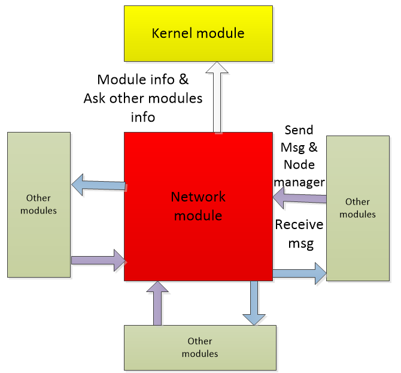


## Functional design

### 2.1 Functional Architecture

   The network module has functions in the business: node management, node group management, p2p network connection management, and message transmission and management.

   The internal infrastructure functions include: state management of the module (including startup and shutdown management), and management of external interfaces.

  Thread task management, data storage management, etc.

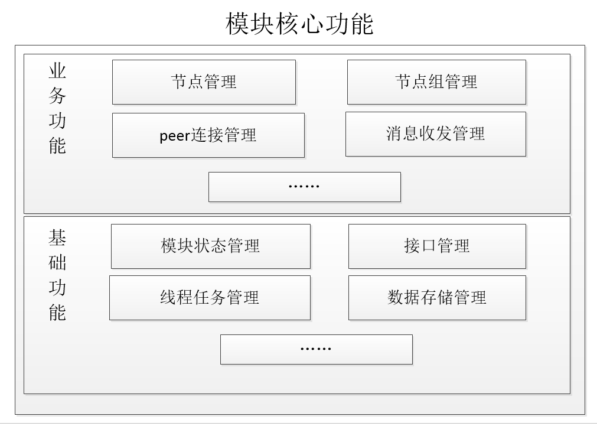

- Node management 

  Manage all connectable, connected node information, status, and provide node operation interfaces

  - Node discovery
  - Node storage

- Node Group Management

  Manage different network nodes, divide nodes into different collections, and manage each collection separately.The magic parameters of the nodes connected in each set are the same and different from the magic parameters of other sets.

  Each NodeGroup is initialized according to the information registered in the chain or the network information configured by itself (magic parameters, number of nodes, etc.)

  Each time a NodeGroup is initialized, the network service listens for a MagicNumber.

- Connector Management Connection management

  - Initialize the connection
    - Intra-chain node: Initially connect through the seed node, request the peer address through the protocol or receive the shared peer address, and then cache.
    - Cross-chain nodes: The primary network passively waits for the connection of parallel chain nodes.
  - Connection management: Need to perform node availability detection, heartbeat maintenance, and disconnect the seed node when there are redundant nodes available.
  - Disconnect

- Messaging management

  1>Message receiving Message receiver

  Receiving the message sent by the network node, judging the message (determining cmd), and transparently transmitting the message to the corresponding module service according to the message cmd field.

2> Message Sending Message sender

a> Broadcast messages to the network group (NodeGroup)

b> Specify the peer node to send messages

- Module status management

  a> start, close the logic processing

b>Maintenance and management of the status of its own module: management module operation status, internal function status, etc.

        

- Interface management

  a>Register your own interface to the NUSTAR module

  b> Synchronize module information and status to the NUSTAR module 

  c>Get the service list to the local module

  d> open external interface call

- Thread task management

  a>Manage heartbeat threads

  b> management node discovery / elimination mechanism thread

  

### 2.2 Module Service

#### 2.2.1 Network Message Reception

* Function Description:

    Receiving the message sent by the (external) network node, making a simple judgment on the message (determining the magic parameter), and sending the message to the module service of interest according to the command field contained in the message header.

* Process description

  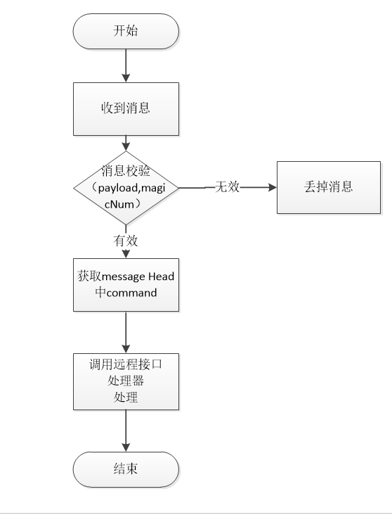

* Message verification part:

Payload check

magicNumber check

* Interface parameter constraints provided by external modules

   - method : *** // Same CMD instruction in the message header, constraining 12 bytes

   - params

```
    0: chainId //chain id
    1:nodeId //nodeId
    2: message // hexadecimal network sequence message body
    ......
```

- Dependent service

Parsing the command parameter in the message header, relying on the remote service interface data provided by the kernel module when calling the remote interface processing.

#### 2.2.2 Network Message Sending

Forwards messages encapsulated by other or own modules, including broadcast messages and designated nodes to send messages.

##### 2.2.2.1, Broadcast Network Message

Function Description:

   Forwarding messages encapsulated by other or own modules, the interface that provides forwarding calls to external modules has the following two cases:

  a> Broadcast a message to a NodeGroup (specify a network).

  b> Broadcast messages to the NodeGroup (specify a network) and exclude certain nodes.

  c> Broadcast a message to the NodeGroup (specify a network) in a specified proportion and exclude certain nodes.

- Process description


  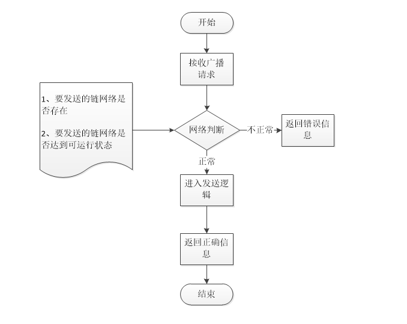

- Interface definition

  - Interface Description

    method : nw_broadcast

    External modules can broadcast messages through this interface

  - Request example

    ```
    {
       "chainId":1234，
       "excludeNodes": "10.13.25.36:5003,20.30.25.65:8009",
       "messageBody":     "03847ABDFF303847ABDFF303847ABDFF303847ABDFF303847ABDFF303847ABDFF3"，
       "command":"block"，
       "isCross":"false"，
       "percent":"50"，
        }
    ```

  - Request parameter description

    | index | parameter    | required | type    |         description         |
    | ----- | ------------ | -------- | ------- | :-------------------------: |
    | 0 | chainId | true | int |
    | 1 | excludeNodes | true | String | Exclude nodes, comma split |
    | 2 | messageBody | true | String | Object hexadecimal characters |
    | 3 | command | true | String | Message Protocol Instructions |
    | 4 | isCross | true | boolean | Whether it is a cross-chain |
    | 5 | percent | false | int | Broadcast transmission ratio, do not fill, default 100 |

  - Return to example

    Failed

    ```
    {
       "version": 1.2,
        "code":1,
        "msg" :"xxxxxxxxxxxxxxxxxx",
        "result":{
            "value":false
        }
    }
    ```

    Success

    ```
    {
     "version": 1.2,
        "code":0,
        "result":{
           "value":true
        }
    }
    ```


- Dependent service

  no

##### 2.2.2.2, the specified node sends a network message

Function Description:

Forwarding messages encapsulated by other or own modules, you can specify that certain nodes (which can be 1 node) send messages.

- Process description

  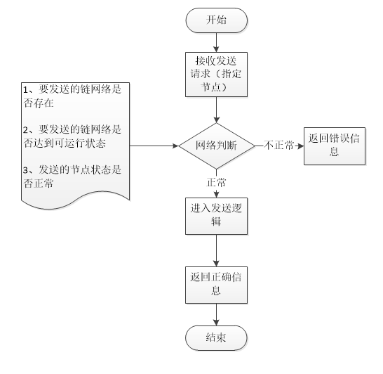

- Interface definition

  - Interface Description

    External modules can broadcast messages through this interface

    method : nw_sendPeersMsg

  ```
  @Parameter(parameterName = "chainId", requestType = @TypeDescriptor(value = int.class), parameterValidRange = "[1-65535]", parameterDes = "linked chain Id, value range [1-65535]"),
  @Parameter(parameterName = "nodes", requestType = @TypeDescriptor(value = String.class), parameterDes = "specify the send peer node Id, a comma-separated string"),
  @Parameter(parameterName = "messageBody", requestType = @TypeDescriptor(value = String.class), parameterDes = "message body Hex"),
  @Parameter(parameterName = "command", requestType = @TypeDescriptor(value = String.class), parameterDes = "message protocol directive")
  ```

  

  - Request example

    ```
    {
    "chainId":  1234，
    "nodes":  "10.13.25.36:5003,20.30.25.65:8009",
    "messageBody":"03847ABDFF303847ABDFF303847ABDFF303847ABDFF303847ABDFF303847ABDFF3"，
    "command":  "block"
        }
    ```

  - Request parameter description

    | index | parameter   | required | type   |    description    |
    | ----- | ----------- | -------- | ------ | :---------------: |
    | 0 | chainId | true | int |
    | 1 | nodes | true | String | Send node, comma split |
    | 2 | messageBody | true | String | hexadecimal characters |
    | | command | true | String |

  - Return to example

    Failed

    ```
    {
       "version": 1.2,
        "code":1,
        "msg" :"xxxxxxxxxxxxxxxxxx",
        "result":{}
    }
    ```

    Success

    ```
    {
     "version": 1.2,
        "code":0,
        "result":{
           
        }
    }
    ```

  - Return field description

    | parameter | type | description |
    | --------- | ---- | ----------- |
    |           |      |             |

- Dependent service

  no

#### 2.2.3 Creating a Node Group

In addition to its own network, the main network chain also has n cross-chain networks, and its own network and cross-chain network use different magicNumber.

In addition to its own network, the parallel chain can also register the cross-chain network on the main network, and its own network and the cross-chain network use the same magicNumber.

Node groups are used to manage different network information.The network module isolates and maintains different networks through node groups.

Node group type: 1> own network 2> cross-chain network (main network chain cross-chain network & parallel chain cross-chain network)

Create a node group for the network module:

1> The own configuration file is loaded to create its own network group.

2> Cross-chain network:

As the main network link node, after the parallel chain registers with the chain management module, the system generates a transaction verification confirmation and then calls the network module to generate a cross-chain network group, and then stores the configuration, and the subsequent modules start automatic loading.

As a parallel chain node, when started by the cross-chain protocol module, the cross-chain protocol module obtains cross-chain configuration information from the module configuration, and invokes the network module.

The network module triggers a cross-chain connection.

##### 2.2.3.1 Creating a Node Group from Your Own Network

- Function Description:

    The own network corresponds to its own chainId, and a magic parameter, through the configuration initialization to create a node group

* Process description

   Create a node group by configuration file loading

* Interface definition

Created internally, no external interface.

- Dependent service

No

##### 2.2.3.2 Creating a cross-chain node group

- Function Description:

  The cross-chain node group on the main network chain is triggered by the parallel chain registration in the main network chain.The parallel chain obtains cross-chain configuration information, and the cross-chain status of the own network group is updated by the cross-chain protocol.

* Process description

  1> The main network chain is triggered by the chain management module to trigger the creation of a cross-link node group.

  2> Parallel chains update the cross-chain status of their own network groups through the cross-chain protocol module.

 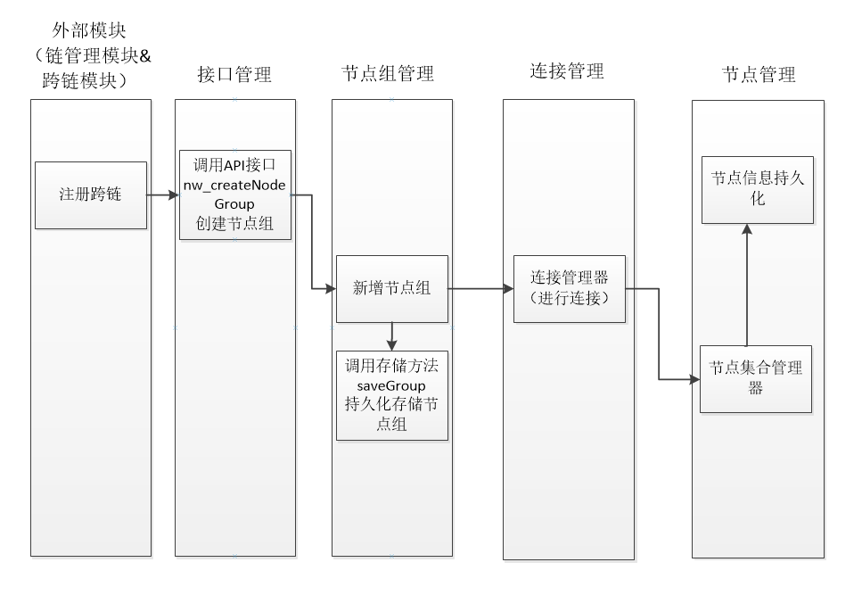

* Interface definition

  - Interface Description

    Receive a call to an external module to create a node group

    method : nw_createNodeGroup

  - Request example

    ```
    {
          "chainId":  1234,
          "magicNumber": 232342,
          "maxOut":  10,
          "maxIn":  100,
          "minAvailableCount":  20，
          "seedIps":  "10.20.30.10:8002,48.25.32.12:8003,52.23.25.32:9003",
          "isCrossGroup":  0
        }
    ```

  - Request parameter description

    | index | parameter         | required | type    |                   description                    |
    | ----- | ----------------- | -------- | ------- | :----------------------------------------------: |
    | 0 | chainId | true | int |
    | 1 | magicNumber | true | long | Magic Parameters |
    | 2 | maxOut | true | int | Maximum active connections |
    | 3 | maxIn | true | int | Maximum Passive Connections |
    | 4 | minAvailableCount | true | int | Minimum number of connections in the friend chain |
    | 5 | seedIps | true | String | seed node, comma split |
    | 6 | isMoonNode | true | boolean | Whether to create a cross-chain connection group: true cross-chain connection, false normal connection |

  - Return to example

    Failed

    ```
    {
       "version": 1.2,
        "code":1,
        "msg" :"xxxxxxxxxxxxxxxxxx",
        "result":{}
    }
    ```

    Success

    ```
    {
     "version": 1.2,
        "code":0,
        "result":{
           
        }
    }
    ```

  - Return field description

    | parameter | type | description |
    | --------- | ---- | ----------- |
    |           |      |             |


- Dependent service

Relies on remote service interface data provided by the kernel module.

     

#### 2.2.4 Logging out the node group

- Function Description:

  Receive calls from external modules, unregistering cross-chain node groups.

  As the main network link node, the chain management module performs deregistration, and the system generates a transaction verification confirmation and then calls it.

- Process description

   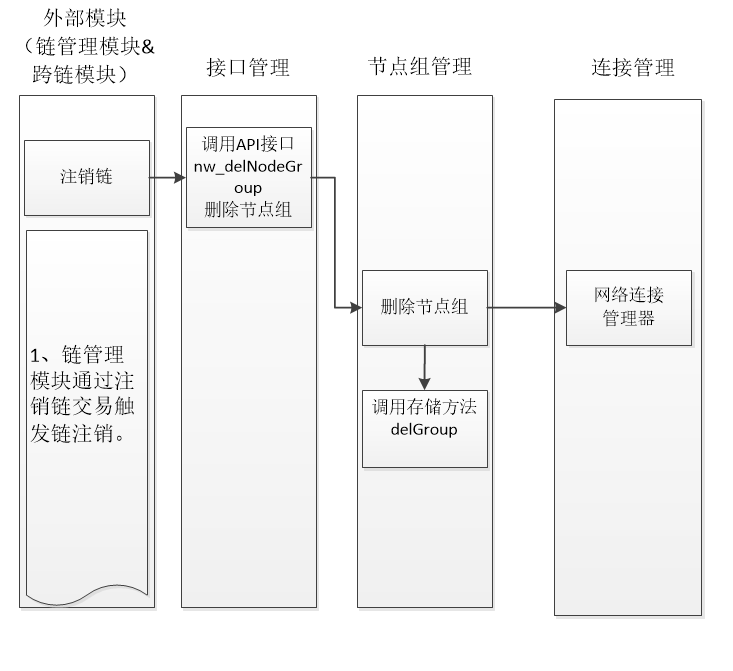

- Interface definition

  - Interface Description

    Receive calls from external modules, delete node groups

    method : nw_delNodeGroup

  - Request example

    ```
    {
        "chainId": 1234
        }
    ```

  - Request parameter description

    | index | parameter | required | type | description |
    | ----- | --------- | -------- | ---- | :---------: |
    | 0 | chainId | true | int |

  - Return to example

    Failed

    ```
    {
       "version": 1.2,
        "code":1,
        "msg" :"xxxxxxxxxxxxxxxxxx",
        "result":{}
    }
    ```

    Success

    ```
    {
     "version": 1.2,
        "code":0,
        "result":{
           
        }
    }
    ```

  - Return field description

    | parameter | type | description |
    | --------- | ---- | ----------- |
    |           |      |             |

 

- Dependent service

  Relies on remote service interface data provided by the kernel module.


#### 2.2.5 Cross-chain seed node provides

- Function Description:

  The seed node is a node used to provide peer connection information when the network is initialized.When performing chain registration, the chain management module needs to obtain information about the cross-chain seed nodes on the primary network chain for initializing the connection.

- Process description

   no

- Interface definition

  - Interface Description

    Obtain satellite chain seed node

    method : nw_getSeeds

  - Request example

    ```
    {
        "chainId": 1234
        }
    ```

  - Request parameter description

    | index | parameter | required | type | description |
    | ----- | --------- | -------- | ---- | :---------: |
    | 0 | chainId | true | int |

  - Return to example

    Failed

    ```
    {
       "version": 1.2,
        "code":1,
        "msg" :"xxxxxxxxxxxxxxxxxx",
        "result":{}
    }
    ```

    Success

    ```
    {
     "version": 1.2,
        "code":0,
        "result":{
          seedsIps:"101.132.33.140:8003,116.62.135.185:8003,47.90.243.131:8003" 
        }
    }
    ```

  - Return field description

    | parameter | type   | description          |
    | --------- | ------ | -------------------- |
    | seedsIps | String | Seed Node Information Comma Separation |

- Dependent service

  Relies on remote service interface data provided by the kernel module.


#### 2.2.6 Adding a connection node

- Function Description:

  Under the cmd command, add peer connection information to a network.

- Process description

  The added node triggers the network connection process.

- Interface definition

  - Interface Description

    Add network peer node

    method : nw_addNodes

  - Request example

    ```
    {
        "chainId":455，
        "isCross":0,
        "nodes":"10.20.23.02:5006,53.26.65.58:8003"
           }
    ```

  - Request parameter description

    | index | parameter | required | type   |        description        |
    | ----- | --------- | -------- | ------ | :-----------------------: |
    | 0 | chainId | true | int |
    | 1 | isCross | true | int | Whether cross-chain: 0 non-cross-chain, 1 cross-chain |
    | 2 | nodes | true | String | Node Group |

  - Return to example

    Failed

    ```
    {
       "version": 1.2,
        "code":1,
        "msg" :"xxxxxxxxxxxxxxxxxx",
        "result":{}
    }
    ```

    Success

    ```
    {
     "version": 1.2,
        "code":0,
        "result":{
           
        }
    }
    ```

  - Return field description

    | parameter | type | description |
    | --------- | ---- | ----------- |
    |           |      |             |

- Dependent service

  No


#### 2.2.7 Deleting Connection Nodes

- Function Description:

  Under the cmd command, delete the peers connection information under a certain network.

- Process description

  Deleting a node triggers the disconnection of the network node.

- Interface definition

  - Interface Description

    Delete network peer node

    method : nw_delNodes

  - Request example

    ```
    {
        "chainId":234,
        "nodes": "10.20.23.02:5006,53.26.65.58:8003"
        }
    ```

  - Request parameter description

    | index | parameter | required | type   | description |
    | ----- | --------- | -------- | ------ | :---------: |
    | 0 | chainId | true | int |
    | 1 | nodes | true | String | Node Group |

  - Return to example

    Failed

    ```
    {
       "version": 1.2,
        "code":1,
        "msg" :"xxxxxxxxxxxxxxxxxx",
        "result":{}
    }
    ```

    Success

    ```
    {
     "version": 1.2,
        "code":0,
        "result":{
           
        }
    }
    ```

  - Return field description

    | parameter | type | description |
    | --------- | ---- | ----------- |
    |           |      |             |

- Dependent service

  no


#### 2.2.8 Reconnecting the specified network

- Function Description:

  Network reconnection of the specified nodeGroup under the cmd command

- Process description

  After receiving the command, disconnect all the peers under the specified nodeGroup and reconnect to the network.

  Refresh the peer connection address under nodegroup and restart the network connection.

  If the peer connection is owned by multiple network services, you only need to cancel the association. If only the service is used, you can disconnect.

- Interface definition

  - Interface Description

    Refresh and connect to the network node

    method : nw_reconnect

  - Request example

    ```
    {
        "chainId":1234
        }
    ```

  - Request parameter description

    | index | parameter | required | type | description |
    | ----- | --------- | -------- | ---- | :---------: |
    | 0 | chainId | true | int |

  - Return to example

    Failed

    ```
    {
       "version": 1.2,
        "code":1,
        "msg" :"xxxxxxxxxxxxxxxxxx",
        "result":{}
    }
    ```

    Success

    ```
    {
     "version": 1.2,
        "code":0,
        "result":{
           
        }
    }
    ```

  - Return field description

    | parameter | type | description |
    | --------- | ---- | ----------- |
    |           |      |             |

- Dependent service

  no


#### 2.2.9 Get the list of nodeGroup

- Function Description:

  Get a list of all networks managed by the node.

- Process description

  no

- Interface definition

  - Interface Description

    Get node group information

    method : nw_getGroups

  - Request example

    ```
    {
        "startPage":1,
        "pageSize":10
     }
    ```

  - Request parameter description

    | index | parameter | required | type | description |
    | ----- | --------- | -------- | ---- | :---------: |
    | 0 | startPage | true | int | Start Pages |
    | 1 | pageSize | true | int | Number of records per page |

  - Return to example

    Failed

    ```
    {
       "version": 1.2,
        "code":1,
        "msg" :"xxxxxxxxxxxxxxxxxx",
        "result":{}
    }
    ```

    Success

    ```
    {
     "version": 1.2,
        "code":0,
        "result":{
            list:[{
                chainId: 1212, //chain id
                magicNumber: 324234, / / magic parameters
                totalCount: 2323, // total number of connections
                inCount: 22, //passive connections
                outCount: 33, //active connections
                isActive: 1, / / 0 is not activated, 1 is activated
                isCrossChain: 1 //0 is not a cross-chain network, 1 cross-chain network
                },{}
                ]
        }
    }
    ```

  - Return field description

    | parameter    | type | description              |
    | ------------ | ---- | ------------------------ |
    | chainId | int | chain id |
    | magicNumber | int | Magic Parameters |
    | totalCount | int | Total connections |
    | inCount | int | Passive Connections |
    | outCount | int | Active Connections |
    | isActive | int | 0 is inactive, 1 is activated |
    | isCrossChain | int | 0 is not a cross-chain network, 1 cross-chain network |

- Dependent service

No


#### 2.2.10 Get the connection information under the specified nodeGroup

- Function Description:

  Get information about all nodes under the specified network id

- Process description

  no

- Interface definition

  - Interface Description

    Get node information

    method : nw_getNodes

  - Request example

  ```
  {
      "chainId":125,
      "state":1,
      "isCross":1,
      "startPage":1,
      "pageSize":5
  }
  ```

  - Request parameter description

  | index | parameter | required | type |          description          |
  | ----- | --------- | -------- | ---- | :---------------------------: |
  | 0 | chainId | true | int | network id |
  | 1 | state | true | int | 0 all links, 1 connected, 2 not connected |
  | 2 | isCross | true | int | 0 Normal Connection 1 Cross-Chain Connection |
  | 3 | startPage | true | int | Start Pages |
  | 4 | pageSize | true | int | Number of records per page |

  - Return to example

  Failed

  ```
  {
     "minVersion": 1.2,
      "code":1,
      "msg" :"xxxxxxxxxxxxxxxxxx",
      "result":{}
  }
  
  ```

  Success

  ```
  {
   "minVersion": 1.2,
   "code":0,
   "msg" :"xxxxxxxxxxxxxxxxxx",
   "result":{
         list:[{
                  chainId: 122, / / chain id
                  nodeId:"20.20.30.10:9902"
                  magicNumber: 134124, / / magic parameters
                  blockHeight: 6000, //block height
                  blockHash："0020ba3f3f637ef53d025d3a8972462c00e84d9
                       Ea1a960f207778150ffb9f2c173ff", //block hash value
                  Ip: "200.25.36.41", / / ip address
                  port：54,//
                  State: "connected",
                  isOut: "1", //0 passive connection, 1 active connection
                  Time: "6449878789", // recent connection time
  	     },{}
  	     ]
      }
  }
  
  ```


  - Return field description


| parameter   | type   | description              |
| ----------- | ------ | ------------------------ |
| chainId | int | chain id |
| nodeId | String | node id |
| magicNumber | int | Magic Parameters |
| blockHeight | long | Latest block height|
| blockHash | String | Latest block hash |
| ip | String | ip address|
| port | int | port number |
| state | int | connection state 1 connection 0 not connected |
| isOut | int | 0 passive connection, 1 active connection |
| time | long | Recent connection time |

 

- Dependent service

no


#### 2.2.11 Get the specified chain network summary information

- Function Description:

  Get the network information of the specified chainId.

- Process description

   no

- Interface definition

  - Interface Description

    Get chain network information

    method : nw_getGroupByChainId

  - Request example

    ```
    {
        "chainId":142
     }
    ```

  - Request parameter description

    | index | parameter | required | type | description |
    | ----- | --------- | -------- | ---- | :---------: |
    | 0 | chainId | true | int | Chain Id |

  - Return to example

    Failed

    ```
    {
       "version": 1.2,
        "code":1,
        "msg" :"xxxxxxxxxxxxxxxxxx",
        "result":{}
    }
    ```

    Success

    ```
    {
     "version": 1.2,
        "code":0,
        "result":{
                "chainId": 1212, //chain id
                "magicNumber": 324234, / / magic parameters
                "totalCount": 2323, // total number of connections
                "connectCount": 44, / / connected number
                "disConnectCount": 32, / / unconnected quantity
                "inCount": 22, //passive connections
                "outCount": 33, //active connections
                "connectCrossCount": 44, / / connected cross-chain number
                "disConnectCrossCount": 32, / / unconnected quantity
                "inCrossCount": 22, // cross-chain passive connections
                "outCrossCount": 33, / / cross-chain active connections
                "isActive": 1, / / 0 is not activated, 1 is activated
                "isCrossActive": 1, //0 cross-chain network is not activated, 1 cross-chain activation
                "isMoonNet": 0 //0 friend chain, 1 satellite chain
                }
    }
    ```

  - Return field description

    | parameter            | type | description                |
    | -------------------- | ---- | -------------------------- |
    | chainId | int | chain id |
    | magicNumber | int | Magic Parameters |
    | totalCount | int | Total connections |
    | connectCount | int | Connected Quantity |
    | disConnectCount | int | Unconnected Quantity |
    | inCount | int | Passive Connections |
    | outCount | int | Active Connections |
    | connectCrossCount | int | Cross-chain connected number |
    | disConnectCrossCount | int | Cross-chain unconnected quantity|
    | inCrossCount | int | Cross-chain passive connections |
    | outCrossCount | int | Cross-chain active connections |
    | isActive | int | 0 is inactive, 1 is activated |
    | isCrossActive | int | 0 cross-chain network not activated, 1 cross-chain activation|
    | isMoonNet | int | 0Friend Chain, 1 Satellite Chain |

- Dependent service

No


#### 2.2.12 Updating the information of the peer connection node (height & Hash)

  - Function Description:

    The network connection has the height and hash value of the peer node when the handshake connection is made, and the height and hash value of the subsequent peer connection node are called and updated by the external module (block management module).

  - Process description

      1> Wait for the block management interface to be initialized when the node starts, and then call the block management interface to get the latest block height and hash value.

      2> When the handshake is performed, the node related information is put into the Verion protocol message and sent to the peer.

      3> After the connection is established, the block management module will call the interface to update the latest block height and hash value.

  - Interface definition

    - Interface Description

      The block management module calls to update the height of the node and the hash value.

      method : nw_updateNodeInfo

    - Request example

      ```
      {
          "method":"nw_reconnect",
          "minVersion":1.1,
          "params":[
              1598,
              "10.20.30.20:8856",
              10,
              "0020ba3f3f637ef53d025d3a8972462c00e84d9ea1a960f207778150ffb9f2c173ff"
          ]
      }
      ```

    - Request parameter description

    | index | parameter   | required | type   | description  |
    | ----- | ----------- | -------- | ------ | :----------: |
    | 0 | chainId | true | int | network id |
    | 1 | nodeId | true | String | Network Node id |
    | 2 | blockHeight | true | long | Start Pages |
    | 3 | blockHash | true | String | Block Latest Hash |

    - Return to example

    Failed

    ```
    {
       "version": 1.2,
        "code":1,
        "msg" :"xxxxxxxxxxxxxxxxxx",
        "result":{}
    }
    
    ```

    Success

    ```
    {
     "version": 1.2,
     "code":0,
     "msg" :"xxxxxxxxxxxxxxxxxx",
     "result":{
       
        }
    }
    
    ```
    - Return field description

| parameter | type | description |
| --------- | ---- | ----------- |
|           |      |             |

- Dependent service

No

#### 2.2.13 Registering Network Protocol Processor

- Function Description:

  After receiving the message sent by the peer end, the network module needs to call the corresponding module according to the cmd in the message protocol header.

  The mapping relationship between cmd and module requires each module to submit registration at startup.

- Process description

  slightly

- Interface definition

  - Interface Description

     Registering a message invocation command between remote nodes

    method : nw_protocolRegister

  - Request example

    ```
    {
      "role": "bl",
      "protocolCmds": [
       "getBlockRequest",
        "downLoadBlock"
      ]
    }
    
    ```

  - Request parameter description

  | index | parameter    | required | type   | description  |
  | ----- | ------------ | -------- | ------ | :----------: |
  | 0 | role | true | String | Module Role |
  | 1 | protocolCmds | true | array | Protocol Instruction Array |
  |       |              |          |        |              |

  - Return to example

  Failed

  ```
  {
    
  }
  
  
  ```

  Success

  ```
  {
     
  }
  
  ```

  - Return field description

    

- Dependent service

No

#### 2.2.14 Network time acquisition

- Function Description:

   Get network time for local time offset synchronization.

* Process description

  The network module obtains the time of several servers on the network and performs offset calculation adjustment.If the network time acquisition fails, the time-acquisition protocol is sent to the 10 peer nodes to obtain the peer node time for the deviation calculation. If it is not available, the local time is directly returned.

  Description: Deviation correction is performed periodically.

- Interface definition

  - Interface Description

    Get network time

    method : nw_currentTimeMillis

  - Request example

    ```
    Rpc unified format
    ```

  - Request parameter description

  | index | parameter | required | type | description |
  | ----- | --------- | -------- | ---- | :---------: |
  |       |           |          |      |             |

  - Return to example

  Failed

  ```
  Rpc unified format
  
  ```

  Success

  ```
  {
     "currentTimeMillis":11544545466 
  }
  
  
  ```

  - Return field description

| parameter         | type | description                    |
| ----------------- | ---- | ------------------------------ |
| currentTimeMillis | long | 1970-01-01 The difference so far, in milliseconds |

- Dependent service

No

### 2.3 Module internal function

#### 2.3.1 Module startup

- Function Description:

  When the module is started, the configuration information is initialized, the registration service is initialized, and the initialization of each internal function management database information is performed.

- Process description

        

1> Local configuration data loading, database node group and node information data loading.

2> The state of the listening block management module enters the initialization completion, and the interface can be called, and then the block height and the hash value of the latest local node are acquired.

3> Initialization is complete, enter the peer node connection.

4> After the network connection module is stable, it can be sent out as an event.

 The network module initiates the connection stability determination condition: no new handshake connection occurs in x seconds, and there is no height increase in x seconds.x=10

     

- Dependent service

  Dependent on core module, block management module

#### 2.3.2 Module is off

- Function Description:

   When the module is closed, the connection is closed, the thread management is closed, the resources are released, and the status is notified to the core interface.

- Process description

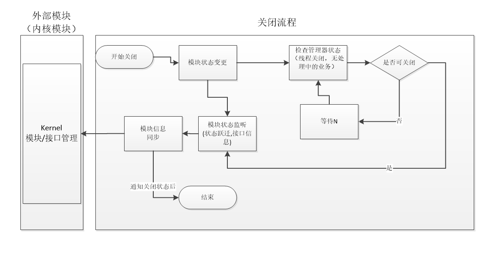


- Dependent service

  no

#### 2.3.3 peer node discovery

- Function Description:

  After the network module is started, the peer node is managed.

  The ways for node acquisition are:

  1> Connect to the seed node and request address acquisition.

  2> Receive the broadcasted node message.

  2> The connection of the cross-chain network, for example, as a connection between a node on the main network chain and a parallel chain, or a connection between a node on the parallel chain and the main network chain.

- Process description

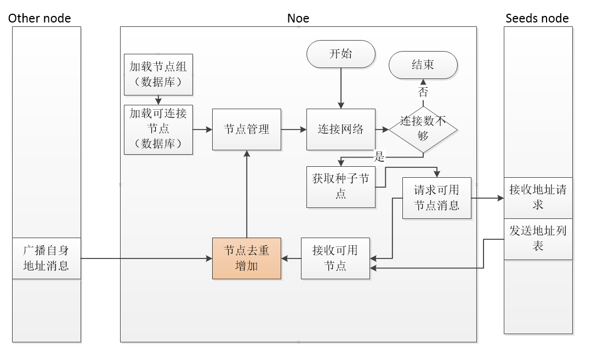


- Dependent service

No

#### 2.3.4 Network Connection

- Function Description:

   A node acts as the client and actively connects to the known peer node. It is also the server and waits for the peer node to connect.

  A connection can work normally, and it needs to pass the handshake protocol, that is, send each version protocol message. The specific definition of the protocol is as follows.

  "Protocol - Network Communication Protocol Part".

- Process description

After the TCP connection is complete with the server, the client needs to handshake through the service version protocol. Only the connection with successful handshake can forward the service.The state in the connection cannot be transitioned to connected after X minutes, and the connection is actively disconnected.

The version protocol is sent in the process (see the version structure of the protocol):

1> The protocol carries the information of the node, including: version information of the protocol, the highest block height of the port, the block hash value,

The external network ip, port, and cross-chain service port of the other node, as well as the external network ip, port, and cross-chain service port of the node.

2> The service connection can be established only through the version protocol, otherwise it will be disconnected after waiting for X=1 minutes.

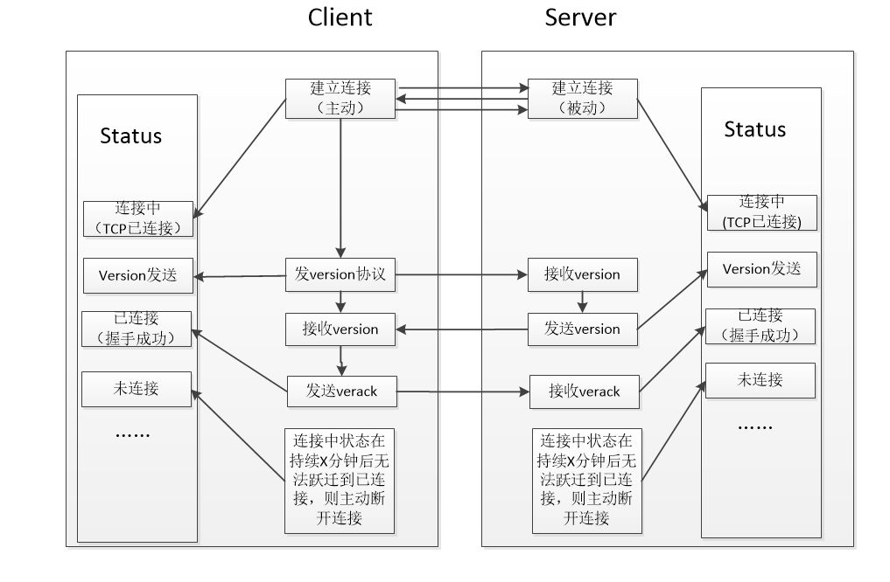

- Dependent service


#### 2.3.5 Heartbeat Detection

- Function Description:

  Check if the connection is still connected.The keep-alive is maintained by the ping-pong message of the client and the server.Refer to the "Protocol - Network Communication Protocol" section for the definition of the ping-pong protocol involved.

- Process description

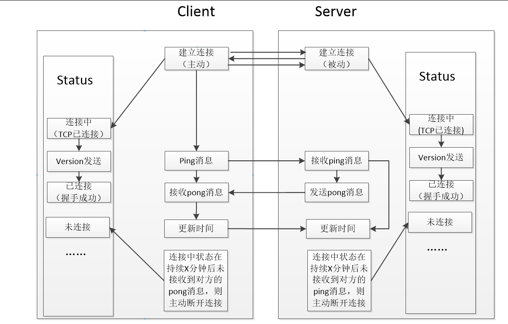


- Dependent service


#### 2.3.6 Connection Quantity Verification

- Function Description:

  When a node connection is established, the number of connections is made, and if the maximum is reached, the connection is actively disconnected.

  Process description

      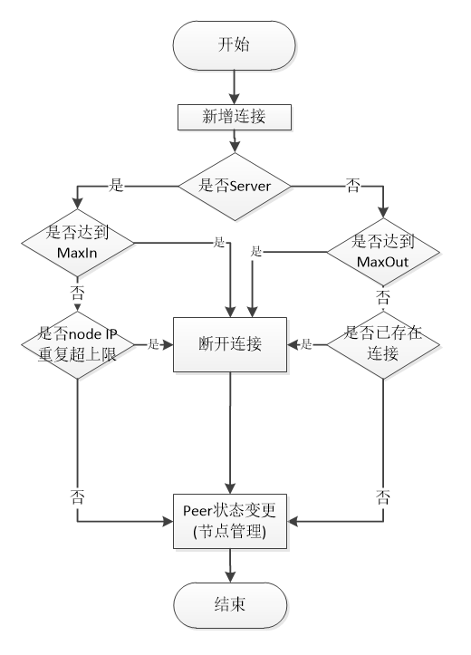


- Dependent service


#### 2.3.7 External ip storage of nodes

- Function Description:

A node may have multiple network cards, or it may be in a local area network. Therefore, when establishing a connection, it does not know its own external network ip address.

The node needs to know its own external network IP address to broadcast its own address for the external network peers to connect.In our design, the external network of the node is carried by the version protocol message.

- Process description

    When the client receives the version message, it can know its own IP address information.

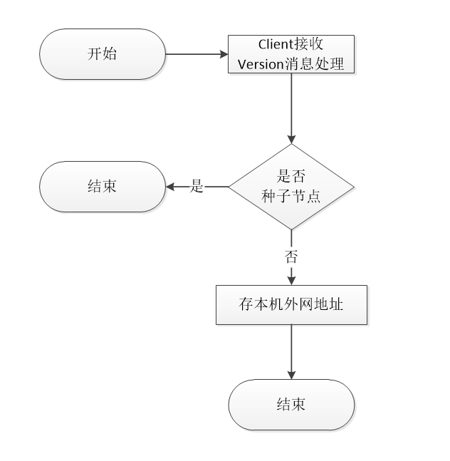


- Dependent service


#### 2.3.8 Node's external network connection detection

- Function Description:

When a node establishes a connection, it can broadcast its own external network IP+port to other nodes.However, if a node is in a local area network, the IP address of its external network cannot be directly connected.Therefore, in order to detect whether the external IP address of the node is available, you can connect to your own server to determine whether the IP address can be used for broadcast. If the connection is successful, the external IP address of the node cannot be broadcast to other nodes.

- Process description

  Self-connection may succeed or fail. If it is successful, the external network ip is reachable, and it can be broadcasted to other nodes in the network when the connection is established. If it is unreachable, the connection cannot be established without processing.

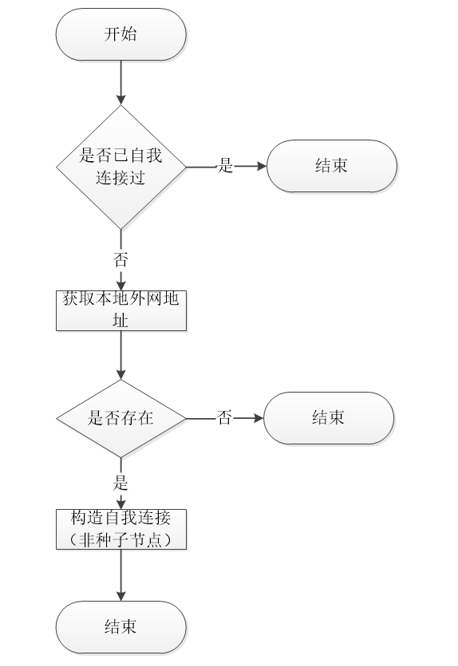


- Dependent service


#### 2.3.9 Broadcasting of the peer node

- Function Description:

  Broadcast its own node to other nodes in the network. In the design, we will promote the broadcast of its external network ip after the network is stabilized.

- Process description


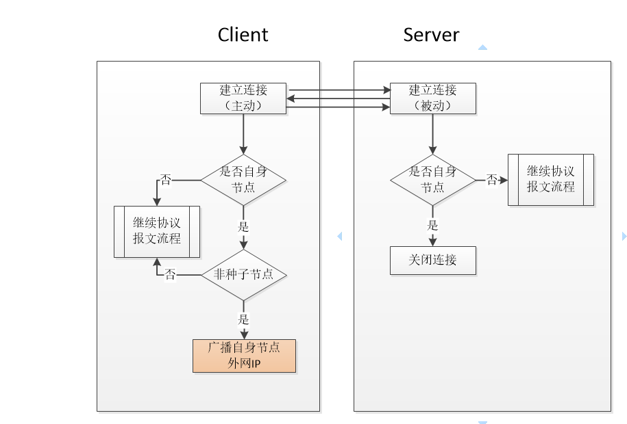


- Dependent service

#### 2.3.10 Request/Reply getaddr Protocol Message

  - Function Description:

     Request an address protocol message for more network connections

  - Process description

     Request getaddr:

1> After the network is stable, broadcast to the peer connection node to request a list of connectable addresses.

Reply getaddr

1>peer cross-chain connection, the main network chain replies to the address list of the main network nodeGroup (IP+cross-chain port), and the parallel chain replies with its own chain address list (IP+cross-chain port)

2>peer own network connection, the node will reply to the address list (IP+ own chain port)

  - Dependent service


#### 2.3.11 Send/Receive Address Logic

- Function Description:

   Receiver protocol message processing logic for receiving network transmission

- Process description

   Send addr:

1> When a new node is accessed, an addr message is broadcast to other peers of the same nodegroup.

2> When the getaddr message is requested, the addr message will be replied.

Receive addr:

1> Determine whether the address is already owned locally. If you do not forward it, get the new addr.

2> The received node can be forwarded only after it has been authenticated by the connection.

- Dependent service


#### 2.3.12 Cross-chain server port delivery

- Function Description:

   A node can have two roles, one is to maintain its own internal chain network.The other is to maintain a cross-chain network as a cross-chain role.

  Therefore, in the server definition, we distinguish the port listeners of the two networks so that they are relatively independent.The own chain defines a serverPort1, and the cross-chain part defines a serverPort2.

- Process description

  As shown in the figure below, our main network chain network and the parallel chain network generate a cross-chain connection. When there is a node 2 in the main network chain connected to node 1, the connection is established through the internal service Port1, and node 1 can be the node 2 The node A sent to the friend chain and the node B are connected, and the information sent to the friend chain at this time should be serverPort2, so the serverPort2 needs to be transferred in the internal interaction of the main network chain.We define this part of the data in the version protocol for delivery.

      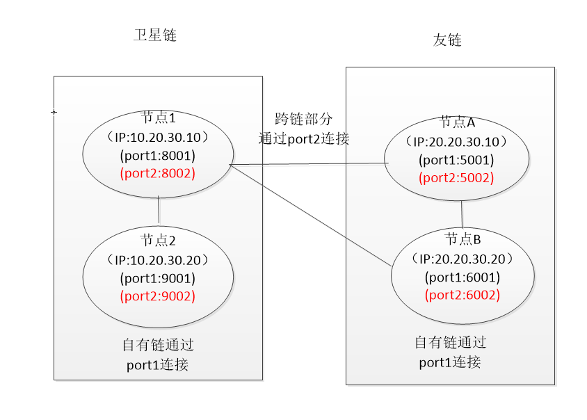

* Dependent service


## Description of the event

### 3.1 Published events

No

### 3.2 Subscribe to events

No


## Agreement

### 4.1 Network Communication Protocol

#### version

Used to establish a connection (handshake)

| Length | Fields       | Type     | Remark                                                       |
| ------ | ------------ | -------- | ------------------------------------------------------------ |
| 4 | version | uint32 | Protocol version identifier used by the node |
| 20 | addr_you | byte[20] | The other party's network address [IP+PORT1+PORT2] PORT2 is a cross-chain server port such as: [10.32.12.25 8003 9003] 16byte+2byte+2byte |
| 20 | addr_me | byte[20] | The network address of this node [IP+PORT1+PORT2] PORT2 is a cross-chain server port such as: [20.32.12.25 7003 6003] 16byte+2byte+2byte |
| 4 | block_height | uint32 | Node Height |
| ? | block_hash | varInt | Block hash |
| ?? | extend | VarByte | Extended field, no more than 10 bytes? |

#### verack

Used to answer version

| Length | Fields   | Type  | Remark                           |
| ------ | -------- | ----- | -------------------------------- |
| 1 | ack_code | uint8 | Return code, 1 for normal, 2 for connection is full |

#### ping

Used to maintain the connection. After receiving a message for a certain node for a period of time, the message is sent. If the pong message is received, the node remains connected. Otherwise, the connection is closed and the node is deleted.

| Length | Fields     | Type   | Remark |
| ------ | ---------- | ------ | ------ |
| 4 | randomCode | uint32 | Random Numbers |

#### pong

Used to respond to ping

| Length | Fields     | Type   | Remark |
| ------ | ---------- | ------ | ------ |
| 4 | randomCode | uint32 | Random Numbers |

#### getaddr

Used to request connection information for available nodes in the network.

| Length | Fields         | Type   | Remark           |
| ------ | -------------- | ------ | ---------------- |
| 2 | chainId | uint16 | Chain id |
| 1 | isCrossAddress | uint8 | Whether to request a cross-chain address |

#### addr

It is used to answer getaddr, or announce its existence to the network. After receiving the message, the node determines whether the node is known. If it is an unknown node, it saves it and propagates the address to the network after it passes the verification.

| Length | Fields    | Type            | Remark                               |
| ------ | --------- | --------------- | ------------------------------------ |
| ?? | addr_list | network address | 18 bytes per node (16 bytes IP + 2 bytes port) |

#### bye

 Used for peer-to-peer connection to actively disconnect, denial of service peer message service

| Length | Fields  | Type  | Remark   |
| ------ | ------- | ----- | -------- |
| 1 | byeCode | uint8 | Reserved Fields |

#### getTime

 Used to get time from the peer node

| Length | Fields    | Type   | Remark |
| ------ | --------- | ------ | ------ |
| 4 | messageId | uint32 | Request id |

 

#### responseTime

 Reply to peer node time

| Length | Fields    | Type   | Remark |
| ------ | --------- | ------ | ------ |
| 4 | messageId | uint32 | Request id |
| 4 | time | uint32 | Time Value |

 

### 4.2 Trading Agreement

No

## Module configuration


```
[network]
port=18001
crossPort=18002
#魔法参
packetMagic=20190807
#籽点
selfSeedIps=39.98.226.51:18001,47.244.186.65:18001,47.254.234.223:18001,47.74.86.85:18001
#Main-network cross-chain seed connection node for initial connection of parallel chain
moonSeedIps=39.98.226.51:18002,47.244.186.65:18002,47.254.234.223:18002,47.74.86.85:18002
#Maximum number of network connections
maxInCount=100
#Maximum number of outgoing connections
maxOutCount=20
```

## Java-specific design

[^Description]: Core object class definition, storage data structure, ...

## Supplementary content

[^Description]: Required content not covered above

