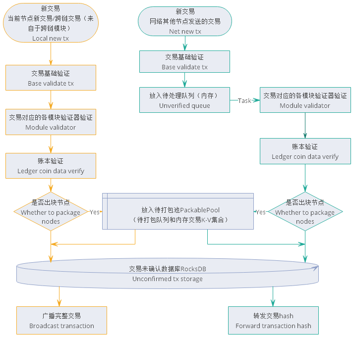

# Transaction management module Design document 

## Overall overview

### Module Overview

#### Why are there trading modules?

In the Nuls 2.0 ecosystem, trades flow between chains and chains. The nodes of each chain not only deal with transactions within the chain, but also deal with cross-chain transactions, so each node needs to be processed. The trades are more and more complex, so we need a single but separate module to handle the various transactions. From the architectural design of Nuls 2.0, we need a separate module to handle the collection, verification, storage and forwarding of transactions. For all transactions, these functions are shared and unified, so transaction management runs as a standalone module.

#### What does the trading module do?

##### Processing local transactions

- Collecting transactions
- Local verification
- Extract packageable transactions
- Submit, rollback transactions
- Save unconfirmed, packageable and confirmed transactions
- Provide data for the transaction

#### Positioning of the trading module in the system

Throughout the system, the transaction module manages the collection, verification, and provision of secure transaction data for each block in the blockchain, providing storage and query of transactions for confirmed blocks.

#####Required dependencies during normal operation
- Core module
- Network module
- Account module
- Block module
- Chain Management Module

### Architecture diagram

The entire module is roughly divided into three parts: 
- interface
- implementation layer
- local storage

The implementation layer contains 4 parts

- Functional implementation logic of the interface
- Manager, Transaction Manager, Chain Manager
- The transaction manager caches the registration information for each transaction, including the validator of the transaction, the name of the interface for the business submission and rollback.
- Various queues for transaction reception, asynchronous verification processing, and push consensus
- Basic data such as cache, chain data, etc.

## feature design

### Functional Architecture

### Core Process 

#### Initialization chain

When the module starts, it needs to read the configuration information of all the existing chains to initialize each chain. The default chain of the configuration will be started for the first time.

#####Basic information about the initialization chain

- Load chain configuration information, initialize various logos, status, etc. when running the chain.

#####Initialize the chain RocksDB table

- Create a db table for each data store in the chain runtime.

#####Initialize the log of the chain

- Create individual print log objects for the chain.

#####Initialize the chain's cache

- Create a cache and queue for the chain runtime.

#####Initialize transactions in the chain trading module, such as cross-chain trading

- The cross-chain transaction in the registration transaction module will maintain a Map with the transaction type as the key and the transaction registration object as the value. The transaction registration object contains the API name of the transaction validator, the transaction service submission interface, and the transaction service rollback interface. And some information about the transaction itself.

#####Initialize the chain task scheduler

- Create various timing tasks for the chain runtime

&nbsp;
#### Collecting and processing transaction processes

- Collect newly created transactions for each module of this node

The nodes of Nuls 2.0 are modular. The node is a whole composed of multiple core modules. The transaction module acts as the transaction processing center of the node, but it is not the assembler of all the transactions of the node. The various transactions of the node are created by the corresponding individual function modules. Therefore, the primary task of the trading module is to collect the transactions assembled by each module.

The function module performs transaction assembly according to the data provided by the user. After the assembly is completed, the transaction verifier is first executed to verify the basic and business data of the transaction. Then the account block is verified by the account block module, and the transaction is directly sent to the transaction module through the verified transaction. Do the following, then wait for the next step.

  - db unconfirmed storage
  - Consensus node puts the transaction into the queue to be packaged
  - Broadcast to other nodes
  

#####Collect transactions broadcast by other nodes

The transactions broadcast by other nodes will be sent by means of network messages. The first is the hash of the transaction, and the transaction management module will send a message requesting the complete transaction before receiving the complete transaction.

Since the node is a whole composed of modules, within the node, the modules are trusted, and the nodes are not trusted. Therefore, unlike the new transaction of the receiving module, when the transaction module receives the transactions of other nodes. When the transaction is rigorously verified, then wait for the next step.

  - De-duplication (validation in unconfirmed and confirmed databases)
  - Call the validator corresponding to the transaction for verification
  - Call the ledger for verification
  - db unconfirmed storage
  - Consensus node puts the transaction into the queue to be packaged
  - Forward to other nodes

 Only transactions that are not verified by an orphan transaction are temporarily placed in the orphan pool for processing, and all other unverified transactions are discarded.

> Orphan transactions: It means that the transaction data can be verified. The transaction nonce value is not used by other transactions, but it cannot be connected to an existing transaction and will be judged as an orphan transaction.

#### Node packing new block transactions

Only the consensus node will have the process of packaging the new zone fast transaction. The order of the transaction module to start packaging the new block transaction is issued by the consensus module. The consensus provides the execution deadline of the assembly transaction, and the total capacity of the current block can be packaged. It is packaged by the trading module.

When the trading module packs the block transaction, the transaction is first taken out from the PackablePool to be packaged queue (first in, first out), and then the block is verified by the block module for the transaction, and the block is verified in batches, in order to reduce the inter-module in the bulk transaction. RPC call. For the stability of the network, the number of transactions in a block is limited. In the case of not including system transactions, the default is one block with a maximum of 10,000 transactions.

Transactions that fail to pass the block verification and confirmed transactions will not be placed in the packageable transaction set (if it is an orphan transaction, it will be re-inserted into the queue to be packaged, in order to prevent the occurrence of permanent orphan transactions, duplicates are taken out and Putting it back into the system, the number of times it will be replaced will be limited)

After the block verification, if it is a smart contract transaction, you need to execute the smart contract, and then group the transaction according to the module registered by the transaction. After the reserved unified verification time threshold is reached, stop the transaction from the queue and stop the transaction. The group, respectively, calls the unified verifier of each module to verify and detect the transaction.

If there is a transaction that fails verification in the unified verification phase of the module, the transaction will be removed from the set of packaged transactions that are taken out. If it is an orphan transaction, it will still be re-entered into the queue to be packaged, and all the packaged transactions can be packaged. The packaged full validation logic will be re-executed until all transactions have been uniformly verified by each module. If you have executed a smart contract transaction, you will go to the smart contract module to get the smart contract result, and add the newly generated transaction to the packageable transaction combined with the end of the team, and then return all the transactions to the consensus module for packaging.

> In the process of packaging new block transactions, if the latest local height changes, that is, the new block is received and saved successfully, then the package is abandoned, all the retrieved transactions are put back into the package to be packaged, and then the new zone is restarted. 

Block trading package
> When packaging a new block transaction, if the execution time exceeds the deadline, the consensus will assemble a new block with no transactions.

#### Verifying transactions in blocks

The verification block transaction is one of the processes of the block module processing the new block. The transaction module obtains all the transactions in a complete block, firstly takes out the transaction in turn, and performs basic verification on the transaction, and then calls the block to verify; if not The cross-chain transaction generated by the chain also checks the cross-chain verification result of the cross-chain transaction; if it is a smart contract transaction, it needs to execute a smart contract, and then compare the existing result with the newly generated result, and finally group, The module unified verifier is called for verification; if one of the verifications fails, the entire block transaction fails to be verified, and the direct return fails.

If the received block contains cross-chain transactions, the results of the cross-chain verification need to be verified during verification.

#### Saving transactions in blocks

The transaction of saving the block is one of the processes of the block module processing block. The data of the block name has passed the verification and enters the save phase. When the transaction is saved, all the transactions are first saved to the confirmed DB database; then all the calls are respectively called. The business submission interface of the transaction performs processing on the transaction business data; then submits to the account block module, submits the account block and the nonce value; finally deletes the corresponding transaction from the unconfirmed DB. If an operation fails in the middle, the process that has been successfully operated will be rolled back.

> The process of rolling back block trading is to execute the process of saving block transactions in reverse order.

## General Trading Agreement

Nuls uses a common transaction protocol format and consists of the following fields:

| Len  | Fields   | Data Type | Remark             |
| ---- | -------- | --------- | ------------------ |
| 2 | type | uint16 | Transaction Type |
| 4 | time | uint32 | Time, accurate to the second |
| ? | txData | VarByte | Business Data |
| ? | coinData | VarByte | Asset Data |
| ? | remark | VarString | Notes |
| ? | sigData | VarByte | Contains public key and signature data |

**type**

Used to distinguish different business transactions, each module can register multiple transaction types, each transaction type can have different verification logic and processing logic. The value ranges from 1 to 65535.
Different transaction types should not be set to duplicate types, and the system does not allow duplicate types to be registered.

System support for extensions: types greater than 100

**time** 

The time of the transaction, accurate to the second, is not mandatory, the value range can be any number in uint32.

**txData**  

Used to extend business data, the account does not verify txData content, and any data can be stored here. Currently, the business data in the transaction type built into NULS is stored in the txData field. After registering the transaction type, the business module provides three interfaces to validate and process the data in txData (verifyTx, commitTx, rollbackTx).

**CoinData**  

For asset data of transactions, NULS currently defines a common set of CoinData formats, as follows

- Froms :   List<CoinFrom> format
- Tos :   List<CoinTo> format

Note: Support multiple accounts to transfer different assets to different accounts in the same transaction.

**CoinFrom structure [70]**

- address :  byte[24] account address 
- assetsChainId : uint16 asset distribution chain
- assetsId :  uint16 asset
- amount :  uint128, the number of transfers
- nonce :  byte[8] transaction sequence number, the last 8 bytes of the hash of the previous transaction
- locked :  byte Whether it is locked (locktime: -1), 1 means lock, 0 means non-lock

**CoinTo structure [68]**

- address :   byte[24], destination address
- assetsChainId :   uint16 asset distribution chain
- assetsId :   uint16 asset
- amount :   uint128, transfer amount
- lockTime :   uint32, unlock height or unlock time, -1 is permanent lock

**Handling fee**

The remaining part of froms-tos is the handling fee (the model supports multiple asset payment fees, and the constraints are determined by the economic model design)

**remark**  

Note that the data for this content will be converted to a string in utf-8 encoding and displayed in the browser and wallet.You can also use the remark field to perform business extensions for transactions.

**sigData** 

The signature data supports the signature of multiple accounts, and each signature includes four parts: public key length, public key, signature data length, and signature data.

**Trading Hash Calculation** 

Serialize the transaction except for sigData to get a complete byte array. The data is calculated twice using Sha-256 to obtain a 32-bit hash value.

## Module Service

Refer to [Transaction Management Module RPC-API Interface Document](https://docs.nuls.io/Docs/i_transaction.html)

## Network Message Body Protocol 

### ForwardTxMessage

- Message description: The node forwards and forwards the transaction hash to other nodes after receiving and verifying new transactions sent by other nodes on the network.
- cmd：newHash

| Length | Fields | Type   | Remark           |
| ------ | ------ | ------ | ---------------- |
| 32     | hash   | byte[] | transaction hash |

- Message processing
  - newHash processes the message and sends a message requesting the full transaction

### BroadcastTxMessage

- Message description: Broadcast full transaction to other nodes in the chain
- cmd：receiveTx

| Length | Fields               | Data Type | Remark         |
| ------ | -------------------- | --------- | -------------- |
| 2 | type | uint16 | Transaction Type |
| 4 | time | uint32 | Trading Hours |
| ? | txData | VarByte | Trading Data |
| ? | coinData | VarByte | Transaction Inputs and Outputs |
| ? | remark | VarString | Notes |
| ? | transactionSignature | VarByte | Transaction Signature |

- Message processing
  - receiveTx enters new transaction process

### GetTxMessage

- Message description: Receive the transaction hash forwarded by other nodes, request the sender for the complete transaction
- cmd：askTx

| Length | Fields | Type   | Remark           |
| ------ | ------ | ------ | ---------------- |
| 32     | hash   | byte[] | transaction hash |

- Message processing
  - askTx to process the message and send the full transaction back

