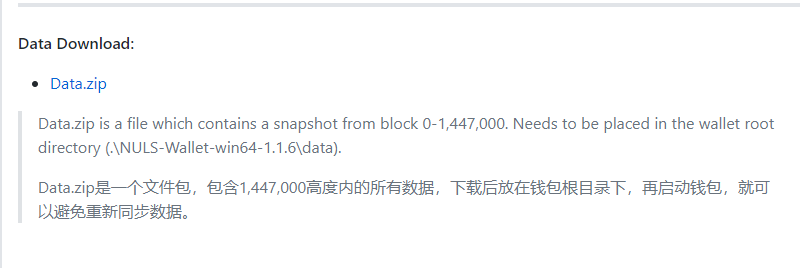

# How to connect wallet to NULS test-net

## Downloading wallet

The NULS test-net wallet is available in Windows, Linux and Mac versions, and is constantly updated. You can download for your operating system of choice.

Download: downloading from github (https://github.com/nuls-io/nuls/releases)

!

Note: The version marked [Testnet] is the test-net wallet.

## Launching wallet

After the wallet is downloaded, unzip it according to specific operating systems.

For Windows users, the wallet is unzipped as shown below: the data folder and the logs folder are generated after the first run of the wallet.

Double-click NULS-Wallet.exe to launch and run the wallet. The browser will automatically open the wallet interface by default, as shown below:

When the interface is opened for the first time, the page will prompt that currently the block is being synchronized, as shown below:

The appearance of block synchronization means the successful connection to the NULS test-net. Once the synchronization is completed, the wallet can be used normally. To save time, users who do not want to resynchronize data from the first block can also download the latest block data package corresponding to each version on github, as shown below:

For Linux users, the wallet is unzipped as shown below: the data folder and the logs folder are generated after the first run of the wallet.

Run the command sh bin/start.sh to launch the wallet. Then run the command sh bin/cmd.sh to enter the NULS wallet command line interface (CLI). Run the command getnetinfo on the CLI to check the current network status. When the localBestHeight increases, it indicates that the test-net has been successfully connected, as shown below:

Users can also track the nuls.log in the logs folder to check the latest status of the wallet.

For MAC users, steps are almost the same as the Windows users, so let’s skip it.
