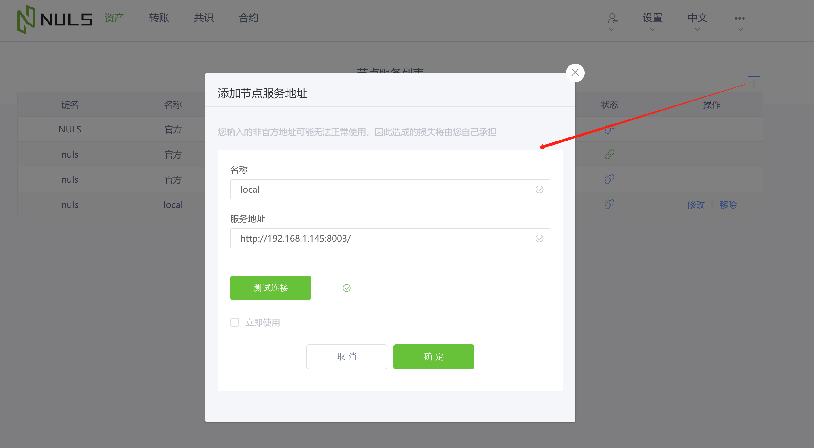

# Deploying the Mainnet Wallet with Public-Service Module

## Docker Deployment

The advanced wallet includes several modules, such as **public-service**, block browser, and web light wallet, setting it apart from regular wallets. The primary distinction is that the public-service module redundantly stores chain data in MongoDB (included in the image). The advantage is enhanced convenience without the need for reliance on the browser and web light wallet provided by the NULS Foundation.

Here's how to operate:

```bash
docker run \
--name nuls-wallet \
-d \
-p 8001:8001 \      
-p 8002:8002 \
-p 8003:8003 \      
-p 8005:1999  \
-p 8004:8004 \
-p 8006:8006 \
-v `pwd`/mongo_data:/nuls/mongo_data \
-v `pwd`/mongo_log:/nuls/mongo_log \
-v `pwd`/data:/nuls/data \
-v `pwd`/logs:/nuls/Logs \
nuls-wallet-pro:v2.0.0
```

- **8001:** Main chain protocol communication port (required)
- **8002:** Cross-chain protocol communication port (required)
- **8003:** Public-service HTTP interface (optional)
- **8004:** HTTP API interface port (optional)
- **8005:** Block browser port (optional)
- **8006:** Web light wallet port (optional)
- **/nuls/data:** Data storage directory
- **/nuls/Logs:** Log storage directory
- **/nuls/mongo_data:** MongoDB data storage directory
- **/nuls/mongo_log:** MongoDB log directory

Once successfully started, you can access the block browser and web light wallet through a web browser.

```bash
http://127.0.0.1:8005
http://127.0.0.1:8006
```

## Linux Deployment

### Starting MongoDB

Download the archive from the MongoDB official website, upload it to the server, extract it to the directory (/usr/local), and start it.


### Starting the Wallet

Download the compressed package containing the public-service (nuls_wallet_pro.tar.gz) from [GitHub](https://github.com/nuls-io/nuls-v2/releases), upload it to the server, and start it after decompression. Before starting, ensure that the server opens ports: 8001, 8002, 8003. After starting the wallet, you can access public-service through (ip:8003), and you can add your own node service in the node service of the web wallet and light wallet.




Note: Start MongoDB before initiating the node wallet!
