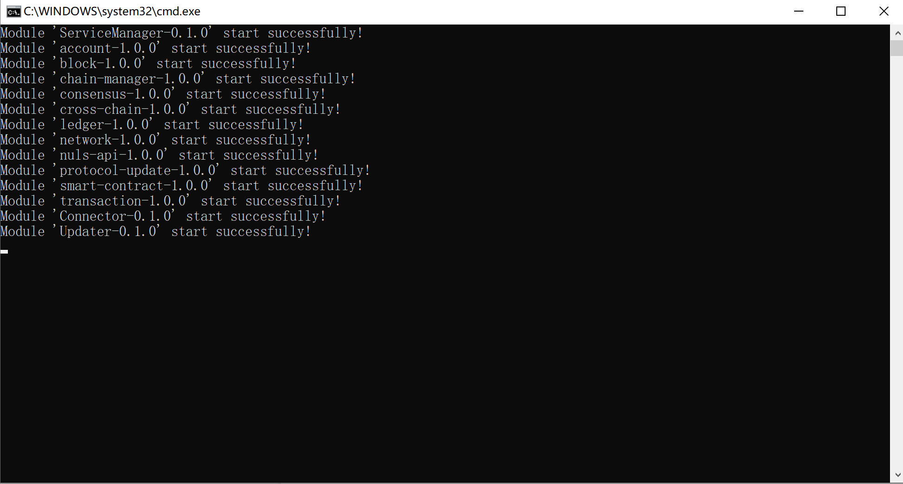
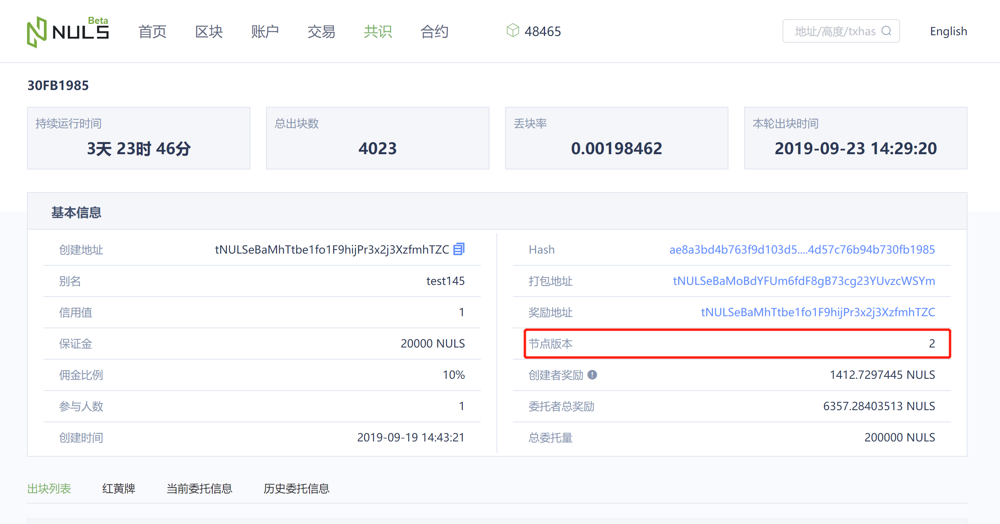
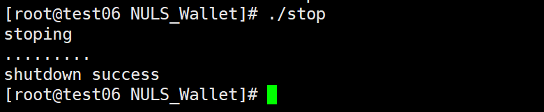
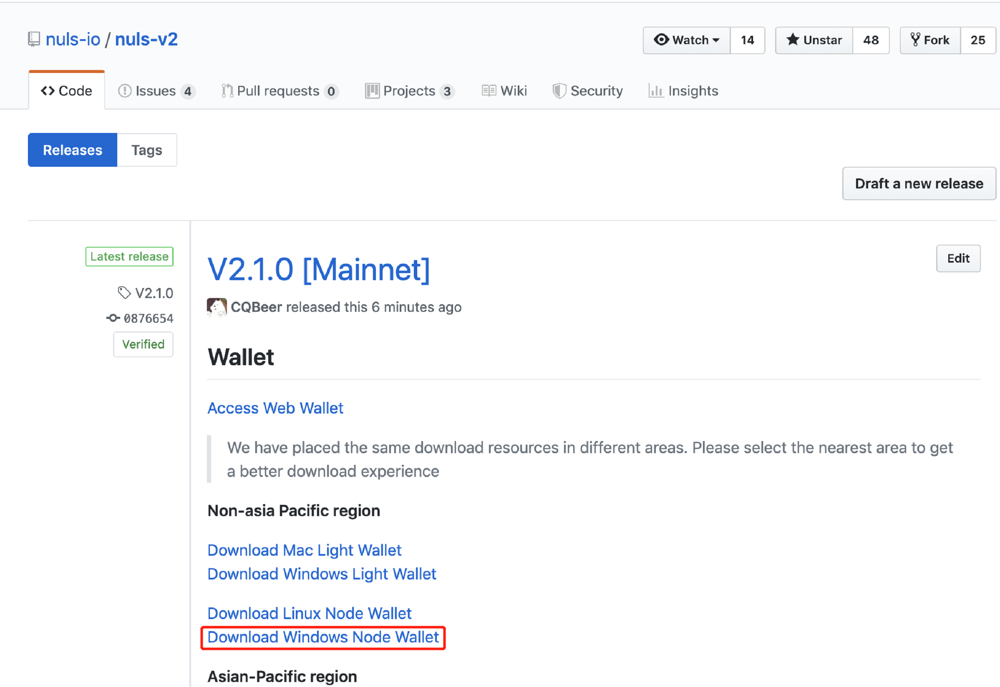
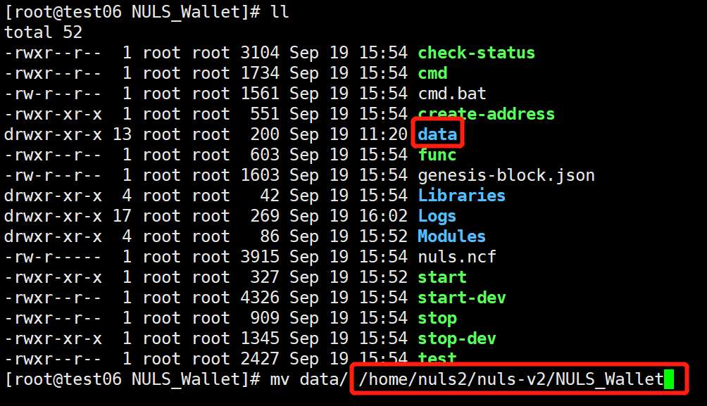
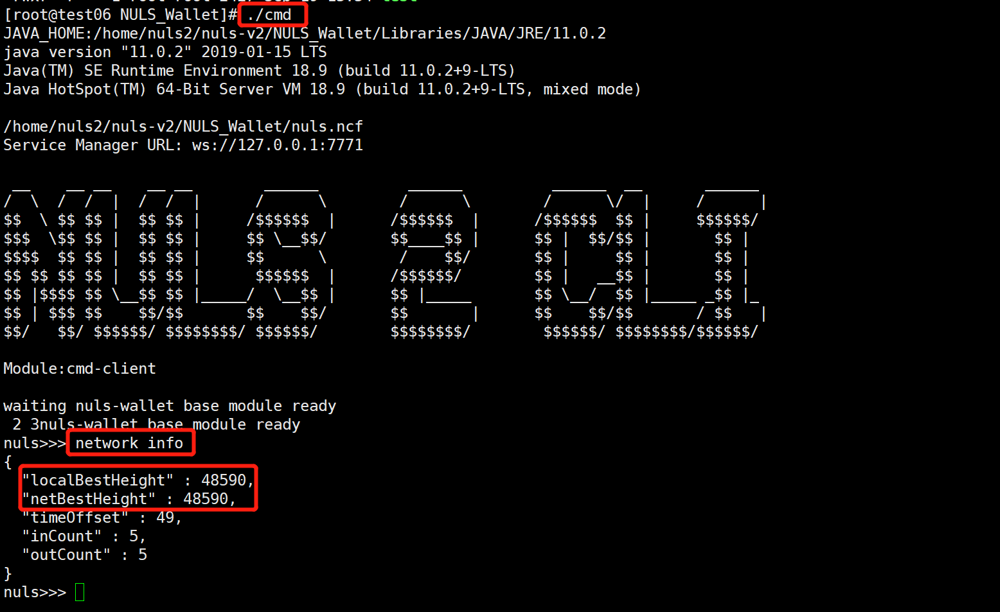

# Node Wallet Upgrade Guide

The node wallet requires manual upgrading as it does not support automatic upgrades. Follow the steps below for upgrading on both Windows and Linux platforms.

## Windows

1. Stop the currently running Windows node wallet by closing the startup window.

   

2. Download the latest Windows package from [GitHub](https://github.com/nuls-io/nuls-v2/releases) and extract it to a specified directory (Note: The directory path should not contain Chinese characters as it may cause issues with the command line).

   

3. Replace the data directory in the decompressed new package with the data directory of the stopped node wallet.

4. Double-click the `start.bat` button to start the node wallet.

5. Double-click the `cmd.bat` button to enter the command line and check the node wall height using the command `network info`.

   

6. When the latest height of the node wallet matches the network height, it indicates that the node wallet is running normally.

7. Verify the node version information in the [Mainnet Explorer](https://nulscan.io). The node version should be displayed as 2, indicating a successful upgrade (the node version number will be updated after the upgrade).

   

## Linux

1. Stop the running node wallet using the command `./stop`.

   

2. Download the latest Linux package from [GitHub](https://github.com/nuls-io/nuls-v2/releases) and unzip it (`tar -xvf NULS_Wallet_linux64_v2.1.0.tar.gz`) to the specified directory.

   

3. Move the data from the stopped node wallet to the newly extracted node wallet directory (`mv data ../NULS-Wallet`).

   

4. Start the node wallet using the command `./start`.

5. Enter the command line (`./cmd`) to check the node wall height using the command `network info`.

   

6. When the latest height of the node wallet matches the network height, it indicates that the node wallet is running normally.

7. Verify the node version information in the [Mainnet Explorer](https://nulscan.io). The node version should be displayed as 2, indicating a successful upgrade (the node version number will be updated after the upgrade).

   
