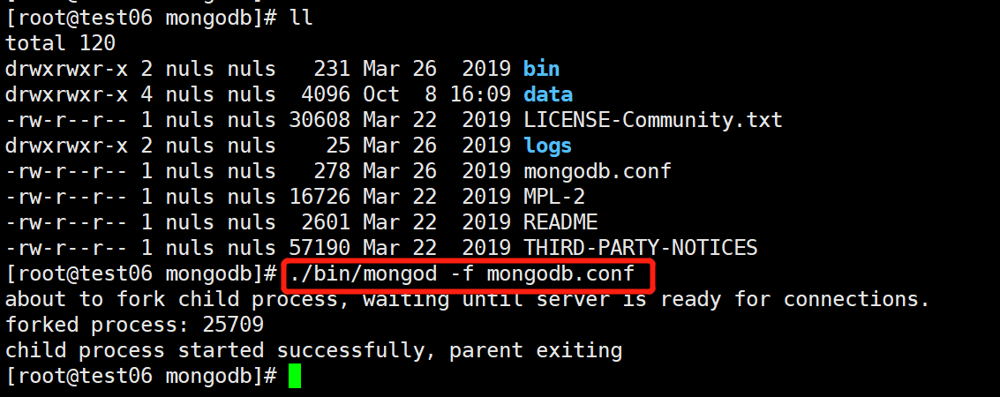

# 部署包含public-service的主网钱包

## docker部署

​	相比与普通钱包，高级钱包带有**public-service**、区块浏览器、网页轻钱包几个模块。与普通钱包最大的区别是public-service模块会将链数据冗余存储在mongodb中（镜像中已包含）。好处是使用更方便，不需要依赖nuls基金会提供的浏览器和网页轻钱包。

​	运行方法如下：

```text
        docker run \
        --name nuls-wallet \
        -d \
        -p 8001:8001 \      
        -p 8002:8002 \
        -p 8003:8003 \      
        -p 8005:1999  \
        -p 8004:8004 \
        -p 8006:8006 \
        -v `pwd`/mongo_data:/nuls/mongo_data \
        -v `pwd`/mongo_log:/nuls/mongo_log \
        -v `pwd`/data:/nuls/data \
        -v `pwd`/logs:/nuls/Logs \
        nuls-wallet-pro:v2.0.0
```

- 8001 主链协议通信端口 （必选）
- 8002 跨链协议通信端口 （必选）
- 8003 public-service http接口 （可选）
- 8004 http api接口使用端口（可选）
- 8005 区块浏览器端口 （可选）
- 8006 网页轻钱包端口 （可选）
- /nuls/data 数据存储目录
- /nuls/Logs 日志存储目录
- /nuls/mongo_data mongodb数据存储目录
- /nuls/mongo_log mongodb日志目录

启动成功后可通过网页浏览器访问区块浏览器和网页轻钱包

```text
http://127.0.0.1:8005
http://127.0.0.1:8006
```

## Linux部署

### 启动MongoDB

​	从MongoDB官网下载压缩包，上传至服务器并解压到目录下（/usr/local），启动即可。



### 启动钱包

​	从[GitHub](https://github.com/nuls-io/nuls-v2/releases)上面下载包含public-service的压缩包（nuls_wallet_pro.tar.gz），上传到服务器，解压之后启动（在启动前，服务器需要开放端口：8001、8002、8003），待钱包启动之后就可以通过(ip:8003)访问public-service，可在网页钱包和轻钱包的节点服务中添加自己的节点服务


注意：先启动MongoDB再启动节点钱包！