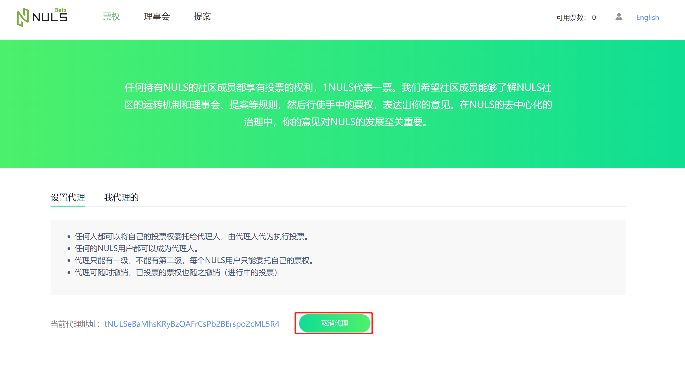
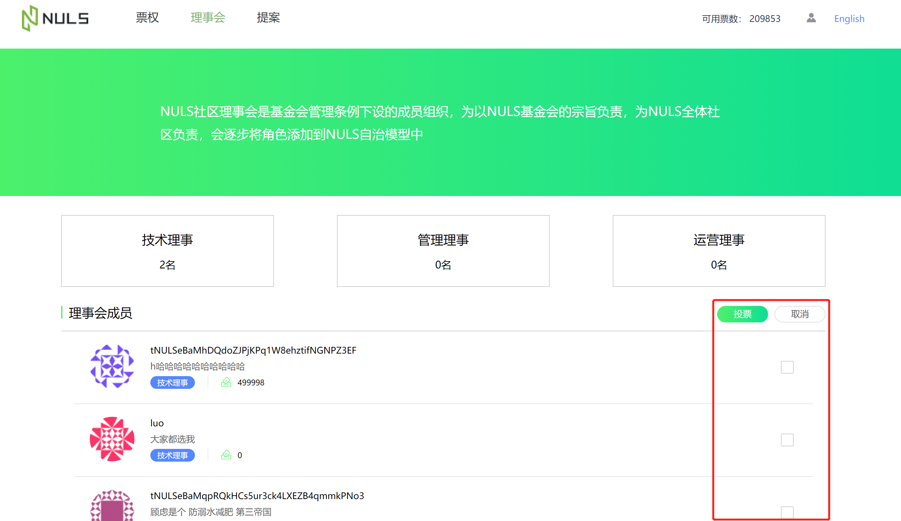
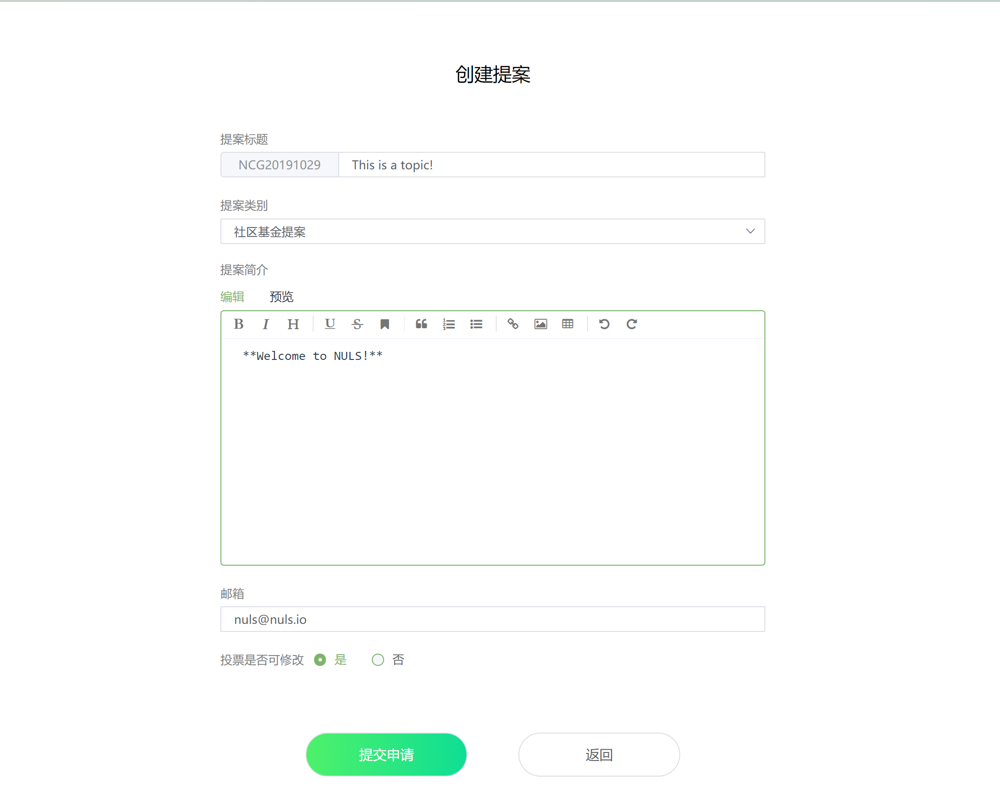

# 社区治理使用指南

​	用户打开[社区治理](http://gov.nuls.io)，进入登录页面，可以通过keystore文件或私钥导入地址，也可以创建新的地址

## 票权

​	用户导入地址之后，可以查看改地址的票权，1NULS=1票；用户可以设置其他地址为代理地址，代为使用自己的票权（输入地址或别名）

此外，用户设置了代理的地址之后也可以主动**取消代理**

​	如果其他用户设置了该地址为代理，那么该用户可以在“我代理的”里面查看，可以进行**撤销**操作，取消对其他用户的票权代理。

## 理事会

​	普通用户进入理事会，可以进行**申请理事**（技术理事：地址余额不能低于25000；管理理事或运营理事：地址余额不能低于50000），理事会成员限制为11名（技术理事3名，管理理事4名，运营理事4名），每种类型的理事排名靠前的为正式理事，其他均为候选理事

​	**理事会投票**：每个账户都可以对理事会成员进行投票，最多只能选择11位，最少选择0位。投票之后，如果要批量取消，取消勾选点击投票即可。

用户也可以进入理事详情页面进行**投票**或**取消投票**

## 提案

​	每个用户都可以**创建提案**，提案有多种类型，提案创建时可选择在投票中是否可更改投票

​	理事会成员可以对申请的提案进行**审核**或**驳回**（当全部理事都驳回该提案时，提案无法进入投票阶段，直接审核拒绝）

任何用户都可以对投票中的提案进行**投票**或**更新投票**

## 投票

​	任何用户都可以**创建普通投票**（抵押10NULS），可以设置单选或多选，选项个数及内容自定义，还可以选择在有效投票时间内能否更新投票，此外还能关联正在投票中的提案。

任何用户都可以进行**投票**或**更新投票**

## 用户中心

可以进入用户中心，可以**查看该账户的全部投票**，标题可以跳转到投票详情。

