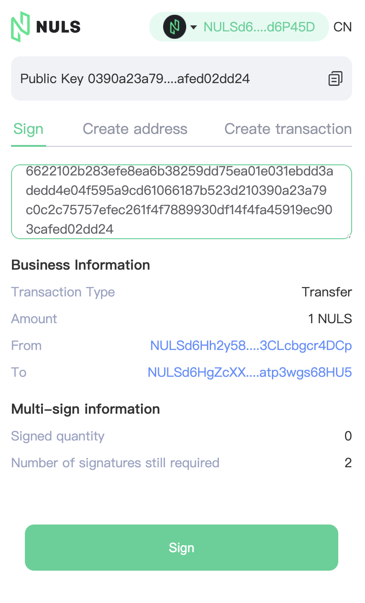

# NULS多重签名DApp教程

## 什么是多重签名

多重签名，英文缩写为 multi-sig，如果一个交易需要两个或者更多的私钥进行签名才能生效，那么这种情况就叫多重签名。可以简单的理解为，一个账户地址多个人拥有签名权和支付权。

如果一个账户地址只能由一个私钥签名和支付，表现形式就是1/1，而多重签名的表现形式是m/n，也就是说一共n个私钥可以给一个账户地址签名，而当达到m个账户地址签名时，就可以发起一笔交易。所以，创建多签账户地址时，m一定是小于或等于n的。

## 多重签名的应用场景 

多重签名在账户地址的权限管理中有很多应用场景，以下为部分例子：

* 管理资金：通过多个私钥的持有人共同管理一个多签账户地址，提高资产管理的安全性，避免单个私钥持有人因黑客攻击或者其他原因私钥丢失而造成损失。

* 账户冗余：通过多个私钥控制自己的多签账户，如果用户丢失了一个私钥，资金不会丢失，因为其他私钥仍然可以使用。

* 部门审批：一个事项必须由多个部门或责任人进行审批签名才可生效，每一次签名可追溯。

## 支持的链上资产

我们以DApp的形式提供了多签工具，该多签工具可在NULS和Nerve网络下进行使用，支持NULS和Nerve链的主链资产、以及所有通过Nerve网络跨链进入到NULS和Nerve网络的链上资产（暂时不支持NRC20 Token），支持的跨链资产包含Ethereum/Polygon/Arbitrum/BSC/Heco/OEC/Cronos等链上Token跨链管理。

## 快速上手多重签名工具 

下方将以NULS网络进行举例：

### 连接钱包
访问[多签工具](https://sign.nuls.io)，点击Nabox或Metamask连接钱包，若未安装插件钱包，则可以[点此下载](https://chrome.google.com/webstore/detail/nabox-wallet/nknhiehlklippafakaeklbeglecifhad?hl=zh-CN&authuser=2)

连接插件成功后，则点击【生成多链地址按钮】进行签名以此生成NULS和Nerve账户地址，
地址生成后会进入多签工具操作界面，从界面可以看出，多签工具支持3个功能。

- 创建多签账户地址  
- 创建多签交易 
- 签名 

下面将以此介绍每个功能的详细使用方法

### 创建多签账户地址
想要使用多签功能，首先需要创建一个多签账户地址。创建多签地址功能用于确定一个多签账户的管理者由哪几个公钥组成，创建者可以不是管理者，当前工具提供了2种方式填写公钥

- 在第一个输入框中将多个公钥通过英文逗号分隔然后粘贴进去，工具将自动识别每个公钥依次将公钥填入输入框，可通过点击+号图标增加输入框
- 依次将公钥填入输入框，可通过点击+号图标增加输入框

公钥填写完成后，还需填写最小签名数，最小签名数代表了该工具进行转账时需要多少个账户地址进行签名，例如生成地址的账户为3，最小签名数填写的为2，则在该多签地址进行转账交易时，需要这3个账户中的2个进行签名，交易才能被广播到区块链网络中。

信息填写完成后，点击【生成地址】按钮即可成功生成多签账户地址

### 创建多签交易 
创建多签交易功能用于发起一笔多签交易，用户选择要发起交易的多签地址，若没有则需要点击【添加多签地址】去创建多签地址，发起者可以不是多签账户的管理者，此处发起者只是组装多签交易并将其HEX发给需要签名的管理者。

接着填写要转出的资产，然后填写要转账的数量和接收地址，最后点击【创建交易】

创建成功后，可以看到按钮下方生成了该多签交易的HEX，可将HEX进行复制然后转发给需要签名的其他多签账户管理者 

### 签名 
签名功能用户将收到的多签交易HEX进行签名，用户此时的角色是签名者之一。用户将收到的HEX，粘贴进输入框，工具会自动解析多签交易的数据并展示出来。

备注：第一位签名者完成签名后，会生成新的HEX，第二位签名者则复制新的HEX，以此类推

解析出来的信息中，可以看到【当前已签名】的数量和【剩余需签名】的数量，以此判断当前该笔多签交易所处的阶段。

如果当前签名的用户是该笔多签交易规定的最后一位签名者（例如该笔多签规定至少需要2位管理者签名，此前已有一位签过名了，当前用户为第二个签名者），那么完成签名后，多签交易将被广播到区块链网络中，多签交易则最终完成

