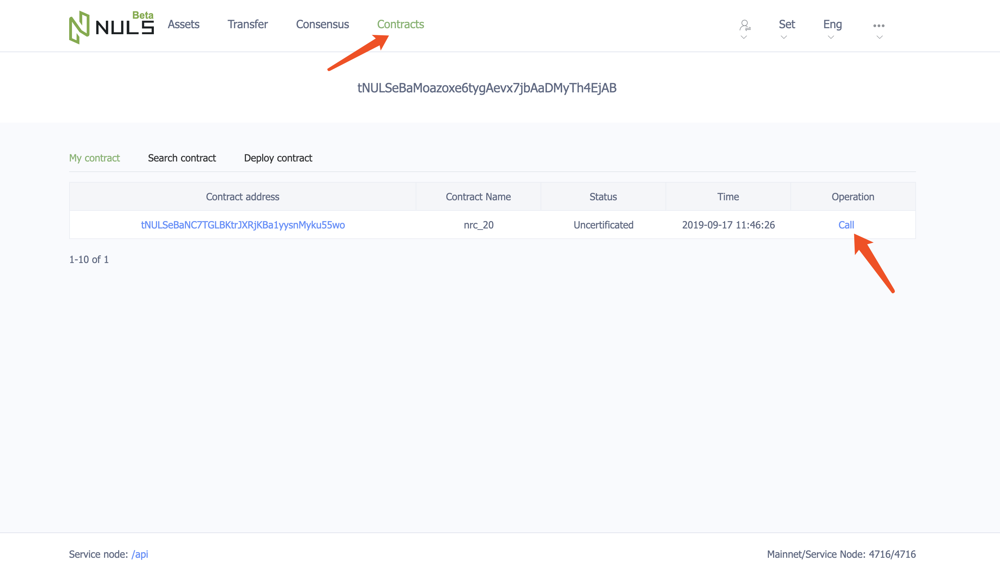
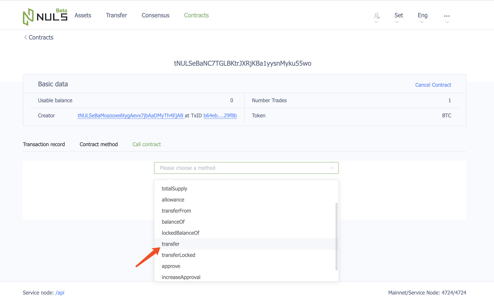
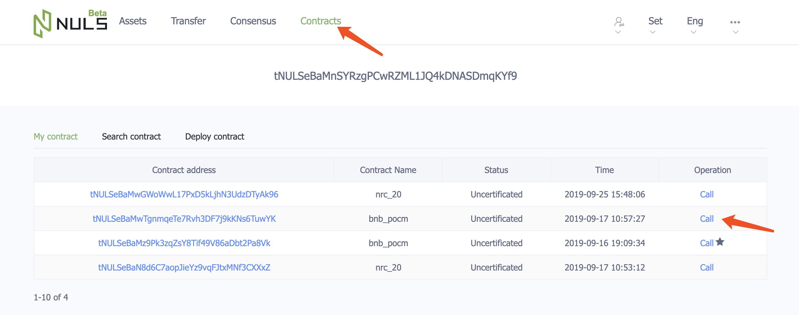
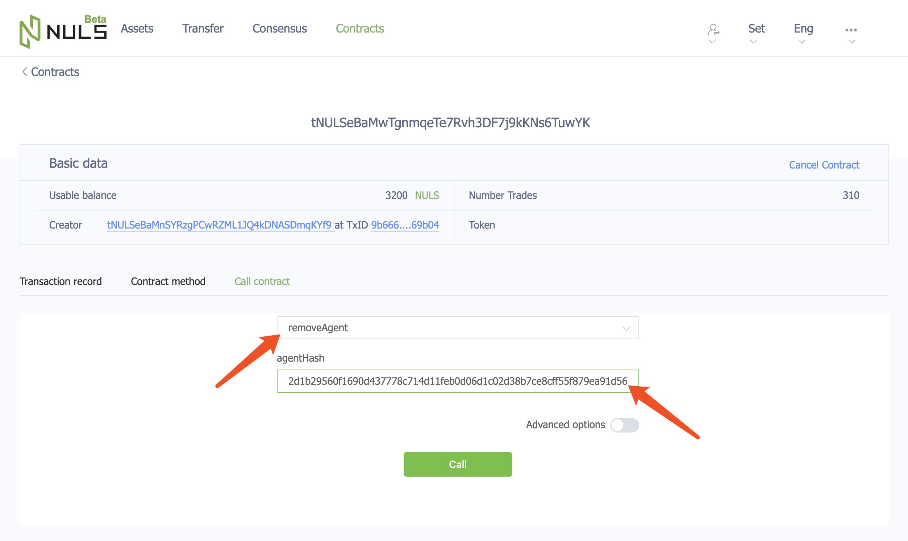

# POCM使用手册

SCO平台提供让项目方可使用的POCM智能合约用于创建SCO节点。NULS的持有人可以将手中的币委托到项目方的SCO节点上来获取新生成的项目代币作为收益，而不是通常的NULS委托挖矿。SCO项目节点可以持续或得NULS的staking收益，用作为项目进一步的发展资金。SCO平台和POCM允许其他公链和资产以相同的方式在其生态内发行

## 测试环境
POCM是一个基于智能合约的去中心化产品，用户（尤其是项目发行方）可在测试环境熟悉操作流程，避免进行误操作，造成资产损失

- POCM测试环境地址：[http://beta.pocm.nuls.io/](http://beta.pocm.nuls.io/)
- 轻钱包测试环境地址：[https://beta.wallet.nuls.io](https://beta.wallet.nuls.io)
- 浏览器测试环境地址：[http://beta.nulscan.io/](http://beta.nulscan.io/)

## NULS持有者

你可以将持有的NULS抵押到你看好的项目，即可获得对应项目的Token，且用于抵押的NULS不会损失，在POCM平台上NULS持有者参与步骤如下：

### 参与POCM

[在POCM平台](http://pocm.nuls.io/)上，点击【选择项目】菜单，进入页面后选择认可的项目，点击进入项目详情页面

在项目详情页面，输入想要抵押的NULS数量（其中抵押数量不可低于项目团队设置的最低值，该值可在项目详情中查看），点击【参与POCM】

### 领取收益

每过5个区块高度的时间，合约就会发放一次奖励。奖励发放后，用户需进入【用户中心】页面点击列表右侧的【领取收益】，领取成功后合约会将收益实时转入参与地址，锁定时间结束后Token即可被使用（具体解锁时间可查看项目详情）

> 领取奖励是一个调用合约的操作，所以需消耗少量的NULS

### 追加奖励

用户可在项目详情继续参与某一个项目的POCM，也可通过【用户中心】页面的参与项目列表右侧的【追加】按钮进行追加

## 项目团队

你可以通过[POCM（SCO发行平台)](https://pocm.nuls.io/)的形式，吸引NULS社区成员成为第一批支持者，持续获得NULS节点共识收益作为项目发展基金，优先获得NULS社区及生态的全面赋能，POCM平台上项目团队参与步骤如下：

### 提交基本信息

在POCM平台上点击【选择项目】菜单，进入页面后点击【发行项目】按钮并填写基本信息并提交

### 发行通证

在POCM平台上点击【发行通证】菜单，进入页面后，在表单中填入通证信息发行自己的NRC-20通证（请注意准确填写通证名称和符号，需和上一步基本信息中的通证信息保持一致）

### 发行POCM合约

基本信息提交后，项目团队需发送一个邮件到邮箱：pen@nuls.io ，邮件中内容如下：
- 项目名称
- 提供一个账户地址（请自行保管好地址私钥），用于后续发布POCM合约

得到邮件回复确认后，用户可在POCM平台上导入该账户，进入【用户中心】页面发行POCM合约

按照项目团队自己的POCM分发规则，填写表单然后发布合约

### 将通证转入合约

 在[钱包](https://wallet.nuls.io/)中导入持有通证的地址，进入【合约】页面，找到通证合约并点击【调用】

进入调用页面，选择通证合约的`transfer`方法

填写已经发布成功的POCM合约地址，然后填入转入的Token数量（因为计算单位原因，需在实际数量后加n个0,n=发行token时候填写的精度），最后点击【调用】

此时用户已经可以在POCM平台上看到该项目信息，并可以往该项目的合约地址抵押NULS获取通证了

### 添加节点

**在NULS网络上，通过委托NULS到共识节点产生的收益将会被分为两部分：**
- 共识节点佣金（委托产生的共识奖励 * 共识节点佣金比例），该部分直接分给共识节点的奖励地址
- 委托者奖励（委托产生的共识奖励 - 委托产生的共识奖励 * 共识节点佣金比例），该部分直接分给委托地址

在POCM平台上，POCM合约会将用户抵押给合约的NULS委托给你所添加的共识节点，合约地址将会收到通过委托产生的委托者奖励，合约的创建地址有权限将委托者奖励转出，转出方法为在钱包的【合约】页面中调用`transferConsensusRewardByOwner`方法

**节点的来源有两种方式：**
- 自己[创建节点](https://docs.nuls.io/zh/Guide/g_pocm.html)，使用该方式，项目方可以同时收到共识节点佣金和委托者奖励
- 使用NULS网络上已有的共识节点，使用该方式，项目方只能收到委托者奖励

**节点的具体添加方法：**

在POCM平台上，点击【用户中心】，进入页面后点击【添加节点】，输入节点的ID

节点添加成功后，POCM合约将会把用户抵押的NULS依次委托给添加的节点，若有多个节点，委托顺序为节点的添加顺序

若需要删除某个已添加的节点，需进入钱包（操作地址为创建POCM合约的地址）的【合约】页面，找到POCM合约，点击【调用】

选择合约的`removeAgent` 方法，输入节点的hash值，点击【调用】，合约调用成功，则节点删除成功

在下个版本的POCM平台上将会支持直接在【用户中心】页面删除节点，请耐心等待

## 共识节点

作为NULS网络的共识节点，可以与项目方合作。方式为：项目方在POCM平台上将你的节点添加为项目的运行节点，这样用户抵押进项目合约的NULS，将会自动委托到你的节点上。节点可获得以下两个部分的收益

- 节点的委托量会增加，因此节点会收到更多NULS佣金
- 节点【创建地址】会收到来自项目方的Token，数量和节点的抵押金成正比，详细公式为：节点获得的Token数量 = 你的节点抵押金 /（用户抵押NULS总数 * 0.9 + 项目上运行的所有节点抵押金总和）* 项目方分发的Token总数 

**领取项目方分发Token方式为：** 在POCM平台上导入创建节点的地址，然后进入【用户中心】，进入页面后点击列表右侧的【领取奖励】，即可在自己的钱包资产页面收到Token

