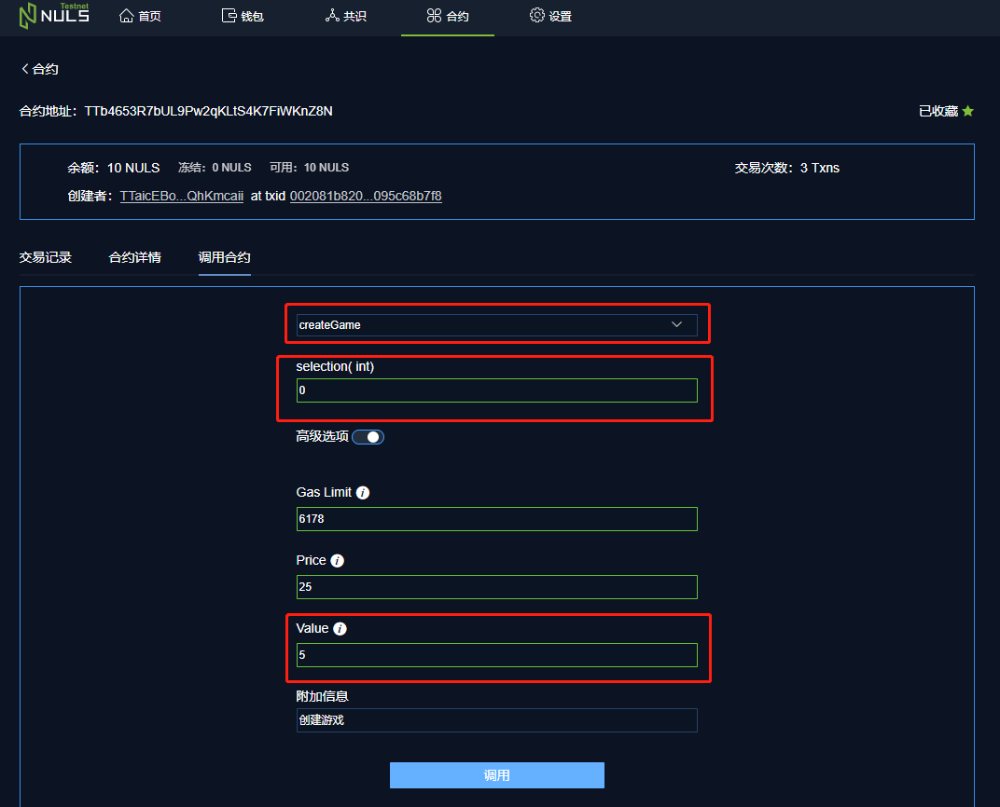

# 猜大小游戏客户端操作手册

> 目前猜大小游戏合约部署在测试网上运行，如果需要测试网NULS，可[进行申请](http://testnet.wallet.nuls.io/#/testNetNULS/testNetNULS)

#### 合约地址：TTb4653R7bUL9Pw2qKLtS4K7FiWKnZ8N

## 查找合约

1 打开钱包客户端，点击顶部【合约】菜单

2 点击【查找合约】，在输入框中填入合约地址，点击访问。即可查找到该合约

3 还可点击合约右侧的星进行收藏。收藏后可在【我的合约】中看到该合约

## 创建游戏

1 下拉列表中选择【createGame】方法

2 在【selection】输入框中填写值：

- 0代表【猜小】
- 1代表【猜大】

3 点击【高级选项】，在【value】输入框中填入值，该值代表本轮猜大小游戏中你所下注的NULS数量

4 点击【调用】按钮，创建本轮游戏

5 从返回结果中找到该轮游戏的ID

## 加入游戏

1 从游戏创建者或等待参与的游戏列表中拿到想要参与的某轮游戏ID

2 在下拉列表中选择【joinGame】方法，在【gameId】输入框中填入本轮游戏的ID

3 点击【高级选项】，在【value】输入框中填入下注的NULS数量，且该数量要和创建者的下注数量相同

4 点击【调用】按钮，加入游戏

## 开奖

> 为防止技术作弊，合约会要求随机确认几个块才可开奖，上限为10。因此加入游戏后最多确认10个块之后即可进行开奖

1 下拉列表中选择【draw】方法，【gameID】输入框中填入本轮游戏的ID

2 点击【调用】按钮，进行开奖。调用完成后会返回游戏结果，且合约会将赢得的NULS和抵押的NULS一起转入获胜账户地址

> 由于需防止技术作弊，

## 撤销游戏

> 若创建游戏100个块之后还没有参与者，则本轮游戏创建者可选择撤销游戏，拿回下注的NULS

1 下拉列表中选择【interrupt】

2 【gameId】输入框中填入想要撤销游戏的Id，点击【调用】按钮，即可撤销该轮游戏

## 查看游戏详情

1 下拉列表中选择【viewGameDetail】

2 【gameId】输入框中填入想要查询游戏的Id，点击【调用】按钮，即可获取该轮游戏详情

## 查看本合约创建了多少个游戏

下拉列表中选择【viewGamesTotalCount】方法，点击【调用】按钮即可

## 查看等待参与的游戏

下拉列表中选择【listRunningGames】方法，点击【调用】按钮即可

## 查看等待开奖的游戏

下拉列表中选择【listRunningGames】方法，点击【调用】按钮即可

