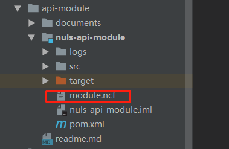

# 开发业务模块

​	阅读本文之前,请先阅读[生成程序包](/zh/NULS2.0/packageGeneration.html)

​	NULS2.0是基于模块化开发的区块链项目。根据区块链的特点以及NULS特有的POC共识机制，我们已内置账户、账本、网络、区块管理、交易管理、共识、智能合约模块，这些模块已经可以满足NULS2.0区块链节点的正常运行。但基础模块不可能满足所有的业务需求，本文会引导开发者如何添加自己的模块以及如何添加自己的协议。

​	在添加模块之前，我们首先应该对业务做需求分析，需要明确的知道，添加的模块只是对现有协议的封装与加工处理，还是说现有的协议不满足业务的需求，必须要新增加协议与协议的逻辑处理来实现功能。

​	本文用api-module和account两个已开发的模块来举例说明如何添加自己的模块（两个模块均为JAVA开发，可到https://github.com/nuls-io/nuls_2.0上下载源码阅读）。

## ​添加模块但不增加协议

​	api-module模块负责对钱包内已存储的区块数据做二次解析，给钱包页面和浏览器提供可展示的信息。因此模块不需要额外增加协议。

1. 在ModuleE枚举类里添加新模块

2. 创建模块的Bootstrap启动类

   启动类需继承RpcModule类，便于mykernel核心模块管理。继承之后需要实现特有方法，如下图所示：

   

添加依赖模块：如果你的模块需要调用其他模块的接口查询相关数据，或者是需要其他模块运行之后，你的模块才能正常运行，就需要在这里添加所依赖的模块。如下图所示：

模块初始化：如果模块有需要初始化的数据，可以在这里实现，init方法里必须调用super.init()，确保依赖注入成功。如下图所示：

启动运行：启动运行里可以启动自己的服务进程，启动成功后返回true，若启动失败，程序捕获异常后返回false，告知mykernel核心模块。如下图所示：

依赖模块已启动： 走到这一步表面你所依赖的模块都已经成功启动，这个时候就可以调用其他模块的接口了。

api-module模块主要功能就是查询其他模块的接口，然后解析数据返回给钱包页面展示，因此模块真正的运行是在scheduleManager.start()这一步做的，内部的实现详见源码。

到此为止，api-module模块已经成功加入nusl2.0。由于没有新增的协议，模块内部只需要编写模块本身的业务功能即可。

## 添加新协议

​	我们用账户模块的别名交易来举例说明如何新增协议。别名交易顾名思义就是账户发送一个交易，交易里带有账户想要设置的别名信息，一旦交易被共识节点成功打包到区块中，就表明账户设置别名成功。页面在显示该账户信息的时候都会显示账户别名。

​	第一步：添加交易类型

​	 每一种交易都需要单独设置自己的交易类型。交易类型不能与其他模块的交易类型重复。有关其他模块的交易类型，详见RPC文档。

​	第二步：创建交易逻辑对象

​	交易逻辑对象属于交易里存储的业务逻辑数据，例如别名交易里就存的别名信息，对象需继承TransactionLogicData类。如下图：

​	由于逻辑数据最终会序列化为byte数组在网络中广播，因此还需要实现序列化和反序列化的方法。如下图：

​	

第三步：创建交易相关RPC接口。接口应包括创建交易、验证交易、处理交易、回滚处理交易。

用户通过创建交易接口能顺利组装交易并广播到全网；

验证交易接口会由交易管理模块统一调用，验证失败的交易会丢弃；

验证通过的交易会由共识模块统一调用处理交易接口，存储到本地数据库中;

当有区块回滚时，由区块管理模块统一调用回滚交易接口，将存储在本地的交易相关数据清除；

有关代码的实现详见：io.nuls.account.rpc.cmd.AliasCmd

第四步：启动模块注册交易

模块在启动的时候，需要在doStart()里向交易管理模块注册自己模块新增的交易，以及对应的验证器和处理器，如下图：

之后就和api-module一样，在自己的模块里添加其他业务逻辑相关的代码实现即可。

最后，记得在模块的类下添加module.ncf配置文件，如下图：

