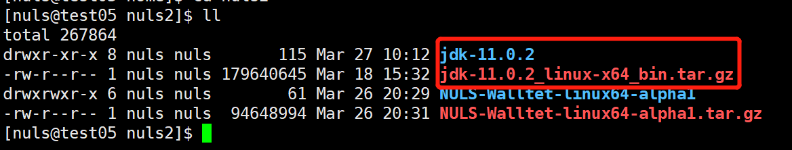
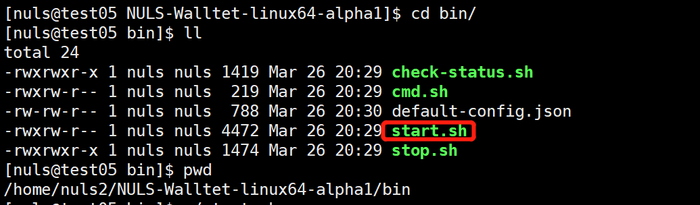

# 快速开始

## 一、安装JDK11

下载JDK11到服务器并解压。

### 1、下载jdk11

jdk11下载地址：[jdk11下载](https://www.oracle.com/technetwork/java/javase/downloads/jdk11-downloads-5066655.html)

### 2、上传至服务器并解压

```
tar -zxvf jdk-11.0.2_linux-x64_bin.tar.gz
```



### 3、配置环境

**vi /ect/profile**

将下面的代码复制写入文件

```
JAVA_HOME=/home/nuls2/jdk-11.0.2
PATH=$PATH:$JAVA_HOME/bin
CLASSPATH=:$JAVA_HOME/lib/dt.jar:$JAVA_HOME/lib/tools.jar
export JAVA_HOME PATH CLASSPATH	
```

**ps**:/home/nuls2/jdk-11.0.2为jdk加压之后的路径，请根据自己的实际路径配置。

**source /ect/profile** 执行该命令配置生效。

通过java -version查看jdk版本：


## 二、下载、安装客户端

### 1、下载NULS钱包

进入GitHub下载最新版的NULS2.0 Alpha1钱包：[下载地址](https://github.com/nuls-io/nuls_2.0/releases)

### 2、上传至服务器并解压

```
tar -zxvf NULS-Walltet-linux64-alpha1.tar.gz
```


## 三、进入CLI

### 1、启动钱包

钱包解压之后，进入start.sh文件目录：/home/nuls2/NULS-Walltet-linux64-alpha1/bin



执行命令：**./start.sh -D** 

### 2、进入命令行

钱包启动之后，执行同目录下的cmd.sh（./cmd.sh）进入钱包命令行，将会提示NULS命令输入提示符：`nuls&gt;&gt;&gt;  `，输入NULS钱包操作命令，进行操作。


## 四、部分操作命令说明

### 1、创建账户

命令：**create** [Number]

```
Number：创建账户地址的数量，默认为1，最大为100
```


### 2、备份keystore

命令：**backup** &lt;address&gt;  [Path]
  
```
Address：待备份的账户地址（必填）
Path：生成备份文件的目录，默认为当前目录（可选）
```

### 3、获取私钥

命令：**getprikey** &lt;address&gt;

```
Address：获取私钥的账户地址（必填）
```

### 4、移除账户

命令：**remove** &lt;address&gt;

```
Address：待移除地址（必填）
```

### 5、修改账户密码

命令：**resetpwd** &lt;address&gt;

```
Address：修改密码的账户地址（必填）
```

### 6、转账

命令：**transfer** &lt;FormAddress/FormAlias&gt; &lt;ToAddress/ToAlias&gt;&lt;amount&gt; [Remark]

```
FormAddress/FormAlias：转出地址或转出别名，二者选一（必填）
ToAddress/ToAlias：接收地址或接收别名，二选一（必填）
```

### 7、创建共识节点

命令：**createagent** &lt;AgentAddress&gt; &lt;PackingAddress&gt; &lt;CommissionRate&gt; &lt;Deposit&gt; [RewardAddress]

```
AgentAddress：共识节点创建地址（必填）
PackingAddress：共识节点打包地址，密码必须与配置文件中一致，默认为：nuls123456（必填）
CommissionRate：佣金比例，范围：10-100，最多小数位2位（必填）Deposit：保证金，范围：20000-200000，最多小数位8位（必填）RewardAddress：奖励地址，默认为节点创建地址（选填）
```

**ps**：保存好创建共识节点的hash(或者在[**浏览器**](http://alpha.nulscan.io)中查询)，加入共识和查询共识节点信息需要使用；必须保证共识节点创建地址与打包地址在一个钱包内，一个钱包不能同时创建两个共识节点。

### 8、加入共识

命令：**deposit**&lt;Address&gt;&lt;AgentHash&gt;&lt;Deposit&gt;

```
Address：加入共识的账户地址（必填）
AgentHash：创建共识节点的hash（必填）
Deposit:加入共识保证金，2000-500000，最多8位小数（必填）
```

**ps**：保存好加入共识的hash，退出共识需要使用

### 9、退出共识

命令：**withdraw**&lt;Address&gt;&lt;TxHash&gt;

```
Address：退出共识地址（必填）
TxHash：委托时的交易hash（必填）
```

### 10、停止共识节点

命令：**stopagent**&lt;Address&gt;

```
Address：共识节点创建地址（必填）
```

### 11、查询共识节点信息

命令：**getagent**&lt;AgentHash&gt; 

```
AgentHash：共识节点创建hash（必填）
```


