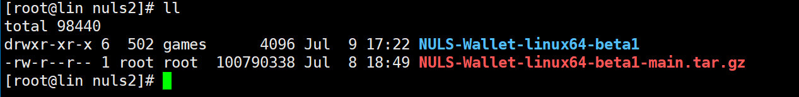
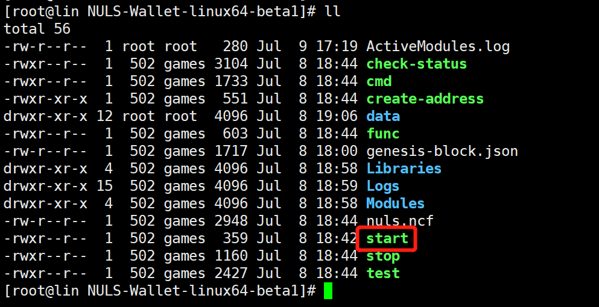
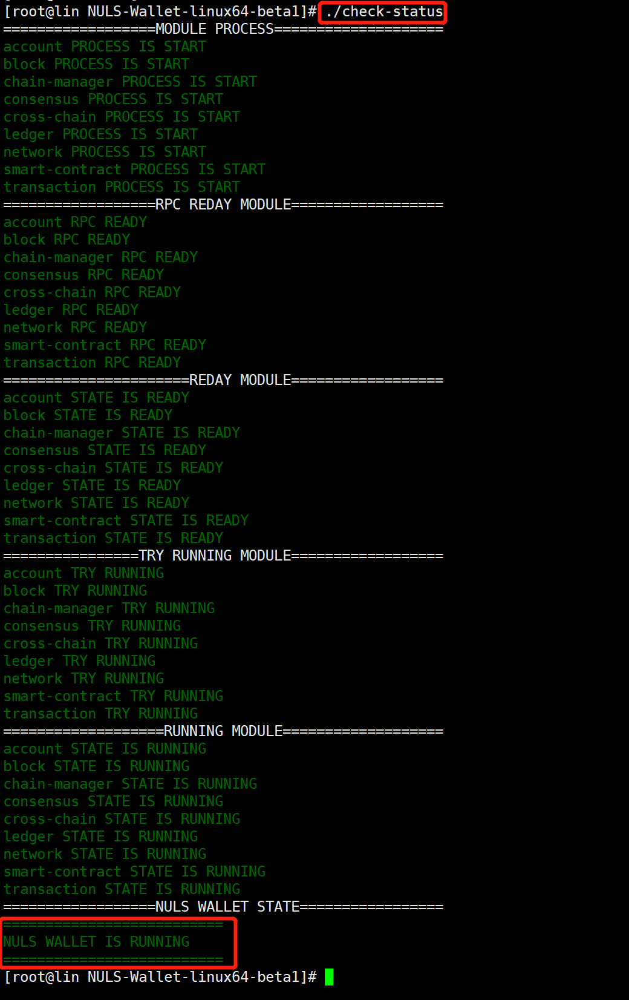
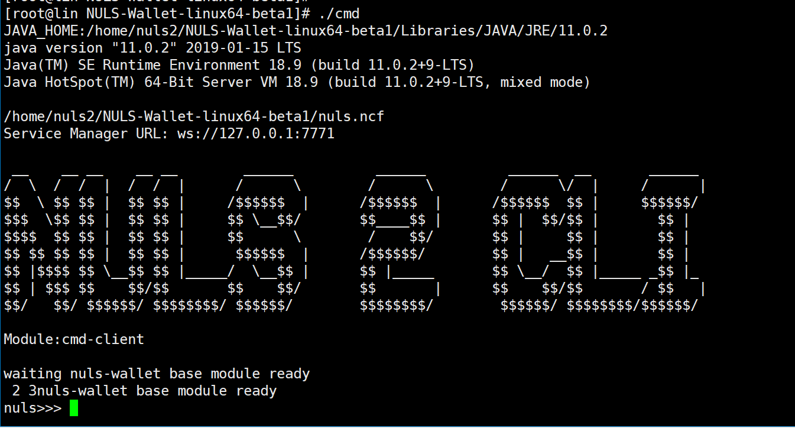

# 快速开始

## 安装钱包

### 1、下载NULS钱包

进入GitHub下载最新版的NULS2.0 beta钱包：[下载地址](&lt;https://github.com/nuls-io/nuls-v2/releases&gt;)。

钱包安装包在打包时已经加入JDK11，不需要安装jdk。

### 2、上传至服务器并解压

```
tar -zxvf NULS-Walltet-linux64-beta1.tar.gz
```



## 进入钱包

### 1、启动钱包

钱包解压之后，进入start文件目录：/home/nuls2/NULS-Wallet-linux64-beta1



执行命令：**./start**

### 2、检查启动状态

钱包启动之后，通过check-status脚本检查钱包启动情况，当显示钱包启动成功之后（如下图），即可进行其他操作。



### 进入命令行

钱包启动之后，执行同目录下的cmd（./cmd）进入钱包命令行，将会提示NULS命令输入提示符：`nuls>>>  `，输入NULS钱包操作命令，进行操作。



## 基本操作命令

### 1、创建账户

- 命令：**create** [Number]

```
Number：创建账户地址的数量，默认为1，最大为100
```
### 2、备份keystore

- 命令：**backup** &lt;Address&gt;  [Path]

```
Address：待备份的账户地址（必填）

Path：生成备份文件的目录，默认为当前目录（可选）
```

### 3、获取私钥

- 命令：**getprikey** &lt;Address&gt;

```
Address：获取私钥的账户地址（必填）
```

### 4、移除账户

- 命令：**remove** &lt;Address&gt;

```
Address：待移除地址（必填）
```

### 5、修改账户密码

- 命令：**resetpwd** &lt;Address&gt;

```
Address：修改密码的账户地址（必填）
```

### 6、转账

- 命令：**transfer** &lt;FormAddress/FormAlias&gt; &lt;ToAddress/ToAlias&gt; &lt;Amount&gt; [Remark]

```
FormAddress/FormAlias：转出地址或转出别名，二者选一（必填）
ToAddress/ToAlias：接收地址或接收别名，二选一（必填）
```

### 7、创建共识节点

- 命令：**createagent**&lt;AgentAddress&gt; &lt;PackingAddress&gt; &lt;CommissionRate&gt; &lt;Deposit&gt; [RewardAddress]

```
AgentAddress：共识节点创建地址（必填）
PackingAddress：共识节点打包地址，密码必须与配置文件中一致，默认为：nuls123456（必填）
CommissionRate：佣金比例，范围：10-100，整数 （必填）
Deposit：保证金，范围：20000-200000，最多小数位8位（必填）RewardAddress：奖励地址，默认为节点创建地址（选填）
```

**ps**：保存好创建共识节点的hash(或者在[**浏览器**](http://alpha.nulscan.io)中查询)，加入共识和查询共识节点信息需要使用；必须保证共识节点创建地址与打包地址在一个钱包内，一个钱包不能同时创建两个共识节点。

### 8、加入共识

- 命令：**deposit**&lt;Address&gt;&lt;AgentHash&gt;&lt;Deposit&gt;

```
Address：加入共识的账户地址（必填）
AgentHash：创建共识节点的hash（必填）
Deposit:加入共识保证金，2000-500000，最多8位小数（必填）
```

**ps**：保存好加入共识的hash，退出共识需要使用

### 9、退出共识

- 命令：**withdraw**&lt;Address&gt;&lt;TxHash&gt;

```
Address：退出共识地址（必填）
TxHash：委托时的交易hash（必填）
```

### 10、停止共识节点

- 命令：**stopagent**&lt;Address&gt;

```
Address：共识节点创建地址（必填）
```

### 11、查询共识节点信息

- 命令：**getagent**&lt;AgentHash&gt; 

```
AgentHash：共识节点创建hash（必填）
```