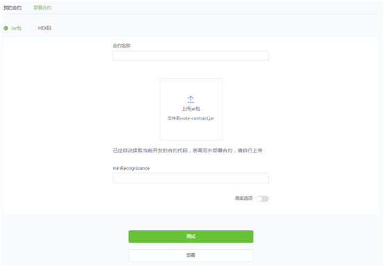
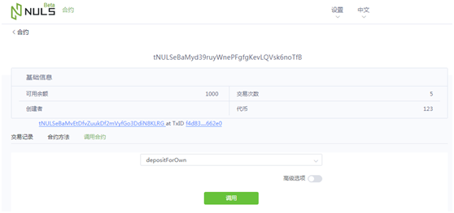
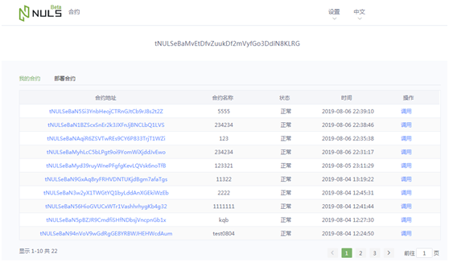
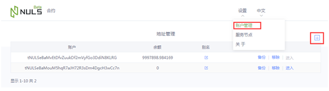
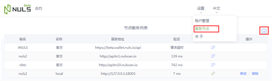
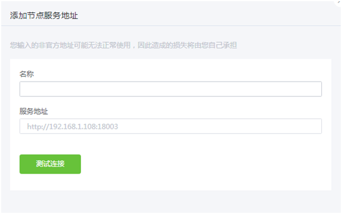

# 开发工具

## NULS智能合约Maven-archetype使用文档

### NULS智能合约Maven-archetype介绍

NULS智能合约Maven-archetype是为开发者定义的智能合约Maven项目模板，在IntelliJ IDEA添加该Maven archetype，并选择此archetype可以快速地生成NULS智能合约开发项目工程。该智能合约项目为maven项目，其中自带样本合约类，并且所有必需的NULS智能合约依赖项都自动添加到项目中，开发者只需关注智能合约业务逻辑的代码开发。

该maven archetype还集成了智能合约客户端，在通过maven打包智能合约之后，会自动启动该智能合约客户端，开发者在此客户端上进行智能合约的部署和合约方法调用。

### 开发环境

1、安装JDK8

2、安装IntelliJ IDEA

3、工程JDK运行环境

    新建工程时JDK请选择JDK8

4、IntelliJ IDEA的Maven插件JDK运行环境

    打开IntelliJ IDEA设置 -> Settings -> Build,Execution,Deployment -> Build Tools -> Maven -> Runner
    
    JRE请选择JDK8

### 新建NULS智能合约Maven工程

1、为了解决Intellij IDEA 通过archetype创建Maven项目缓慢的问题，增加maven运行参数： -DarchetypeCatalog=internal，操作步骤如下图：


2、在IntelliJ IDEA中选择新建maven项目，然后按下图（图1）的操作顺序将NULS智能合约Maven archetype添加到IDEA中。在添加archetype时参数如下：

     GroupId：io.nuls.v2
     ArtifactId: nuls-smartcontract-archetype
     Version: 1.0.0


3、选择“io.nuls.v2:nuls-smartcontract-archetype”，然后点击下一步，如下图所示（图2），创建Maven工程。

> 第一次创建时，可能会等待2~3分钟，请耐心等待


4、最后生成的maven工程如下图（图3）所示，其中pom.xml文件已经加入NULS智能合约所需的依赖jar，开发者无需修改此文件。


其中，pom文件中的配置参数说明如下：


```
第1个参数表示智能合约客户端默认获取合约JAR包的路径；
第2个参数表示智能合约客户端启动时使用的端口号；
第3个参数表示是否Maven打包时是否启动智能合约客户端；
```

5、开始NULS智能合约的业务代码开发，示例如下

[入门示例`NRC20-Token`点击进入](https://github.com/CCC-NULS/NRC20-Token)

[进阶示例`POCM`点击进入](https://github.com/CCC-NULS/pocm-contract)

### 打包NULS智能合约

完成智能合约的开发之后，通过“mvn clean package”命令或者IDEA的maven插件对智能合约进行打包，打包完成后会启动智能合约客户端，开发者可在此客户端进行智能合约的部署和调用工作。

### 部署合约

在“部署合约”页面，自动加载当前智能合约项目target目录下面的jar包，即maven打包的默认路径。若开发者需要部署其他jar包，可选择其他jar包上传并部署。



### 调用合约

当合约部署成功之后，在“我的合约”页面的列表中展示，开发者点击相应合约的“调用”按钮即可进入调用合约页面，选择调用的合约方法，填写合约方法相关的参数，点击“调用”即可完成合约方法的调用。如下图所示。



### 智能合约客户端介绍

智能合约客户端的主要功能是进行智能合约的部署和发布，同时还提供了账户创建和导入、NULS API module服务节点地址的维护等功能。客户端的主要页面包括我的合约、部署合约、账户管理、服务节点。

智能合约客户端的主要优势是，开发者无需在本地部署NULS钱包，仅运行该客户端即可进行智能合约的部署和合法方法调用工作。

#### 我的合约

在“我的合约”页面可以查看选中的账户地址下已经部署的合约列表，点击“调用”按钮可以进入合约方法的调用页面。



#### 部署合约

在“部署合约”页面进行合约的部署，可以选中“jar包”或“HEX码”两种方式部署合约。


#### 账户管理

在进行智能合约部署和发布之前，必须通过“进入”按钮选择账户地址，若无账户信息则可以通过创建账户或者导入账户两种方式实现。操作页面如下图所示。



#### 服务节点

服务节点是指NULS Public-Service模块的URL地址，当不选择服务地址时，默认使用官方提供的测试网的Public-Service服务`http://beta.public1.nuls.io`，操作页面如下图所示。



