# 客户端钱包使用指南
## 客户端
### 获取

​	在NULS官网（nuls.io）下载钱包客户端后运行程序。

### 安装

​	NULS钱包客户端是绿色免安装的，文件解压之后直接点击文件夹里的exe应用程序就可以进入客户端界面。

## 账户

### 创建账户

#### 钱包无账户时创建账户

​	钱包语言已切换为中文，开始创建自己的账户。点击顶部菜单的“钱包”开始“创建账户”，界面如图1：

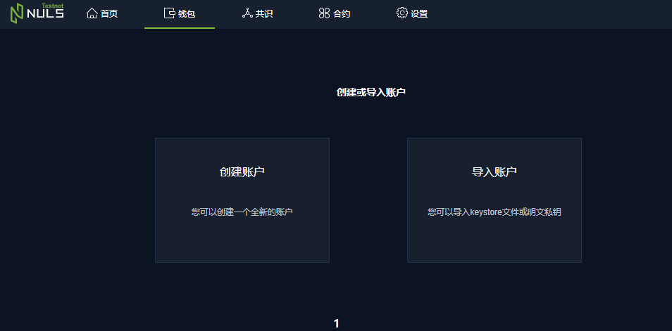

##### 创建有密码的账户

​	点击“创建账户”之后，首先设置密码，输入两次密码一致，注意密码规则：8-20位字符，需包含字母和数字。

然后点击“确定”，界面如图2：

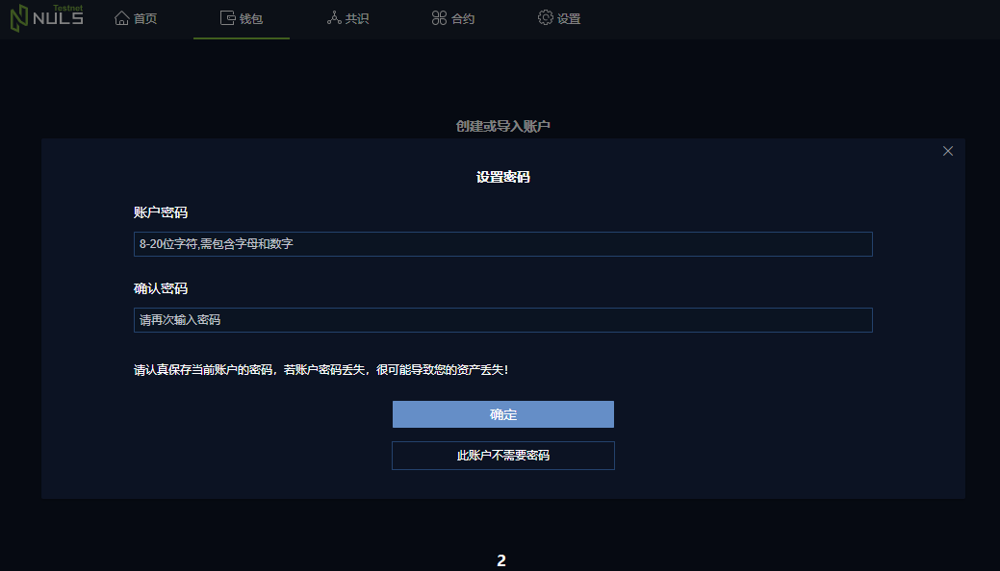

​	**PS：账户密码一定要认真保存，丢失后将无法进行转账和共识等关键操作。**

##### 创建不带密码的账户

​	点击“创建账户”后，弹出设置密码窗口，直接点击“此账户不需要密码”即可创建无密码账户。

#### 钱包有账户时创建账户

​	点击顶部菜单的钱包，进入钱包页面后，点击“账户管理”图标（见图3）：

​	进入账户管理界面之后，点击账户列表右上方的“+”（见图4），进入创建或导入账户界面（见下图5）。

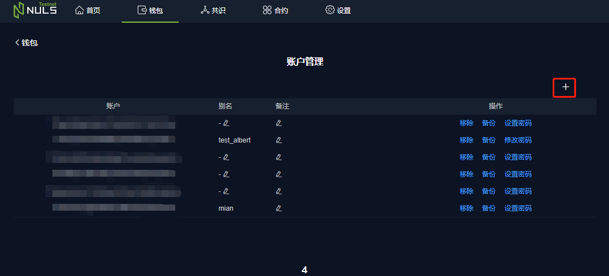

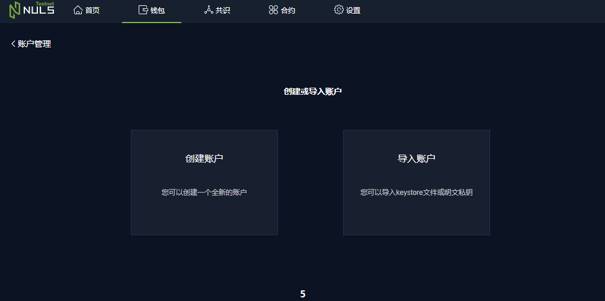

​	选择“创建账户”，之后的操作请参照“**创建有密码账户**”和“**创建不带密码账户**”。

### 备份账户

#### 备份入口

​	账户创建成功之后，此时需要立即进行账户备份，以保证账户资产安全。

- 方式一：点击顶部菜单中的“设置”，进入设置页面之后，点击“账户备份”按钮（见图6），进入账户管理界面（如图7）。

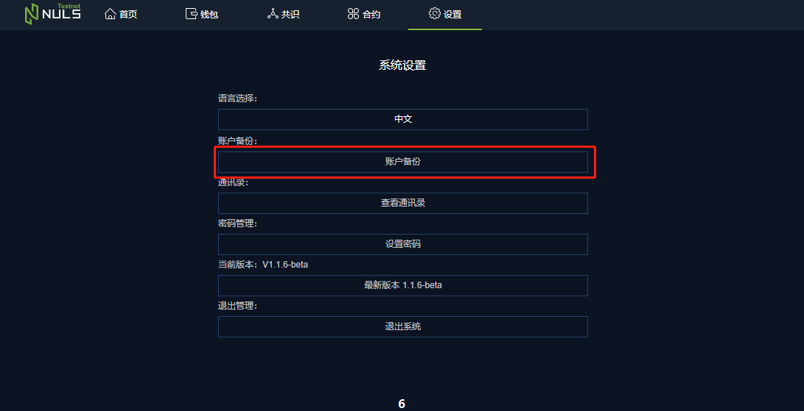

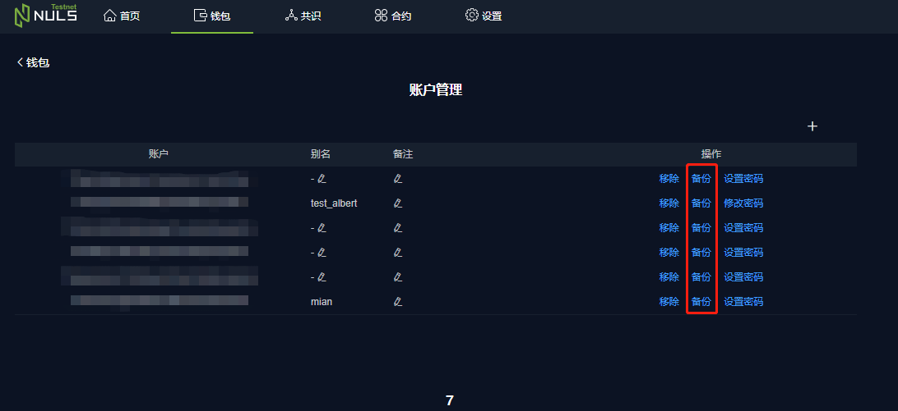

- 方式二：点击顶部菜单“钱包”，再点击“账户管理”图标，进入账户管理界面（图7）。
- 方式三：钱包地址创建成功后，直接在完成界面进行备份，设置密码的地址备份界面（图8），没有设置密码的地址备份界面（图9）。

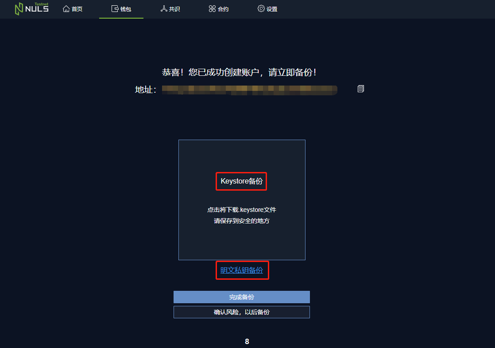

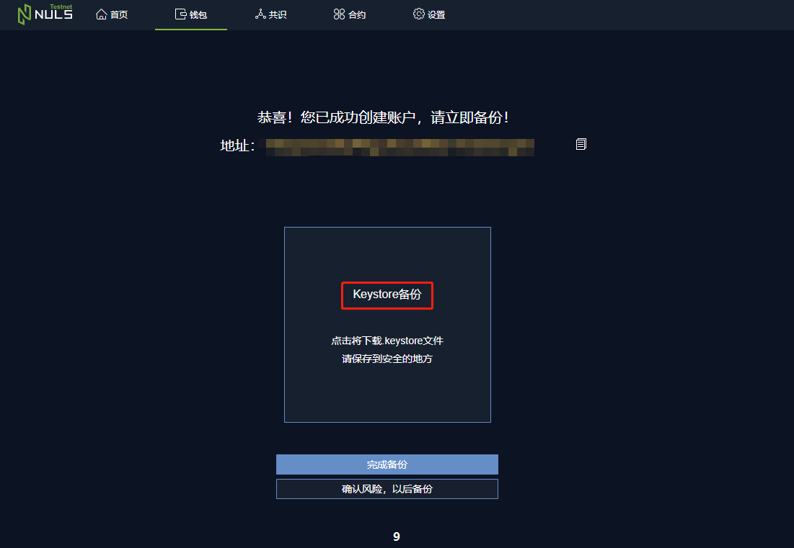

- 当账户已经设置密码，点击“备份”，弹出密码确认框，输入正确账户密码之后进入钱包备份界面（图10），可进行Keystore备份和私钥备份；
- 当账户未设置密码，点击“备份”，直接跳转至账户备份界面（图11），只能进行Keystore备份。

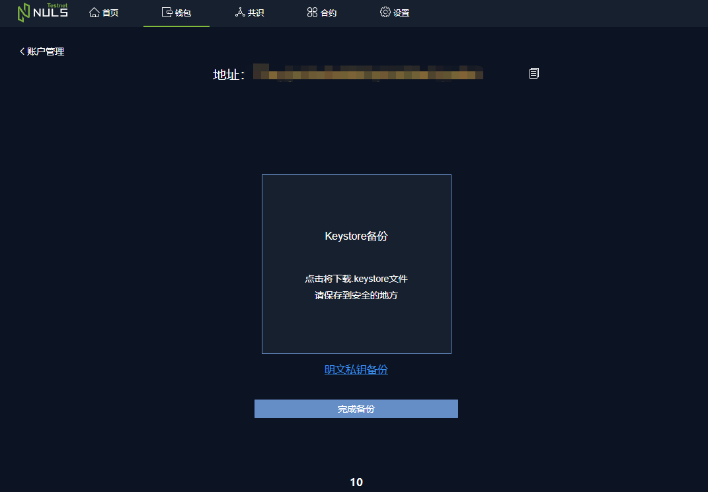

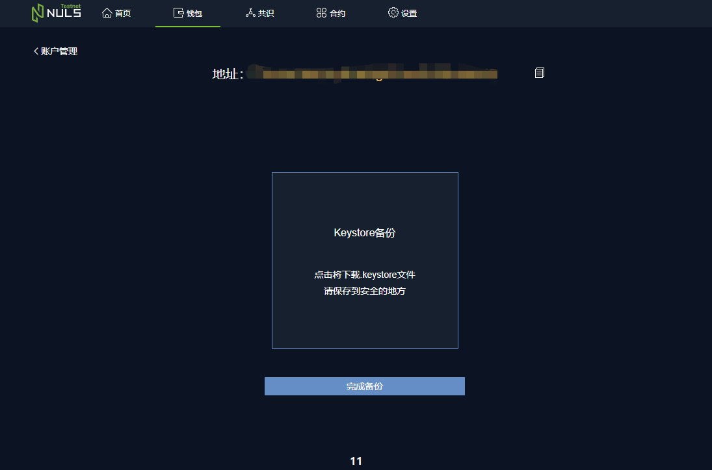

#### 明文私钥备份

​	进入已经设置密码账户备份界面，点击“明文私钥备份”，弹出私钥备份窗口，然后点击“复制”按钮（图12），提示复制成功。

#### Keystore备份

​	点击“Keystore备份”，直接显示Keystore保存路径（图13），在该路径下可以查看Keystore备份文件。

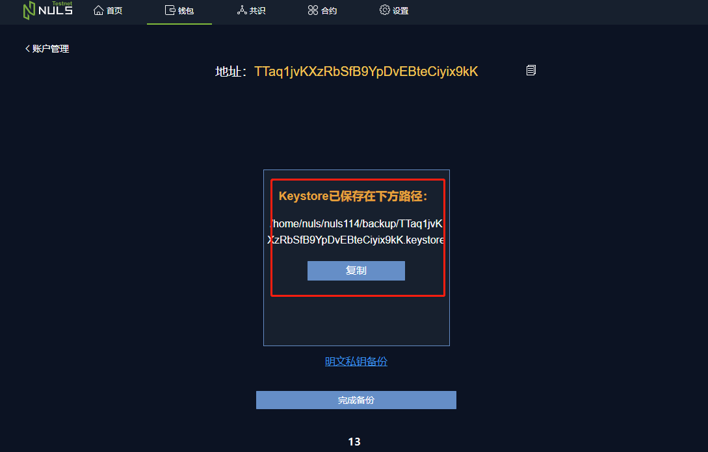

### 导入账户

#### 钱包中无账户时导入账户

- 点击顶部菜单的“钱包”，选择“导入账户”（图14）；
- 进入导入账户页面（图15）；
- 选择备份时的明文私钥或者Keystore文件进行导入，将备份账户导入钱包。

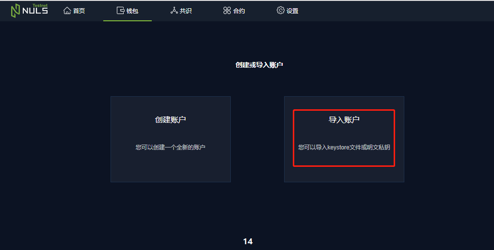

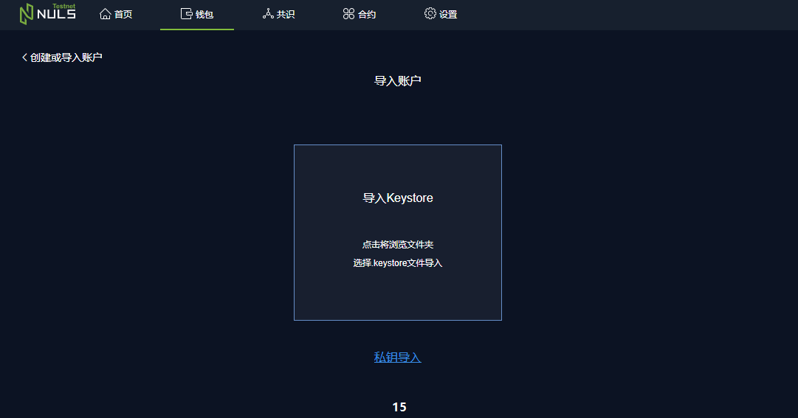

#### 钱包中已有账户时导入账户

 - 如果钱包中已有账户地址，点击顶部菜单的“钱包”进入钱包界面；
 - 点击钱包页面的“账户管理”图标（图16）进入账户管理界面（图17）；
 - 点击账户管理界面右上角的“+”进入创建或导入账户界面（图18），选择导入账户进入导入账户界面（图19）
 - 选择明文私钥（导入时可以设置密码，也可以不设置密码）或者Keystore文件（如果备份Keystore文件是账户已经设置了密码，则导入的时候需要进行密码确认才能成功导入）进行导入，将已有的账户导入钱包。

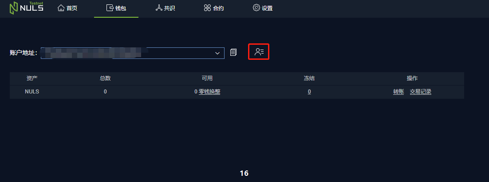

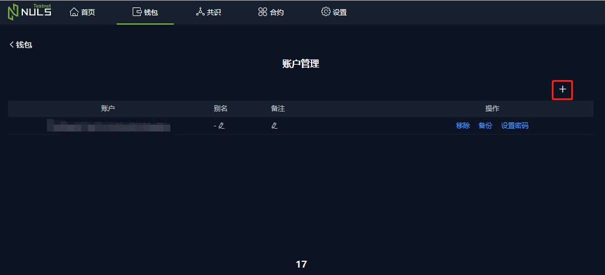

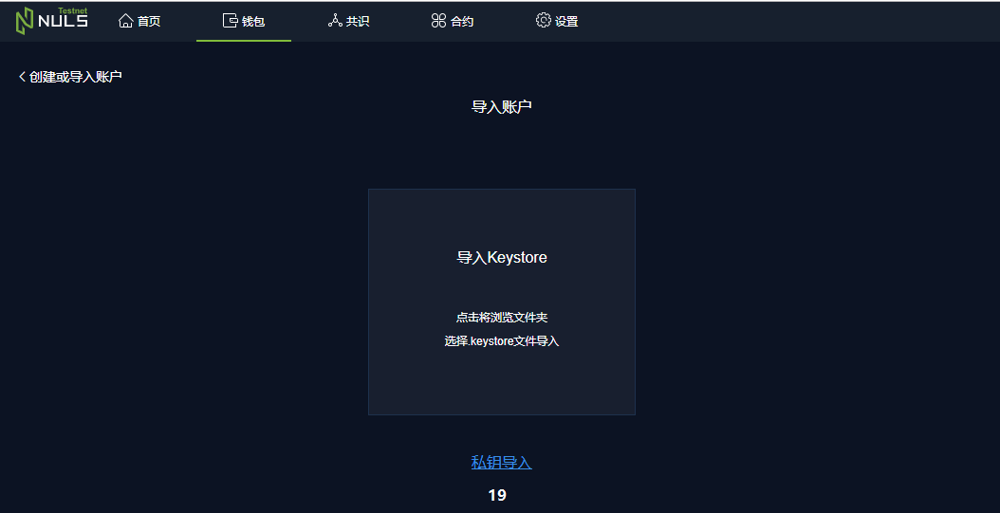

### 管理账户

- 在钱包界面，点击账户管理图标进入账户管理界面，此界面展示了钱包的所有账户信息，可花费NULS对账户设置别名（图20），一旦设置便不可更改。
- 该界面也可以移除和备份账户，备份流程见“备份账户”。
- 该界面可以进入创建或导入账户界面，其流程与“创建账户”、“导入账户”一致。
- 该界面可以对没有密码的账户进行密码设置，对已有密码的账户可以进行密码修改（具体流程见“修改密码”、“设置密码”），账户管理界面如图21。

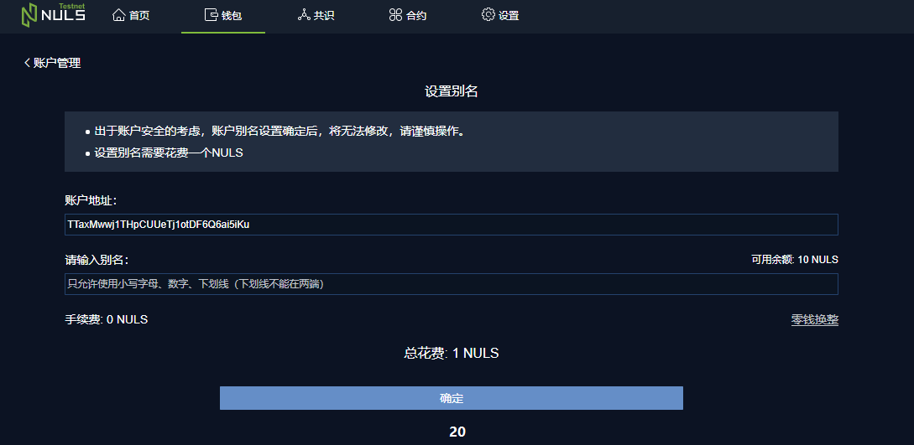

​	账户管理界面还可以对已有账户设置备注（图22）

### 交易

- 钱包首页展示了当前账户的资产情况，包括总额、可用和冻结；
- 可以通过账户地址的下拉框切换不同账户查看账户信息
- 在账户资产页面，点击资产后面的“转账”（图23）进入转账界面（图24）。

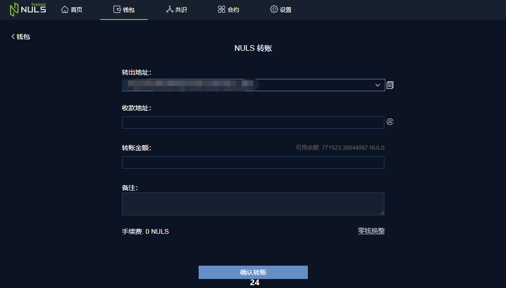

- 进入转账界面之后，转出地址可以通过下拉列表进行选择；
- 输入收款地址（可以点击收款地址输入框后面的头像图标选择通讯录中已经保存的联系人，选择之后地址自动填入收款地址输入框）；
- 输入正确的转账金额（备注可选填）；
- 点击确认转账即可进行转账（若转出地址有密码，需要输入正确的密码发起转账交易）；
- 转账完成之后进入转出地址交易记录界面，可以查看该交易进度（图25）。

​	点击txid可以查看转账详情，界面如图26。

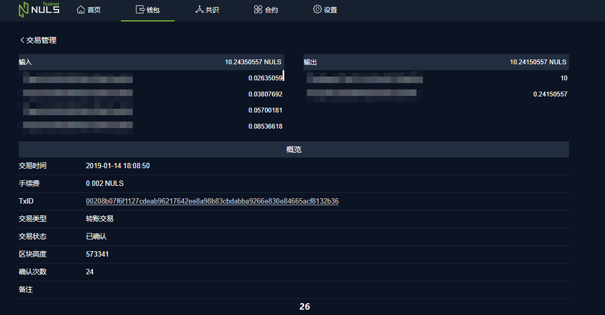

​	

## 共识
### 创建共识节点

​	点击钱包顶部菜单的“共识”，进入共识界面，该界面展示了共识的总览信息，包括全网的委托总额和节点总数以及自己的参与共识情况，界面下方展示了全网所有的共识节点和自己创建、委托的共识节点信息（图27）

- 当前账户（未受红牌惩罚）还未创建节点，点击我的总体情况中的创建（图27中红框标识），便可进入创建节点界面（图28）
- 输入正确的必填信息，考虑到安全问题，出块地址必须使用自己创建的其他账户地址，创建节点的保证金范围：20000-200000NULS，代理佣金比例（10%-100%）一旦确定便不可更改
- 点击确定经过密码确认之后便成功创建节点，节点创建成功后返回共识页面（图27）。

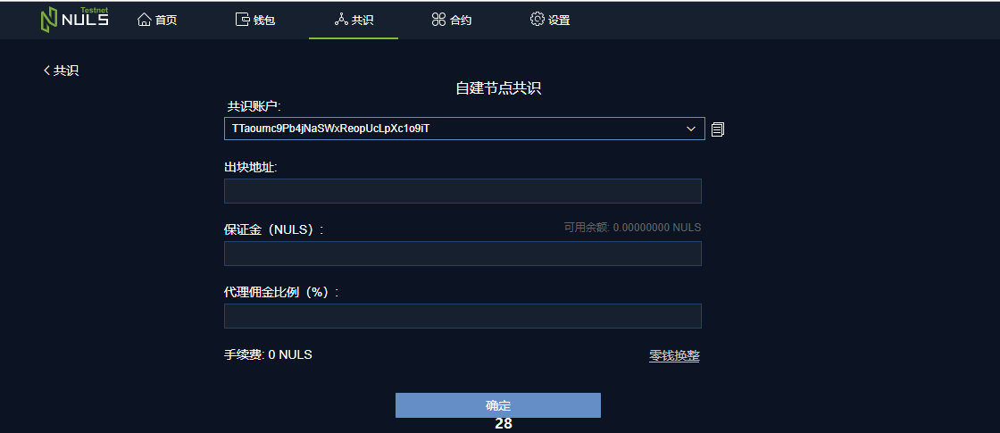

**PS：创建节点时，出块地址不能设置密码，节点正常出块过程中，出块地址不能设置密码，否则无法正常出块并影响节点信用值**

### 注销共识节点

​	账户自己创建的节点可以进行注销（节点注销之后，创建节点时的保证金会被冻结3天），点击钱包顶端菜单“共识”进入共识界面（图29），点击我的总体情况中创建节点后面的查看（图29红框标识）。

​	进入节点详情页面（图30），点击“注销节点”按钮，确认密码之后则节点注销成功。

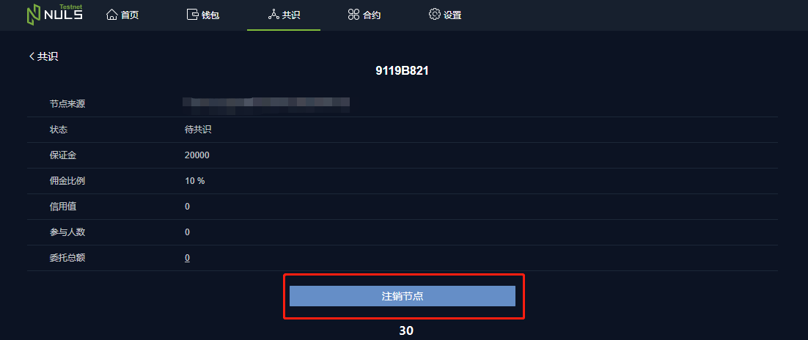

### 参与共识

- 在共识界面中，我的总体情况点击委托节点后面的“委托”入口（也可以直接点击节点列表中的某个未委托节点进入）；
- 在参与共识界面（图31）显示节点的信息（节点ID、节点来源、佣金比例、保证金、参与人数、信用值、委托数量）；
- 可以在该界面直接选择委托地址，输入保证金参与委托（需要确认密码）。

### 追加和退出共识

​	在共识界面中，我的共识table页中点击某个节点进入节点详情（图32），此页面可以进行追加委托保证金和选择退出共识。

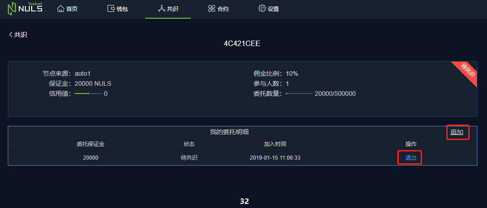

## 设置

​	点击顶部菜单的“设置”，进入系统设置界面（图33），可以对系统语言、通讯录、密码进行设置和账户备份、版本升级、退出系统。

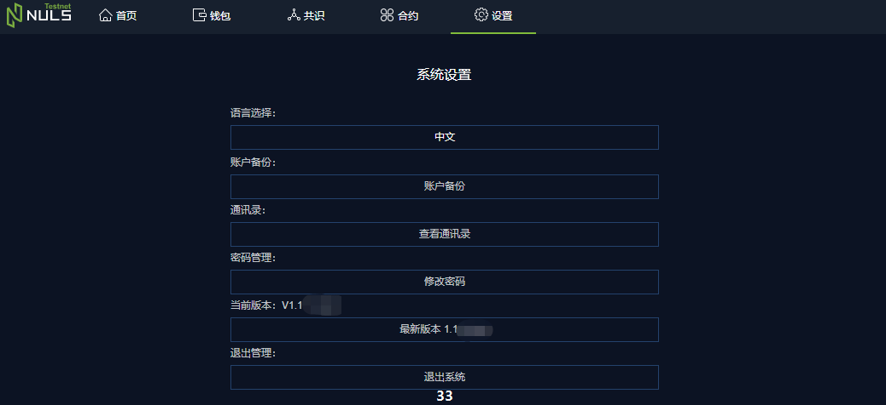

### 语言切换

​	系统设置界面中可以对系统语言进行中英文切换（图34）。

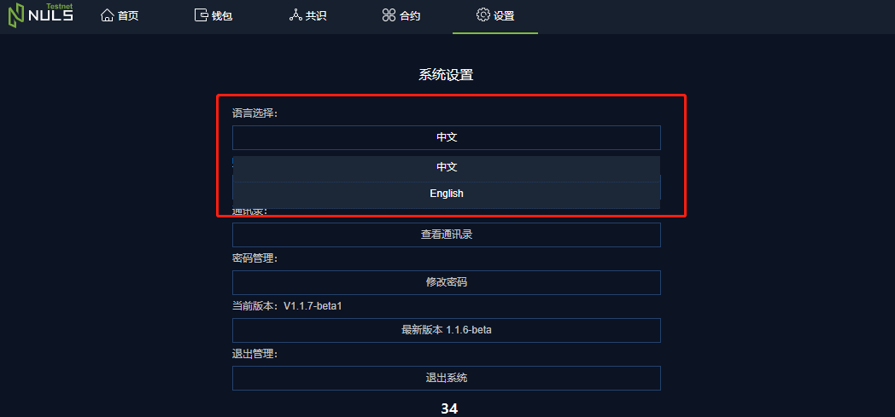

### 查看通讯录

​	系统设置界面可以查看通讯录，在通讯录界面（图35）可以对通讯录进行新增、编辑和删除操作。

### 设置/修改密码

#### 设置密码

​	在系统设置中，对为设置密码的账户地址可以进行密码设置（图36），设置密码需要符合密码规则。

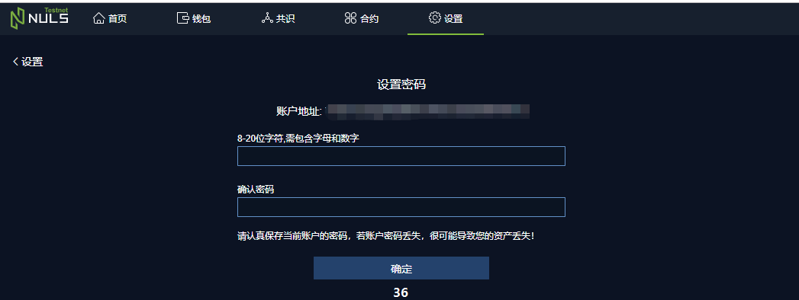

#### 修改密码

​	在系统设置中，对已经设置密码的账户地址可以进行密码修改（图37），修改密码时，需要输入账户地址当前的正确密码，修改的密码需要符合密码规则。

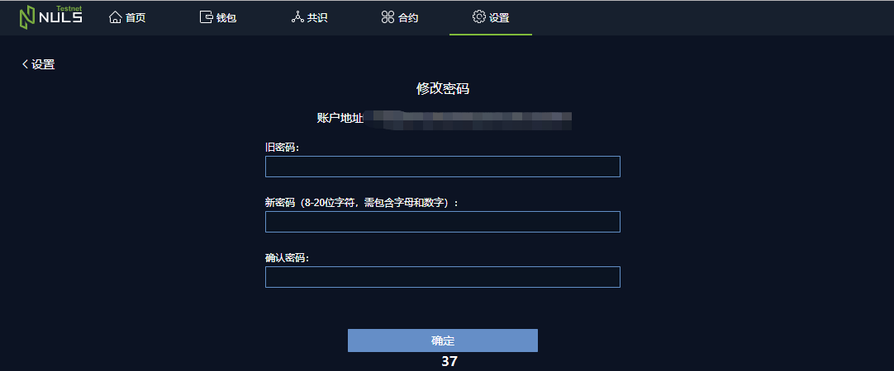

### 版本升级

​	在系统设置中，当最新版本号高于当前版本号时，可以直接点击“最新版本”（图38），对系统进行升级。

### 退出系统

​	在系统设置界面进行退出操作，直接点击“退出系统”按钮（图38）即可。

