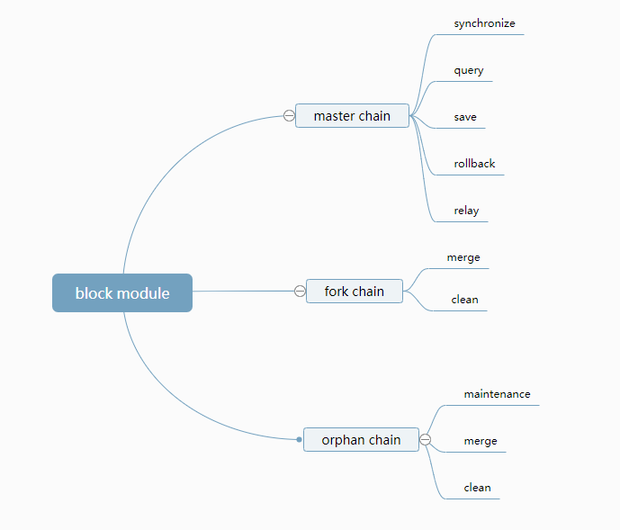
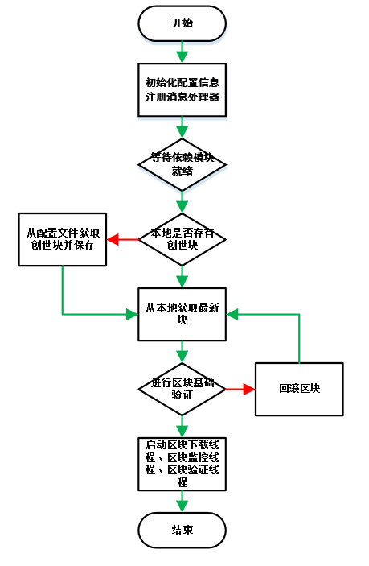
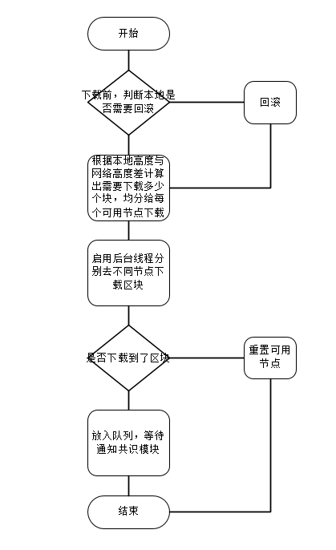
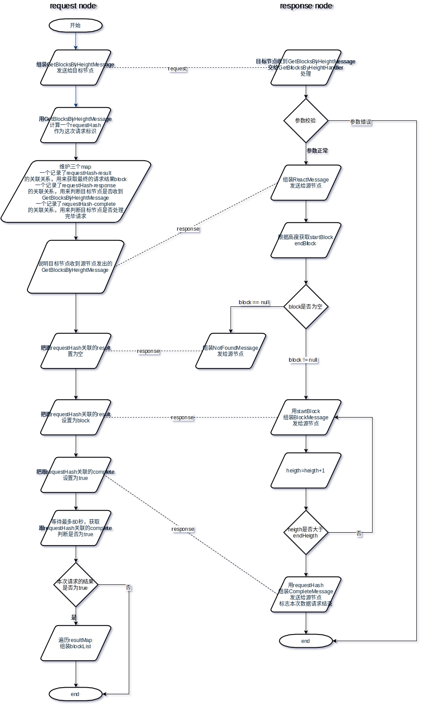
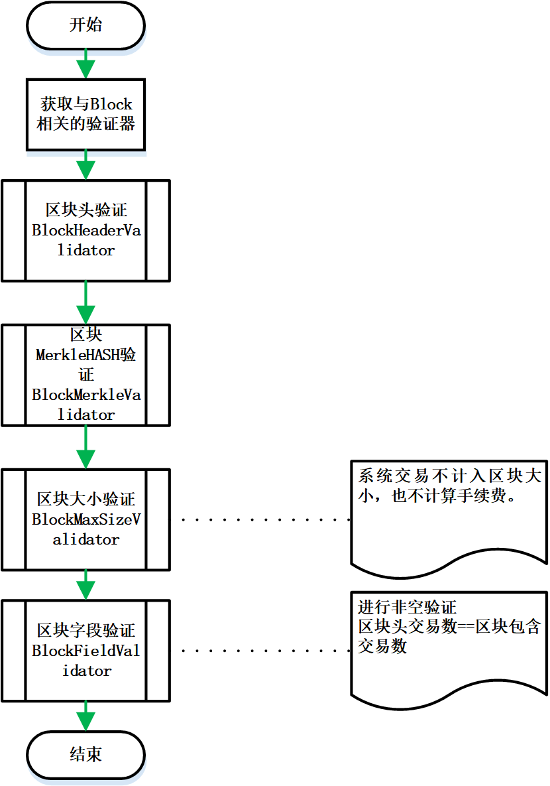

# 区块管理模块设计文档

## 一、总体描述

### 1.1 模块概述

#### 1.1.1 为什么要有《区块管理》模块

​	区块链上所有交易数据都保存在区块中，所以要有一个模块负责区块的存储与管理，以便其他模块对区块中数据进行验证、业务处理时可以获取到区块。

​	区块链程序初次启动时，需要同步网络上的最新区块到本地，这个过程一般耗时较长，且同步未完成时不能发起交易，所以适合由单独模块来完成该工作。

​	综上所述，为其他模块提供统一的区块数据服务是必要的，也能更好地把区块的管理与区块的具体业务进行分离，用到区块的模块不必关心区块的获取细节。

#### 1.1.2 《区块管理》要做什么
- 提供api，进行区块存储、查询、回滚的操作
- 从网络上同步最新区块，验证通过后保存
- 区块同步、广播、转发消息的处理
- 分叉区块的判断、存储
- 孤儿区块的判断、存储
- 分叉链维护、切换
- 孤儿链维护、切换

#### 1.1.3 《区块管理》在系统中的定位

区块管理是底层模块之一，以下分功能讨论模块依赖情况

依赖

- 区块同步-依赖网络模块的通讯接口，依赖工具模块的序列化工具
- 区块存储、回滚-依赖工具模块的数据库存储工具、共识模块、交易管理模块
- 区块转发-依赖网络模块的广播消息接口

被依赖

- 整个系统可以发起交易-区块同步
- 共识模块:区块详细验证、打包-区块查询、区块保存、区块广播、区块回滚

### 1.2 架构图


## 二、功能设计

### 2.1 功能架构图



### 2.2 模块服务

#### 2.2.1 获取最新区块高度

#### 2.2.2 获取最新区块头

- 接口说明

1. 根据链ID、缓存的最新区块高度查询DB得到最新区块头HASH
2. 根据HASH查询DB得到区块头byte数组
3. 反序列化为区块头对象

- 请求示例

    ```
    {
      "cmd": "bestBlockHeader",
      "minVersion":"1.1",
      "params": ["888"]
    }
    ```

- 请求参数说明

| index | parameter | required | type    | description |
| ----- | --------- | -------- | ------- | :---------: |
| 0     | chainId   | true     | Long  |   链ID    |

- 返回示例

    Failed
    
    ```
    {
        "version": 1.2,
        "code": 1,
        "msg": "error message",
        "result": {}
    }
    ```
    
    Success
    
    ```
    {
        "version": 1.2,
        "code": 0,
        "result": {
            "chainId": "888",
            "hash": "xxxxxxx",
            "preHash": "xxxxxxx",
            "merkleHash": "1",
            "height": 1,
            "size": 1,
            "time": 1,
            "txCount": 1,
            "packingAddress": "1",
            "reward": 0,
            "fee": 0,
            "extend": xxxxxxx,HEX
            "scriptSig": "1"
        }
    }
    ```
    
- 返回字段说明
  
| parameter | type      | description                                |
| --------- | --------- | ------------------------------------------ |
| chainId      | Long    | 链ID                                |
| hash      | String    | 区块HASH                                |
| preHash   | String    | 上一区块HASH                              |
| merkleHash   | String    | 区块MerkleHash                              |
| height   | Long | 区块高度                              |
| size   | Integer    | 区块大小                              |
| time   | Long    | 区块打包时间                              |
| txCount   | Integer    | 交易数                              |
| packingAddress   | String    | 打包地址                              |
| reward   | Long    | 共识奖励                              |
| fee   | Long | 手续费                             |
| extend   | String   | 扩展字段,HEX,包含roundIndex、roundStartTime、consensusMemberCount、packingIndexOfRound、stateRoot                              |
| scriptSig   | String    | 区块签名                              |

#### 2.2.3 获取最新区块

- 接口说明:

1. 根据链ID获取本地最新区块头
2. 根据区块头高度查询DB得到交易HASH列表
3. 根据HASH列表从交易管理模块获取交易数据
4. 组装成block对象

- 请求示例

    ```
    {
      "cmd": "bestBlock",
      "minVersion":"1.1",
      "params": ["888"]
    }
    ```

- 请求参数说明

| index | parameter | required | type    | description |
| ----- | --------- | -------- | ------- | :---------: |
| 0     | chainId   | true     | Long  |   链ID    |

- 返回示例 

    Failed

      ```
      {
          "version": 1.2,
          "code":1,
          "msg" :"xxxxxxxxxxxxxxxxxx",
          "result":{}
      }
      ```

    Success

    ```
    {
        "version": 1.2,
        "code": 0,
        "result": {
        	"blockHeader": {
                "chainId": "888",
                "hash": "xxxxxxx",
                "preHash": "xxxxxxx",
                "merkleHash": "1",
                "height": 1,
                "size": 1,
                "time": 1,
                "txCount": 1,
                "packingAddress": "1",
                "reward": 0,
                "fee": 0,
                "extend": xxxxxxx,HEX
                "scriptSig": "1"
        	}, //区块头
        	"transactions": [
        	    {
                    "chainId": "888", //链Id
                    "height": "1", //区块高度
                    "hash": "1", //交易HASH
                    "remark": "1", //交易备注
                    "size": "1", //交易大小
                    "time": "1", //交易时间
                    "type": "1", //交易类型
                    "transactionSignature": "1", //交易签名
                    "coinData": {
                        "from" : [
                            {
                                "fromAssetsChainId":""//资产发行链的id  
                                "fromAssetsId":""//资产id
                                "fromAddress":""//转出账户地址
                                "amount":""//转出金额
                                "nonce":""//交易顺序号，递增
                            },{...}
                        ]
                        "to" : [
                            {
                                "toAssetsChainId":""//资产发行链的id  
                                "toAssetsId":""//资产id
                                "toAddress":""//转出账户地址
                                "amount":""//转出金额
                                "locktime":""
                            },{...}
                        ]
                    }
                    "txData": XXXX, //交易数据 HEX
        	    },
        	    {...}
        	] //交易列表
        }
    }
    ```

- 返回字段说明

    略

#### 2.2.4 根据高度获取区块头

- 接口说明

1. 根据链ID、高度查询DB得到最新区块头HASH
2. 根据HASH查询DB得到区块头byte数组
3. 反序列化为区块头对象

- 请求示例

    ```
    {
      "cmd": "getBlockHeaderByHeight",
      "minVersion":"1.1",
      "params": ["111","888"]
    }
    ```

- 请求参数说明

| index | parameter | required | type    | description |
| ----- | --------- | -------- | ------- | :---------: |
| 0     | chainId   | true     | Long  |   链ID    |
| 1     | height   | true     | Long  |   区块高度    |

- 返回示例

    Failed
    
    ```
    {
        "version": 1.2,
        "code": 1,
        "msg": "error message",
        "result": {}
    }
    ```
    
    Success
    
    ```
    {
        "version": 1.2,
        "code": 0,
        "result": {
            "chainId": "888",
            "hash": "xxxxxxx",
            "preHash": "xxxxxxx",
            "merkleHash": "1",
            "height": 1,
            "size": 1,
            "time": 1,
            "txCount": 1,
            "packingAddress": "1",
            "reward": 0,
            "fee": 0,
            "extend": xxxxxxx,HEX
            "scriptSig": "1"
        }
    }
    ```
    
- 返回字段说明
  
| parameter | type      | description                                |
| --------- | --------- | ------------------------------------------ |
| chainId      | Long    | 链Id                                |
| hash      | String    | 区块HASH                                |
| preHash   | String    | 上一区块HASH                              |
| merkleHash   | String    | 区块MerkleHash                              |
| height   | Long | 区块高度                              |
| size   | Integer    | 区块大小                              |
| time   | Long    | 区块打包时间                              |
| txCount   | Integer    | 交易数                              |
| packingAddress   | String    | 打包地址                              |
| reward   | Long    | 共识奖励                              |
| fee   | Long | 手续费                             |
| extend   | String   | 扩展字段,HEX,包含roundIndex、roundStartTime、consensusMemberCount、packingIndexOfRound、stateRoot                              |
| scriptSig   | String    | 区块签名                              |

#### 2.2.4 根据高度获取区块

- 接口说明:

1. 根据链ID、高度获取区块头
2. 根据区块头高度查询DB得到交易HASH列表
3. 根据HASH列表从交易管理模块获取交易数据
4. 组装成block对象

- 请求示例

    ```
    {
      "cmd": "bl_getBlockByHeight",
      "minVersion":"1.1",
      "params": ["111","888"]
    }
    ```

- 请求参数说明

| index | parameter | required | type    | description |
| ----- | --------- | -------- | ------- | :---------: |
| 0     | chainId   | true     | Long  |   链ID    |
| 1     | height   | true     | Long  |   区块高度    |

- 返回示例 

    Failed

      ```
      {
          "version": 1.2,
          "code":1,
          "msg" :"xxxxxxxxxxxxxxxxxx",
          "result":{}
      }
      ```

    Success

    ```
    {
        "version": 1.2,
        "code": 0,
        "result": {
        	"blockHeader": {
                "chainId": "888",
                "hash": "xxxxxxx",
                "preHash": "xxxxxxx",
                "merkleHash": "1",
                "height": 1,
                "size": 1,
                "time": 1,
                "txCount": 1,
                "packingAddress": "1",
                "reward": 0,
                "fee": 0,
                "extend": xxxxxxx,HEX
                "scriptSig": "1"
        	}, //区块头
        	"transactions": [
        	    {
                    "chainId": "888",//链ID
                    "height": "1", //区块高度
                    "hash": "1", //交易HASH
                    "remark": "1", //交易备注
                    "size": "1", //交易大小
                    "time": "1", //交易时间
                    "type": "1", //交易类型
                    "transactionSignature": "1", //交易签名
                    "coinData": {
                        "from" : [
                            {
                                "fromAssetsChainId":""//资产发行链的id  
                                "fromAssetsId":""//资产id
                                "fromAddress":""//转出账户地址
                                "amount":""//转出金额
                                "nonce":""//交易顺序号，递增
                            },{...}
                        ]
                        "to" : [
                            {
                                "toAssetsChainId":""//资产发行链的id  
                                "toAssetsId":""//资产id
                                "toAddress":""//转出账户地址
                                "amount":""//转出金额
                                "nonce":""//交易顺序号，递增
                            },{...}
                        ]
                    }
                    "txData": XXXX, //交易数据 HEX
        	    },
        	    {...}
        	], //交易列表
        }
    }
    ```

- 返回字段说明

    略

#### 2.2.5 根据HASH获取区块头

- 接口说明

1. 根据链ID、HASH查询DB得到区块头byte数组
2. 反序列化为区块头对象

- 请求示例

    ```
    {
      "cmd": "bl_getBlockHeaderByHash",
      "minVersion":"1.1",
      "params": ["888","aaa"]
    }
    ```

- 请求参数说明

| index | parameter | required | type    | description |
| ----- | --------- | -------- | ------- | :---------: |
| 0     | chainId   | true     | Long  |   链ID    |
| 1     | hash   | true     | String  |   区块hash    |

- 返回示例

    Failed
    
    ```
    {
        "version": 1.2,
        "code": 1,
        "msg": "error message",
        "result": {}
    }
    ```
    
    Success
    
    ```
    {
        "version": 1.2,
        "code": 0,
        "result": {
            "chainId": "888",
            "hash": "xxxxxxx",
            "preHash": "xxxxxxx",
            "merkleHash": "1",
            "height": 1,
            "size": 1,
            "time": 1,
            "txCount": 1,
            "packingAddress": "1",
            "reward": 0,
            "fee": 0,
            "extend": xxxxxxx,HEX
            "scriptSig": "1"
        }
    }
    ```
    
- 返回字段说明
  
| parameter | type      | description                                |
| --------- | --------- | ------------------------------------------ |
| chainId      | Long    | 链ID                                |
| hash      | String    | 区块HASH                                |
| preHash   | String    | 上一区块HASH                              |
| merkleHash   | String    | 区块MerkleHash                              |
| height   | Long | 区块高度                              |
| size   | Integer    | 区块大小                              |
| time   | Long    | 区块打包时间                              |
| txCount   | Integer    | 交易数                              |
| packingAddress   | String    | 打包地址                              |
| reward   | Long    | 共识奖励                              |
| fee   | Long | 手续费                             |
| extend   | String   | 扩展字段,HEX,包含roundIndex、roundStartTime、consensusMemberCount、packingIndexOfRound、stateRoot                              |
| scriptSig   | String    | 区块签名                              |

#### 2.2.6 根据HASH获取区块

- 接口说明:

1. 根据链ID、hash获取区块头
2. 根据区块头高度查询DB得到交易HASH列表
3. 根据HASH列表从交易管理模块获取交易数据
4. 组装成block对象

- 请求示例

    ```
    {
      "cmd": "bl_getBlockByHash",
      "minVersion":"1.1",
      "params": ["888","aaa"]
    }
    ```

- 请求参数说明

| index | parameter | required | type    | description |
| ----- | --------- | -------- | ------- | :---------: |
| 0     | chainId   | true     | Long  |   链ID    |
| 1     | hash   | true     | String  |   区块hash    |

- 返回示例 

    Failed

      ```
      {
          "version": 1.2,
          "code":1,
          "msg" :"xxxxxxxxxxxxxxxxxx",
          "result":{}
      }
      ```

    Success

    ```
    {
        "version": 1.2,
        "code": 0,
        "result": {
        	"blockHeader": {
        	    "chainId": "888",
                "hash": "xxxxxxx",
                "preHash": "xxxxxxx",
                "merkleHash": "1",
                "height": 1,
                "size": 1,
                "time": 1,
                "txCount": 1,
                "packingAddress": "1",
                "reward": 0,
                "fee": 0,
                "extend": xxxxxxx,HEX
                "scriptSig": "1"
        	}, //区块头
        	"transactions": [
        	    {
        	        "chainId": "888",
                    "height": "1", //区块高度
                    "hash": "1", //交易HASH
                    "remark": "1", //交易备注
                    "size": "1", //交易大小
                    "time": "1", //交易时间
                    "type": "1", //交易类型
                    "transactionSignature": "1", //交易签名
                    "coinData": {
                        "from" : [
                            {
                                "fromAssetsChainId":""//资产发行链的id  
                                "fromAssetsId":""//资产id
                                "fromAddress":""//转出账户地址
                                "amount":""//转出金额
                                "nonce":""//交易顺序号，递增
                            },{...}
                        ]
                        "to" : [
                            {
                                "toAssetsChainId":""//资产发行链的id  
                                "toAssetsId":""//资产id
                                "toAddress":""//转出账户地址
                                "amount":""//转出金额
                                "nonce":""//交易顺序号，递增
                            },{...}
                        ]
                    }
                    "txData": XXXX, //交易数据 HEX
        	    },
        	    {...}
        	], //交易列表
        }
    }
    ```

- 返回字段说明

    略

#### 2.2.7 获取某高度区间内区块头

- 接口说明

1. 令queryHash=endHash
2. 根据链ID、queryHash查询DB得到区块头byte数组
3. 反序列化为区块头对象blockHeader，添加到List中作为返回值
4. 如果blockHeader.hash!=startHash，令queryHash=blockHeader.preHash，重复第2步
5. 返回List

- 请求示例

    ```
    {
      "cmd": "bl_getBlockHeaderBetweenHeights",
      "minVersion":"1.1",
      "params": ["888",111","111"]
    }
    ```

- 请求参数说明

| index | parameter | required | type    | description |
| ----- | --------- | -------- | ------- | :---------: |
| 0     | chainId   | true     | Long  |   链ID    |
| 1     | startHeight   | true     | Long  |   起始高度    |
| 2     | endHeight   | true     | Long  |   结束高度    |

- 返回示例

    Failed
    
    ```
    {
        "version": 1.2,
        "code": 1,
        "msg": "error message",
        "result": {}
    }
    ```
    
    Success
    
    ```
    {
        "version": 1.2,
        "code": 0,
        "result": {
            "list" : [
                {
               "chainId": "888",
               "hash": "xxxxxxx",
               "preHash": "xxxxxxx",
               "merkleHash": "1",
               "height": 1,
               "size": 1,
               "time": 1,
               "txCount": 1,
               "packingAddress": "1",
               "reward": 0,
               "fee": 0,
               "extend": xxxxxxx,HEX
               "scriptSig": "1"
               }
            ]

        }
    }
    ```
    
- 返回字段说明
  
| parameter | type      | description                                |
| --------- | --------- | ------------------------------------------ |
| chainId      | Long    | 链ID                                |
| hash      | String    | 区块HASH                                |
| preHash   | String    | 上一区块HASH                              |
| merkleHash   | String    | 区块MerkleHash                              |
| height   | Long | 区块高度                              |
| size   | Integer    | 区块大小                              |
| time   | Long    | 区块打包时间                              |
| txCount   | Integer    | 交易数                              |
| packingAddress   | String    | 打包地址                              |
| reward   | Long    | 共识奖励                              |
| fee   | Long | 手续费                             |
| extend   | String   | 扩展字段,HEX,包含roundIndex、roundStartTime、consensusMemberCount、packingIndexOfRound、stateRoot                              |
| scriptSig   | String    | 区块签名                              |

#### 2.2.8 获取某高度区间内区块

- 接口说明

1. 令queryHash=endHash
2. 根据链ID、queryHash查询DB得到区块byte数组
3. 反序列化为区块对象block，添加到List中作为返回值
4. 如果block.hash!=startHash，令queryHash=block.preHash，startHash，重复第2步
5. 返回List

- 请求示例

    ```
    {
      "cmd": "bl_getBlockBetweenHeights",
      "minVersion":"1.1",
      "params": ["888",111","111"]
    }
    ```

- 请求参数说明

| index | parameter | required | type    | description |
| ----- | --------- | -------- | ------- | :---------: |
| 0     | chainId   | true     | Long  |   链ID    |
| 1     | startHeight   | true     | Long  |   起始高度    |
| 2     | endHeight   | true     | Long  |   结束高度    |

- 返回示例

    Failed
    
    ```
    {
        "version": 1.2,
        "code": 1,
        "msg": "error message",
        "result": {}
    }
    ```
    
    Success
    
    ```
    {
        "version": 1.2,
        "code": 0,
        "result": {
            "list" : [
                {
                    "blockHeader": {
                        "chainId": "888",
                        "hash": "xxxxxxx",
                        "preHash": "xxxxxxx",
                        "merkleHash": "1",
                        "height": 1,
                        "size": 1,
                        "time": 1,
                        "txCount": 1,
                        "packingAddress": "1",
                        "reward": 0,
                        "fee": 0,
                        "extend": xxxxxxx,HEX
                        "scriptSig": "1"
                    }, //区块头
                    "transactions": [
                        {
                            "chainId": "888",
                            "height": "1", //区块高度
                            "hash": "1", //交易HASH
                            "remark": "1", //交易备注
                            "size": "1", //交易大小
                            "time": "1", //交易时间
                            "type": "1", //交易类型
                            "transactionSignature": "1", //交易签名
                            "coinData": {
                                "from" : [
                                    {
                                        "fromAssetsChainId":""//资产发行链的id  
                                        "fromAssetsId":""//资产id
                                        "fromAddress":""//转出账户地址
                                        "amount":""//转出金额
                                        "nonce":""//交易顺序号，递增
                                    },{...}
                                ]
                                "to" : [
                                    {
                                        "toAssetsChainId":""//资产发行链的id  
                                        "toAssetsId":""//资产id
                                        "toAddress":""//转出账户地址
                                        "amount":""//转出金额
                                        "nonce":""//交易顺序号，递增
                                    },{...}
                                ]
                            }
                            "txData": XXXX, //交易数据 HEX
                        },
                        {...}
                    ], //交易列表
               }
            ]

        }
    }
    ```
    
- 返回字段说明
  
    略

#### 2.2.9 接收最新打包区块

- 接口说明

本地节点共识模块打包后，调用此接口保存区块数据

- 请求示例

    ```
    {
      "cmd": "receivePackingBlock",
      "minVersion":"1.1",
      "params": [
      	blockhex//能用hex就用hex
      ]
    }
    ```

- 请求参数说明

    略

- 返回示例

    Failed

    ```
    {
        "version": 1.2,
        "code": 1,
        "msg": "error message",
        "result": {}
    }
    ```

    Success

    ```
    {
        "version": 1.2,
        "code": 0,
        "result": {"sync": "true"}
    }
    ```

- 返回字段说明

| parameter | type      | description                                |
| --------- | --------- | ------------------------------------------ |
| sync      | String    | 区块是否保存成功                          |

#### 2.2.10 运行一条链

- 接口说明

在链工厂发布一条链后，核心模块会调用区块管理模块的该接口，根据chainID初始化区块、分叉链数据库，开启chainID对应的一系列工作线程，并为运行新链做准备。

- 请求示例

    ```
    {
      "cmd": "bl_startChain",
      "minVersion":"1.1",
      "params": ["888"]
    }
    ```

- 请求参数说明

    略

- 返回示例

    Failed

    ```
    {
        "version": 1.2,
        "code": 1,
        "msg": "error message",
        "result": {}
    }
    ```

    Success

    ```
    {
        "version": 1.2,
        "code": 0,
        "result": {"result": "true"}
    }
    ```

- 返回字段说明

| parameter | type      | description                                |
| --------- | --------- | ------------------------------------------ |
| result      | String    | 新链是否启动成功                          |

#### 2.2.11 停止一条链

- 接口说明

在链工厂停止一条链后，核心模块会调用区块管理模块的该接口，删除该链的缓存区块、分叉链数据，停止chainID对应的一系列工作线程。

- 请求示例

    ```
    {
      "cmd": "bl_stopChain",
      "minVersion":"1.1",
      "params": ["888"]
    }
    ```

- 请求参数说明

    略

- 返回示例

    Failed

    ```
    {
        "version": 1.2,
        "code": 1,
        "msg": "error message",
        "result": {}
    }
    ```

    Success

    ```
    {
        "version": 1.2,
        "code": 0,
        "result": {"result": "true"}
    }
    ```

- 返回字段说明

| parameter | type      | description                                |
| --------- | --------- | ------------------------------------------ |
| result      | String    | 新链是否停止成功                          |

### 2.3 模块内部功能

#### 2.3.1 模块启动

- 功能说明:

  启动区块管理模块

- 流程描述



- 1.RPC服务初始化
- 2.初始化通用数据库
- 3.加载配置信息
- 4.初始化各链数据库
- 5.等待依赖模块就绪
- 6.向网络模块注册消息处理类
- 7.启动同步区块线程、数据库大小监控线程、分叉链处理线程、孤儿链处理线程、孤儿链维护线程

- 依赖服务

  工具模块、内核模块、网络模块、交易管理模块

#### 2.3.2 区块存储

- 功能说明:

    存储主链上区块头数据以及分叉链、孤儿链的完整区块数据

    - 主链存储

      不同的链存到不同的表，表名加chainID后缀
              一个完整的区块由区块头和交易组成，区块头与交易分别进行存储。
      	区块头:(放在区块管理模块)
                    key(区块高度)-value(区块头hash)              		block-header-index
                    key(区块头hash)-value(完整的区块头)           	block-header
      	交易:(放在交易管理模块)

    - 分叉链、孤儿链存储

      内存中缓存所有分叉链与孤儿链对象(只记录起始高度、起始hash、结束高度、结束hash等关键信息)，在硬盘中缓存全量区块数据，如果需要分叉链切换、清理分叉链等操作，只需读取一次数据库即可
      	不同链的分叉链集合存在不同的表，表名加chainID后缀，每一个分叉链对象如下:
      		key(区块hash)-value(完整的区块数据)          	CachedBlock

- 流程描述

    略

- 依赖服务

  工具模块的数据库工具

#### 2.3.3 区块清理

- 功能说明:

  为了避免过多垃圾数据占用硬盘空间，对分叉链和孤儿链进行定时清理

- 流程描述

  1. 按照配置的最大缓存区块数量进行清理，当分叉链+孤儿链缓存的区块数量大于阈值时，进行清理
  2. 按照分叉链或孤儿链的起始高度与主链的最新高度差进行清理
  3. 按照孤儿链的年龄进行清理，孤儿链的年龄初始值为0，每经过一次孤儿链维护，但该孤儿链的链首并没有新增合法区块时，该孤儿链年龄加一，当孤儿链年龄大于阈值时，进行清理

- 依赖服务

  工具模块的数据库工具

#### 2.3.4 区块同步

- 功能说明:

  系统启动后，维护本地区块数据与网络上大部分节点保持一致。

  BlockSynchronizer:统计网络上最新一致高度、检查本地区块是否需要回滚、初始化各种区块同步期间的参数

  ​BlockDownloader:从起始高度开始，根据各下载节点的信用值分配下载任务，组装HeightRangeMessage，发送给目标节点

  ​BlockConsumer:根据高度依次取出缓存Map中的区块，验证并保存，如果某个高度一直取不到，就组装一条HeightMessage，发送给连接到的节点单独获取该高度的区块

- 流程描述

    - 区块同步主流程

    

    - 获取网络上可用节点列表

    ```
        1. 遍历节点，统计两个MAP，假定每个节点的(最新HASH+最新高度)是key
        2. 一个以key为主键统计次数
        3. 一个以key为主键记录持有该key的节点列表
        4. 最终统计出出现频率最大的key，就获取到当前可信的最新高度与最新hash，以及可信的节点列表
        
        举个栗子:
        现在同时连接到10个节点。其中4个节点(A,B,C,D)的最新区块高度是100，最新区块hash是aaa，其中6个节点(E,F,G,H,I,J)的最新区块高度是101，最新区块hash是bbb。
        最终返回(101，bbb,[E,F,G,H,I,J])。
    ```

    - 下载区块逻辑

    
    ```
        在正式下载区块前，要判断本地与网络是否发生分叉，是否需要回滚。以便找到准确的区块下载高度。
        以下分情况讨论:
        取上一步的结果(101，bbb,[E,F,G,H,I,J])，同时LH(N)代表本地第N块的hash，RH(N)代表网络上第N块的hash。
        1.本地高度100&lt;网络高度101，LH(100)==RH(100)，正常，比远程节点落后，下载区块
        2.本地高度100&lt;网络高度101，LH(100)!=RH(100)，认为本地分叉，回滚本地区块，如果LH(99)==RH(99)
        回滚结束，从99块开始下载，如果LH(99)!=RH(99)，继续回滚，重复上述逻辑。但最多回滚10个块就停止，等待下次同步，这样可以避免被恶意节点攻击，大量回滚正常区块。
        3.本地高度102>网络高度101，LH(101)==RH(101)，正常，比远程节点领先，无需下载区块
        4.本地高度102>网络高度101，LH(101)!=RH(101)，认为本地分叉，先一次性回滚到高度与远程一致，重复场景2
        5.本地高度101=网络高度101，LH(101)==RH(101)，正常，与远程节点一致，无需下载区块
        6.本地高度101=网络高度101，LH(101)!=RH(101)，认为本地分叉，重复场景2
        
        场景1、2需要额外从节点下载与本地高度一致的区块，进行hash判断
        上述需要回滚的场景，要满足可用节点数(10个)>配置，一致可用节点数(6个)占比超80%两个条件，避免节点太少导致频繁回滚。以上两个条件都不满足，清空已连接节点，重新获取可用节点。
     
        真正下载区块时，举个例子:
        当前高度100，网络高度500，可用节点12个，一致可用节点10个，每个节点初始下载区块2个，下载时缓存队列最多允许缓存100个区块
        伪代码表示
        	空闲的下载节点队列：nodes(每个下载节点会有初始下载信用值，每下载成功一次信用值增加，信用最大值为初始值的2倍)
        	下载到的区块缓存队列：queue
            下载起始高度：startHeight = 101;
            下载结束高度：netLatestHeight = 500;
            while (startHeight &lt;= netLatestHeight) {
                    while (queue.size() > 100) {
                        BlockDownloader wait！ cached queue size beyond config
                    }
                    获取一个可用节点
                    根据节点下载信用值计算本次下载区块数量为size
                    提交异步下载任务
                    startHeight += size;
            }
    如果某节点下载失败，则由其他节点代为下载
    考虑下载过程中，网络上其他节点还会继续生成新区块。下载结束后，需要判断本地最新区块高度与网上最新一致高度是否相同，如果相同，标志区块同步结束，如果不相同，则需要继续下载
    ```

    - 从节点下载某高度区间内的区块

    

- 依赖服务

  工具模块的数据库存储工具、RPC工具

#### 2.3.5 区块基础验证

- 功能说明:

  验证区块自身数据正确性,下载过程中验证，验证通过说明区块数据本身没有问题，验证失败则丢弃该区块

- 流程描述

    - 区块基本验证
    
    
    
    - 区块头验证
    
    

- 依赖服务

  工具模块的数据库存储工具

#### 2.3.6 分叉区块、孤儿区块验证

- 功能说明:

  验证区块上下文正确性，下载完成后验证，验证通过说明该区块与主链相连，验证失败说明该区块分叉，进入分叉链处理逻辑

- 流程描述

  - 分叉区块、孤儿区块验证
  - 区块B与链A的关系有四种：
  - 1.B是A上重复的区块
  - 2.B是A上分叉的区块
  - 3.B能直接连到A
  - 4.B与A没有任何关联关系
  - 以上四种关系适用于主链、分叉链、孤儿链
    

  高度差1000以内缓存到磁盘，磁盘空间做大小限制，超出高度则丢弃，缓存空间满则按加入缓存时间顺序清理分叉链。
  如果是正常运行时，收到其他节点转发的区块，发现分叉了要通知共识模块给生成这个区块的节点红牌惩罚，系统启动后的同步过程中不做这个判断

  

- 依赖服务

  工具模块的数据库存储工具

#### 2.3.7 分叉链管理

- 功能说明:

  判断分叉链与主链是否需要进行切换

- 流程描述
  - 找出最大高度差，与链切换阈值对比，大于阈值则进行链切换
      - 找到主链与最长分叉链的分叉点，同时找出链切换路径
      - 回滚主链区块，回滚掉的区块组成新的分叉链链接到原主链
      - 依次添加切换路径上的分叉链的区块
      - 切换完成


- 依赖服务

  工具模块的数据库存储工具

#### 2.3.8 孤儿链管理

- 功能说明:

    用来进行孤儿链与分叉链、主链的相连、分叉操作

- 流程描述

    链与链之间的关系就三种，相连、分叉、重复。
    
 1.  标记(变更链属性阶段)
 主链、分叉链、孤儿链分别对应MASTER，FORK，ORPHAN三种最终类别
     - 如果孤儿链与主链相连，暂时标记孤儿链为MASTER_APPEND，标记孤儿链的子链为MASTER_FORK
     - 如果孤儿链与主链重复，暂时标记孤儿链为MASTER_DUPLICATE，标记孤儿链的子链为MASTER_FORK
     - 如果孤儿链与主链分叉，暂时标记孤儿链为MASTER_FORK，标记孤儿链的子链为FORK_FORK
     - 如果孤儿链与分叉链相连，暂时标记孤儿链为FORK_APPEND，标记孤儿链的子链为FORK_FORK
     - 如果孤儿链与分叉链重复，暂时标记孤儿链为FORK_DUPLICATE，标记孤儿链的子链为FORK_FORK
     - 如果孤儿链与分叉链分叉，暂时标记孤儿链为FORK_FORK，标记孤儿链的子链为FORK_FORK
     - 如果孤儿链与孤儿链相连，暂时标记孤儿链为ORPHAN_APPEND，标记孤儿链的子链为ORPHAN_FORK
     - 如果孤儿链与孤儿链重复，暂时标记孤儿链为ORPHAN_DUPLICATE，标记孤儿链的子链为ORPHAN_FORK
     - 如果孤儿链与孤儿链分叉，暂时标记孤儿链为ORPHAN_FORK，标记孤儿链的子链为ORPHAN_FORK
     - 如果孤儿链经过上述流程标志未变，说明它与其他链没有关联，标志依然为ORPHAN

 2.  复制、清除
     - 如果标记为与主链重复,orphanChain不会复制到新的孤儿链集合,也不会进入分叉链集合,orphanChain的直接子链标记为ChainTypeEnum.MASTER_FORK
     - 如果标记为与主链相连,orphanChain不会复制到新的孤儿链集合,也不会进入分叉链集合,orphanChain的直接子链标记为ChainTypeEnum.MASTER_FORK
     - 如果标记为从主链分叉,orphanChain不会复制到新的孤儿链集合,但是会进入分叉链集合,orphanChain的直接子链标记为ChainTypeEnum.FORK_FORK
     - 如果标记为与分叉链重复,orphanChain不会复制到新的孤儿链集合,也不会进入分叉链集合,orphanChain的直接子链标记为ChainTypeEnum.FORK_FORK
     - 如果标记为与分叉链相连,orphanChain不会复制到新的孤儿链集合,也不会进入分叉链集合,orphanChain的直接子链标记为ChainTypeEnum.FORK_FORK
     - 如果标记为从分叉链分叉,orphanChain不会复制到新的孤儿链集合,但是会进入分叉链集合,orphanChain的直接子链标记为ChainTypeEnum.FORK_FORK
     - 如果标记为与孤儿链重复,orphanChain不会复制到新的孤儿链集合,也不会进入分叉链集合,orphanChain的直接子链标记为ChainTypeEnum.ORPHAN_FORK
     - 如果标记为与孤儿链相连,不会复制到新的孤儿链集合,所有orphanChain的直接子链会复制到新的孤儿链集合,类型不变
     - 如果标记为与孤儿链分叉,会复制到新的孤儿链集合,所有orphanChain的直接子链会复制到新的孤儿链集合,类型不变
     - 如果标记为孤儿链(未变化),或者从孤儿链分叉,复制到新的孤儿链集合
      
- 依赖服务

  工具模块的数据库存储工具

#### 2.3.9 孤儿链维护

- 功能说明:

    定时尝试在孤儿链的链首请求增加区块，维护失败孤儿链年龄加一。

- 流程描述

    遍历所有孤儿链，取链上起始区块的preHash，组装成HashMessage发往当前可用节点中的任意一个，等待异步返回结果。

- 依赖服务

  工具模块的数据库存储工具

#### 2.3.10 转发区块

- 功能说明:

    非出块节点验证完区块后执行转发流程

- 流程描述

1. 使用blockHash组装HashMessage，发送给目标节点
2. 目标节点收到HashMessage后，取出hash判断是否重复，如果不重复，使用hash组装HashMessage发给源节点
3. 源节点收到GetSmallBlockMessage后，取出hash，查询SmallBlock并组装SmallBlockMessage，发给目标节点
4. 后续交互流程参考广播区块

- 依赖服务

  工具模块的数据库存储工具

#### 2.3.11 广播区块

- 功能说明:

  出块的节点执行广播流程

- 流程描述

  - 接收共识模块的打包区块，验证成功后，根据Block组装SmallBlockMessage并广播给连接到的节点
  - 目标节点收到消息后根据txHashList判断哪些交易本地没有,再组装HashListMessage发给源节点
  - 源节点收到信息后按照hashlist组装TxGroupMessage,返回给目标节点
  - 至此完整区块数据已经发送给目标节点。

- 依赖服务

  工具模块的数据库存储工具

## 三、事件说明

### 3.1 发布的事件

#### 3.1.1 同步完成

说明:同步完成，本地区块高度与网络高度一致时，发布该事件

 event_topic : "bl_blockSyncComplete",

```
data:{
    chainId
    height
    hash
}
```

#### 3.1.2 保存区块

说明:每保存一个区块，发布该事件，初次同步时不发该事件

 event_topic : "bl_saveBlock",

```
data:{
    chainId
    height
    hash
}
```

#### 3.1.3 回滚区块

说明:每回滚一个区块，发布该事件   

 event_topic : "bl_rollbackBlock",

```
data:{
    chainId
    height
    hash
}
```

### 3.2 订阅的事件

​	略

## 四、协议

### 4.1 网络通讯协议

​	参见网络模块

### 4.2 消息协议

#### 4.2.1 区块高度信息HeightMessage

- 消息说明:用于"区块同步"过程中重试下载

- 消息类型（cmd）

  getBlockH

- 消息的格式（messageBody）

| Length | Fields  | Type      | Remark         |
| ------ | ------- | --------- | -------------- |
| 64   | heighrt | int64  | 区块高度    |

- 消息的验证

    略

- 消息的处理逻辑

    - 根据区块高度查询完整区块并发送给目标节点
    - 如果没有该高度的区块，返回空消息

#### 4.2.2 单个摘要消息HashMessage

- 消息说明:用于"转发区块","孤儿链维护"功能

- 消息类型（cmd）

  forward,getBlock,getsBlock

- 消息的格式（messageBody）

| Length | Fields  | Type      | Remark         |
| ------ | ------- | --------- | -------------- |
| 32     | hash  | byte[]  | 交易hash  |

- 消息的验证

    略

- 消息的处理逻辑

    - 转发SmallBlock的hash
    - 根据hash获取SmallBlock
    - 根据hash获取完整区块

#### 4.2.3 摘要列表消息HashListMessage

- 消息说明:用于"转发区块"功能

- 消息类型（cmd）

  getTxs

- 消息的格式（messageBody） 

| Length | Fields  | Type      | Remark         |
| ------ | ------- | --------- | -------------- |
| 32     | blockHash            | byte[]    | 区块hash           |
| ?     | hashLength      | VarInt    | 数组长度           |
| 32     | hash        | byte[]    | 交易hash           |

- 消息的验证

    略

- 消息的处理逻辑

1. 根据chainID、hash获取Transaction列表
2. 组装TxGroupMessage，并发送给源节点

#### 4.2.4 区块广播消息SmallBlockMessage

- 消息说明:用于"转发区块"、"广播区块"功能

- 消息类型（short）

  sBlock

- 消息的格式（messageBody）

| Length | Fields  | Type      | Remark         |
| ------ | ------- | --------- | -------------- |
| ?     | preHash         | byte[]    | preHash           |
| ?     | merkleHash      | byte[]    | merkleHash           |
| 32     | time          | Uint32    | 时间           |
| 32     | height      | Uint32    | 区块高度           |
| 32     | txCount      | Uint32    | 交易数           |
| ?     | extendLength| VarInt    | extend数组长度           |
| ?     | extend      | byte[]    | extend           |
| 32     | publicKeyLength      | Uint32    | 公钥数组长度           |
| ?     | publicKey      | byte[]    | 公钥           |
| ?     | signBytesLength| VarInt    | 签名数组长度           |
| ?     | signBytes      | byte[]    | 签名           |
| ?     | txHashListLength| VarInt    | 交易hash列表数组长度           |
| ?     | txHashLength| VarInt    | 交易hash数组长度           |
| ?     | txHash      | byte[]    | 交易hash           |

- 消息的验证

    略

- 消息的处理逻辑

    - 判断区块时间戳是否大于(当前时间+10s)，如果大于这个时间，则判定为恶意提前出块，忽略该消息
    - 根据chainID、区块hash判断消息是否重复，如果重复，则忽略该消息(这里要求维护一个集合,按照chainID分类储存收到的区块hash)
    - 根据chainID、区块hash在DB中查询本地是否已经有该区块，如果已经有了，则忽略该消息
    - 验证区块头，验证失败，则忽略该消息
    - 取txHashList，判断那些tx本地没有，组装HashListMessage，发给源节点，获取没有的那些交易信息
    - 如果交易都有，组放入缓存队列，等待验证线程验证后存储

#### 4.2.5 高度区间消息HeightRangeMessage

- 消息说明:用于"同步区块"功能

- 消息类型（cmd）

  getBlocks

- 消息的格式（messageBody）

| Length | Fields  | Type      | Remark         |
| ------ | ------- | --------- | -------------- |
| 64   | startHeight  | int64  | 起始高度           |
| 64   | endHeight  | int64 | 结束高度           |

- 消息的验证

    略

- 消息的处理逻辑

    - chainID、高度参数验证
    - 从startHeight开始查找Block,组装BlockMessage，发给目标节点
    - 查找到endHeight为止，组装CompleteMessage(true)，发给目标节点
    - 中途查找失败，组装CompleteMessage(false)，发给目标节点

#### 4.2.6 完整的区块消息BlockMessage

- 消息说明:用于"区块同步"

- 消息类型（cmd）

  block

- 消息的格式（messageBody）

| Length | Fields  | Type      | Remark         |
| ------ | ------- | --------- | -------------- |
| 32     | requestHash         | byte[]    | requestHash           |
| 32     | preHash         | byte[]    | 上一个区块的hash           |
| 32     | merkleHash      | byte[]    | merkleHash           |
| 32     | time          | Uint32    | 时间           |
| 32     | height      | Uint32    | 区块高度           |
| 32     | txCount      | Uint32    | 交易数           |
| ?     | extendLength| VarInt    | extend数组长度           |
| ?     | extend      | byte[]    | extend           |
| 32     | publicKeyLength      | Uint32    | 公钥数组长度           |
| ?     | publicKey      | byte[]    | 公钥           |
| ?     | signBytesLength| VarInt    | 签名数组长度           |
| ?     | signBytes      | byte[]    | 区块签名           |
| 16     | type      | uint16    | 交易类型           |
| 32   | time      | uint32  | 交易时间           |
| ?     | remarkLength| VarInt    | 备注数组长度           |
| ?     | remark      | byte[]    | 备注           |
| ?     | txDataLength| VarInt    | 交易数据数组长度           |
| ?     | txData      | byte[]    | 交易数据           |
| ?     | coinDataLength| VarInt    | CoinData数组长度           |
| ?     | coinData      | byte[]    | CoinData           |
| ?     | txSignLength| VarInt    | 交易签名数组长度           |
| ?     | txSign      | byte[]    | 交易签名           |
| 1     | syn  | byte      | 是否是为区块同步请求的区块           |

- 消息的验证

    略

- 消息的处理逻辑

    - 如果syn==true,把区块放入同步的缓存map中,并增加同步区块字节数
    - 如果syn==false,放入单个区块缓存中

#### 4.2.7 请求完成消息CompleteMessage

- 消息说明:通用消息，用于异步请求，标志异步请求处理结束。

- 消息类型（cmd）

  complete

- 消息的格式（messageBody）

| Length | Fields  | Type      | Remark         |
| ------ | ------- | --------- | -------------- |
| 32     | Hash         | byte[]    | Hash           |
| 1     | success  | byte      | 成功标志           |

- 消息的验证

    略

- 消息的处理逻辑

1. 根据chainID、nodeId把对应节点的工作标志设置为空闲。

#### 4.2.8 交易列表的消息TxGroupMessage

- 消息说明:用于"转发区块"

- 消息类型（cmd）

  txs

- 消息的格式（messageBody）

| Length | Fields  | Type      | Remark         |
| ------ | ------- | --------- | -------------- |
| 32   | blockHash | byte[]    | blockHash  |
| ?     | txCount   | VarInt    | 交易数           |
| 16     | type      | uint16    | 交易类型           |
| 32   | time      | uint32  | 交易时间           |
| ?     | remarkLength| VarInt    | 备注数组长度           |
| ?     | remark      | byte[]    | 备注           |
| ?     | txDataLength| VarInt    | 交易数据数组长度           |
| ?     | txData      | byte[]    | 交易数据           |
| ?     | coinDataLength| VarInt    | CoinData数组长度           |
| ?     | coinData      | byte[]    | CoinData           |
| ?     | txSignLength| VarInt    | 交易签名数组长度           |
| ?     | txSign      | byte[]    | 交易签名           |

- 消息的验证

    略

- 消息的处理逻辑

    - 如果已经收到完整的区块，忽略该消息
    - 如果收到部分区块，还缺失交易，则组装完整区块并保存

## 五、模块配置

```
{
  "forkChainsMonitorInterval": 10000,
  "orphanChainsMonitorInterval": 10000,
  "orphanChainsMaintainerInterval": 5000,
  "storageSizeMonitorInterval": 300000,
  "networkResetMonitorInterval": 300000,
  "nodesMonitorInterval": 5000,
  "txGroupRequestorInterval": 1000,
  "txGroupTaskDelay": 3000,
  "testAutoRollbackAmount": 0,
  "blockMaxSize": 5242880,
  "resetTime": 180000,
  "chainSwtichThreshold": 3,
  "cacheSize": 1000,
  "heightRange": 1000,
  "maxRollback": 1000,
  "consistencyNodePercent": 60,
  "minNodeAmount": 1,
  "downloadNumber": 10,
  "extendMaxSize": 1024,
  "validBlockInterval": 60000,
  "smallBlockCache": 6,
  "orphanChainMaxAge": 10,
  "singleDownloadTimeout": 10000,
  "waitNetworkInterval": 5000,
  "cachedBlockSizeLimit": 20971520,
  "genesisBlockPath": ""
}
```

## 六、Java特有的设计

- Block对象设计
> | `字段名称`          | `字段类型` | `说明`     |
> | ------------------- | ---------- | ---------- |
> | blockHeader        | BlockHeader     | 区块头   |
> | transactions | List&lt;Transaction>     | 交易列表 |

- SmallBlock对象设计
> | `字段名称`          | `字段类型` | `说明`     |
> | ------------------- | ---------- | ---------- |
> | blockHeader             | BlockHeader     | 区块头   |
> | transactions | List&lt;String>     | 所有交易HASH列表 |
> | subTxList | List&lt;Transaction>     | 其他节点一定没有的交易(如共识奖励交易、红黄牌交易等) |

- BlockHeader对象设计
> | `字段名称`          | `字段类型` | `说明`     |
> | ------------------- | ---------- | ---------- |
> | hash             | String     | 区块HASH   |
> | preHash             | String     | 上一区块HASH   |
> | merkleHash             | String     | 区块MerkleHash   |
> | height             | int     | 区块高度   |
> | time             | long     | 区块打包时间   |
> | txCount             | short     | 交易数   |
> | extend             | byte[]     | 扩展字段   |
> | blockSignature             | BlockSignature     | 区块签名   |

- BlockSignature对象设计
> | `字段名称`          | `字段类型` | `说明`     |
> | ------------------- | ---------- | ---------- |
> | signData            | String     | 区块签名   |
> | publicKey           | byte[]     | 公钥 |

- Chain对象设计
> | `字段名称`          | `字段类型` | `说明`     |
> | ------------------- | ---------- | ---------- |
> | parent              | Chain     | 父链   |
> | sons                | SortedSet&lt;Chain>     | 子链集合 |
> | chainId             | int     | 链ID   |
> | previousHash        | NulsDigestData     | 链上起始区块的previousHash   |
> | startHeight         | long     | 链起始高度   |
> | startHashCode       | int     | 链起始hash转换int(排序用)   |
> | endHeight           | long     | 链结束高度   |
> | hashList            | LinkedList     | 链上区块hash列表   |
> | type                | ChainTypeEnum     | 链类型   |
> | age                 | AtomicInteger     | 链年龄(孤儿链清理使用)   |

## 七、补充内容
