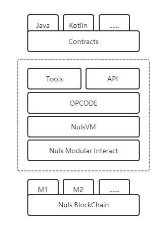

# 智能合约模块设计

## 1. 概要

NULS是一个可定制的区块链基础设施，是全球性区块链开源社区项目。NULS 由微内核和功能模块组成，以弱化主链的全新思维，通过事件和服务的剥离，实现高度模块化的底层架构，提供智能合约、多链并行、跨链共识等运行机制。本文是对智能合约部分的细节进行讨论。

## 2. 目的

NULS智能合约模块（以下简称合约模块）主要解决以下几个问题：

* **可编程环境**：提供基于Nuls区块链的智能合约编程环境。
* **轻量级虚拟机**：提供一个轻量级虚拟机NulsVM，和满足智能合约执行所需的所有字节指令。轻量级保证可以迅速启动，快速运行，像JVM或者.Net那样的虚拟机是不合适的。
* **隔离运行**：每个虚拟机的运行环境都是隔离的，这保证了安全性。
* **支持高级语言**：支持各种高级语言的语法直接编写智能合约。
* **生态完整**：提供各种工具和完整文档，逐渐降低编写智能合约的入门难度。
* **访问方便**：提供API和完整的文档，开发者可以很容易的读取世界状态和监听变化。

## 3. 相关项目

在开发领域里面，切记的是“重复发明轮子”，站在巨人的肩膀上尤为重要，区块链行业本身也是一个开放的共享的共荣的良性生态。所以，在设计智能合约模块的时候，我们也需要学习和借鉴成功的智能合约设计。

首要参考的当然就是以太坊，以太坊的智能合约是目前使用得最广泛的，包括NULS在内的多个项目都使用了以太坊的ERC20标准通过智能合约来发放TOKEN。以太坊的虚拟机也是多个项目学习和借鉴的对象，甚至像量子链，是完整Fork了以太坊的虚拟机代码，通过账户层的概念在UTXO模型上支持了以太坊智能合约的运行，是非常具有创意和大胆的想法。

以太坊的智能合约是通过账户模型构建其世界状态，通过交易消息和状态转换函数来记录和执行世界状态的改变，这个设计非常的精妙和具有突破性。

接着参考的是R3组织的Corda项目，基于Java构建，在智能合约方面奇思妙想的直接使用了Java虚拟机，通过实现预设的Java接口来实现智能合约逻辑，不过和以太坊相比，其应用领域决定了其智能合约只围绕“验证”做文章，而非以太坊的通用性智能合约平台。

然后是超级账本项目，超级账本的理念和NULS还有几分相似，都是以模块化、松耦合设计，可插拔共识等，它的智能合约设计有意思的地方在于将合约放入了docker这个独立的容器中进行执行，目前可支持的高级语言有Java和Go。不过这也是其缺点之一，因为docker的启动虽然非常快，但是相较于其他区块链的轻量级VM来说就算非常耗时了。不过这也与其并非定义为公链的应用前景相关，其更适配的领域在于企业和机构的联盟链和私链环境。

还有就是比原链项目，比原链项目是一个多资产概念的项目，其底层运行了一个多资产的UTXO模型，所以其智能合约创新性的使用了UTXO集合作为其世界状态的存储单位，将UTXO模型有效的组织起来，非常具有借鉴意义。

最后是NEO，NEO作为国内早期就介入区块链行业的企业之一，拥有很多自己的想法和特点，在智能合约模块上想法也很创新，特别是高级语言部分其通过现代主流高级语言本身具有虚拟机的特点，使用了高级语言的字节码到区块链字节码的直接转换方式，给高级语言的扩展带来了很多的可能。

## 4. 基本设计

合约模块是整个Nuls模块化技术生态中的一部分，也是一个完整自治的模块。通过Nuls的模块化契约与其他模块合作，提供链上可编程环境。

与合约交互通过向合约发送特殊的交易来完成。合约的图灵完备计算由虚拟机执行。合约的执行结果被永久存储在Nuls的存储模块上。每个合约都有自己独立的存储空间，通过不同的合约地址区分。

合约执行时，虚拟机会加载合约代码编译成的字节码，并根据合约代码执行程序，执行完成之后，整个合约存储的状态发生了改变，这些改变的哈希被存储在链上。合约可以作为另外一个合约的软件库，也即是说合约本身可以调用另外一个合约，虚拟机在执行合约之前，会对合约内容进行解析，将相关的合约提前加载。同时通过缓存技术提高执行效率。

虚拟机执行的每一个字节码命令都会根据运算量收取一定的费用，这在以太坊中叫GAS，Nuls保留这个设计理念。每一个指令根据其运算长短计费也不同，同时为了保证效率，整个合约执行的计费有一个上限，超出了上限之后，合约将会执行失败，状态回滚，但是不会返还已经消耗的费用。如果执行完成之后，提交的费用还没有消费完全，那么剩余的部分将会返还给合约调用者。设置费用上限的原因也是为了杜绝无限循环调用的问题。

合约的编写支持高级语言，Java作为第一个被支持的语言在合约模块上线时即可使用，同时JVM上的语言，像Kotlin、Scala、Groovy都会很快被支持，我们同时也欢迎社区贡献多种高级语言的支持。

合约的状态可以通过API开放给外界进行查询。合约中内置了许多方法，可以在使用中直接调用，例如hash算法，随机数等。

### 4.1 世界状态

我们将在NULS中构建一个世界状态，NULS中的每一次与合约相关的交易都会促使这个世界状态发生变化。状态中可以包含任意的数据。

我们把智能合约看做APP的话，那么NULS中的合约交易就可以看做电脑程序中的函数调用，这些函数调用可以改变程序内部的属性。当然，并不是所有的交易都是有效的，也可能具有无效的交易，无效的交易不会引起状态的转变。可以用一个表达式来说明：

        f(S, T) = S'

f代表了智能合约中的函数方法。NULS智能合约的核心思想，是读取已定状态的S和合约交易T作为f的输入，从而将状态从S转换成了S'。

NULS的区块链中保存了能够改变状态的所有历史的交易数据，所以最新的区块就是当前的状态，当然，NULS不会把这些状态保存在区块上，这样的话区块就太大了，区块上只是保存了这个世界状态的根哈希。NULS的矿工一方面会验证之前区块执行的状态结果，另一方面为了争夺记账权，矿工也会将收到的交易放入相应的合约中执行，将终态放入新的区块中进行公布。

世界状态是由合约账户组成的，世界状态存储在NULS的存储模块中，存储模块提供了一个KV结构的数据接口，这也即是说，世界状态的存储模式是KV形式的，KV就是键值对，在这里K代表了合约的地址，是一个160位长度的哈希值；V代表了合约的状态。世界状态上虽然没有全部存储在区块上，但是整个状态是被缓存在合约模块中的，通过Merkle Patricia树来维护整个状态。Partricia树其实是一个字典树，字典的设计是为了更快速的找到这个合约账户。Merkle则负责保证所有的状态是不被更改的，Merkle根就是状态根，被存储在区块中。每一次更改，新的状态都会重新存储在存储模块中。这样设计是为了让每个区块的根所代表的整个状态树是不可变的，所以NULS中的世界状态可以从任意一个已经确定的世界状态开始，也即是说我们可以恢复到指定区块的历史状态。

合约账户包含了三个字段：

* nonce：交易计数：这个值等于这个合约已经执行的交易数量。
* storage root：存储根节点，这个字段存储了账户内部存储内容的根节点，存储内容的组织是和账户一样的Merkle Patricia树，长度是256位哈希编码。
* code hash：代码哈希，代码是NULS虚拟机执行的内容。代码哈希和前两个字段不同，这个字段的内容指定之后不能被更改。

![worldstatestrie]

默克尔帕特里夏树有四种节点：

* 空节点，顾名思义，空的节点，没有任何值
* 扩展节点，扩展节点存储了三个字段，第一个是前缀字段，值为0或1；第二个存储的是KV中K的共同的部分，例如'ab12...'和'ab32..'中的'ab'就是共同的部分；第三个字段存储了到分支节点的索引。
* 分支节点，分支节点是一个17位的数组，前16位存储的是0-F的字符和指向下层节点的索引，最后一位是值。
* 叶子节点，存储了三个字段，第一个是前缀字段，值有2或3；第二个存储的是KV中K的除去共同部分的最后部分；第三个字段存储的是具体的值，这个值是经过RLP编码的。

### 4.2 整体架构

![artwork]

上图为智能合约的整体架构，其核心都是围绕Nuls虚拟机来进行，虚拟机提供了访问世界状态的方法，世界状态被存储在Nuls的存储模块中。OpCode是字节码，Nuls实现了支持图灵完备的最小字节码集合，其目的是为了快速启动，同时又能保持图灵完备。Tools是工具箱，提供了包括字节码编译器、模板方法、SDK等能够提升和简化开发的一系列工具。API是访问合约的入口，通过API可以很容易的查询到合约的世界状态。

### 4.3 未来方向

世界状态虽然只增加变化的部分，但是其存储量还是会积累得比较庞大，所以未来可能会实行一个快照方式，将有一定历史的所有数据压缩成最新的状态，把这个状态之前的所有变化量都进行清理。

会提供轻节点的支持，NULS的使用者并不需要获取完整的世界状态历史，只需要获得最新的世界状态即可，这会使数据量相较于完整的世界状态而言少得可怜，大部分的PC都能够完美兼顾。

## 5. NULS虚拟机

NULS虚拟机类似于Java的虚拟机，和VMWare、VirtualBox等不同，算是图灵完毕的最小集合。和JVM一样，NULS虚拟机中执行的是字节码，高级语言都会被编译成NULS虚拟机可执行的字节码。

![nulsvm]

NULS虚拟机的架构图

* OpCodeLoader：加载合约字节码和相关合约字节码
* Stack：操作数栈也常被称为操作栈，它是一个后入先出栈。虚拟机底层字节码指令集是基于栈类型的，所有的操作码都是对操作数栈上的数据进行操作，对于每一个方法的调用，虚拟机会建立一个操作数栈，以供计算使用。
* Memory：作为执行中提供的临时存储区域，在执行完成后进行释放。
* Execute Engine是执行引擎，就好像电脑中的CPU，所有的操作都由这个执行引擎来完成，可以执行智能合约字节码，常见的字节码：流程控制、栈操作、位操作、算数运算、逻辑运算等。
* Nuls Moduler Interafce：提供了Nuls区块链和其他Nuls模块进行交互的能力。

这个NulsVM的设计参考了JVM的设计思想，针对智能合约引擎的需求做了很多简化和改造，力求实现最简单的最高效的虚拟机。

NULS虚拟机基于栈结构，栈中数据的大小是256位，这样设计的目的是为了符合哈希运算结果的输出。栈的最大深度为1024。虚拟机的临时存储区域基于寻址的字节数据，每个虚拟机都具备这个临时存储区域，也可以说是虚拟机的内存，这样设计是为了方便一些需要被临时维护的状态，所有内存在一开始都是0。

NULS虚拟机在某些情况下会发生错误，例如栈溢出和非法指令，缺乏GAS等。当异常出现时，虚拟机会立刻停止执行并返回错误。

每次在执行合约代码的时候，会启动一个新的虚拟机。和一些其他虚拟机不同的是，这些虚拟机之间没有像堆一样的共享的空间。NULS通过调用和依赖分析来保证同一个合约只能按照调用时间顺序执行，不同的合约可以并行的原理来解决。这既保证了合约的有序性，又保证了高效性。

## 6. 费用和GAS

出于经济和效率的考虑，合约引擎在执行代码的时候，一方面为了防止合约无终止的持续执行，另外一方面也督促开发者写出高效的合约代码。每一个指定的操作都会有指定的成本，成本用GAS来计算。

每一个操作都对应了GAS的价格，所以每次调用合约方法都会计算整个调用的费用，当调用完成时，如果GAS被完全消耗了，整个状态发生改变；如果GAS不足，消耗完成之后整个合约代码还未执行完，那么消耗的GAS也不会返还，而状态也会回滚；如果GAS富裕，合约代码调用完成之后，多余的GAS将会返还。而GAS的购买需要NULS，NULS的价格已经在成熟的市场趋于稳定。

费用的计算公式为：

**总费用** = **GAS使用量** * **GAS价格**

每条语句，每个内置的操作都有固定的GAS价格和使用量，也即是说每次调用合约的价格能够计算出来。合约有一个起始价格，也即是说只要调用合约，最低支付的价格，即便这个调用合约什么都没有做，这也是为了防止恶意调用而进行的设置。

整个价格表将会在后续陆续给出。

| 操作    | GAS消耗 | 说明 |
|:----------:|-------------|-------------|
|Add|1|加法|
|Sub|1|减法|
|Mul|1|乘法|
|Div|1|除法|
|Step|1|执行每步|
|Stop|0|停止执行|
|Store|100|存储|
|Load|100|读取|
|Hash|20|哈希函数|
|Create|50000|创建合约费用|
|Call|500|调用基础费用|
|Balance|20|读取余额|

## 7. 合约交易

合约的交易具备几个参数。

* sender：交易发送者
* gas limit：gas用量上限，达到这个上限，如果交易还未完成，则会取消状态改变的转换。
* data：传入指定的参数，data是一个16进制的编码结构。

### 7.1 部署合约

部署合约也称为创建合约。合约被部署在NULS的存储模块之中，合约模块提供了对存储模块完整的封装与整合，合约的开发者不需要直接去访问存储模块，只需要通过合约模块提供的工具即可很方便的进行部署。

部署合约也是一次消息调用，当然也需要支付费用，费用参照上一节。合约创建时，会收到发送者、合约代码和GAS限制等参数，合约模块会在存储模块开辟一块独立的存储空间，并且赋予一个独立的hash地址，同时生成合约账户，交易计数为0，存储哈希根植为空。而在账户层部分，这个交易的输出除了矿工收取的交易费以外，是一个余额为0的结果。也即是说合约在创建时是不允许给合约转账的。同时，合约有一个初始化方法，会在合约被成功创建之后立刻执行，所以使用者如果有在初始化方法中进行计算的话，请给定足够的GAS费用，如果GAS不足，将导致初始化失败，也会牵连合约创建失败。
合约的初始化和销毁作为其生命周期函数，只会被调用一次，后续若再调用会抛出异常。

### 7.2 调用合约

合约中如果有对存储产生影响的函数方法只能通过合约交易来调用访问。当然是从底层的普通地址发起。

合约模块也提供了一个可以根据地址访问合约的接口，该接口能够获取该合约的所有函数方法定义，同时合约的方法“读”方法都无需通过调用的方式访问，可以直接通过API调用，如果通过API调用能够“写”的方法，都会抛出错误。调用“读”方法是不需要支付GAS费用的。

合约的调用的结果会形成一个编码的输出，最直接的就是世界状态的根哈希，以及执行的结果，GAS的用量等。

### 7.3 销毁合约

合约并不能真正的被销毁，而是被标志为不再可用，这是因为每个区块的状态根都能引出一个完整的世界状态，不同的区块对应了不同时刻的世界状态，所以当合约删除时，之前的世界状态便不能被构建，这样矿工将无法对每个历史区块进行验证。当用户调用被销毁的合约时，会抛出错误。我们鼓励开发者自己在合约代码中控制合约的生命周期。

## 8. 合约

### 8.1 合约工具

为了让使用者更简单快捷的编写合约，合约本身遵循了模板模式的设计，通过继承合约的模板类，能够快速获得合约的基础能力，这包括了合约的生命周期的初始化和销毁方法；链上相关事件的监听，例如有使用者转账NULS到合约账户；与链的交互方法，例如读取区块数，获取交易发送者，存储模块等相应的接口。

### 8.2 高级语言支持

合约提供了高级语言支持，将会逐步支持基于JVM的主要语言，这包括了

* Java
* Kotlin
* Scala
* Groovy

在未来，我们会支持更多的高级语言，包括但不局限于

* C#
* C++
* Python
* Go

值得注意的是，这里支持的高级语言，只是其语法的支持，而并非语言的所有特性都支持，这是因为我们为了保持虚拟机简单且高效，去掉了一些指令和特性，同时还有以下一些特性无法得到支持。

* 多线程：多线程会增加虚拟机执行的复杂度，也增加了编写者的复杂度。在NULS虚拟机中，没有多线程的字节码支持。
* 加载三方库：这会导致过多的类被加载到虚拟机中，增加计算的复杂度，降低执行效率，我们建议编写者只把需要的函数方法直接拷贝到合约中。在NULS虚拟机中，过多的代码量会导致异常。

### 8.3 范例

通过范例可以更清楚如何写智能合约。提供了几个具有代表性的范例。

[入门示例`NRC20-Token`点击进入](https://github.com/CCC-NULS/NRC20-Token)

[进阶示例`POCM`点击进入](https://github.com/CCC-NULS/pocm-contract)

Github上里面有一些合约示例。

[NULS合约示例收集](https://github.com/nuls-io/nuls-contracts)

[NULS合约示例 - NRC20](https://github.com/CCC-NULS/NRC20-Token)

[NULS合约示例 - NRC721](https://github.com/MIMIEYES/NULS-NRC721-baselib)

[NULS合约示例 - POCM](https://github.com/CCC-NULS/pocm-contract)

## 9. 开发者文档

开发智能合约程序需要了解合约模块提供的API，SDK，Java语言。使用的开发工具推荐Intellij IDEA。下面一些资源可以帮助开发者更好、更高效的开发NULS智能合约应用。

* [合约开发手册](https://docs.nuls.io/zh/Docs/s_manual.html)
* [合约开发工具](https://docs.nuls.io/zh/Docs/s_tools.html)

## 引用

* [以太坊黄皮书](https://ethereum.github.io/yellowpaper/paper.pdf)
* [Corda Docs](https://docs.corda.net)
* [Hyperedger fabric](https://hyperledger-fabric.readthedocs.io)
* [比原链技术白皮书](https://bytom.io/BytomWhitePaperV1.0.pdf)
* [NEO智能合约介绍](http://docs.neo.org/zh-cn/sc/introduction.html)

