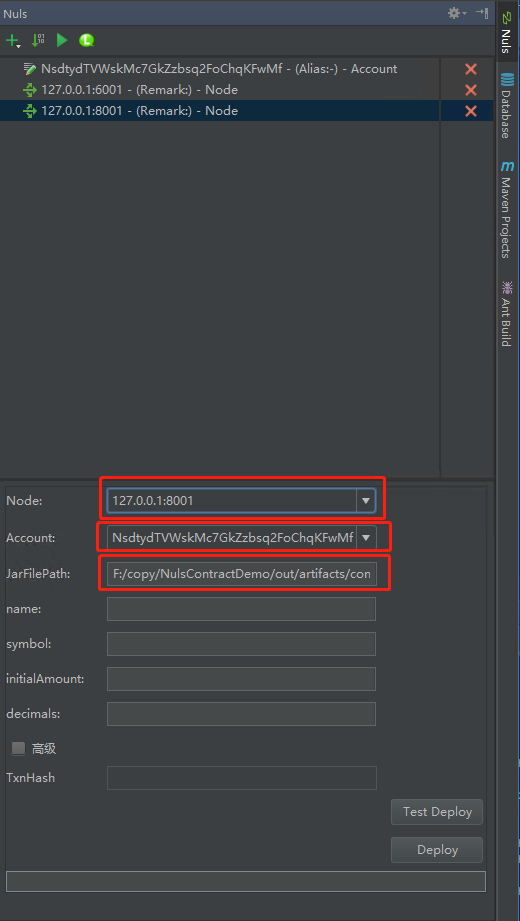

# 智能合约插件

#### 1 在IDEA安装NULS插件
- [获取NULS插件](https://nuls-usa-west.oss-us-west-1.aliyuncs.com/1.1.0-beta/Docs%26plugin.zip)ZIP包，存放在磁盘
点击File->Settings->Plugin->Install plugin from disk

- 选择之前获取到的ZIP包，然后点击OK

- 勾选上NULS插件，点击Apply

#### 2 创建一个NULS项目

输入Project名，点击finish

#### 3 编写智能合约

智能合约代码编写可查看[开发者文档](http://dev.nuls.io/contract/)

#### 4 设置部署合约的节点和账户

- 点击右方的NULS插件，调出NULS插件面板

	

- 插件会自动生成一个127.0.0.1:8001节点，开发者可自主添加一个节点，用来部署合约。推荐方法为：在本地启动钱包，然后将钱包的地址添加为节点地址

	点击面板左上角的+号，选择Add Node

	

- 输入Node地址，点击OK

	

- 点击面板左上角+号，选择Add Account，输入Account地址，然后点击OK

	

#### 5 打包合约

- 点击插件左上方第二个按钮，可直接将当前Project打包，打包后的输出有两种形式：Jar包和Hex编码

	

- 可点击【复制编码】，将HEX编码复制到钱包的【部署合约】界面进行合约的部署（可选步骤）

	

- 点击插件面板上方第三个部署按钮或当前打包页面底部的【Next】，可进入部署合约界面

	

	

#### 6 部署合约

- 在部署页面，可通过下拉列表选择部署合约的节点和账户，JarFilePath默认值为上一步的打包路径

	

- 紧接JarFilePath的参数为该合约构造函数的参数
	
	

- 点击【高级】，设置Gas值和price值，Gas值范围为1-10000000，建议将Gas值设置较大，以免Gas不足导致部署合约失败

	

- 点击【Test Deploy】，可将合约进行一次测试部署，若成功，会返回Success提示信息

	

- 若测试成功，则点击【Deploy】，创建合约的交易确认成功后，则会返回交易详细信息，则表示合约部署成功

	

- 可在面板上方查看已部署的合约

	

- 点击部署成功的合约，可查看该合约的所有方法

	
	
	

