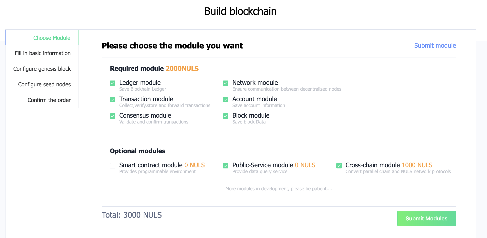
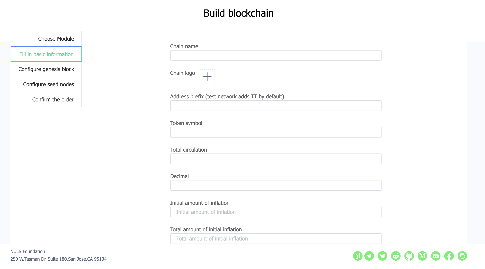
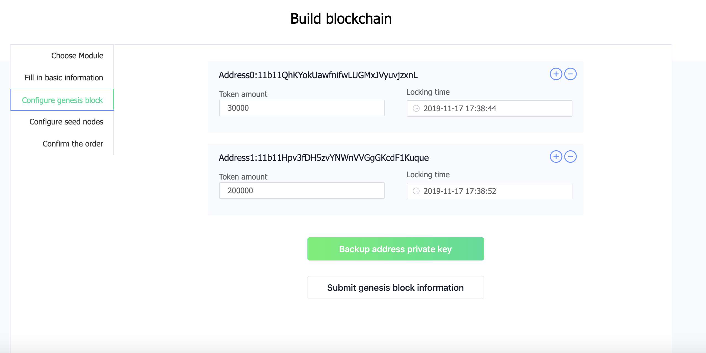
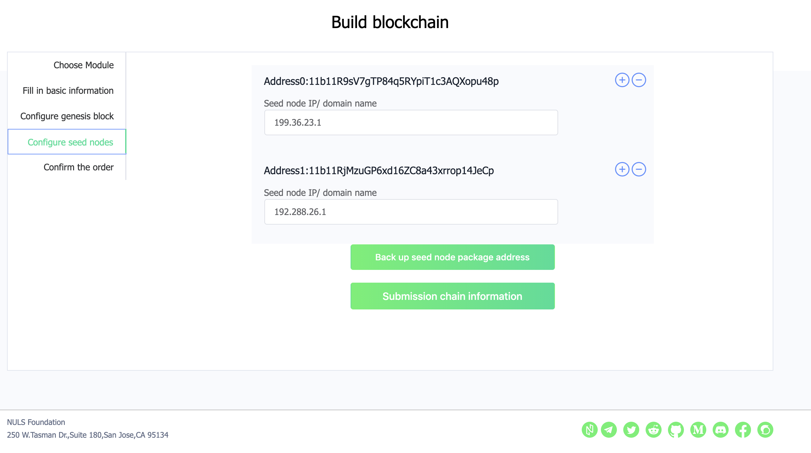
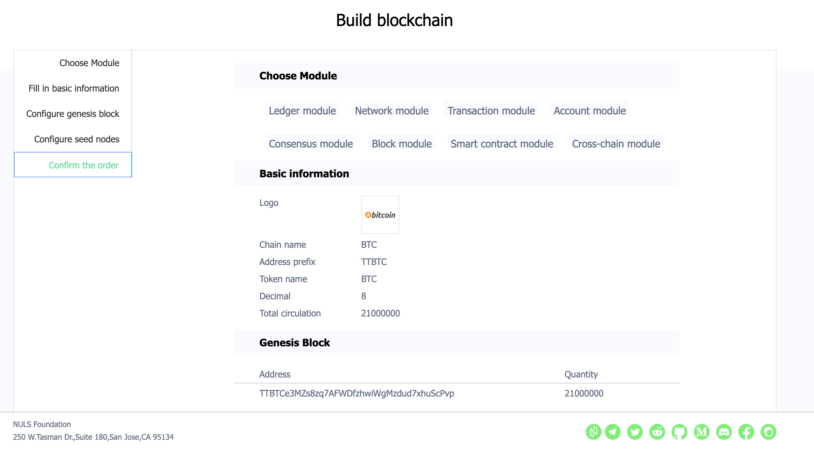
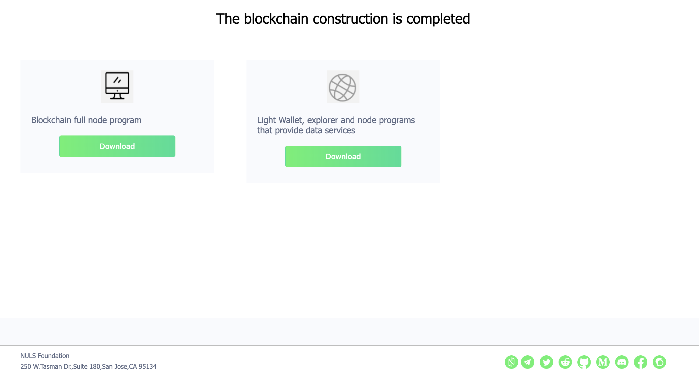
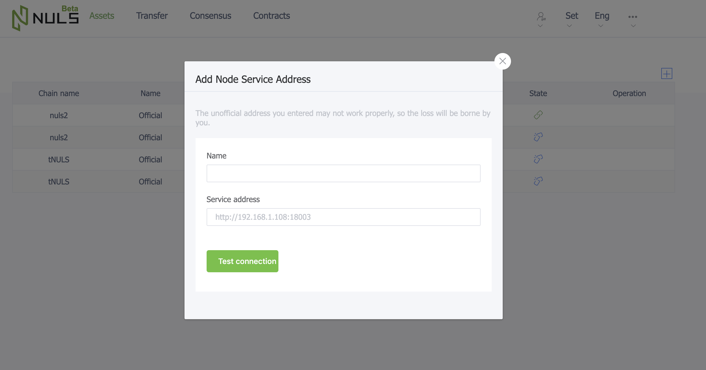

# 链工厂使用指南

欢迎来到链工厂，我们为链工厂感到非常自豪，它能够根据您的业务需求搭建区块链。我们区块链的核心是Nulstar。 Nulstar的设计使我们能够为您提供一个通过选择模块组装而成的区块链。随着时间的流逝，我们的模块/服务会不断丰富，区块链的多样性和区块链功能会不断扩展，会超出我们今天的想象。在使用链工厂的过程中，可以加入电报频道（https://t.me/NulsSupport）以获取问题或反馈，我们期待您的回音。

## 搭建区块链
### 选择模块
在链工厂中，模块分为必须模块和可选模块，系统已经帮助用户勾选上了所有必选模块，用户需根据实际的业务场景勾选可选模块。选择完成后，点击【提交模块信息】



### 填写基本信息

填写链的基本信息，例如名称，logo和通胀规则等



### 配置创世块

系统会自动生成一系列创世块地址，用户需填写初始为每个地址分配的数量。在完成该步骤过程中有两点需要用户格外注意

- 分配给各个地址通证数量的总和需等于基本信息中填写的总发行量
- 填写完成后，用户需点击【备份地址私钥】下载所有地址私钥并保存。系统不会保存该部分信息，因此若用户丢失私钥，系统无法帮助其找回。



### 配置种子节点

若用户已准备好种子节点的服务器，则将种子节点IP/域名填入表单中，并保存打包地址的私钥。待在种子节点上启动节点程序后，导入对应打包地址，种子节点即可开始维护区块链网络。若未准备好服务器，则可先使用默认IP，待服务器准备好后，自行更改节点程序配置文件中的种子节点IP值



### 确认订单

用户需确认前面的步骤中填写信息的正确性，订单提交且交易发出后，便不可修改。确认信息无误后，点击【提交订单】，输入密码，系统将从账户地址自动扣除对应数量NULS作为造链费用




### 下载链资源

提交订单并支付NULS后，系统将开始组装模块并打包资源，该过程可能需要几分钟时间，请用户耐心等待，等待一定时间后，请用户刷新页面，即可看到打包完成的资源



## 部署区块链

若用户选择了Public-service模块，则需要按照一下步骤启动数据服务节点，钱包和浏览器

### 安装MongoDB

首先，需要使用public-service服务的用户，需要先在服务器上面安装MongoDB，下载centos7版本：

```
wget https://fastdl.mongodb.org/linux/mongodb-linux-x86_64-rhel70-4.2.1.tgz
```

下载成功后解压并进入目录：

```
tar -xvf mongodb-linux-x86_64-rhel70-4.2.1.tgz
cd mongodb-linux-x86_64-rhel70-4.2.1
```

进入目录之后，新建一个配置文件mongodb.conf

```
vi mongodb.conf
dbpath=/usr/local/mongodb/data  #数据文件存放目录
logpath=/usr/local/mongodb/logs/mongodb.log #日志存放目录
port=27017 #端口
fork=true #以守护程序的方式启用，即在后台运行
logappend=true
maxConns=5000
storageEngine = wiredTiger
bind_ip = 127.0.0.1
```

MongoDB设置默认名称，不设置密码，通过新建配置文件mongodb.conf启动

```
./bin/mongod -f mongodb.conf
```

### 启动Public-service服务节点钱包

在链工厂造链成功后，下载带有public-service服务的包上传到安装有MongoDB的服务器，先启动MongoDB，然后解压钱包并进入目录启动钱包：

```
tar -xvf pro_linux.tar.gz 
cd NULS_Wallet/
```

进入钱包目录之后，执行`./start`命令启动钱包，`./check-status`命令查看钱包启动状态。

钱包启动成功后

- 通过**IP:8005**访问该链的区块浏览器

- **ip:8006**访问链的网页钱包，在网页钱包里可以通过添加节点服务(**http://{ip}:8003/**)来连接链：



### 启动普通节点钱包

从链工厂下载普通钱包上传到服务器并解压（同上），进入目录之后启动钱包；待钱包启动成功之后，通过命令`./cmd`进入命令行，导入造链时下载的出块地址（密码设置与配置文件一致）

注意事项：

- 多个出块地址都需要导入启动的钱包（不能是同一个钱包），

- 配置为种子节点的IP的服务器上面必须启动钱包，新加入的钱包首先会来连接这个IP

### 跨链网络组网等待

设置了跨链的链，需要等待跨链组网，组网需要一段时间，当主网和新链的跨链网络成功初始化之后，才可以发起跨链交易，否则引起资产损失。