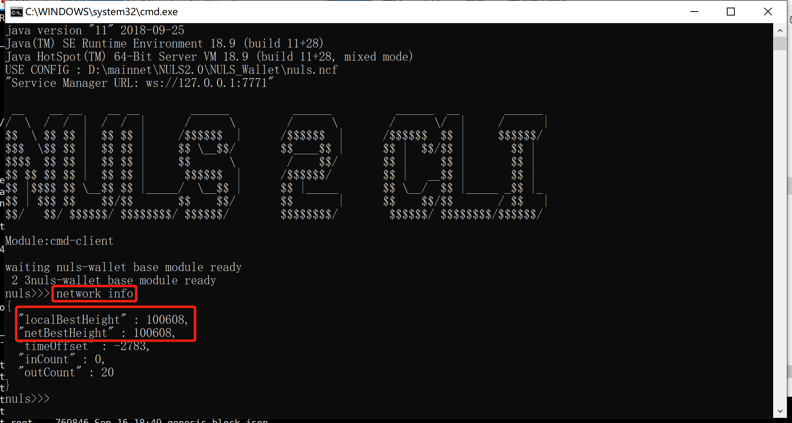
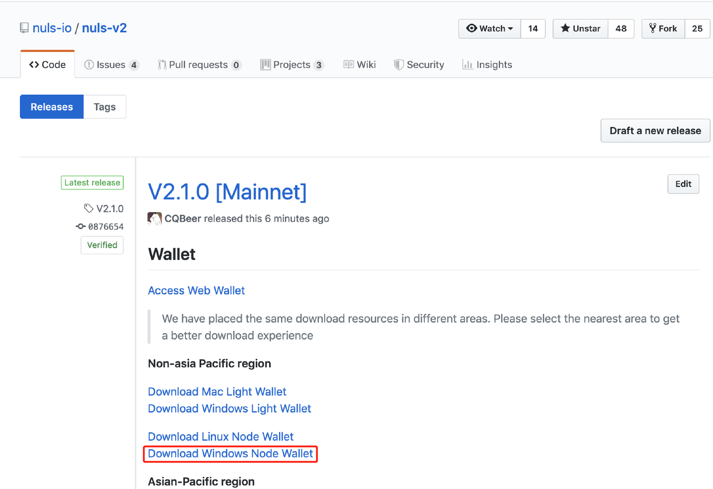
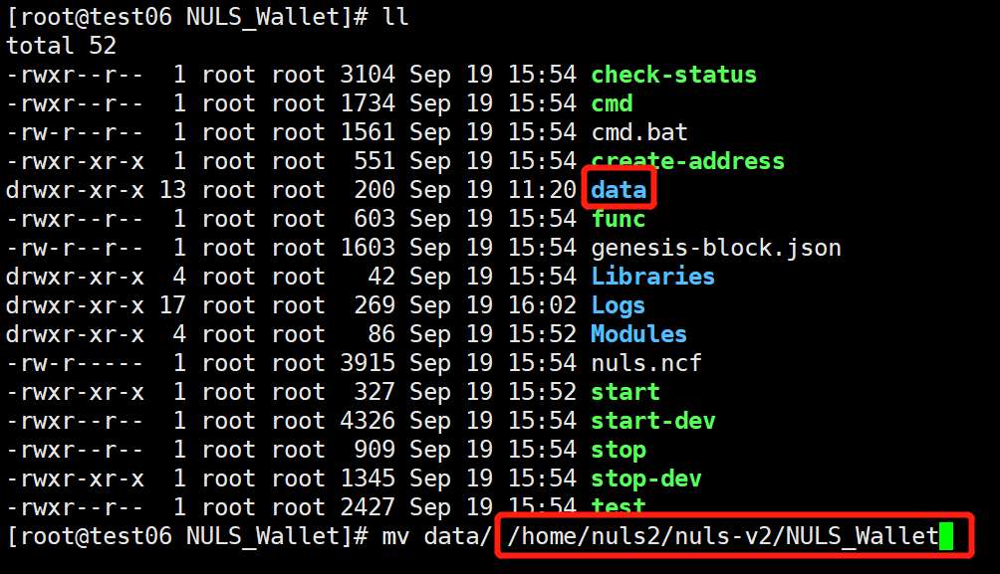
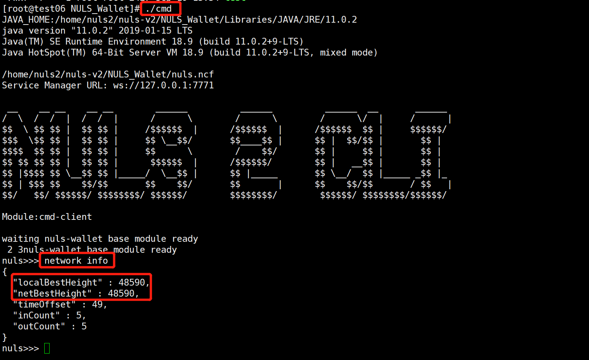
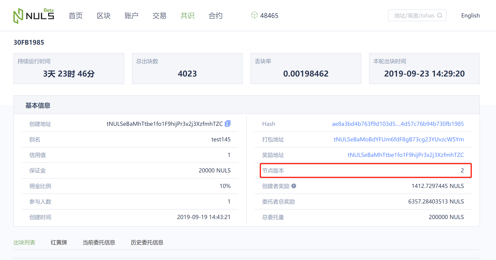

# 节点钱包升级指南

​目前节点钱包未支持自动升级，所以需要手动操作，下面为Windows和Linux两个系统下的升级方法。

## Windows

* 停止当前运行的Windows节点钱包（关闭启动窗口）；

  

* 在[GitHub](https://github.com/nuls-io/nuls-v2/releases)上面下载最新的Windows包，解压到指定目录（目录路径不能包含中文：中文路径会导致无法打开命令行）；

  

* 将停止运行的节点钱包的data目录整体替换解压后的新包里面的data目录；
* 鼠标左键双击start.bat启动节点钱包；
* 鼠标左键双击cmd.bat进去命令行，查看节点钱包高度情况（network info）；

  

* 当节点钱包最新高度跟网络高度一致时，证明节点钱包正常运行；
* 在[主网区块浏览器](https://nulscan.io)中查看自己节点的版本信息，节点版本显示为2，正常升级（需要节点升级并且重新出块后节点版本号才会更新）。

  

## Linux

* 停止运行中的节点钱包（./stop）；

  

* 在[GitHub](https://github.com/nuls-io/nuls-v2/releases)上面下载最新的Linux包，解压（tar -xvf NULS_Wallet_linux64_v2.1.0.tar.gz）到指定目录；

  

* 将停止的节点钱包中的data移动到新解压的节点钱包目录下（mv data  ../NULS-Wllet）；

  

* 启动节点钱包（./start）；
* 进入命令行（./cmd），查看节点钱包高度情况（network info）；

  

* 当节点钱包最新高度跟网络高度一致时，证明节点钱包正常运行；
* 在[主网区块浏览器](https://nulscan.io)中查看自己节点的版本信息，节点版本显示为2，正常升级（需要节点升级并且重新出块后节点版本号才会更新）。

  

