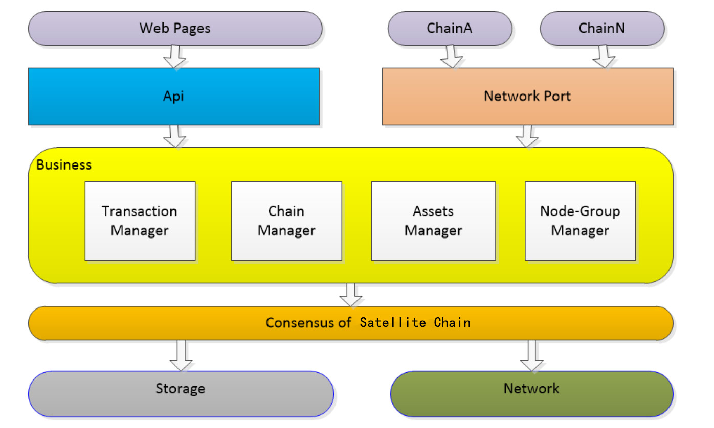
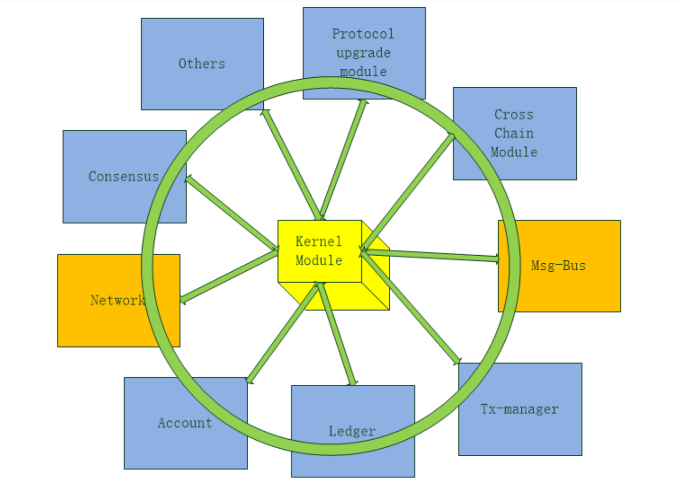

title: Cross-chain Overall Design
---

## 1 Industrial Background

Blockchain is a decentralized application operating system. Cross-chain technology is in need for linking multiple operating systems together, thus substantially developing the ecosystem to form the internet of blockchain. 

## 2 Design Objectives

* To define cross-chain standards and realize cross-chain communication. 
* To build Satellite Chain to realize cross-chain asset transfer

## 3 Overall Plan

### 3.1 Overall Architecture

Clarification:

​	An independent Satellite Chain is responsible for communication among all chains and realizing cross-chain communication in an open way. 

​	Blockchains (in the ecology) based on NULS module warehouse can communicate with Satellite Chain in the underlying level by adding cross-chain modules via selecting modules. 

​	 For Ethereum and Bitcoin and other public chains free from influence by NULS, protocol conversion should be achieved by a special mechanism, in which the public chain protocol and NULS cross-chain protocol will be adapted to realize communication with a unified protocol.

​	 All blockchains can only communicate with the Satellite Chain, which is responsible for verifying transactions and all parallel chains trust the verification results. 

* Linking Methods Between Chains 

  All nodes in the blockchain will operate cross-chain modules and are connected to some nodes of the Satellite Chain. Corresponding random algorithm will decide specific nodes to be connected and try to guarantee diversion of the connection so as to safeguard the network security. 

* How to realize cross-chain transaction

  Suppose Account a1 of Chain A transfers its Asset a to Account b1 of Chain b, the procedures are as follows: 

  * Cross-chain transaction will be initiated in Chain A and is subject to the verification of Chain A first;
  * When certain blocks are accumulated, cross-chain modules will push the transaction to nodes in Satellite Chain;
  * After receipt, Satellite Chain will verify the transaction in the following two steps:
    * 1 Inquire nodes in Chain A if the transaction is verified and if the transaction sent to Satellite Chain by cross-chain protocol is correct and authentic; 
    * 2 Verify the transaction by Byzantine fault tolerant algorithm in Satellite Chain. The transaction will be regarded as invalid if a majority of nodes cannot agree.
  * The transaction will be packaged in blocks of Satellite Chain; 
  * Nodes will push this cross-chain transaction to Chain B;
  * Nodes of Chain B will verify the transaction via nodes connected to Satellite Chain. If it cannot pass the verification, this transaction will be discarded;
  * If it passes the verification, corresponding asset will be placed in target address;
  * This transaction will be verified in Chain B consensus. 
  * The transaction is complete and corresponding asset is available in Chain B. 

* Adaptation of Multiple Algorithms 

  Satellite Chain supports most of mathematical algorithms used at present, including digest algorithm, symmetric encryption and asymmetric encryption among others. These algorithms can be used via a unified interface provided by the algorithm library. 

* Community-based Governance 

  Community governance mechanism is built in Satellite Chain. Its functions include modifying system operation parameters, upgrading protocols, handling malicious chains, using community asset among others.   

## 4 Satellite Chain Design 

###  4.1 Satellite Chain Architecture

 

* Satellite Chain verifies and packages cross-chain transaction by POC consensus mechanism and Byzantine fault tolerant algorithm, which strikes a balance between decentralization and performance and security. 

* Protocols in Satellite Chain are NULS cross-chain protocols with unified definition. Every node will connect multiple nodes in multiple blockchains.  
* Satellite Chain provides chain management mechanism to supervise all corresponding blockchains registered on it. Registration contents include chain information, asset information and cross-chain pledge among others. 
* When one blockchain receives assets from other blockchains, corresponding assets will be in place in this chain. Tokens in different blockchains will be stored as assets in other blockchains. 
* Details for asset transfer to one blockchain from other chains will be stored in Satellite Chain. It should be verified if the asset is to transfer out of this blockchain and illegal asset transfer from this chain is not allowed. Malicious blockchains will be dealt with by community mechanism, including cross-chain pausing, cross-chain suspending and forfeiture of deposit. 
* Blockchain will provide an api user manual. Any developer can develop his/her own wallet, browser, light wallet among other tools. 
* Smart contract will not be operated in Satellite Chain so as to reduce operation complexity of Satellite Chain. 
* Satellite Chain provides protocol application extension. Developers can use this protocol to develop DApp and optimize cross-chain protocols.
### 4.2 Satellite Chain Operation 

* Satellite Chain has a modular architecture.
* Every module can be an independently operating micro service. 
* Micro services are directly linked by http protocol communication. 
* Module development languages are not restrained. 
* Satellite Chain provides micro kernel module to manage service, configuration and data sharing function. 
* Modules of Satellite Chain can also be used by NULS main network to some extent, so modules in Satellite Chain will also be included in NULS module library as NULS modules do. There modules are available for direct use of Chain Factory. 
* Every in-use module is subject to extension. If a module in the library can only meet partial operation needs, this module can be extended instead of re-developing. 
