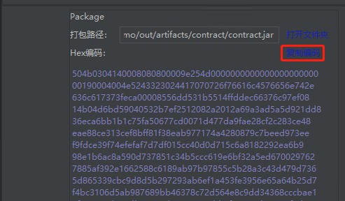

# NULS IDEA plugin manual

#### 1 Install the NULS plugin in IDEA
- Get the NULS plugin ZIP package and store it on disk and 
Click File->Settings->Plugin->Install plugin from disk

- Select the ZIP package you obtained earlier, then click OK

- Check the NULS plugin and click Apply

#### 2 Create a NULS project

Enter the Project name and click finish

#### 3 Writing smart contracts

Smart contract code writing can be viewed [developer documentation](http://dev.nuls.io/contract/)

#### 4 Set up nodes and accounts for deployment contracts

- Click the NULS plugin on the right to bring up the NULS plugin panel

	

- The plugin will automatically generate a 127.0.0.1:8001 node, and the developer can add a node to deploy the contract. The recommended method is to start the wallet locally and then add the address of the wallet as the node address.

	Click the + sign in the upper left corner of the panel and select Add Node.

	

- Enter the Node address and click OK

	

- Click the + sign in the upper left corner of the panel, select Add Account, enter the Account address, and click OK.

	

#### 5 Package contract

- Click the second button at the top left of the plugin to package the current Project directly. The packaged output has two forms: Jar and Hex

	

- Click [Copy Coding] to copy the HEX code to the [Deployment Contract] interface of the wallet for contract deployment (optional step)
	

- Click the third deployment button above the plugin panel or [Next] at the bottom of the current packaging page to enter the deployment contract interface

	

	

#### 6 Deployment contract

- On the deployment page, you can select the node and account for the deployment contract from the drop-down list. The default value of JarFilePath is the packaging path of the previous step.

	

- The parameter immediately following JarFilePath is the parameter of the contract constructor.
	
	

- Click [Advanced] to set the Gas value and the price value. The Gas value range is 1-10000000. It is recommended to set the Gas value to be large to avoid the failure of the Gas to cause the deployment contract to fail.

	

- Click [Test Deploy] to deploy the test to the contract. If successful, it will return the Success message.

	

- If the test is successful, click [Deploy], after the transaction confirmation of the created contract is successful, the transaction details will be returned, indicating that the contract is successfully deployed.

	

- View deployed contracts above the panel

	

- Click on the successful deployment contract to view all the methods of the contract

	
	
	

