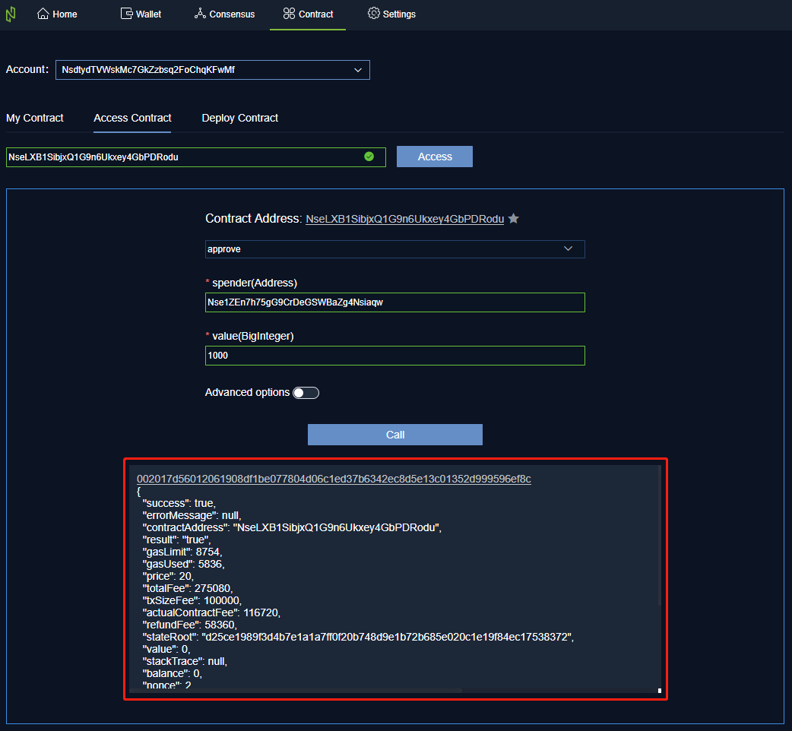
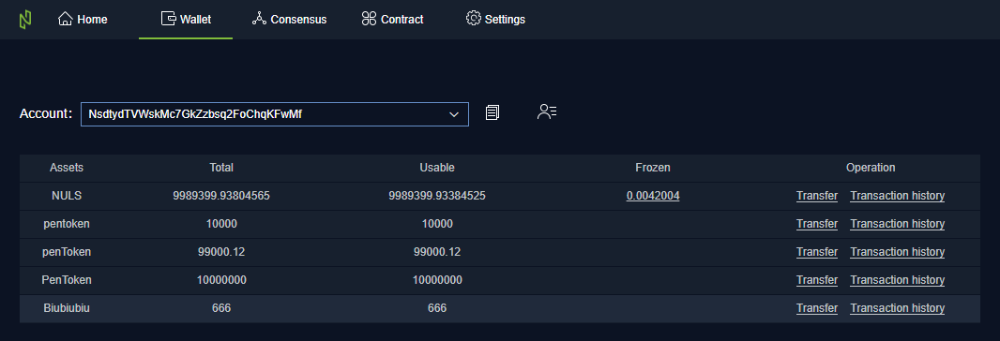

# Wallet smart contract manual

## Deploy contract

1 start wallet, click [contract], click[deploy contract]

2 Fill the Hex code of the contract in the text box

3 Fill in the contract constructor parameters, pay attention to the required fields and value types, otherwise the form validation will not pass

4 Click [Advanced Options] to change the default values of GasLimit and GasPrice, continue to fill in additional information, this field is not required. (This step is optional)

5 After the form is filled, click [Test Contract], the wallet will conduct a test deployment of the contract to verify the legality of the contract

6  After the test is passed, click [Deploy Contract], if the current account has a password, enter the password, and then click [Confirm]. If there is no password, click [Confirm] directly. At this point, the system will transfer to the [My Contracts] page, where you can view the confirmation progress of the contract deployment

7 After the confirmation

- Click [call], the operation on the right side of the form to go directly to the [call contract] page

- Click the contract address to go directly to the contract overview page

## View contract

1 Start the wallet, click [Contract], click [access Contract]

2 Enter the valid/legitimate contract address in the input box, click [Access], a panel will appear below

- Click the [drop-down list] in the panel to select the contract method to be called
- Click on the star icon next to the contract address to add the contract to my contract list

3 There are two cases after selecting a method

- The method is a read-only method. Clicking [call] will return the call result immediately after the network request is completed

	

- The method is writable. You can click the advanced option to change the default values of GasLimit and GasPrice. After clicking [call], the operation will initiate a transaction and consume nuls, so if you had set the account password, you need enter password. After the transaction is confirmed, the result of the call is returned.

	Call contract transaction confirming

	

	Call contract transaction confirmed

	

4 If the method of the writing contract is called, you can click the TxID in the panel to view the details of the contract transaction.

Call contract transaction details

## My contract

1 My contract list shows the contract created by the current account and the contract of the collection

- Click the contract address to enter the contract overview page

		

- Click call, you can enter the [call contract] page of the contract

	

- Click [Cancel Collection] to remove the contract from the [My Contracts] list

3 [Transaction History] shows the transactions within the contract. Click TxID to view the details of the transaction

4 [Contract Info] shows all the methods of the contract, the corresponding parameters and return value types.

5 If the contract is created by the current account, you can delete the contract by clicking the [Delete] icon at the top right of the contract overview. After the contract is deleted, you can continue to view the contract details, but you cannot call the contract method

## Account multi-asset

After a Token is issued through a smart contract or transferred to a different type of Token from another account, multiple assets appear in the account.

1 Enter the wallet to view all types of assets under the current account address

2 Click [Transfer] to enter the transfer interface of this type of asset, enter the payment address and transfer amount, and transfer the asset of this type

3 Click [Transaction History] to enter the transaction record page of this type of asset

4 On the [Transaction History] page, you can switch the transaction records of different types of assets by clicking the drop-down list

5 lick on TxID to view the transaction details

