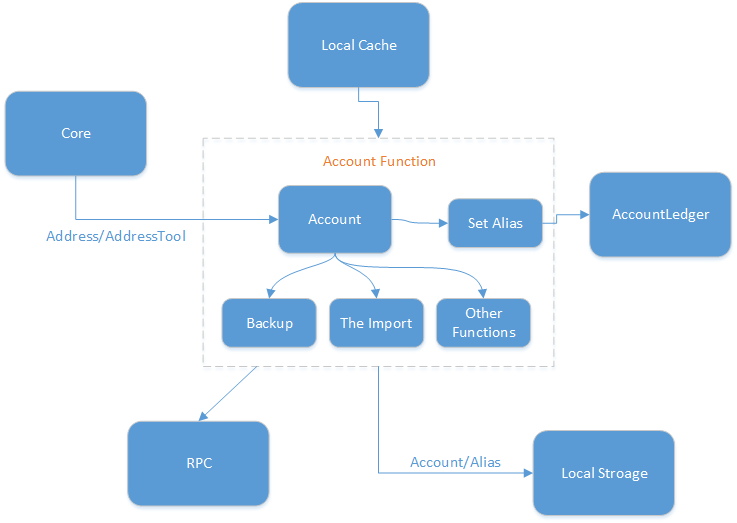
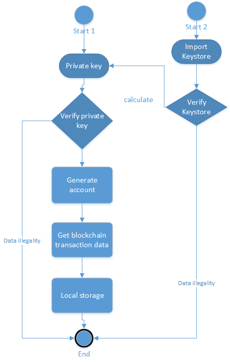

# NULS Account Module Resolution

## 1、Overview

The NULS Account Module is the basic module for providing the NULS main chain with all the functions of the account. It mainly supports the functions of account generation, security and custody, and information acquisition. Other modules can use various functions of the account and obtain account information according to the interface provided by the account module. Users or other applications can be based on RPC. The interface makes the account more practical and personalized. The account is the basic module of NULS and the carrier of user data (display window). With the development of NULS, the account module will be more complete.

## 2、Feature

The function of the account module is quite rich, and the same function will also provide overloading of multiple interfaces, which is convenient for use in different scenarios, mainly in the following aspects.

#### 2.1 Account generation

The generation aspect of the account includes creating an account and importing an account; and importing the account is divided into importing a private key to generate an account, and importing a keystore backup file to generate an account.

#### 2.2 Security and custody

Account security features include account backup, setting account password, modifying account password, and removing account; backup account is divided into generating Keystore backup file and obtaining private key for backup.

#### 2.3 Access to account information

The functions of obtaining account information mainly include querying individual account information, obtaining multiple account information, obtaining account address, checking account balance, and querying account aliases.

#### 2.4 Practical and personalized features

The functions of the account also include some special tool functions and personalization functions, such as setting account aliases, setting account notes, verifying whether the account is encrypted, signing, verifying the signature, verifying the account address format, and verifying that the account password is correct.

#### 2.5 Access to account local data

In addition to the data of the account alias, the data of the account will be locally persisted, so the account module has the function of accessing the account data, and the final implementation of the function is implemented by calling the interface of the data storage module.


## 3、Interface

- Class that defines the interface: `io.nuls.account.service.AccountService`

```java
    /**
     * Create a specified number of accounts,and encrypt the accounts,
     * all the accounts are encrypted by the same password
     * if the password is NULL or "", the accounts will be unencrypted.
     *
     * @param count    the number of account you want to create.
     * @param password the password of the accounts.
     * @return the account list created.
     */
    Result<List<Account>> createAccount(int count, String password);

    /**
     * Create unencrypted accounts.
     *
     * @param count the number of account you want to create.
     * @return the account list created.
     */
    Result<List<Account>> createAccount(int count);

    /**
     * Create an account and encrypt it,
     * if the password is NULL or "", the accounts will be unencrypted.
     *
     * @param password the password of the accounts(only one account in the list).
     * @return the account list created.
     */
    Result<List<Account>> createAccount(String password);

    /**
     * Create an unencrypted account
     *
     * @return the account list created(only one account in the list).
     */
    Result<List<Account>> createAccount();

    /**
     * delete an account by address.
     *
     * @param address  the address of the account you want to delete.
     * @param password the password of the account.
     * @return the result of the operation.
     */
    Result<Boolean> removeAccount(String address, String password);


    /**
     * Reset password by keyStore.
     *
     * @param keyStore the keyStore of the account.
     * @return the result of the operation.
     */
    Result<Account> updatePasswordByAccountKeyStore(AccountKeyStore keyStore, String password);

    /**
     * import an account form account key store.
     *
     * @param keyStore the keyStore of the account.
     * @return the result of the operation.
     */
    Result<Account> importAccountFormKeyStore(AccountKeyStore keyStore, String password);

    /**
     * import an account form account key store.
     *
     * @param keyStore the keyStore of the account.
     * @return the result of the operation.
     */
    Result<Account> importAccountFormKeyStore(AccountKeyStore keyStore);


    /**
     * import an account from plant private key and encrypt the account.
     */
    Result<Account> importAccount(String prikey, String password);

    /**
     * import an unencrypted account by plant private key.
     */
    Result<Account> importAccount(String prikey);

    /**
     * export an account to an account key store.
     *
     * @param address  the address of the account.
     * @param password the password of the account key store.
     * @return the account key store object.
     */
    Result<AccountKeyStore> exportAccountToKeyStore(String address, String password);

    /**
     * Query account information by address.
     *
     * @param address the address of the account you want to query.
     * @return the account.
     */
    Result<Account> getAccount(byte[] address);

    /**
     *Query account by address.
     *
     * @param address the address of the account you want to query.
     * @return the account.
     */
    Result<Account> getAccount(String address);

    /**
     * Query account by account address.
     *
     * @param address the address of the account you want to query;
     * @return the account.
     */
    Result<Account> getAccount(Address address);

    /**
     * Query account address by public key.
     *
     * @param pubKey public key string.
     * @return the account address.
     */
    Result<Address> getAddress(String pubKey);

    /**
     *Gets the account address object from the account binary public key.
     *
     * @param pubKey public key binary array.
     * @return the account address.
     */
    Result<Address> getAddress(byte[] pubKey);

    /**
     * Verify weather the account is encrypted according to the account.
     *
     * @param account the account to be verified.
     * @return the result of the operation.
     */
    Result isEncrypted(Account account);

    /**
     * Verify weather the account is encrypted according to the account's address object.
     *
     * @param address The address of the account to be verified.
     * @return the result of the operation.
     */
    Result isEncrypted(Address address);

    /**
     * Verify weather the account is encrypted according to the account's address string.
     *
     * @param address The address of the account to be verified.
     * @return the result of the operation.
     */
    Result isEncrypted(String address);

    /**
     * Verify the account password.
     *
     * @param account
     * @param password
     * @return
     */
    Result validPassword(Account account, String password);

    /**
     * Verify the format of the address string.
     *
     * @param address To verify the address string.
     * @return the result of the operation.
     */
    Result verifyAddressFormat(String address);

    /**
     * Query all account collections.
     *
     * @return account list of all accounts.
     */
    Result<Collection<Account>> getAccountList();

    /**
     * Sign data.
     *
     * @param data     Data to be signed.
     * @param account  Signed account
     * @param password Account password
     * @return The NulsSignData object.
     */
    NulsSignData signData(byte[] data, Account account, String password) throws NulsException;

    /**
     * Sign data.(no password)
     *
     * @param data    Data to be signed.
     * @param account Signed account
     * @return The NulsSignData object.
     */
    NulsSignData signData(byte[] data, Account account) throws NulsException;

    /**
     * Sign data.
     *
     * @param data  Data to be signed.
     * @param ecKey eckey.
     * @return The NulsSignData object.
     */
    NulsSignData signData(byte[] data, ECKey ecKey) throws NulsException;

    /**
     * Sign data.
     *
     * @param digest   data digest.
     * @param account  account to sign.
     * @param password password of account.
     * @return the NulsSignData object.
     */
    NulsSignData signDigest(byte[] digest, Account account, String password) throws NulsException;

    /**
     * Sign data digest
     *
     * @param digest to be signed.
     * @param ecKey  eckey
     * @return The NulsSignData object.
     */
    NulsSignData signDigest(byte[] digest, ECKey ecKey);

    /**
     * Verify the signature.
     *
     * @param data     data to be validated.
     * @param signData signature.
     * @param pubKey   dublic key of account.
     * @return the result of the opration
     */
    Result verifySignData(byte[] data, NulsSignData signData, byte[] pubKey);

    /**
     * Query the balance of all accounts.
     *
     * @return Balance object.
     */
    Result<Balance> getBalance() throws NulsException;

    /**
     * Query the balance of an account.
     *
     * @param account the account.
     * @return Balance object.
     */
    Result<Balance> getBalance(Account account) throws NulsException;

    /**
     * Query the balance of an account.
     *
     * @param address the address of the account.
     * @return Balance object.
     */
    Result<Balance> getBalance(Address address) throws NulsException;

    /**
     * Query the balance of an account.
     *
     * @param address the address of the account.
     * @return Balance object.
     */
    Result<Balance> getBalance(String address) throws NulsException;


    /**
     * Get an account alias based on the array of account address bytes
     *
     * @param address
     * @return alias string
     */
    Result<String> getAlias(byte[] address);

    /**
     * Get account alias according to account address
     *
     * @param address
     * @return alias string
     */
    Result<String> getAlias(String address);

    /**
     * Gets to set the alias transaction fee
     *
     * @param address
     * @param aliasName
     * @return
     */
    Result<Na> getAliasFee(String address, String aliasName);

```


## 4、Architectures

- Module name：account
- Module ID：5



## 5、Protocol

##### 5.1 General transaction data structure

| Size | Field      | Data type | Description      |
| ---- | ---------- | --------- | ---------------- |
| 2    | type       | uint16    | Transaction type |
| 6    | time       | uint48    | Timestamp        |
| ??   | remark     | VarByte   | Remark           |
| ??   | txData     | ??        | Transaction data |
| ??   | coinData   | ??        | Token data       |
| ??   | scriptSign | VarByte   | P2PKHScriptSig   |

##### 5.2 Alias transaction

- txData：Alias

**Alias**

| Size | Field   | Data type | Description            |
| ---- | ------- | --------- | ---------------------- |
| 2    | address | VarByte   | Address of the account |
| ？？ | alias   | String    | Alias                  |

## 6、Core Process

#### 6.1 Account generation

##### 6.1.1 create account

The account address of NULS is generated by the combination of the default Chain ID of NULS, the default address type of NULS, and ECKey (elliptic curve encryption algorithm), and the fixed length is 23. The generated Byte array obtains the address string of the NULS account through the Base58 algorithm. When creating a new account, ECKey is an ECKey instance generated by a random seed. The public key and private key of the account and the account address are obtained by ECKey to generate a new account.

##### 6.1.2 Backup

After the account is generated, the clear key of the account can be obtained through the interface, so that the private key can be properly kept (ie, backed up), and a backup file can be generated by backing up the interface of the keystore file for backup. 

There are two situations when backing up the Keystore: 

1、Backup unencrypted account

When the account has no password, the interface is directly called to generate a backup file. The file has been named with the account address and the file suffix is .keystore. And the private key in the keystore is a plaintext private key (prikey has a value, encryptedPrivateKey has no value).

2、Backup encrypted account

When backing up an encrypted account, you need to verify the current account password, and use this password to encrypt the private key in the keystore. The encrypted private key has a value in the generated file (encryptedPrivateKey has a value), and the plaintext private key has no value (prikey) No value).

##### 6.1.3 Import account (private key, keystore file)

Importing an account means that the user wants to regenerate his or her account information locally for some reason. The user needs to hold the private key of the corresponding account or the keystore backup file. The difference between a private key and a keystore is that the keystore (when the account is set with a password) can save the encrypted private key without saving the plaintext private key, so the security is higher. In this case, when the keystore file is imported, the password of the account at the time of generating the keystore file is verified. The password and the encrypted private key can be used to calculate the plaintext private key, and then the next import process is performed.

Regardless of the way the user imports it, the corresponding ECKey instance is generated by the private key of the account, and then the account information is generated in the same way as the account creation. The way to create an account is different from the way the ECkey instance is obtained. The account generated by the same private key is consistent in the same information, and then the account transfer is used to obtain the account transfer, set the alias, create the node, commission and other transaction data from the blockchain to synchronize to the local, thus The function of importing accounts is implemented.

Although the keystore file contains an alias for the account, since the Keystore file may be serially modified and forged, it is still necessary to restore the account's alias information by obtaining the account setting alias transaction information from the blockchain when importing the account. It is a feature that makes use of blockchain information that cannot be tampered with.



##### 6.1.4 Set up an account alias

Setting an account alias will cost 1 NULS token. This 1 NULS will be burned to a fixed hole address, the account set alias will be saved in the blockchain, and the alias will be unique in the blockchain. A transaction will be initiated and sent to other nodes for verification, packaging, confirmation, and then setting the alias will be successful.