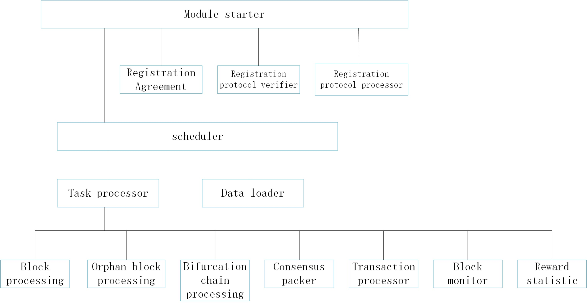
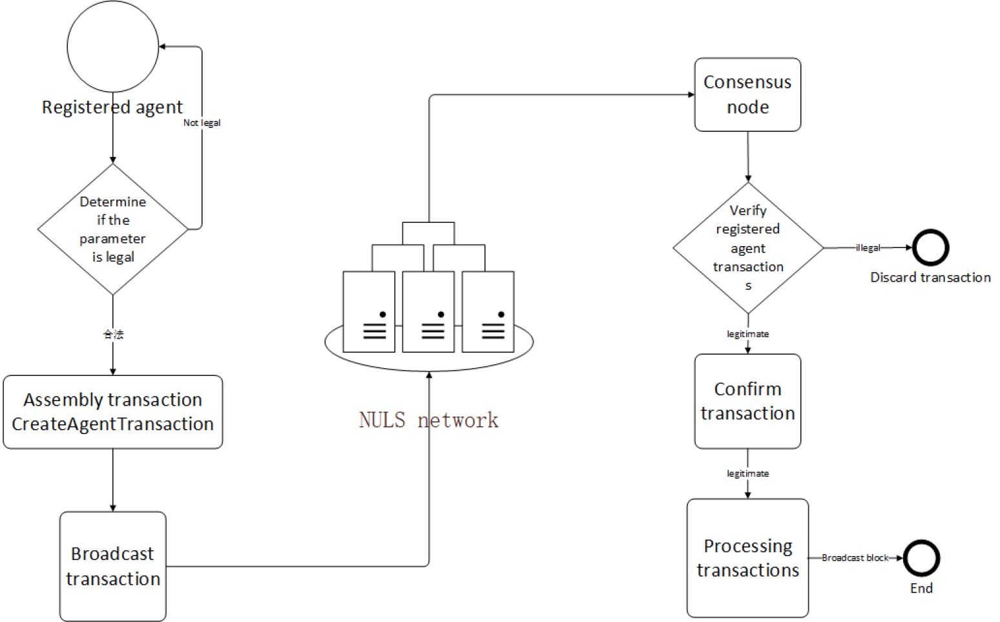
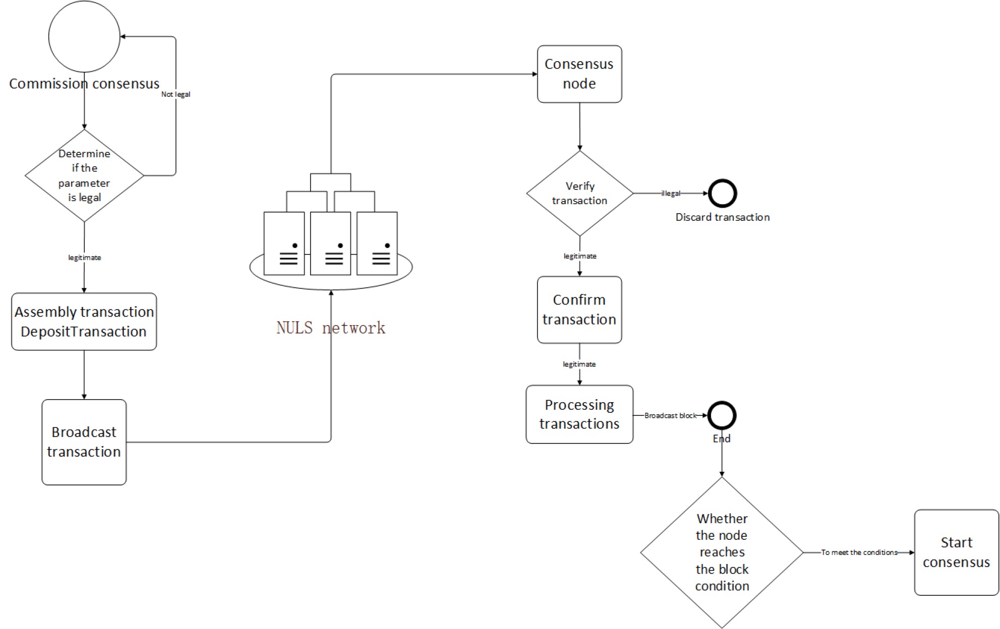
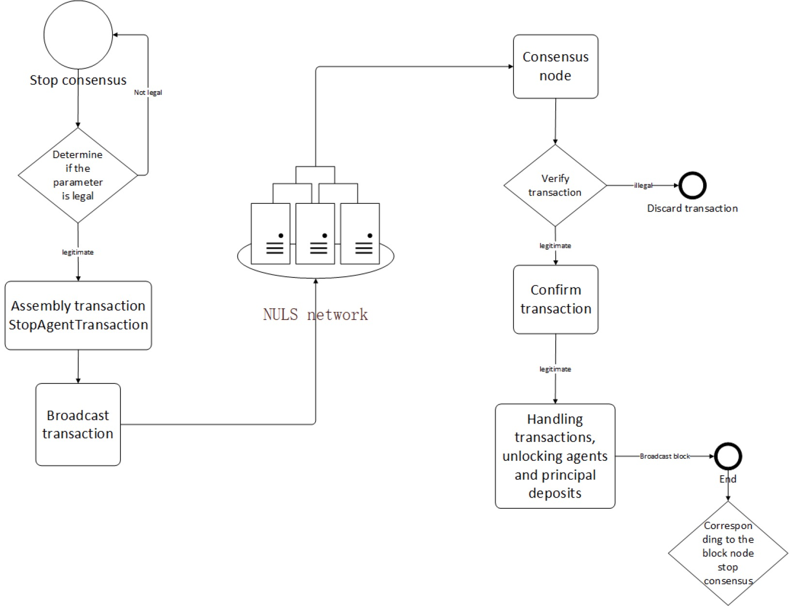
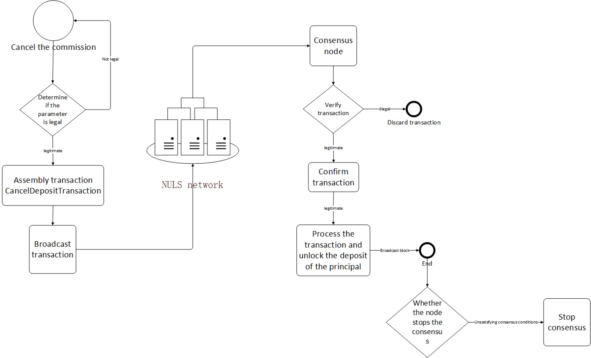
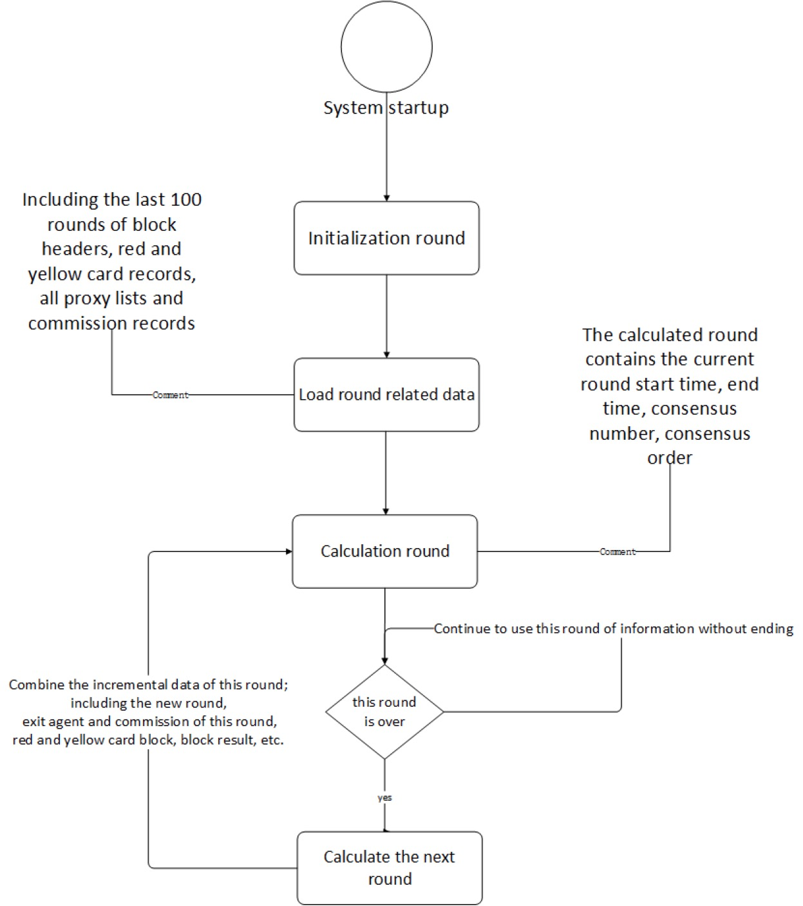
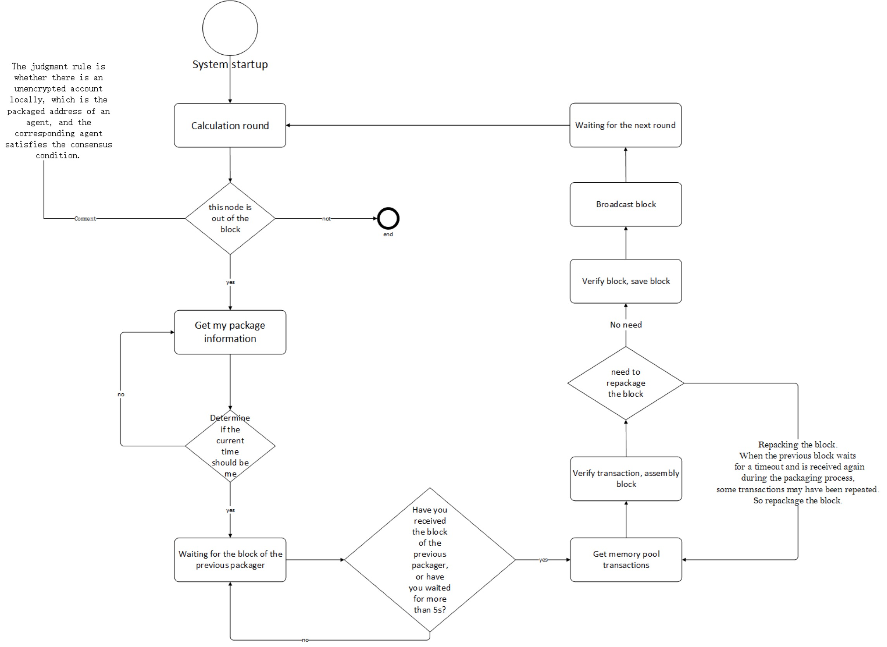
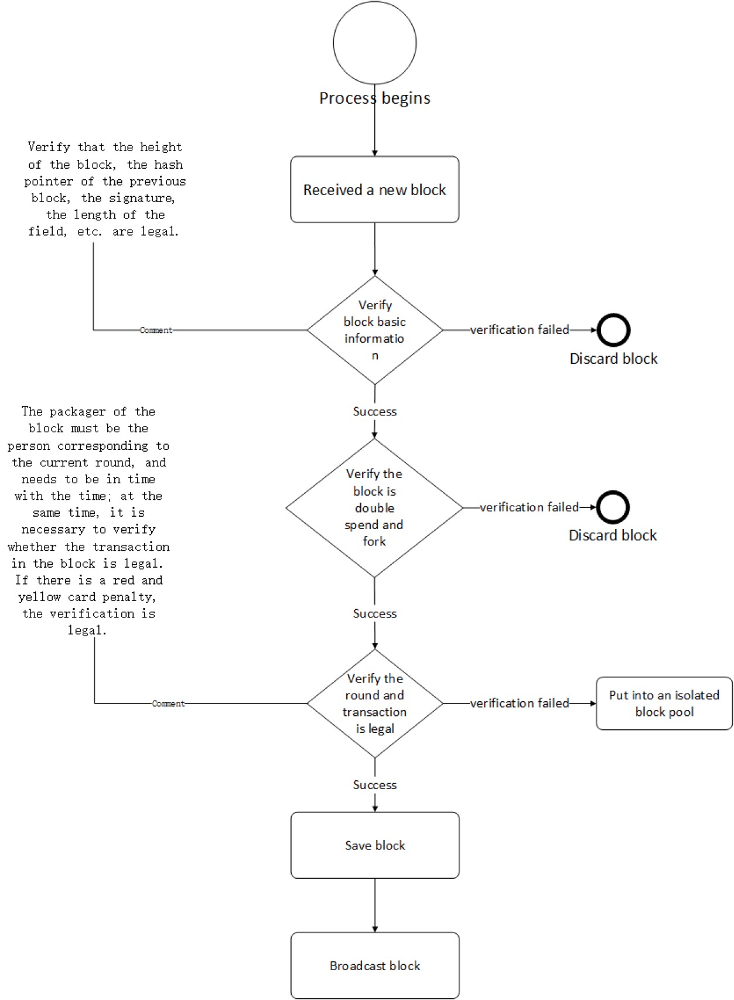
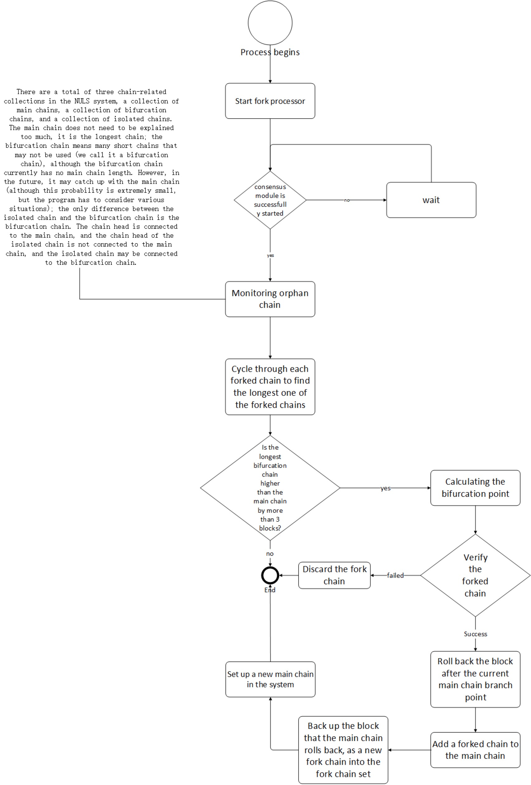

title: NULS consensus module analysis
---

## 1、Module overview
As we all know, the core of the blockchain is the consensus mechanism. Unlike the traditional Internet's clipet-server architecture, the nodes of the blockchain are peer-to-peer, without the center, and everyone has the same rights; so in order to make the data consistent, let a network without a center maintain a set of books that everyone agrees with. This is the role of the consensus mechanism.


There are many public chain consensus mechanisms. The NULS main network adopts the self-originated POC (Proof Of Credit) consensus mechanism, which inherits the security and high efficiency of the Dpos consensus mechanism, and has made great improvements in collaboration. Can be seen as an upgraded version of Dpos.


The NULS consensus module is highly abstracted at the interface layer, and some necessary functional interfaces are extracted, which is implemented as a POC consensus. Based on the modular architecture of NULS, any other possible consensus mechanism can be implemented. Look forward to the consensus mechanism of the community, individuals or institutions to achieve their needs, and contribute the code to the main warehouse of NULS. In addition to the POC, there will be multiple consensus algorithms such as POW, POS, DPOS and PBTF.


This chapter focuses on the NULS consensus module interface definition and the implementation details of the default POC consensus mechanism.
​	
​	
​	**Module information**
​	
​	Module name：consensus-module
​	
​	Module structure: module top-level directory consensus-module, consesnus project for module interface definition, poc implementation directory poc, poc implementation project consensus-poc-base, consensus-poc-protocol consensus implementation of related network protocols, consensus-poc-storage consensus storage interface And implementation engineering
​	
​	Interface definition dependency module：**protocol-module、network-module**
​	
​	Implement additional dependency modules：**core-module、ledger-module、account-module、account-ledger-module**

## 2、Module function
​	This section introduces the NULS consensus module functionality from two levels. The first level describes the interface function provided by the external interface. The external interface is a shared abstract interface that may be required by multiple consensus algorithms. The second level is summarized from the functional requirements of the POC implementation.

### 2.1 External interface

* New transaction: The new transaction on the network received by the node. After the verification is passed, it needs to be put into a unified memory pool for the consensus module to confirm these transactions (that is, package the transaction into the block); at the same time, receive the new transaction. When the block is located, it is quickly assembled into a complete block by looking up the transactions of these sites (because the new block is generated, the block header information and the transaction hash list are broadcast to the peer nodes).

* Get memory pool transaction: The consensus module provides a method for querying the list of pending transactions for other modules to call when needed.

* Obtain a single transaction: query a transaction, in fact, the transaction of the NULS system should be provided by the account book module, but the transactions provided by the account book module are all confirmed transactions, and the unconfirmed transaction is in the memory pool of the consensus module, so the consensus The module provides a functional interface for finding a single transaction, as well as looking for unconfirmed transactions.

* New block：
	- During the download process, the downloaded target block is received: when a node is just started, the local block data of the node is probably not the latest data, and the incremental block needs to be downloaded from other peer nodes, and the downloaded block needs to enter the consensus module. Through the corresponding consensus rules, the downloaded block is considered to be correct, added to the main chain and saved.
	- The newly generated block received during the operation: receiving a newly born block sent from the network, the general protocol module will get the complete block information (take the way of assembling the transaction, if some transactions are not found locally , then download to the corresponding node), and then hand over the complete block to the consensus module for verification - storage and other operations.
	- Whether the above two scenarios are processed by the same business logic depends on the choice of the consensus mechanism, such as the POC consensus. The only difference is that the round information in the verification is inconsistent. The former uses the calculation history round to verify, the latter. It is verified by the current consensus theory; if the implementation of the POW consensus, the same business logic can be used. That is, the specific implementation can decide whether to reuse the code.

* Rollback block: The rollback of a block means that when the node discovers that there is a longer chain than the local main chain on the network, it accepts the longer chain on the network as the local new main chain. It is necessary to delete all the blocks in the local main chain that are not included in the longer chain on the network, and the transactions in the corresponding blocks should also be deleted (the corresponding business logic should also be reversed, the terminology is called Rollback). In most cases, whether there is a fork or not, whether it needs to be forked, depends on the implementation and selection of the consensus mechanism. Most of the time, the consensus mechanism is internally processed. The consensus module provides this interface function. Other modules need to be called when needed (such as the initial start of the download, you may need to roll back the block). In particular, not all consensus mechanisms need to be rolled back.

### 2.2 POC functional requirements analysis
To implement POC, you first need to know the design philosophy and business rules of POC. 

##### In the POC system, there are four roles: agent, principal, packager, and rewarder.
 * The agent———— the node creator, initiates a transaction that creates a consensus node, logs it into the chain, and tells everyone that I want to be a consensus node. The basic condition for node creation is to lock 20,000 NULS. The purpose of setting up this basic condition is to prove that you are really trying to maintain the basic network of NULS.
 
 * The principal———— NULS holder can entrust the NULS he holds to the agent according to the agent's credit value and the influence of the agent, etc., and enjoy the corresponding consensus. Revenue, if the agent node quality or integrity is found to decrease, the principal may withdraw its entrustment and change to others at any time.
 
 * Packager———— When creating a consensus node, the agent can specify a packager. This packager can be his own other account, or a friend who knows technology. The most important thing is that the packager can not hold any NULS. Even if the server participating in the consensus is hacked, the user will not have a huge loss, and the loss will only be affected by the earnings after the attack.
 
 * Rewarding people———— When creating a consensus node, an agent can not only specify a packager, but also designate a beneficiary to specify who can get the reward generated by the consensus.

##### In the POC system, there are four business logics: creating a proxy (creating a consensus node), stopping a proxy node (exiting a consensus), delegating a consensus, and canceling a delegation.

* Create proxy (create consensus node): Lock 20,000 NULS and initiate a registration proxy transaction. After packaging, the whole network can be seen. Others can lock NULS to the proxy node.

* Stop the agent node (exit consensus): The agent can stop its agent qualification at any time, initiate a transaction to delete the agent node, and after the transaction is packaged and confirmed, it will quickly withdraw from the consensus and no longer participate in the production of the new block. The 20,000 NULS locked during the registration of the agent will be unlocked after 72 hours, and the rest of the NULS delegated to the node will be unlocked immediately.

* Delegate consensus: Users with NULS of 2000 or above can choose a proxy node to commission and obtain the corresponding block revenue. Before exiting, the corresponding delegated NULS will be locked out of use.

* Cancellation of the delegation: The user can cancel the previous entrustment. After the revocation, the locked NULS will immediately explain and no longer enjoy the corresponding consensus revenue.

##### Two punishment mechanisms for POC systems
 * Yellow card penalty: When the block node is disconnected from the network, card machine and other uncertain reasons, the block will not be out of the block, or the block is not used, then the yellow card will be punished in the next round. The yellow card penalty will affect the node's income; when 100 consecutive yellow card penalties are awarded, a red card will be imposed.
 
 * Red card penalty: When the block node makes malicious fork, double flower and other behaviors that seriously endanger the stability of the network, or when it receives 100 yellow card penalties continuously, the system will give a red card penalty. The node that receives the red card penalty will be forced to stop the consensus. The deposit when the agent is created is frozen for 3 months, and the node can never be created again; the corresponding node of the node that received the red card penalty is immediately unlocked.


##### Hidden functional requirements of POC internal systems
* Maintain an agent information form and update it based on the above four transactions received in real time.

* Maintain a round of information table, so that each round of agents who meet the conditions of the outbound block are randomly queued out.

* The proxy node that meets the condition of the outbound condition verifies and packages the transaction of the memory pool, assembles it into a new block and broadcasts it to the whole network.

* Fork processing.

The above is a functional analysis of the consensus module POC consensus mechanism implementation, and the details of each function implementation are described in the [** core process**] (#core-processer) section.
 
## 3、Module interface

The external interface definition class of the consensus module is io.nuls.consensus.service.ConsensusService
, under the conssusus project.

* **New transaction**
  * Method name: newTx
  * Method description:

	 - The new transaction generated on the network or locally generated by the node is initially verified and passed into the transaction memory pool for confirmation.

  * Parameter Description:

	 - tx : Transaction


  * Return value description:

	 - Type：Result
	 - Field：
	 		* success : Return whether the processing is successful

  * Code

```
   /**
     * receive a new transaction, add in memory pool after verify success
     * @param tx
     * @return Result
     */
    Result newTx(Transaction<? extends BaseNulsData> tx);
```

* **New block is born**
  * Method name: newBlock
  * Method description:

	 - After receiving a newly born block from the network, the general protocol module will get the complete block information (take the way of assembling the transaction, if some transactions are not found locally, download it to the corresponding node), and then complete The block is handed over to the consensus module for verification - operations such as warehousing.
	 
			There are two overloaded methods in the interface class, whether you know exactly which peer node received the new block.

  * Parameter Description:

	 - block : Complete block information（Block)
	 - node :  Received peer node information（Node)


  * Return value description:

	 - Type：Result
	 - Field：
	 		* success : Return whether the processing is successful

  * Code

```
  /**
     * receive block from other peers
     * @param block
     * @return Result
     */
    Result newBlock(Block block);

    /**
     * receive block from other peers
     * @param block
     * @param node
     * @return Result
     */
    Result newBlock(Block block, Node node);
```

* **Add a block to the main chain**
  * Method name: addBlock
  * Method description:

	 - When the local block is lower than the latest height of the network, you need to download the latest incremental block from the network. After downloading to the block, call this method to add and connect the block to the local main chain.

  * Parameter Description:

	 - block : Complete block information（Block)


  * Return value description:

	 - Type：Result
	 - Field：
	 		* success : Return whether the processing is successful

  * Code

```
  	/**
     * synchronous block from other peers
     * @param block
     * @return Result
     */
    Result addBlock(Block block);
```


* **Rollback block**
  * Method name: rollbackBlock
  * Method description:

	 - The latest block in the local main chain is revoked. When the incoming block is not the latest block of the local main chain, it will return a failure. In the implementation of the POC, the optimal block of the main chain in the memory will be preferentially rolled back. After the success, the database is rolled back accordingly.

  * Parameter Description:

	 - block : Complete block information（Block)


  * Return value description:

	 - Type：Result
	 - Field：
	 		* success : Return whether the processing is successful

  * Code

```
  	/**
     * Roll back the latest block and roll back the status of the chain in the consensus service memory
     *
     * 回滚最新区块，同时回滚共识服务内存中链的状态
     * @return Result
     */
    Result rollbackBlock(Block block) throws NulsException;
```

* **Get the transaction list of the memory pool**
  * Method name: getMemoryTxs
  * Method description:

	 - Get all the transactions in the memory pool

  * Parameter Description:

	 - No parameters


  * Return value:

	 - Type：List\<Transaction>
	 - Description: Transaction collection

  * Code

```
  	/**
     * Get all the transactions in the memory pool
     *
     * 获取内存池里面的所有交易
     * @return List<Transaction>
     */
    List<Transaction> getMemoryTxs();
```


* **Get a single transaction**
  * Method name: getTx
  * Method description:

	 - Inquiring a transaction, in fact, the transaction of the NULS system should be provided by the ledger module, but the transactions provided by the ledger module are all confirmed transactions, and the unconfirmed transaction is in the memory pool of the consensus module, so the consensus module provides a lookup externally. A functional interface for a single transaction that also includes looking for unconfirmed transactions.

  * Parameter Description:

	 - hash : transaction hash（NulsDigestData)


  * return value:

	 - Type：Transaction
	 - Description: The transaction object, if not, is null

  * Code

```
  	Transaction getTx(NulsDigestData hash);
```

## 4、Module architecture




## 5、Module protocol

### TX_TYPE_REGISTER_AGENT

| 尺寸   | 字段         | 数据类型    | 说明             |
| ---- | ---------- | ------- | -------------- |
| 2    | type       | uint16  | 4           |
| 6    | time       | uint48  | 时间戳            |
| ??   | remark     | VarByte |    备注数据          |
| 8   | deposit    | uint64  | 抵押金额           |
| 23   | agentAddress    | Address  |  节点地址           |
| 23   | packingAddress    | Address  |  打包地址           |
| 23   | rewardAddress    | Address  |  奖励地址           |
| 8   | commissionRate    | Double  |  昵称           |
| ??   | coinData   | CoinData| 交易 UTXO           |
| ??   | scriptSign | VarByte | P2PKHScriptSig |

### TX_TYPE_JOIN_CONSENSUS

| 尺寸   | 字段         | 数据类型    | 说明             |
| ---- | ---------- | ------- | -------------- |
| 2    | type       | uint16  | 2           |
| 6    | time       | uint48  | 时间戳            |
| ??   | remark     | VarByte |    备注数据          |
| 8   | deposit     | byte[]  | 委托金额           |
| 23   | address     | byte[23]  | 地址           |
| 8   | agentHash     | NulsDigestData  | 委托节点地址           |
| ??   | coinData   | CoinData| 交易 UTXO           |
| ??   | scriptSign | VarByte | P2PKHScriptSig |

### TX_TYPE_CANCEL_DEPOSIT

| 尺寸   | 字段         | 数据类型    | 说明             |
| ---- | ---------- | ------- | -------------- |
| 2    | type       | uint16  | 2           |
| 6    | time       | uint48  | 时间戳            |
| ??   | remark     | VarByte |    备注数据          |
| ??   | agentHash     | NulsDigestData  | 委托节点地址           |
| ??   | coinData   | CoinData| 交易 UTXO           |
| ??   | scriptSign | VarByte | P2PKHScriptSig |

### TX_TYPE_STOP_AGENT

| 尺寸   | 字段         | 数据类型    | 说明             |
| ---- | ---------- | ------- | -------------- |
| 2    | type       | uint16  | 2           |
| 6    | time       | uint48  | 时间戳            |
| ??   | remark     | VarByte |    备注数据          |
| ??   | agentHash     | NulsDigestData  | 停止节点地址           |
| ??   | coinData   | CoinData| 交易 UTXO           |
| ??   | scriptSign | VarByte | P2PKHScriptSig |

### TX_TYPE_YELLOW_PUNISH

| 尺寸   | 字段         | 数据类型    | 说明             |
| ---- | ---------- | ------- | -------------- |
| 2    | type       | uint16  | 2           |
| 6    | time       | uint48  | 时间戳            |
| ??   | remark     | VarByte |    备注数据          |
| ??   | count     | VarInt  | 惩罚数量           |
| ??   | addres		| Address[]| 被黄牌警告的节点地址|
| ??   | coinData   | CoinData| 交易 UTXO           |
| ??   | scriptSign | VarByte | P2PKHScriptSig |

### TX_TYPE_RED_PUNISH

| 尺寸   | 字段         | 数据类型    | 说明             |
| ---- | ---------- | ------- | -------------- |
| 2    | type       | uint16  | 2           |
| 6    | time       | uint48  | 时间戳            |
| ??   | remark     | VarByte |    备注数据          |
| 23   | address    | byte[23]  | 惩罚数量           |
| 1   | reasonCode	| byte    | 处罚代码 |
| ??   | evidence   | VarByte | 证据		   |
| ??   | coinData   | CoinData| 交易 UTXO           |
| ??   | scriptSign | VarByte | P2PKHScriptSig |


## <a name="core-processer"></a> 6、Core process

#### Create an agent

* Brief
	* Any user who holds 20,000 or more NULS can create a proxy through the creation of a wallet consensus interface (Linux can be commanded via command line, or via the rpc command). After the creation, the transaction is verified and broadcasted to the entire network for confirmation.
	* After the pen creation agent transaction is confirmed, the node where the package address is located will start consensus after 2 rounds.

* flow chart


* Code interpretation
	* The entry is the io.nuls.consensus.poc.rpc.resource.PocConsensusResource class under the consensus-poc-rpc project, corresponding to the createAgent method.
	
	* The createAgent method in PocConsensusResource first verifies the legality of the parameters (including the address can not be repeated, can not be empty, the account can be found in the local account, the correctness of the account password, etc.), then assemble the transaction and then call the txProcessing method for signature verification. And broadcast.
	
	* The corresponding network protocol is defined in the io.nuls.consensus.poc.protocol.tx.CreateAgentTransaction under the consensus-poc-protocol project;
	
	* The processor bound to the protocol is io.nuls.consensus.poc.tx.processor.CreateAgentTxProcessor under the consensus-poc-base project;
	
	* There are 3 validators, which are under the consensus-poc-base project: io.nuls.consensus.poc.tx.validator.AgentAddressesValidator、io.nuls.consensus.poc.tx.validator.AgentCountValidator、io.nuls.consensus.poc.tx.validator.CreateAgentTxValidator
	
	* CreateAgentTransaction will call verify method to verify when packaging, that is, call 3 bindings respectively, and return true to represent successful verification; after successful packaging, CreateAgentTxProcessor will be called to save to the database.
	
	* After the transaction is packaged into the block, the block will be saved by the addBlock method in io.nuls.consensus.poc.process.BlockProcess. When saving the block, some basic verification will be done first to verify whether the block header is legal. Whether the block contains a double flower transaction, etc., then it will verify whether the packager is legal, the code is

		```
		boolean verifyAndAddBlockResult = chainManager.getMasterChain().verifyAndAddBlock(block, isDownload);
		```
		
		After running here, once successful, the transaction for creating the commission is placed in the agentList of Chain corresponding to ChainChatainer, and the next time the round is calculated, this data will be included.
		
		**In the same way, the following entrusted consensus, stop proxy, and unconfirmed transaction are the same process after being packaged into the block.**

#### Commission consensus

* Brief
	* Users with more than 2000NULS can choose to trust the proxy node to obtain consensus and obtain corresponding benefits.

* flow chart



* Code interpretation
	* The entry is the io.nuls.consensus.poc.rpc.resource.PocConsensusResource class under the consensus-poc-rpc project, corresponding to the depositToAgent method.
	
	* The depositToAgent method in PocConsensusResource first verifies the legality of the parameters (including the proxy hash can not be empty and exists, the delegate account can not be empty and can be found in the local account, the correctness of the account password, etc.), then assemble the DepositTransaction transaction and then call The txProcessing method performs signature verification and broadcast.
	
	* The corresponding network protocol is defined in the io.nuls.consensus.poc.protocol.tx.DepositTransaction under the consensus-poc-protocol project;
	
	* The processor bound to the protocol is io.nuls.consensus.poc.tx.processor.DepositTxProcessor under the consensus-poc-base project;
	
	* The validator is io.nuls.consensus.poc.tx.validator.DepositTxValidator under the consensus-poc-base project
	
	* DepositTransaction will call the verify method to call the validator row validation when it is packaged. Returning true means that the verification is successful; after the package is successful, it will call DepositTxProcessor to save to the database.


#### Stop agent

* Brief
	* The node that successfully registers the agent can choose to stop the agent at any time, but the margin will be locked for 72 hours, and the agent will be unlocked immediately.

* flow chart


* Code interpretation
	* The entry is the io.nuls.consensus.poc.rpc.resource.PocConsensusResource class under the consensus-poc-rpc project, corresponding to the stopAgent method.
	
	* The stopAgent method in PocConsensusResource first verifies the validity of the parameters (including the proxy hash can not be empty and exists, and is the proxy created by itself, the account can not be empty and can be found in the local account, the correctness of the account password, etc.) Reassemble the StopAgentTransaction transaction and then call the txProcessing method for signature verification and broadcast.
	
	* When the StopAgentTransaction is assembled, the margin that was locked when the proxy was created is treated as the current input, and an output corresponding to the lock time is output, which is equivalent to spending the previous margin and relocking for a certain period of time.
	
	
	* The corresponding network protocol is defined in the io.nuls.consensus.poc.protocol.tx.StopAgentTransaction under the consensus-poc-protocol project;
	
	* The processor bound to the protocol is io.nuls.consensus.poc.tx.processor.StopAgentTxProcessor under the consensus-poc-base project;
	
	* The validator is io.nuls.consensus.poc.tx.validator.StopAgentTxValidator under the consensus-poc-base project.
	
	* When the package is stopped, the StopAgentTransaction will call the verify method to call the validator to verify. The return true means the verification is successful. After the package is successful, the StopAgentTxProcessor will be saved to the database. When the StopAgentTxProcessor is executed, all the delegates corresponding to the proxy node will be Cancel and unlock.

#### Cancel the commission

* Brief
	* The client can cancel the proxy of the proxy node at any time, and the locked deposit is immediately unlocked.

* flow chart



* Code interpretation
	* The entry is the io.nuls.consensus.poc.rpc.resource.PocConsensusResource class under the consensus-poc-rpc project, corresponding to the withdraw method.
	
	* The withdraw method in PocConsensusResource first verifies the legality of the parameters (including the proxy hash can not be empty and exists, and is the proxy created by itself, the account can not be empty and can be found in the local account, the correctness of the account password, etc.) Reassemble the CancelDepositTransaction transaction and then call the txProcessing method for signature verification and broadcast.
	
	* When the CancelDepositTransaction is assembled, the margin that was locked in the previous delegate will be treated as this input, and an output that is immediately available will be output, which is equivalent to spending the previous margin and paying it to itself.
	
	* The corresponding network protocol is defined in the io.nuls.consensus.poc.protocol.tx. CancelDepositTransaction under the consensus-poc-protocol project.
	
	* The processor bound to the protocol is io.nuls.consensus.poc.tx.processor.CancelDepositTxProcessor under the consensus-poc-base project.
	
	* The validator is io.nuls.consensus.poc.tx.validator.CancelDepositTxValidator under the consensus-poc-base project.
	
	* CancelDepositTransaction will call the verify method to call the bound validator to verify when packaging, return true means the verification is successful; after the package is successful, CancelDepositTxProcessor will be called to save to the database.


#### Consensus round

* Brief
	* Initially, the NULS system will have five seed consensus nodes built in. The five seed consensus nodes are responsible for maintaining the initial network data in the initial period of the network; these five seed nodes have no locked margin, so the five seed nodes do not participate in the consensus reward ( Except for handling fees).
	* Once the NULS system starts running, the subsequent registered consensus nodes will be added to the network maintenance of NULS. After the proxy node is successfully registered, it only needs to meet the 200,000 NULS entrustment amount to participate in the consensus.
	* All the agent nodes that satisfy the consensus condition (including 5 seed nodes) have the same weight for maintaining the network (that is, the permissions between the agent nodes are the same, there is no large authority for the large amount of entrustment), and the same opportunity for the block is obtained. The consensus algorithm is randomly performed in blocks.
	* All the agents who meet the consensus conditions, each period of one block, is called the consensus round; in one round, each person has a chance to make a block, and the order of the different rounds is random.
	
* flow chart


* Code interpretation
	* The process entry is the io.nuls.consensus.poc.scheduler.ConsensusScheduler class under the consensus-poc-base project. The initDatas method inside the io.nuls.consensus.poc.manager.CacheManager load method initializes the data.
	
	* CacheManager's load method will first load the data needed by the system from the database (including the last 100 rounds of block headers, the last 10 complete blocks, all agents, delegates, stop agents and cancel delegate records, red and yellow card records), and then Assemble an io.nuls.consensus.poc.container.ChainContainer as the main chain and set it to the chainManager.
	
	* ```chainManager.getMasterChain().initRound();```
	  
	  The initRound method of io.nuls.consensus.poc.manager.RoundManager is then called to initialize the most recent round information. After the initialization is successful, it will be placed in the roundList of the RoundManager.
	
	* Use rounds：
		
	  The verifyBlock method of io.nuls.consensus.poc.container.ChainContainer. First, the current round information is obtained by roundManager.getCurrentRound(), and the round information in the block header is compared. If it is not the desired round, then the roundManager.getRoundByIndex method is called again to get the desired round; or roundManager is called. .getNextRound gets the next round of the current round (without the latest round in the RoundManager).
	
	* Round change：

	  There are two ways to change the round. The first one is the roundManager.getNextRound that ends above. The second type of doWork in io.nuls.consensus.poc.process.ConsensusProcess, the code is
	  
	  ``` MeetingRound round = chainManager.getMasterChain().getOrResetCurrentRound(); ```
	
	   The system executes the doWork method every 1000 milliseconds, and finally calls the RoundManager's resetRound(true) method to get the round. If the current round has ended, it will return a new round of round information.
	   

#### Packing block

* Brief
	* The agent that satisfies the consensus condition, corresponding to the node where the block address is set, has one opportunity for each block.
	* After the node is started, the task scheduler of the consensus module starts a task block of the packaged block, and the taskkeeper monitors in real time whether all unencrypted accounts of the current node become packaged nodes.
	* If the node has an unencrypted account and becomes the outbound node of the proxy node, the task manager of the packed block monitors whether the proxy node satisfies the consensus outbound condition. Once it is satisfied, the consensus is started in the next round, and the consensus is performed according to the consensus rule.
	

* flow chart



* Code interpretation
    * The launch of the Consensus Packer is in the start method of io.nuls.consensus.poc.scheduler.ConsensusScheduler.
    
    ```java
    	ConsensusProcess consensusProcess = new ConsensusProcess(chainManager);
        threadPool.scheduleAtFixedRate(new ConsensusProcessTask(consensusProcess), 1000L, 1000L, TimeUnit.MILLISECONDS);
    ```
    
    * io.nuls.consensus.poc.task.ConsensusProcessTask calls the process method of ConsensusProcess every second.

    ```java
    	@Override
    	public void run() {
	        try {
	            consensusProcess.process();
	        } catch (Exception e) {
	            Log.error(e);
	        }
    	}
    ```
    
    * io.nuls.consensus.poc.process.ConsensusProcess will first determine whether to continue processing the package according to the status of the consensus module, whether the configuration is packaged, or the network status.
    
    * After entering the doWork method, the round information is obtained first, and then the obtained round information is used to determine whether there is any outbound information corresponding to the account that needs to be out of the block (including the time of the block, the order index, the reward address, the delegation list, and the credit value). Etc.), if not, it means that the node does not need to be out of the block, then call the clearTxMemoryPool method to periodically clear the transactions in the memory pool.
    
    * If it needs to be packaged, it is judged whether the current time has reached the time when the block should be released. If it is reached, the packing method is called to package.
    
    * The packing will first call waitReceiveNewestBlock to wait for the reception of the previous block. If the previous node is normally out of the block and received normally, it will start to pack. If the previous node fails to pack in time or the network transmission is too bad, then the maximum waits. The 1/2 of the block time interval is 5 seconds. After the timeout, even if the previous block is not received, it needs to be packaged.
    
    * Call doPacking to perform the operation of packing the block; the flow is the assembly block round information -> verify the transaction in the memory pool -> the end of the time or the block size reaches the upper limit -> verify the transaction in the block (including business conflict detection) -> Call addConsensusTx method to assemble coinbase transaction (reward) and red and yellow card penalty transaction assembly -> Call ConsensusTool.createBlock to assemble the complete block.
    
    * If the previous block was not received before packing, then it is detected again if the previous block was received. If it is received, it will be repackaged again because the transaction may be repeated.
    
    * The last is to save the block (saveBlock method), broadcast block (broadcastSmallBlock method).
    

#### Block verification

* Brief
	* When any NULS node receives a new block from another peer node on the network, it will check the block. Only the legal block can be correctly added to the main chain. The illegal block is It is a lone block.
	* In addition to verifying the basic information of the block (such as block upper limit, signature, previous block hash reference, etc.), the most important thing is to verify whether the signer of the block is legal.
	* To verify whether the signer of the block is legal, it is necessary to verify whether the block signer has a corresponding agent node, whether the corresponding agent node satisfies the consensus outbound condition, and whether the time zone of the block should be corresponding to the agent node.

* flow chart


* Code interpretation
	* io.nuls.consensus.poc.service.impl.ConsensusPocServiceImpl is the implementation of the consensus module external interface io.nuls.consensus.service.ConsensusService.
	
		```java
			@Override
		    public Result newBlock(Block block) {
		        return newBlock(block, null);
		    }
		
		    @Override
		    public Result newBlock(Block block, Node node) {
		        BlockContainer blockContainer = new BlockContainer(block, node, BlockContainerStatus.RECEIVED);
		        boolean success = blockQueueProvider.put(blockContainer);
		        return new Result(success, null);
		    }
		
		    @Override
		    public Result addBlock(Block block) {
		        BlockContainer blockContainer = new BlockContainer(block, BlockContainerStatus.DOWNLOADING);
		        boolean success = blockQueueProvider.put(blockContainer);
		        return new Result(success, null);
		    }
		
		```
	
	
	* When the consensus module receives a request for a new block, it stores the block in a block queue provider, which is the blockQueueProvider for asynchronous processing.
	
	* io.nuls.consensus.poc.task.BlockProcessTask is a block processing task started by ConsensusScheduler. This task is executed every 300ms. When there is a new block in the block queue, BlockProcessTask will hand over the new block to io. The addBlock method of .nuls.consensus.poc.process.BlockProcess is processed.
	
	* BlockProcess's addBlock method will first verify the block, if it is larger than the current time, then directly discard, and then verify the basic information of the block (whether the block is legal), the corresponding block validator in the protocol project, respectively :
	
			io.nuls.protocol.model.validator.BlockFieldValidator
			
			io.nuls.protocol.model.validator.BlockHeaderValidator
			
			io.nuls.protocol.model.validator.BlockMaxSizeValidator
			
			io.nuls.protocol.model.validator.BlockMerkleValidator
			
			io.nuls.protocol.model.validator.HeaderFieldValidator
			
			io.nuls.protocol.model.validator.HeaderSignValidator
	
	* Then bifurcationUtil.validate(block.getHeader()) verifies that the block corresponds to the packager's malicious fork condition (multiple blocks are played in the same round), and if there is a malicious situation, a red card penalty is given.
	
	* ledgerService.verifyDoubleSpend(block) verifies that there is a double flower transaction in this block, and if there is a red card penalty.
	
	* **chainManager.getMasterChain().verifyAndAddBlock(block, isDownload)** Verify that the package of the block is legal, and verify that the block's coinbase transaction and penalty transaction (if any) are verified by then adding the block to the main chain in memory (while processing the block contains Create a proxy, commission, stop proxy, cancel commission, red and yellow card penalty transactions).
	
	* In the above successful case, continue to verify the transaction of this block, first verify the transaction signature (to provide efficiency, multi-thread asynchronous verification), and then verify whether the transaction utxo is legal **ledgerService.verifyCoinData(tx, toMaps, fromSet)**，Finally verify the business logic conflict of the transaction **tansactionService.conflictDetect(block.getTxs())**。
	
	* After the transaction is verified, save the block **blockService.saveBlock(block)**。
	
	* Finally, the latest block of the system is set and forwarded to other peer nodes.
	
	* If the above steps fail, the data of the memory main chain will be rolled back. **chainManager.getMasterChain().rollback(block)**。
	 

#### Bifurcation

* Brief
	* Due to the open nature of the block, it is possible that some peer nodes on the network are malicious (possibly modifying the program code because of open source), and it is also possible that some trusted nodes cause errors due to various unstable factors such as network and server. Blocks, blocks are not synchronized in time, etc.;
	* In such a situation, it is possible that the block is malicious and needs to be discarded. It is also possible that the block is correct, but the receiving time delay of the node; then the final criterion for judging whether the block is included in the main chain is to look at the next one. Whether the block node continues to block out of this block.
	* Therefore, the system needs a fork processor to handle various problems encountered during the operation of the node, and to ensure the unification of the entire network backbone.

* flow chart



* Code interpretation
	* The scheduler ConsensusScheduler will start a fork processing task
	
		```java
		ForkChainProcess forkChainProcess = new ForkChainProcess(chainManager);
		threadPool.scheduleAtFixedRate(new ForkChainProcessTask(forkChainProcess), 1000L, 1000L, TimeUnit.MILLISECONDS);
		```
		
		The task is executed once per second to detect and process the forked blocks.

	* io.nuls.consensus.poc.task.ForkChainProcessTask directly calls the doProcess method of io.nuls.consensus.poc.process.ForkChainProcess.
	
	* ForkChainProcess's doProcess method first calls the monitorOrphanChains method to process the orphan chain to detect whether the block of the orphan chain is connected to the main chain or the forked chain. If it is connected, it will be merged. If it is not connected, the task will not be processed.
	
	* Next check the fork chain, the code is as follows：
	
		```java
		
			long newestBlockHeight = chainManager.getBestBlockHeight() + PocConsensusConstant.CHANGE_CHAIN_BLOCK_DIFF_COUNT;

            ChainContainer newChain = chainManager.getMasterChain();
            if (null == newChain) {
                return false;
            }
            Iterator<ChainContainer> iterator = chainManager.getChains().iterator();
            while (iterator.hasNext()) {
                ChainContainer forkChain = iterator.next();
                if (forkChain.getChain() == null || forkChain.getChain().getStartBlockHeader() == null || forkChain.getChain().getEndBlockHeader() == null) {
                    iterator.remove();
                    continue;
                }
                long newChainHeight = forkChain.getChain().getEndBlockHeader().getHeight();
                if (newChainHeight > newestBlockHeight || (newChainHeight == newestBlockHeight && forkChain.getChain().getEndBlockHeader().getTime() < newChain.getChain().getEndBlockHeader().getTime())) {
                    newChain = forkChain;
                    newestBlockHeight = newChainHeight;
                }
            }
		
		```
		
		Check all the bifurcation chains, whether there are more than 3 blocks higher than the main chain, and choose the longest bifurcation chain. If not, then newChain is still the main chain, otherwise it is the corresponding bifurcation chain.
	
	* Check if newChain is the main chain. If it is not the main chain, it shows that a longer bifurcation chain is found.
	
		```java
		
			if (!newChain.equals(chainManager.getMasterChain())) {

                ChainContainer resultChain = verifyNewChain(newChain);

                if (resultChain == null) {
                    chainManager.getChains().remove(newChain);
                } else {
                    //Verify pass, try to switch chain
                    //验证通过，尝试切换链
                    boolean success = changeChain(resultChain, newChain);
                    if (success) {
                        chainManager.getChains().remove(newChain);
                    }
                }
            }
		
		```
	
	* The verifyNewChain method is to verify whether the new fork chain is legal. It is mainly to verify whether the block chain of the new chain and the coinbase transaction and the red and yellow card penalty transactions in the block are legal. If not, the branch chain is deleted.
	
	* The changeChain method is to switch this longer bifurcation chain as the main chain, first find the bifurcation point, roll back all the blocks and transactions after the bifurcation point on the main chain; then divide the block of the new bifurcation chain from the bifurcation Verify and save one by one (including block headers and transactions). If successful, set the forked chain to the new main chain and revoke if it fails.
	
	* After the chain switch succeeds, the fork chain in the branch chain set is deleted.
	
	* Finally, the clearExpiredChain method is called to clear the expired isolated chain, the forked chain, etc., and release the memory.