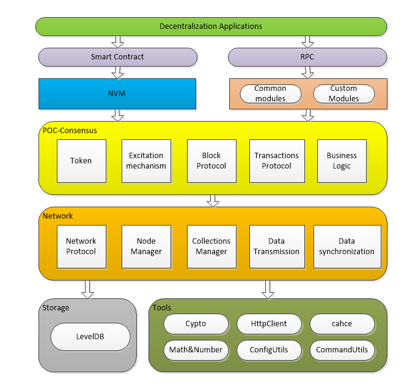
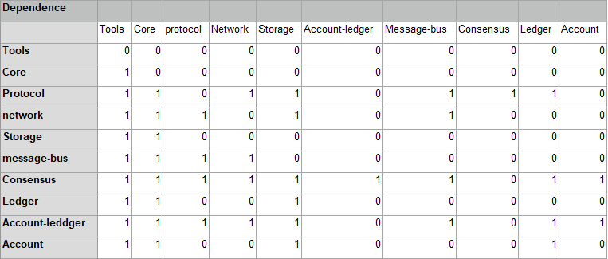
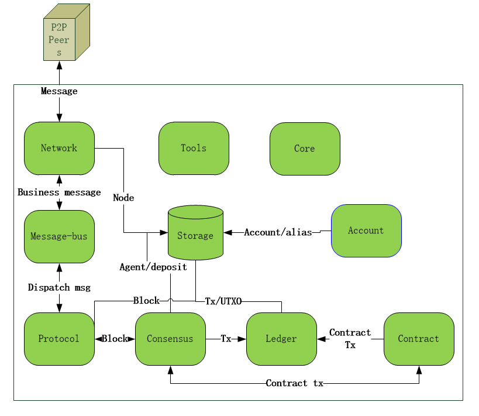

# Unit 2 Overall Design

## 1、Architecture diagram

### 1.1 Storage and tool layer

#### 1.1.1 Tools

​	 The NULS low-level code separates the tools-module module and provides various underlying related tool codes, including cryptography tools, http tools, caching tools, math calculation tools, configuration file operation tools, command line tools, etc., which are convenient for upper-level modules. 

#### 1.1.2 Storage layer

​	 The db-module module defines the interface of the data storage service for storing various types of data. The currently implemented version is based on LevelDB for key-value type storage, and can store any serialized data in the database, which is efficient and space-saving. 

### 1.2 Network layer

​	The network-module module defines the interface of the network service for establishing connections and communicating with peer nodes. The currently implemented version is based on the Netty implementation and defines a set of communication protocols for managing nodes and connections. Module functions include node discovery, data transfer, timed handshake, node management, etc.

### 1.3 Consensus layer

​	The consensus layer defines tokens, incentive mechanisms, block packing mechanisms, basic data protocols, and core business processes. The current implementation uses POC consensus implementation.

### 1.4 Interface layer

​	The interface layer of NULS is divided into two parts, the smart contract and the RPC interface service. The smart contract is based on NVM and supports Java syntax. RPC is implemented by various functional modules. Each module can provide its own RPC interface. All RPC interfaces are aggregated to form the NULS RPC interface service.

### 1.5 Application layer

​	Business applications in the NULS ecosystem.

## 2、 Relationship between modules

	

### 2.1 Tools module

​	Tool module with some basic tools built in for other modules.

### 2.2 Core module

​	The microkernel module is responsible for module management, thread management, context management, and configuration information management.

### 2.3 Account module

​	The account module is responsible for the management of addresses, public and private key pairs, and account token balances.

### 2.4 Network module

​	The network module is responsible for receiving and transmitting messages between peer nodes, where the service messages are sent to the message-bus module by means of interface calls.

### 2.5 Message-Bus module

​	The module currently implements the use of the Disruptor circular queue to buffer data and distribute the messages to the corresponding Handlers.

### 2.6 Protocol module

​	The currently implemented Protocol module defines the protocol for most common services and implements most of the protocol's processors, including block processing, transaction processing, data synchronization, and so on.

### 2.7 consensus module

​	The consensus module is responsible for token creation, management, packaging, data validation, data storage, business logic management for block packaging, and node penalties.

### 2.8 Ledger module

​	This module is responsible for storing token data records in transactions and transactions, and verifying that token usage is legal.

### 2.9 Storage module

​	The db-module storage module supports all types of data storage and is currently stored in LevelDB.

### 2.10 Contract module

​	The contract module is mainly used for communication with NVM (NULS virtual machine), which can perform call and query operations of smart contract related services.

More detailed module introduction see subsequent chapters

## 3、Core business relationship

- Description:
  - After the system is started, the node discovery function is used to find and connect the peer nodes to realize communication between nodes.
  - The received external message is uniformly processed into the ConnectionManager. If it is the message of the network module itself, it is put into the network message processor. Otherwise, it is uniformly distributed through the Message-Bus and sent to the processor corresponding to the message for processing.
  - Messages are divided into 3 types, blocks, transactions and other business messages, which are handled differently
  - The transaction is placed in the buffer pool and then verified for packaging by the consensus module
  - Store directly after block verification
  - Other business messages are processed in the handler and the network is returned to return the processing result
  - The application implements data interaction by calling RPC. It can broadcast a transaction like a network, or obtain the required data from the received block.
  - When each module calls the storage module, the service data will be prepared. The storage module is only responsible for adding, deleting, and changing operations, and does not perform any business processing.