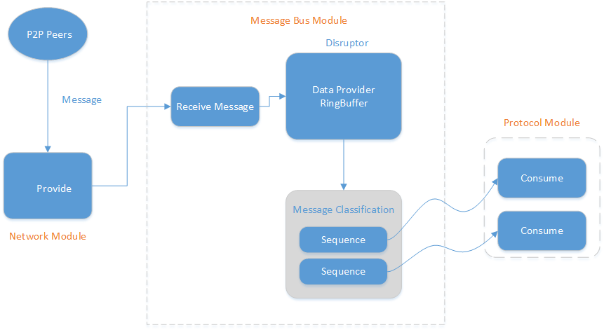
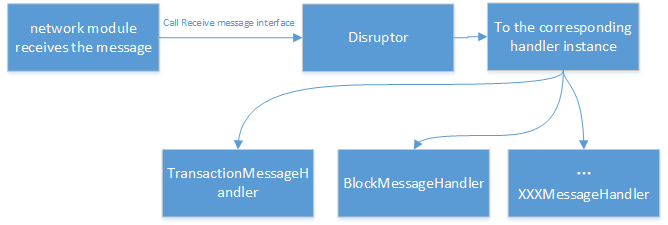

# NULS Message Bus Module Resolution

## 1、Overview

The message bus module is a functional module used by NULS to process messages. It manages all network messages and protocol messages, and provides functions such as subscription, reception, and transmission of messages. It is a data relay station for each node of NULS.

##  2、Feature

The message bus module manages all the messages in the NULS through the MessageManager, and provides functions such as message subscription, unsubscription, broadcast message, point-to-point sending message, receiving message, and creating message example.

## 3、Interface

- Class that defines the interface:  `io.nuls.message.bus.service.MessageBusService`

```java
    /**
     * Subscribe to message
     *
     * @param messageClass   The class object that needs to subscribe to the message.
     * @param messageHandler The message message
     * @return The id of the subscription message.
     */
    String subscribeMessage(Class<? extends BaseMessage> messageClass, NulsMessageHandler<? extends BaseMessage> messageHandler);


    /**
     * unsubscribe
     *
     * @param subscribeId id.
     * @param subscribeId The id of the message message.
     */
    void unsubscribeMessage(String subscribeId);

    /**
     * Receive the message and place the message on the message bus.
     *
     * @param message Received message.
     * @param node    The message comes as to which node.
     */
    void receiveMessage(BaseMessage message, Node node);

    /**
     * broadcast to nodes except "excludeNode"
     *
     * @param message     The message was broadcast.
     * @param excludeNode The node that is not passed.
     * @param aysn        Asynchronous execution
     * @return Return all broadcasted node id list
     */
    Result<List<String>> broadcast(BaseMessage message, Node excludeNode, boolean aysn, int percent);


    /**
     * send msg to one node
     *
     * @param message The message you want to sent
     * @param node    The node that received the message
     * @param aysn    Asynchronous execution
     * @return Return whether sent successfully
     */
    Result sendToNode(BaseMessage message, Node node, boolean aysn);

    /**
     * Instantiate a message object based on message type and module identity.
     */
    Result<? extends BaseMessage> getMessageInstance(short moduleId, int type);
```

## 4、Architectures

- Module name：message-bus-module
- Module ID：6



## 5、Core Process

#### 5.1 Module start -> Subscribe message


#### 5.2 Receive message -> classification processor processing -> distribution to specific message handler for processing

