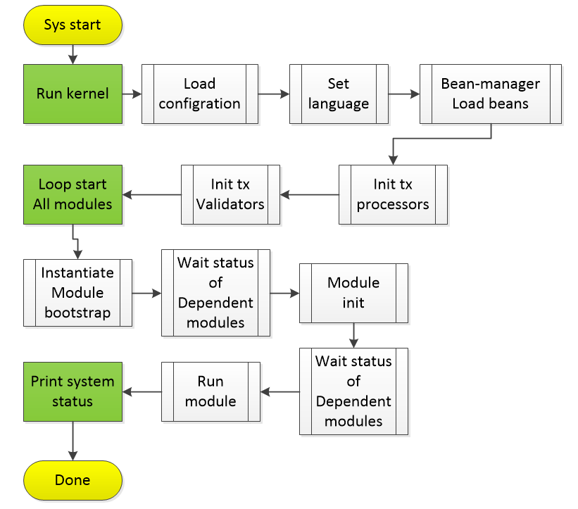

# Chapter 3 Microkernel Module Resolution

[TOC]

## 1, module overview

The microkernel module is the core module of NULS, responsible for the core functions of module management, object management, thread management, service management, configuration management, etc.

## 2, module function

### 2.1 Configuration Management

The microkernel module is responsible for reading and storing the system configuration file. When each module needs to be used, only the configuration manager needs to be called to obtain the required configuration item information.

The configuration supports both the properties and the ini format.

### 2.2 Context management

The microkernel module provides the system's context container NulsContext, through the context container can get the latest block, creation block, network height, chain id, default address type, the context also provides a quick access to the service manager's get service object the way.

### 2.3 Module Management

The microkernel module defines the abstract class BaseModuleBootstrap of the module launcher. The module needs to inherit the abstract class to add the module to the management. The module manager manages the lifecycle of all modules, including loading, initializing, running, stopping, and destroying. The microkernel module also maintains the dependencies of the modules and controls the order in which the modules are started.

### 2.4 Object Management

An IOC container like spring-framework implements object instantiation and manages objects by annotation. The corresponding method is intercepted and verified. If the module in which the called object is located is not yet running, execution is not allowed.

### 2.5 thread management

The microkernel module provides a thread manager TaskManager that can create and allow threads or thread pools. Provide the default thread creation factory NulsThreadFactory, all threads should be created with this factory.

### 2.6 Service Management

All services in NULS are registered in the service manager. Inter-service interdependencies can be referenced by means of annotations or by the NulsContext context manager.

### 2.7 Internationalization

The microkernel module provides a basic internationalization solution. The language can be switched through different configuration files (zh-CN.properties, en.properties). Any language can be added to the nuls system through configuration files.

## 3, module interface

### 3.1 Setting the language

Interface definition class:

```
io.nuls.kernel.service.KernelService
```

- Get the creation block

  - Method description:
    Set the system language,
  - Parameter Description:
    Lang(String): The prefix of the internationalization configuration file. For example, the key configured in English en.properties is "en".
  - Return value description:
    Success(boolean): Whether the operation is successful
  - code

  ```
    /**
       * 设置系统语言
       * set language of system
       *
       * @param lang zhe name of the language properties file
       * @return success or not
       */
      public Result setLanguage(String lang);
  ```

### 3.2 thread interface

Interface definition class:

```
io.nuls.kernel.thread.manager.TaskManager
```

- Create a thread pool

  - Method description:
    Create a thread pool based on the passed parameters and return
  - Parameter Description:
    threadCount(int): number of threads
      queueSize(int): number of queues
      Factory(NulsThreadFactory): Thread creates a factory object
  - Return value description:
    Data: returns the created thread pool object
  - code

  ```
  /**
       * 创建一个线程池，并返回
       * create a thread pool and return it;
       * @param threadCount the max count of thread 
       * @param queueSize the max size of the queue
       * @param factory which create all the threads
       * @return the thread pool
       */
      public static final ThreadPoolExecutor createThreadPool(int threadCount, int queueSize, NulsThreadFactory factory) 
  ```

- Create a scheduled task thread pool

  - Method description:
    Create a timed task thread pool based on the passed parameters and return
  - Parameter Description:
    threadCount(int): number of threads
      Factory(NulsThreadFactory): Thread creates a factory object
  - Return value description:
    Data: returns the created thread pool object
  - code

  ```
  /**
       * 创建一个定时执行的线程池，并返回
       * create a scheduled thread pool and return it;
       * @param threadCount the max count of thread
       * @param factory which create all the threads
       * @return the thread pool
       */
      public static final ScheduledThreadPoolExecutor createScheduledThreadPool(int threadCount, NulsThreadFactory factory) ;
  ```

- Asynchronous method execution

  - Method description:
    The asynchronous method calls a run method, and all methods called in this way share the same thread pool.
  - Parameter Description:
    Runnable(Runnable):run
  - Return value description:
    Void
  - code

  ```
  	/**
       * 异步执行一个方法，该方法会在系统中一个特定的线程池中异步执行，
       * 该线程池为系统中所有该类的调用者共享。
       * A method is executed asynchronously, which is executed asynchronously in a specific 
       * thread pool in the system, which is shared by all callers of this class in the system.
       * @param runnable 可以行的run方法对象，Run method object
       */
      public static final void asynExecuteRunnable(Runnable runnable)
  ```

- Create a separate thread and run

  - Method description:
    Create a thread based on the parameters passed in,
  - Parameter Description:
    moduleId(short): module id
      threadName(String): thread name
      Runnable(Runnable): execution method object
      Deamon (boolean): whether to create a daemon
  - Return value description:
    Void
  - code

  ```
   /**
       * 创建一个独立的线程，并执行runnable的run方法
       * Create a separate thread and execute the runnable run method
       * @param moduleId 模块id
       * @param threadName 线程名称
       * @param runnable 方法对象
       * @param deamon     是否是守护线程
       */
      public static final void createAndRunThread(short moduleId, String threadName, Runnable runnable, boolean deamon) 
  ```

- Stop all threads of a module

  - Method description:
    Stop all threads of the module based on the passed module id
  - Parameter Description:
    moduleId(short): module id
  - Return value description:
    Void
  - code

  ```
      /**
       * 停止一个模块的所有线程
       * stop all the threads of the module
       * @param moduleId 模块id
       */
      public static void shutdownByModuleId(short moduleId)
  ```

## 4、Module architecture

```
1. The microkernel module is the "motherboard" of the entire NULS system. All modules are plugged into the motherboard.
2, module communication, function calls are dependent on the "main board"
3, "Motherboard" provides management and synergy
```

## 5、Module protocol

skip

## 6, the core process

### 6.1 system startup



