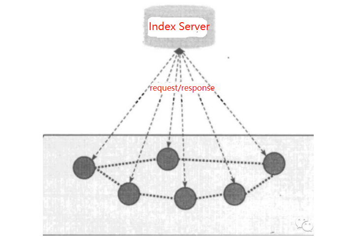
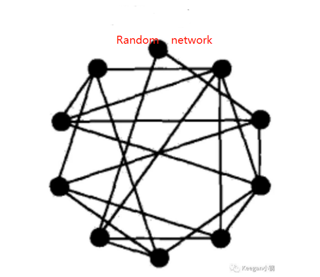
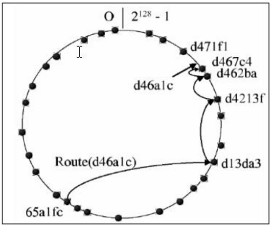
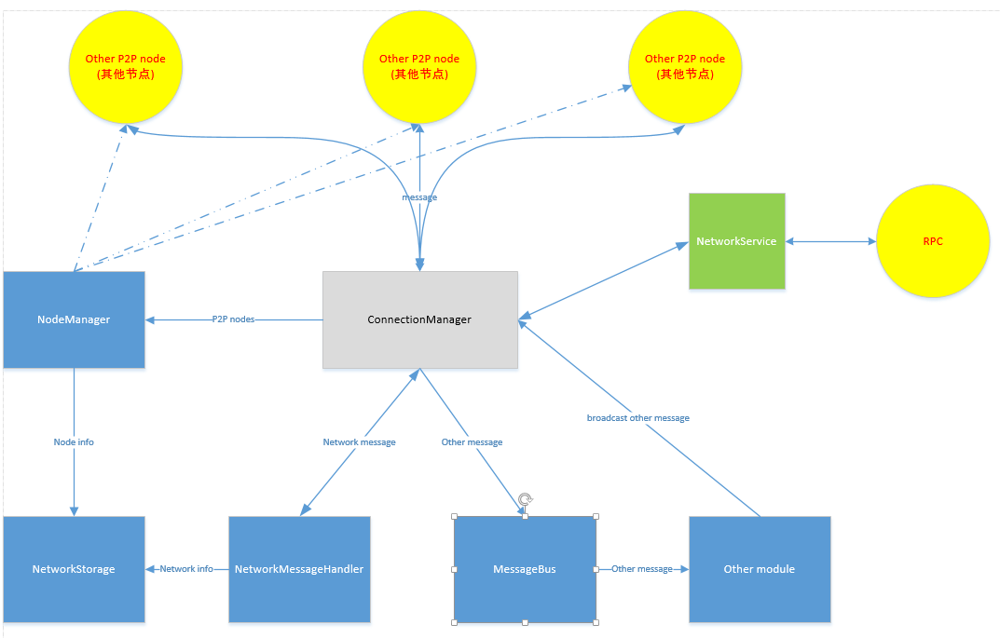
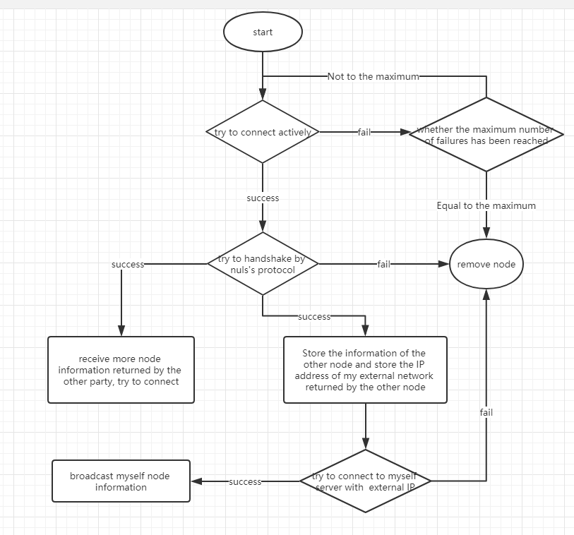
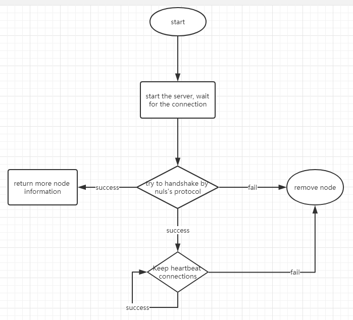
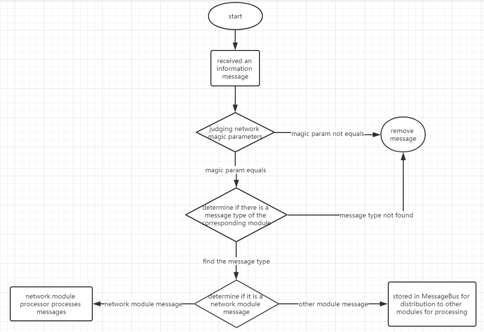

# NULS network module analysis

## Module overview

The network module is one of the eight basic modules of NULS, providing the lowest level of network communication, node discovery and other services. The network foundation of the blockchain is Peer to Peer, or P2P. All participants in the P2P network can be either a server or a client. Features of P2P networks: decentralized, scalable, robust, cost-effective, privacy-protected, and load-balanced.

According to the structural relationship, the P2P system can be subdivided into four topological forms:

- **Centralized Topology:** There is a central node that stores index information of all other nodes. The index information generally includes the node IP address, port, node resources, and so on.

  

- **Decentralized Unstructured Topology:** The central node is removed, and a random network is established between the P2P nodes, that is, a connection node is randomly established between a newly joined node and a node in the P2P network, thereby forming a random topology. Bitcoin uses the network structure.

  

- **Decentralized Structured Topology(also known as DHT network):** All nodes are organized in an orderly structure, such as forming a ring network or a tree network. The specific implementation of structured networks is generally based on the DHT (Distributed Hash Table) algorithm. For example, the implementation algorithm of the Ethereum network Kademlia.



- **Partially Decentralized Topology:** Take advantage of the centralized structure and fully distributed unstructured topology, and select nodes with higher performance (processing, storage, bandwidth, etc.) as super nodes (expressed as SuperNodes or Hubs in English) ), the information of other parts of the system is stored on each super node, and it is found that the algorithm only forwards between the super nodes, and the super node forwards the query request to the appropriate leaf node. The semi-distributed structure is also a hierarchical structure. The super-nodes form a high-speed forwarding layer, and the super-nodes and the common nodes responsible are composed of several levels. The EOS uses this network structure.


The NULS 1.0 version is similar to Bitcoin in the second, fully distributed unstructured topology. The nodes in the network have functions: routing, wallet, mining, blockchain database. All nodes have routing capabilities, participate in checksum broadcast transactions and block information, and discover and maintain connections with other nodes.

**Module information**

**Module name**: network-module

**Module structure**: module top-level directory network-module, consesnus project for module interface definition, base directory for the network module's default implementation, implementation of the project network-base, network-protocol to achieve the relevant network protocol, network-storage network storage interface and implementation.

**Interface definition dependent modules**: protocol-module, network-module

**Implement additional dependency modules**: core-module, ledger-module, account-module, account-ledger-module


## Module function

This section details the functional requirements of the network module and each of the functional point constraints, as well as the default implementation of the NULS version 1.0.

### Node discovery

**Functional requirements: **Each node of NULS is both a server and accepts connections from other nodes. It is also a client that actively initiates connections to other nodes. Nodes ask each other more nodes and try to connect. Each node tries to ensure that it connects to more nodes and communicates with each other.

**Implementationmode :** NULS version 1.0 is implemented by default using the Netty framework. When the node is running, the network module starts the network service (NettySever), waits for the connection of other nodes, and also actively connects to other nodes (NettyClient). Actively connected nodes, we call active nodes, the same IP address can not be repeated to initiate active connections; the new nodes received by the network services, we call passive nodes, taking into account the public network IP exposed by the nodes in the LAN is consistent, so passive A node running a unified IP address has up to 10 connections.

After the active node is successfully connected, the other party will return more information about the connectable nodes. After receiving the node information, it will try to connect to these nodes in turn. Until the configured active connection maximum is reached.

The NULS version 1.0 provides seven seed nodes, and the new node will connect seven seed nodes when it is first run. The seed node will return the external network IP address of the new node. The new node will attempt to actively connect to its own server through the external network IP. If the connection is successful, it will automatically send a new node message to the network. After receiving the message, other nodes will Try to connect to a new node.

### Message reception and processing

**Functional requirements:** The node will receive messages sent by other nodes. The received message is first filtered by the network protocol of NULS, and the filtered message is then processed by each module.

**Implementation mode:** The message sent by NULS includes a message header (MessageHeader) and a message body (MessageBody). The message header contains a magic parameter, a module ID corresponding to the message, and a message type. After receiving the message sent by other nodes, first determine whether the magic parameters are consistent, and then determine whether the module ID and the message type exist, and the inconsistent message is directly filtered.

The filtered message, with the protocol of the network module, is processed by the network module itself. The non-network module protocol is uniformly distributed to the distributor, distributed to other modules by the distributor, and the MessageBody is converted into business data by a custom deserialization method and then processed accordingly.

### Message broadcast

**Functional requirements:** The protocols (blocks, transactions, etc.) generated by the nodes are sent by the network module to other nodes that have been connected and successfully handshake.

**Implementation mode:** The network module provides an interface for broadcasting messages. The interface adds all messages to the header of the corresponding module, and then converts it into network information through a customized serialization method and sends it to other nodes.

### Node grouping

**Functional requirements:** Connected peer nodes can be stored in different node groups for easy management according to different attributes and functions. For example, according to the connection situation, it can be divided into an active connection group and a passive connection group, and can be divided into a consensus node group and a common node group according to functions.

**Implementation mode:**The network module provides node grouping functions, and provides interfaces for creating node groups, adding nodes to node groups, and acquiring node groups. The current network module creates active connection groups and passive connection groups by default.


## Module interface

io.nuls.network.service.NetworkService

```
/**
 * 断开一个已连接的节点
 * Disconnect the connection with the node
 *
 * @param nodeId the id of node
 */
void removeNode(String nodeId);

/**
 * 获取一个节点
 * get node by id
 *
 * @param nodeId the id of node
 * @return Node
 */
Node getNode(String nodeId);

/**
 * 获取所有节点
 * get all nodes
 *
 * @return Map
 */
Map<String, Node> getNodes();

/**
 * 获取已连接的节点
 * get connected nodes
 *
 * @return Collection
 */
Collection<Node> getAvailableNodes();

/**
 * 获取可连接的节点
 * get connectable nodes
 *
 * @return List
 */
List<Node> getCanConnectNodes();

/**
 * 根据名字获取节点组
 * get NodeGroup by name
 *
 * @param  groupName groupName
 * @return NodeGroup
 */
NodeGroup getNodeGroup(String groupName);

/**
 * 发送消息
 * Send message to all connected nodes
 *
 * @param nulsData message
 * @param asyn     Whether or not asynchronous
 * @return BroadcastResult
 */
BroadcastResult sendToAllNode(BaseNulsData nulsData, boolean asyn, int percent);

/**
 * 发送消息
 * Send message to all connected nodes
 *
 * @param event event
 * @param excludeNode node that does not need to be send
 * @param asyn        Whether or not asynchronous
 * @return BroadcastResult
 */
BroadcastResult sendToAllNode(BaseNulsData event, Node excludeNode, boolean asyn, int percent);

/**
 * send message to node
 *
 * @param event event
 * @param node node
 * @param asyn  Whether or not asynchronous
 * @return BroadcastResult
 */
BroadcastResult sendToNode(BaseNulsData event, Node node, boolean asyn);

/**
 * 发送消息给节点组
 * send message to nodeGroup
 *
 * @param  event event
 * @param groupName groupName
 * @param asyn asyn
 * @return BroadcastResult
 */
BroadcastResult sendToGroup(BaseNulsData event, String groupName, boolean asyn);

/**
 * 发送消息给节点组
 * send message to nodeGroup
 *
 * @param event event
 * @param groupName groupName
 * @param excludeNode node that does not need to be send
 * @param asyn asyn
 * @return BroadcastResult
 */
BroadcastResult sendToGroup(BaseNulsData event, String groupName, Node excludeNode, boolean asyn);

/**
 * 重置网络
 * reset network module
 */
void reset();

/**
 * 获取网络配置信息
 * Get network configuration information
 *
 * @return NetworkParam
 */
NetworkParam getNetworkParam();
```


## Module protocol

Network module, protocol module ID = 4

```
short NETWORK_MODULE_ID = 4;
```


- Node            p2p Node information 

| size | field       | field type | Description                  |
| ---- | ----------- | ---------- | ---------------------------- |
| 4    | magicNumber | uint32     | message filtering parameters |
| 2    | port        | uint16     | port                         |
| ??   | IP          | VarString  | IP                           |

- HandshakeMessage                Node handshake message

| size | field           | field type | Description                     |
| ---- | --------------- | ---------- | ------------------------------- |
| 2    | handshakeType   | uint16     | 1. request   2. response        |
| 2    | ServerPort      | uint16     | node server port                |
| 4    | BestBlockHeight | uint32     | latest block height of the node |
| ??   | BestBlockHash   | VarString  | latest block hash of the node   |
| 6    | networkTime     | uint48     | time of node                    |
| ??   | nodeIp          | VarString  | ip of node                      |
| ??   | Version         | VarString  | version of node                 |

- P2PNodeMessage                 message of node infomation

| size | field | field type | Description |
| ---- | ----- | ---------- | ----------- |
| 2    | Port  | uint16     | port        |
| ??   | IP    | VarString  | IP          |

- NodesMessage                     message of many nodes

| size | field     | field type      | Description   |
| ---- | --------- | --------------- | ------------- |
| ??   | NodeCount | VarInt          | count of node |
| ??   | Node[]    | Node[NodeCount] | nodes         |

- GetVersionMessage             get node version message

| size | field           | field type | Description                     |
| ---- | --------------- | ---------- | ------------------------------- |
| 2    | handshakeType   | uint16     | 1. request 2. response          |
| 2    | ServerPort      | uint16     | node server port                |
| 4    | BestBlockHeight | uint32     | latest block height of the node |
| ??   | BestBlockHash   | VarString  | latest block hash of the node   |
| 6    | networkTime     | uint48     | time of node                    |
| ??   | nodeIp          | VarString  | ip of node                      |
| ??   | Version         | VarString  | version of node                 |

- NETWORK_VERSION             message of node

| size | field           | field type | Description                     |
| ---- | --------------- | ---------- | ------------------------------- |
| 2    | handshakeType   | uint16     | 1. request 2. response          |
| 2    | ServerPort      | uint16     | node server port                |
| 4    | BestBlockHeight | uint32     | latest block height of the node |
| ??   | BestBlockHash   | VarString  | latest block hash of the node   |
| 6    | networkTime     | uint48     | time of node                    |
| ??   | nodeIp          | VarString  | ip of node                      |
| ??   | Version         | VarString  | version of node                 |


## Module architecture




## Core process

### Discovery node

Each node of NULS is both a client and a server. Therefore, discovering a node and establishing a connection need to describe the server from actively initiating a connection to access other nodes, and passively waiting for others to connect to their own server.





### Message reception and processing

