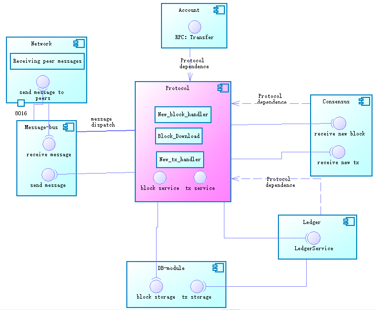
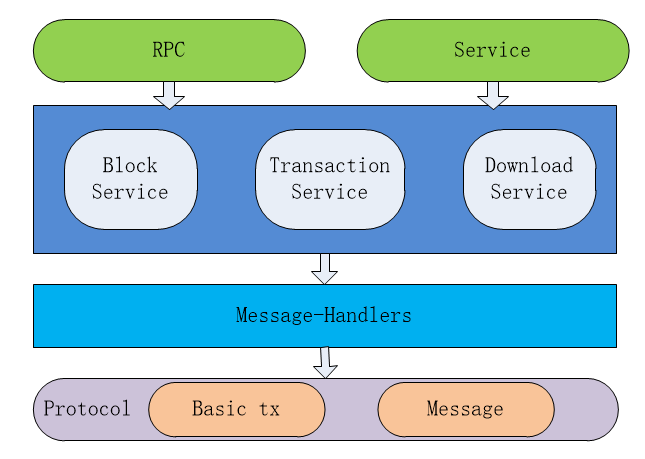
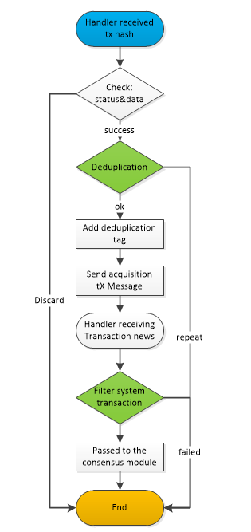
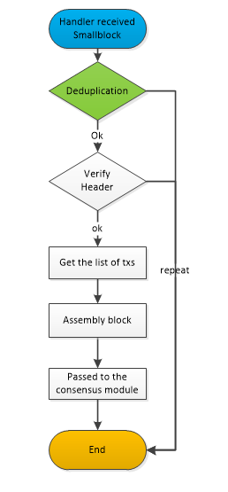
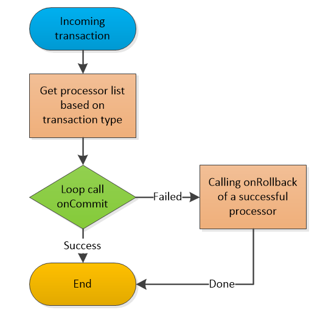
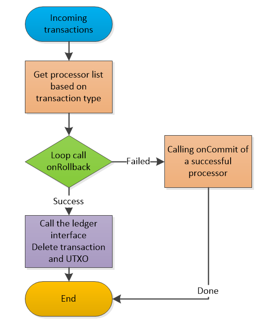
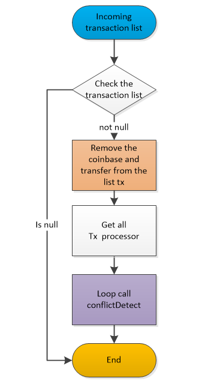
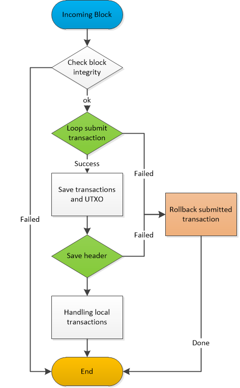

# General protocol module resolution

[TOC]


## 1、Module overview

​	The Protocol-module module was originally designed to define a common protocol format for all modules, and all modules can use these common protocols by relying on protocol modules. While defining these general-purpose protocols, the protocol module also provides a service interface for generic validators, general-purpose processors, and some important data structures associated with these protocols.

## 2、Module function

### 2.1 Protocol definition

- Trading Agreement: Consensus Reward Transaction, Transfer Transaction, Stored Transaction in Data Chain, and Transaction Verifier
- Network protocol and processor: The definition and implementation of sending and acquiring cell fast, block, transaction messages and processors between nodes.

### 2.2 Other functions

- Block Synchronization: Get the current latest block height information from the network peer node, and download and store the block.
- Block management: Receive new block, storage block, rollback block, query block and block header information, broadcast block.
- Transaction management: receiving transactions, transaction confirmation, transaction rollback, query transactions, transaction conflict detection.

## 3、Module interface

### 3.1 Block interface

Interface definition class:

```
io.nuls.protocol.service.BlockService
```

- Get the creation block

  - Method description:
    Get the block with height 0 from the database, first get the block header from the database, then get the transaction in the block through LedgerService, and finally assemble the complete block and put it into the returned result.
  - Parameter Description:
    no
  - Return value description:
    Data: returns the complete block information, and returns the failed result when the data is not queried.
  - code

  ```
  /**
   * 获取创世块（从存储中）
   * Get the creation block (from storage)
   */
  Result<Block>  getGengsisBlock();
  ```

- Get the latest block

  - Method description:
    Get the maximum height from the database, query the block header according to the height, and then get the transaction in the block through LedgerService, and finally assemble the complete block and put it into the returned result.
  - Parameter Description:
    no
  - Return value description:
    Data: returns the complete block information, and returns the failed result when the data is not queried.
  - code

  ```
  /**
   * 获取最新的区块（从存储中）
   * Get the highest block (from storage)
   */
  Result<Block> getBestBlock();
  ```

- Get the latest block header

  - Method description:
    Get the maximum height from the database, query the block header according to the height and return.
  - Parameter Description:
    no
  - Return value description:
    Data: returns the block header information, and returns the failed result when the data is not queried.
  - code

  ```
  /**
   * 获取最新的区块头（从存储中）
   * Get the highest block header (from storage)
   */
  Result<BlockHeader> getBestBlockHeader();
  ```

- Get block headers based on height

  - Method description:
    According to the height query block hash, and then get the block header information through hash
  - Parameter Description:
    Block height (long)
  - Return value description:
    Data: returns the block header information, and returns the failed result when the data is not queried.
  - code

  ```
  /**
   * 根据区块高度获取区块头（从存储中）
   * Get the block head (from storage) according to the block height
   *
   * @param height 区块高度/block height
   * @return 区块头
   */
  Result<BlockHeader> getBlockHeader(long height);
  ```

- Get the block header according to the block hash

  - Method description:
    According to the hash query block header, put in the returned result.
  - Parameter Description:
    Block hash (NulsDigestHash)
  - Return value description:
    Data: returns the block header information, and returns the failed result when the data is not queried.
  - code

  ```
  /**
   * 根据区块摘要获取区块头（从存储中）
   * Get the block head (from storage) according to the block hash
   *
   * @param hash 区块摘要/block hash
   * @return 区块头/block header
   */
  Result<BlockHeader> getBlockHeader(NulsDigestData hash);
  ```

- Get the block according to the height

  - Method description:
    According to the height query block hash, the block header information is obtained through hash, and then the transaction in the block is obtained through LedgerService, and finally the complete block is assembled and put into the returned result.
  - Parameter Description:
    Block height (long)
  - Return value description:
    Data: returns the complete block information, and returns the failed result when the data is not queried.
  - code

  ```
  /**
   * 根据区块高度获取区块（从存储中）
   * Get the block (from storage) according to the block height
   *
   * @param height 区块高度/block height
   * @return 区块/block
   */
  Result<Block> getBlock(long height);
  ```

- Get the block according to Hash

  - Method description:
    According to the hash, the block header information is obtained, and then the transaction in the block is obtained through the LedgerService, and finally the complete block is assembled and put into the returned result.
  - Parameter Description:
    Block hash (NulsDigestHash)
  - Return value description:
    Data: returns the complete block information, and returns the failed result when the data is not queried.
  - code

  ```
  /**
   * 根据区块摘要获取区块（从存储中）
   * Get the block (from storage) according to the block hash
   *
   * @param hash 区块摘要/block hash
   * @return 区块/block
   */
  Result<Block> getBlock(NulsDigestData hash);
  ```

- Save block

  - Method description:
    First confirm the transaction, then store the transaction, then store the block header, and finally process the local unconfirmed transaction. If any of the above steps fail, the previously processed steps will be rolled back.
  - Parameter Description:
    Block
  - Return value description:
    Success: Returns whether the block is successfully stored.
  - code

  ```
  /**
   * 保存区块到存储中
   * Save the block to the store.
   *
   * @param block 完整区块/whole block
   * @return 操作结果/operating result
   * @throws NulsException 保存区块有可能出现异常，请捕获后谨慎处理
   * There may be exceptions to the save block, please handle it carefully after capture.
   */
  Result saveBlock(Block block) throws NulsException;
  ```

- Rollback block

  - Method description:
    Roll back the transaction first, delete the block header, and finally process the local transaction. If any of the above steps fail, the previously processed steps will be reversed.
  - Parameter Description:
    Block
  - Return value description:
    Success: Returns whether the block is successfully rolled back.
  - code

  ```
  /**
   * 回滚区块
   * roll back the block to the store.
   *
   * @param block 完整区块/whole block
   * @return 操作结果/operating result
   * @throws NulsException 回滚区块有可能出现异常，请捕获后谨慎处理
   * There may be exceptions to the roll back block, please handle it carefully after capture.
   */
  Result rollbackBlock(Block block) throws NulsException;
  ```

- Broadcast block

  - Method description:
    The cell block is placed in the block broadcast message, and the message is sent to the network by calling the interface of the MessageBus module.
  - Parameter Description:
    smallBlock: cell block (SmallBlock)
  - Return value description:
    Success: Returns whether the block is successfully broadcast.
      Data: list of node ids sent successfully
  - code

  ```
  /**
   * 广播区块给连接的其他对等节点
   * The broadcast block gives the connection to other peers.
   *
   * @param block 完整区块/the whole block
   * @return 广播结果/Broadcast the results
   */
  Result broadcastBlock(SmallBlock block);
  ```

- Forwarding block

  - Method description:
    The cell block is assembled according to the block, and the cell block is placed in the forwarding message, and the message is sent to the network by calling the interface of the MessageBus module.
  - Parameter Description:
    Block: block (Block)
      excludeNode: Excluded node (Node)
  - Return value description:
    Success: Returns whether the block is successfully forwarded.
      Data: list of node ids sent successfully
  - code

  ```
  /**
   * 转发区块给连接的其他对等节点，允许一个列外（不转发给它）
   * Forward block to other peers of the connection, allowing one column (not forward to it)
   *
   * @param hash       区块摘要/the hash of block
   * @param excludeNode 需要排除的节点，一般是因为从该节点处接收的本区块
   *                    The nodes that need to be excluded are generally due to the block received from the node.
   * @return 转发结果/forward results
   */
  Result forwardBlock(NulsDigestData hash, Node excludeNode);
  ```

### 3.2 trnasaction interfaces

Interface definition class:

```
io.nuls.protocol.service.TransactionService
```

- Confirm transaction

  - Method description:
    According to the type of incoming transaction, the processor of the transaction is acquired, and the onCommit method of all processors is called. If any processor returns a failure, the successfully executed processor is rolled back.
  - Parameter Description:
    Tx: transaction (Transaction)
      secondaryData: auxiliary data (Object)
  - Return value description:
    Success: Returns whether the transaction confirms success
  - code

  ```
  /**
   * 确认交易时调用的方法，对交易相关的业务进行提交操作
   * Identify the method that is invoked during the transaction and submit the transaction related business.
   *
   * @param tx            操作的交易/The transaction of the operation
   * @param secondaryData 辅助数据（可以为空）/Secondary data (available for null)
   * @return 操作结果/operating results
   */
  Result commitTx(Transaction tx, Object secondaryData);
  ```

- Rollback transaction

  - Method description:
    According to the incoming transaction type, the processor of the transaction is acquired, the onRollback method of all processors is called, and finally the transaction is deleted. If any process returns a failure, the successful operation is rolled back.
  - Parameter Description:
    Tx: transaction (Transaction)
      secondaryData: auxiliary data (Object)
  - Return value description:
    Success: Returns whether the transaction was successfully rolled back
  - code

  ```
  /**
   * 回滚交易时调用的方法，对交易相关的业务进行回退操作
   * The method invoked when the transaction is rolled back and the transaction related business is returned.
   *
   * @param tx            操作的交易/The transaction of the operation
   * @param secondaryData 辅助数据（可以为空）/Secondary data (available for null)
   * @return 操作结果/operating results
   */
  Result rollbackTx(Transaction tx, Object secondaryData);
  ```

- Forwarding transaction

  - Method description:
    The incoming transaction is placed in the transaction forwarding message and the transaction is sent to the network by calling the Message-Bus module interface.
  - Parameter Description:
    Tx: transaction (Transaction)
      excludeNode: Node to be excluded (Node)
  - Return value description:
    Success: Returns whether the transaction was successfully forwarded
      Data: list of node ids successfully sent
  - code

  ```
  /**
   * 转发交易给连接的其他对等节点，允许一个列外（不转发给它）
   * Forward Transaction to other peers of the connection, allowing one column (not forward to it)
   *
   * @param tx          完整交易/the whole transaction
   * @param excludeNode 需要排除的节点，一般是因为从该节点处接收的本交易/The nodes that need to be excluded are generally
   *                    due to the transaction received from the node.
   * @return 转发结果/forward results
   */
  Result forwardTx(Transaction tx, Node excludeNode);
  ```

- Broadcast transaction

  - Method description:
    The incoming transaction is placed in the transaction broadcast message and the transaction is sent to the network by calling the Message-Bus module interface.
  - Parameter Description:
    Tx: transaction (Transaction)
  - Return value description:
    Success: Returns whether the transaction was successfully forwarded
      Data: list of node ids successfully sent
  - code

  ```
  /**
   * 广播交易给连接的其他对等节点
   * The broadcast transaction gives the connection to other peers.
   *
   * @param tx 完整交易/the whole transaction
   * @return 广播结果/Broadcast the results
   */
  Result broadcastTx(Transaction tx);
  ```

- Receive new transactions

  - Method description:
    Pass the incoming transaction into the consensus service.
  - Parameter Description:
    Tx: transaction (Transaction)
  - Return value description:
    Success: Whether the consensus module is successfully processed
  - code

  ```
  /**
   * 将交易缓存到共识交易池
   * cache the transaction for consensus
   *
   * @param tx transaction
   * @return Result
   */
  Result newTx(Transaction tx);
  ```

- Conflict detection

  - Method description:
    Get all the transaction processors, call the conflictDetect method of all processors, if any processor returns a failure, it will directly return the failed result object.
  - Parameter Description:
    txList: transaction (List<Transaction>)
  - Return value description:
    Success: Returns whether the transaction conflicts
      Data: the auxiliary data returned
  - code

  ```
  /**
   * 冲突检测，检测如果传入的交易列表中有相冲突的交易，则返回失败，写明失败原因及所有的应该舍弃的交易列表
   * <p>
   * Conflict detection, which detects conflicting transactions in the incoming transaction list, returns failure,
   * indicating the cause of failure and all the list of trades that should be discarded.
   *
   * @param txList 需要检查的交易列表/A list of transactions to be checked.
   * @return 操作结果：成功则返回successResult，失败时，data中返回丢弃列表，msg中返回冲突原因
   * Operation result: success returns successResult. When failure, data returns the discard list,
   * and MSG returns the cause of conflict.
   */
  ValidateResult conflictDetect(List<Transaction> txList);
  ```

- Get a transaction

  - Method description:
    According to the incoming transaction hash, the interface of the consensus service is called, and the transaction data in the memory is returned.
  - Parameter Description:
    Hash: transaction hash (NulsDigestData)
  - Return value description:
    Data: transaction data
  - code

  ```
  /**
   * 根据交易hash获取交易信息
   * get transaction by tx hash
   * @param hash
   * @return
   */
  Transaction getTx(NulsDigestData hash);
  ```

### 3.3 Block synchronization service interface

Interface definition class:

```
io.nuls.protocol.service.DownloadService
```

- Download block

  - Method description:
    Download a block from the specified node according to the block hash
  - Parameter Description:
    Hash: block hash (NulsDigestData)
      Node: node (Node)
  - Return value description:
    Success: Returns whether the download was successful.
      Data: the returned block data (Block)
  - code

  ```
  /**
   * 从指定节点处根据hash下载一个区块，下载过程中线程是阻塞的
   * Download a block according from the node to the hash, and the download process is blocked.
   *
   * @param hash 区块摘要/block hash
   * @param node 指定的节点/Specified node
   * @return 区块及结果/ block  results
   */
  Result<Block> downloadBlock(NulsDigestData hash, Node node);
  ```

- Whether the synchronization is successful

  - Method description:
    Get the current synchronization status and determine if the synchronization is successful.
  - Parameter Description:
    no
  - Return value description:
    Success: Returns whether the synchronization has been successful
  - code

  ```
  /**
   * 返回下载是否完成的结果
   * Returns the results of the download.
   * @return Result
   */
  Result isDownloadSuccess();
  ```

- Reset block sync status

  - Method description:
    Check if the current status requires downloading the block and download it if necessary. This is done by changing the download status to waiting for the download.
  - Parameter Description:
    no
  - Return value description:
    Success: Returns whether the operation was successful
  - code

  ```
  /**
   * 重新检查当前状态是否需要重新同步区块，如果需要则下载
   * Recheck whether the current state needs to be resynchronized, and download if necessary.
   * @return Result
   */
  Result reset();
  ```

## 4、Module architecture

### 4.1 Module context

a.The protocol module provides definitions of common protocols to other modules.

b.The protocol module is responsible for receiving and synchronizing functions of blocks and transactions.



### 4.2 Module architecture diagram



## 5、Module protocol

### 5.1 Transactions

 General transaction data structure

- Transfer transaction
- CoinBase transaction

| Size | Field      | data type | Description    |
| ---- | ---------- | --------- | -------------- |
| 2    | type       | uint16    | 交易类型       |
| 6    | time       | uint48    | 时间戳         |
| ??   | remark     | VarByte   | 备注           |
| ??   | txData     | ??        | 交易数据       |
| ??   | coinData   | ??        | 代币数据       |
| ??   | scriptSign | VarByte   | P2PKHScriptSig |

- Data bearer transaction

| Size | Field      | data type | Description    |
| ---- | ---------- | --------- | -------------- |
| 2    | type       | uint16    | 交易类型       |
| 6    | time       | uint48    | 时间戳         |
| ??   | remark     | VarByte   | 备注           |
| ??   | txData     | VarByte   | 交易数据       |
| ??   | coinData   | ??        | 代币数据       |
| ??   | scriptSign | VarByte   | P2PKHScriptSig |

### 5.2 Message of module

#### PROTOCOL_NOT_FOUND

| Size | Field | data type    | Description        |
| ---- | ----- | ------------ | ------------------ |
| 1    | type  | NotFoundType | 未找到的类型       |
| ??   | Hash  | VarString    | 请求但未找到的hash |

#### PROTOCOL_NEW_TX

| Size | Field       | data type   | Description |
| ---- | ----------- | ----------- | ----------- |
| ??   | transaction | Transaction |             |

#### PROTOCOL_GET_BLOCK

| Size | Field     | data type      | Description |
| ---- | --------- | -------------- | ----------- |
| ??   | blockHash | NulsDigestData | 区块hash    |

#### PROTOCOL_BLOCK

| Size | Field         | data type       | Description  |
| ---- | ------------- | --------------- | ------------ |
| ??   | header        | BlockHeader     | 块头         |
| ??   | Transaction[] | Transaction[??] | 节点信息数组 |

#### PROTOCOL_GET_BLOCKS_BY_HASH

| Size | Field       | data type      | Description  |
| ---- | ----------- | -------------- | ------------ |
| ??   | startHeight | NulsDigestData | 开始区块hash |
| ??   | endHeight   | NulsDigestData | 结束区块hash |

#### PROTOCOL_GET_BLOCKS_BY_HEIGHT

| Size | Field     | data type | Description  |
| ---- | --------- | --------- | ------------ |
| 4    | startHash | uint32    | 开始区块高度 |
| 4    | endHash   | uint32    | 结束区块高度 |

#### PROTOCOL_BLOCK_HEADER

| Size | Field      | data type      | Description  |
| ---- | ---------- | -------------- | ------------ |
| ??   | PreHash    | NulsDigestData | 上一个块摘要 |
| ??   | MerkleHash | NulsDigestData | Merkle树根   |
| 6    | time       | uint48         | 时间         |
| 4    | height     | uint32         | 高度         |
| 4    | txCount    | uint32         | 交易数量     |
| ??   | extend     | VarByte        | 扩展数据     |
| ??   | scriptSign | P2PKHScriptSig | 签名         |

#### PROTOCOL_GET_TX_GROUP

| Size | Field       | data type        | Description  |
| ---- | ----------- | ---------------- | ------------ |
| ??   | TXHashCount | VarInt           | 交易摘要数   |
| ??   | TXHash      | NulsDigestData[] | 交易摘要数组 |

#### PROTOCOL_TX_GROUP

| Size | Field     | data type      | Description |
| ---- | --------- | -------------- | ----------- |
| ??   | BlockHash | NulsDigestData | 块摘要      |
| ??   | TXCount   | VarInt         | 交易数      |
| ??   | TXHash    | Transaction[]  | 交易数组    |

#### PROTOCOL_NEW_BLOCK

| Size | Field   | data type        | Description  |
| ---- | ------- | ---------------- | ------------ |
| ??   | header  | BlockHeader      | 块头         |
| ??   | TXCount | VarInt           | 交易数       |
| ??   | TXHash  | NulsDigestData[] | 交易摘要数组 |
| ??   | TXCount | VarInt           | 交易数       |
| ??   | TXHash  | Transaction[]    | 交易数组     |

#### PROTOCOL_GET_BLOCKS_HASH

| Size | Field | data type | Description |
| ---- | ----- | --------- | ----------- |
| 4    | start | uint32    | 开始高度    |
| 4    | end   | uint32    | 结束高度    |

#### PROTOCOL_BLOCKS_HASH

| Size | Field            | data type        | Description  |
| ---- | ---------------- | ---------------- | ------------ |
| ??   | requestEventHash | NulsDigestData   | 请求Hash     |
| ??   | HeightListCount  | VarInt           | Hash列表数量 |
| ??   | Hash[]           | NulsDigestData[] | Hash列表     |

#### PROTOCOL_STRING

| Size | Field | data type | Description |
| ---- | ----- | --------- | ----------- |
| ??   | Hash  | VarString |             |

#### PROTOCOL_COMPLETE

| Size | Field            | data type      | Description |
| ---- | ---------------- | -------------- | ----------- |
| ??   | requestEventHash | NulsDigestData | 请求Hash    |
| 1    | success          | boolean        | 结果        |

#### REQUEST_REACT

| Size | Field            | data type      | Description |
| ---- | ---------------- | -------------- | ----------- |
| ??   | requestEventHash | NulsDigestData | 请求Hash    |


## 6、Core process

### 6.1 Block synchronization

```
1, start block synchronization thread, execute once every second
2, the initialization of dependent services in the thread: block service, network services
3. Determine the synchronization status, wait or fail (before 30 seconds), then synchronize
4. Determine the network connection status. If there are too few nodes connected, the execution is terminated.
5, modify the synchronization status is: Ready
6, change the download status to: download
7, initialize two FutureTask placed separately: download thread manager and download data processor
8, waiting for the task to run: see 6.1.1, 6.1.2
9, modify the download status according to the results
```

#### 6.1.1 Block download

```
1. Check the current block height, whether it is the latest height, whether it needs to be rolled back, and roll back if necessary (return 10 blocks each time)
2, the latest node corresponding to the height of the statistics, each node creates a download thread
3. Download 10 blocks per node per round
4, after the download fails, reorganize the node download
5, put the downloaded block into the queue
6, clean up the future, stop the thread pool running
```

#### 6.1.2 Downloaded block processing

```
1. Non-stop access to the block from the queue
2, simple check block data
3. Pass the block into the consensus module service.
4. When there is no block header in the obtained block, the thread ends.
```

### 6.2 New transaction processing



### 6.3 New block processing



### 6.4 Confirm transaction



### 6.5 Rollback transaction



### 6.6 Transaction conflict check



### 6.7 Save block



### 6.8 Rollback block


