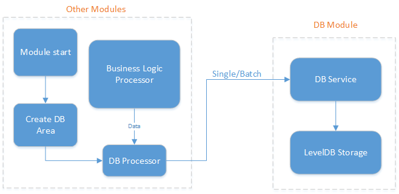

# NULS DB Module Resolution

## 1、Overview

The DB module plays the role of a tool module in NULS. It provides the function of storing data locally. Each module can store and retrieve its own data through the interface of the DB module. At present, the database implementation of the NULS DB module is LevelDB, and developers can also use different database implementations according to their own needs.

## 2、Feature

The functions of the DB module are mainly divided into saving data, deleting data, and querying data; modifying data is implemented by overwriting or saving and saving first. The implementation of the function is divided into single data operation, batch operation, serialized binary data operation, and operation of model instance data.

## 3、Interface

- Class that defines the interface:  `io.nuls.db.service.DBService`

```java
	/**
     * Create a data area
     *
     * @param areaName
     * @return
     */
    Result createArea(String areaName);

    /**
     * Create a data area for the custom key comparator.
     *
     * @param areaName
     * @param comparator Custom key comparator.
     * @return
     */
    Result createArea(String areaName, Comparator<byte[]> comparator);

    /**
     * Lists all Area names in the current database
     *
     * @return
     */
    String[] listArea();

    /**
     * Store key-value in bytes.
     *
     * @param area
     * @param key
     * @param value
     * @return
     */
    Result put(String area, byte[] key, byte[] value);

    /**
     * Store the object
     *
     * @param area
     * @param key
     * @param value Objects that need to be stored.
     * @param <T>
     * @return
     */
    <T> Result putModel(String area, byte[] key, T value);

    /**
     * Delete value according to key.
     *
     * @param area
     * @param key
     * @return
     */
    Result delete(String area, byte[] key);

    /**
     * Get value from the key.
     *
     * @param area
     * @param key
     * @return
     */
    byte[] get(String area, byte[] key);

    /**
     * Gets the specified object from the key and object class.
     * The premise is that this key is stored in a putModel, otherwise value is null.
     *
     * @param area
     * @param key
     * @param clazz Specifies the class of the object.
     * @param <T>
     * @return
     */
    <T> T getModel(String area, byte[] key, Class<T> clazz);

    /**
     * Get the Object of Object from the key.
     *
     * param area
     * @param key
     * @return
     */
    Object getModel(String area, byte[] key);

    /**
     * Gets an unordered collection of all keys in the data area.
     *
     * @param area
     * @return
     */
    Set<byte[]> keySet(String area);

    /**
     * Gets an ordered collection of all keys in the data area.
     *
     * @param area
     * @return
     */
    List<byte[]> keyList(String area);

    /**
     * Gets an ordered collection of all values in the data area.
     *
     * @param area
     * @return
     */
    List<byte[]> valueList(String area);

    /**
     * Gets an unordered collection of all key-value in the data area.
     *
     * @param area
     * @return
     */
    Set<Entry<byte[], byte[]>> entrySet(String area);

    /**
     * Gets an ordered set of all key-values in the data area.
     *
     * @param area
     * @return
     */
    List<Entry<byte[], byte[]>> entryList(String area);


    /**
     * Gets the ordered collection of all key-value in the data area and specifies the returned value object.
     * The premise is that the storage mode in this data area is the putModel, otherwise value is null.
     *
     * @param area
     * @param clazz Specifies the class of the object.
     * @param <T>
     * @return
     */
    <T> List<Entry<byte[], T>> entryList(String area, Class<T> clazz);

    /**
     * Gets the ordered collection of all values in the data area and specifies the returned value object.
     * The premise is that the storage mode in this data area is the putModel, otherwise value is null.
     *
     * @param area
     * @param clazz 指定对象的class/Specifies the class of the object.
     * @param <T>
     * @return
     */
    <T> List<T> values(String area, Class<T> clazz);

    /**
     * Specifies the batch add, delete, update operations in the data area.
     *
     * @param area
     * @return
     */
    BatchOperation createWriteBatch(String area);

    /**
     * Destroy area
     *
     * @param areaName
     * @return
     */
    Result destroyArea(String areaName);

    Result clearArea(String area);

```


- Class that defines the batch operations interface:  `io.nuls.db.service.BatchOperation`

```java
 	/**
     * Add or update operations.
     *
     * @param key
     * @param value
     * @return
     */
    Result put(byte[] key, byte[] value);

    /**
     * Add or update the object
     *
     * @param key
     * @param value Objects that need to be added or updated.
     * @return
     */
    <T> Result putModel(byte[] key, T value);

    /**
     * Delete operation
     *
     * @param key
     * @return
     */
    Result delete(byte[] key);

    /**
     * Perform batch operation
     *
     * @return
     */
    Result executeBatch();
```


## 4、Architectures

- Module name：db-module
- Module ID：2


## 5、Core Process

When NULS starts, each module initializes the used DB Area constant in Storage. In the module business logic, when the data is stored, the corresponding Area and data are transmitted to the corresponding storage function interface, and the DB module is Perform a single data or batch access operation.

