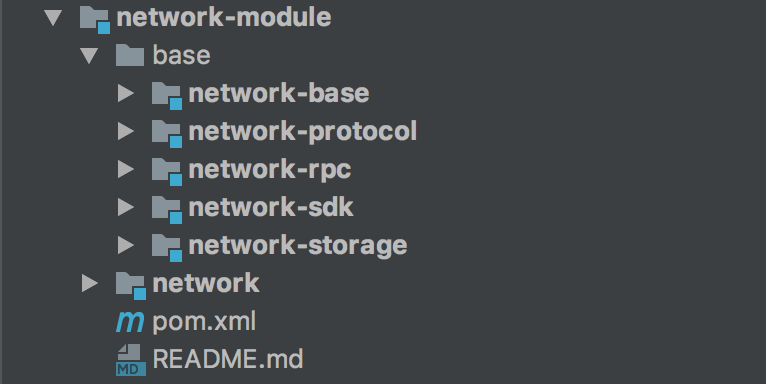
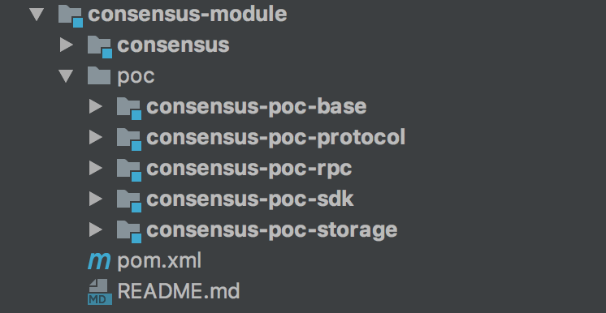

title: NULS Directory Structure
---

* NULS Website：https://nuls.io
* NULS Code URL：https://github.com/nuls-io
* Technology Forum：http://nulsforum.org/?cat=17

## NULS source code directory structure description

* Nuls : NULS core underlying source code
* Nuls-explorer : NULS blockchain browser（https://nulscan.io）
* Nuls-client : NULS core wallet
* Api-server : NULS data service, NULS blockchain browser and online wallet 、 data services such as mobile wallet
* Website : NULS official website code

## NULS core underlying directory structure description

   We will focus on the core layer of NULS, the github address is https://github.com/nuls-io/nuls。

   The biggest feature of NULS is modular design, which is divided into network module, storage module, account module, ledger module, message bus module, general protocol module, consensus module, smart contract module, micro-kernel module, tool module, client module and sdk Module.

* account-ledger-module ： account ledger module
* account-module ： account module
* client-module ：client module
* consensus-module ： consensus module
* contract-module ：smart contract module
* core-module ：microkernel module
* db-module ：storage module
* ledger-module ：ledger module
* message-bus-module ：message bus module
* network-module ： network module
* protocol-module ： general protocol module
* tools-module ： general tool module

## Module directory structure

The above describes the top-level directory of each module. The modules in NULS are divided into two categories, one is a module with very clear business, such as a consensus module; the other is a relatively clear service, and the default is a basic implementation, such as a network module. We will take these two modules for detailed explanation.

### Network module

* network-module ： Is the top level directory of the network module (type is folder)
* network ： The service interface definition provided for the network module (type is pom project)
* base ：The basic implementation of the network module (can also be understood as the default implementation, the type is a folder)
* network-base :  Implementation of the network interface (type is pom project)
* network-protocol :  Network protocol definition project for network module (type is pom project)
* network-rpc:  The rpc interface of the network module provides and implements the project (type is pom project)
* network-sdk :  The sdk provided by the network module (type is pom project)
* network-storage :  Network module storage implementation project (type is pom project)
* README.md ： Module specification, detailing the interface definition and usage of the module (type is md file)

### Consensus module

* consensus-module ： The top level directory of the consensus module (type is folder)
* consensus ： Service interface definition of the consensus module (type is pom project)
* poc ：Implementation of the poc consensus mechanism (type is folder)
* consensus-poc-base :  Consensus interface implementation project based on poc consensus mechanism (type is pom project)
* consensus-poc-protocol :  Network protocol definition project of poc consensus mechanism (type is pom project)
* consensus-poc-rpc:  The rpc interface of the poc consensus mechanism provides and implements the project (type is pom project)
* consensus-poc-sdk :  The sdk (type pom project) provided by the poc consensus mechanism
* consensus-poc-storage :  Storage implementation project of poc consensus mechanism (type is pom project)
* README.md ： Module specification, detailing the interface definition and usage of the module (type is md file)

## Analysis of modules and directory structure

The NULS system is a combination of multiple modules. The definition of the module has a set of rules: top-level directory -> interface engineering, implementation directory -> implementation project. There are also corresponding naming rules, such as a module is A, then the structure of this module is as follows：

* A-module
* A
* base
* A-base
* A-protocol
* A-rpc
* A-sdk
* A-storage

The change is that this module has a very clear implementation of many different ways, then named according to the corresponding implementation, more typical consensus module and ledger module. In this case, for example, if a module is M and its implementation is B, then the structure of this module is as follows：

* M-module
* M
* B
* M-B-base
* M-B-protocol
* M-B-rpc
* M-B-sdk
* M-B-storage

It is worth noting that not all module implementations must include these projects. For example, some modules do not need to use storage, so there is no need for storage. Some modules do not have a protocol, so no protocl is needed.

## to sum up：
From the naming of the directory structure of NULS, it shows the great ambition of NULS. NULS hopes that communities, enterprises and individuals can provide various modules to the NULS code base, such as pow implementation and pos implementation under the consensus module. Also hope that the same module can produce modules with higher quality, better efficiency and more complete functions, such as network modules.